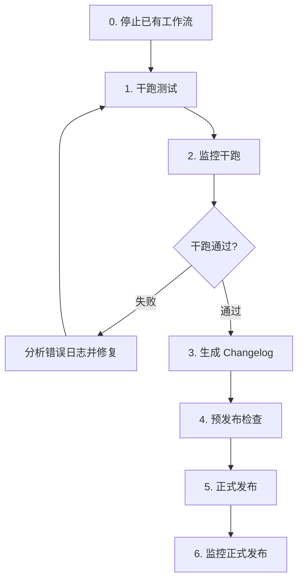
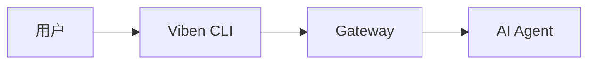
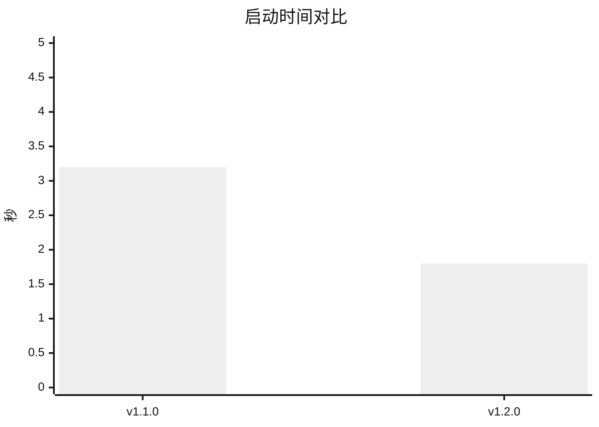
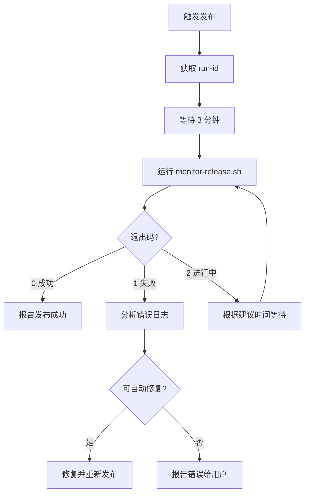

# Release

发布新版本到 GitHub Release、npm 和 Homebrew。

---

## 前置条件

1. **代码质量检查通过**: `pnpm check:release`
2. **Changelog 文件必须存在**: `docs/changelogs/<version>.md`
3. **GitHub CLI 已认证**: `gh auth status`
4. **在 main 分支**: 确保代码已合并到 main
5. **代码已推送到远程**: `git push origin main` — 发布脚本触发的是远程 GitHub Actions，本地未推送的代码不会被包含在发布中

---

## 流程



### 0. 停止已有发布工作流 `[AI]`

> **重要**: 在触发新发布前，必须先检查并取消所有正在运行的 `release-all.yml` 工作流，避免重复发布。

```bash
# 查看正在运行的发布工作流
gh run list --workflow=release-all.yml --status in_progress --limit 10

# 取消所有进行中的发布工作流
gh run list --workflow=release-all.yml --status in_progress --json databaseId -q '.[].databaseId' | xargs -I {} gh run cancel {}
```

### 1. 干跑测试 `[AI]`

> **重要**: 必须先用干跑模式触发完整构建+测试流程，**全部通过后**才能写 changelog 和正式发布。干跑模式会执行构建和测试但不发布，Desktop E2E 测试必须启用。

```bash
gh workflow run release-all.yml \
  --ref main \
  -f version=<version> \
  -f dry_run=true \
  -f skip_desktop_tests=false \
  -f release_cli=true \
  -f release_desktop=true
```

**参数说明:**

| 参数 | 值 | 说明 |
|------|-----|------|
| `dry_run` | `true` | 干跑模式：构建+测试，跳过 npm publish 和 GitHub Release |
| `skip_desktop_tests` | `false` | **必须启用** Desktop E2E 测试 |
| `release_cli` | `true` | 构建并测试 CLI |
| `release_desktop` | `true` | 构建并测试 Desktop |

**干跑阶段和预计时间:**

| 阶段 | 预计时间 | 建议检查间隔 |
|------|----------|--------------|
| prepare | ~10s | 30s |
| build-cli | ~8min | 3min |
| test-cli | ~2min | 1.5min |
| build-desktop | ~20min | 5min（前15min）/ 3min（后期）|
| test-desktop | ~8min | 3min |
| **总计** | **~40min** | |

获取 run ID：

```bash
sleep 3
gh run list --workflow=release-all.yml --limit 1 --json databaseId -q '.[0].databaseId'
```

### 2. 监控干跑 `[AI]`

使用监控脚本跟踪干跑进度，**必须等所有 job 成功后才能继续**：

```bash
./scripts/monitor-release.sh <run-id>
```

**监控脚本退出码:**

| 退出码 | 含义 | AI 行为 |
|--------|------|---------|
| 0 | 全部通过 | 进入下一步：生成 Changelog |
| 1 | 失败/取消 | 分析错误日志，修复后重新干跑 |
| 2 | 进行中 | 根据建议等待时间后再次检查 |

如果干跑失败：

```bash
# 查看失败日志
gh run view <run-id> --log-failed

# 修复后可重新运行失败的 jobs
gh run rerun <run-id> --failed
```

### 3. 生成 Changelog `[AI]`

> **前置条件**: 干跑测试全部通过后才能执行此步骤。

#### Step 1: 获取上次发布版本

```bash
# 获取最近的 tag
git describe --tags --abbrev=0

# 或列出所有 tags
git tag --sort=-v:refname | head -5
```

#### Step 2: Review 所有 commit messages

```bash
# 查看自上次发布以来的所有提交（简洁）
git log $(git describe --tags --abbrev=0)..HEAD --oneline

# 查看详细提交信息（包含完整 message）
git log $(git describe --tags --abbrev=0)..HEAD --format="%h %s%n%b%n---"

# 查看变更统计
git log $(git describe --tags --abbrev=0)..HEAD --stat

# 查看涉及的文件
git diff $(git describe --tags --abbrev=0)..HEAD --stat
```

#### Step 3: 分析并分类 commits

根据 commit message 的 prefix 分类：
- `feat:` → 新功能
- `fix:` → Bug 修复
- `perf:` → 性能优化
- `refactor:` → 重构
- `docs:` → 文档更新
- `chore:` → 构建/工具
- `BREAKING CHANGE:` → 破坏性变更

#### Step 4: 编写 Changelog

**创建文件: `docs/changelogs/<version>.md`**

Changelog 可以包含丰富的内容：
- **Mermaid 图表**: 流程图、架构图、序列图
- **Markdown 表格**: 功能对比、API 变更
- **Viben 品牌 SVG 动画**: 视觉亮点展示

```markdown
# Viben v<version> 更新日志

<!-- 可选: Viben 品牌 SVG 动画 -->
<p align="center">
  
</p>

## 亮点

- **功能 1**: 简要描述
- **功能 2**: 简要描述

## 新功能

### 功能名称

功能详细描述。

<!-- 可选: 使用 Mermaid 展示架构或流程 -->


### 功能对比表

| 功能 | v1.1.0 | v1.2.0 |
|------|--------|--------|
| 多智能体 | 基础支持 | 完整支持 |
| 并发任务 | 2 | 10 |

## 改进

- 改进 1: 简要描述
- 改进 2: 简要描述

## Bug 修复

- 修复了 XXX 问题 (#123)
- 修复了 YYY 导致的崩溃

## 破坏性变更

> 如果没有破坏性变更，删除此节

- **API 变更**: `oldMethod()` → `newMethod()`
  - 迁移指南: 替换所有调用

## 性能提升

<!-- 可选: 使用图表展示性能对比 -->


## 贡献者

感谢所有为本次发布做出贡献的人！

---

**完整变更日志**: https://github.com/LinXueyuanStdio/viben/compare/v<prev>...v<version>
```

### 4. 运行预发布检查 `[AI]`

> **前置条件**: Changelog 文件已创建并提交推送。

发布脚本会自动运行预发布检查，也可以手动运行：

```bash
pnpm check:release
```

**检查项目:**

| 检查项 | 说明 |
|--------|------|
| pnpm lockfile | 确保 lockfile 与 package.json 同步 |
| TypeScript | 类型检查无错误 |
| ESLint | 代码规范检查无错误 |
| @viben/core build | 核心包编译检查（CLI 和 Desktop 的依赖） |
| viben CLI build | CLI 包编译检查 |
| Cargo check | Rust/Tauri 代码编译检查 |
| Git status | 检查是否有未提交的更改 |
| Git branch | 检查是否在 main 分支 |
| Git push | 检查本地 commit 是否已推送到远程 |

**所有检查必须通过才能继续发布流程。**

### 5. 执行正式发布 `[AI]`

> **前置条件**: 预发布检查全部通过，changelog 已提交并推送。

```bash
pnpm release --version <version>
```

**参数:**
| 参数 | 说明 | 必填 |
|------|------|------|
| `--version, -v <version>` | 版本号（如 1.2.0） | 是 |
| `--draft` | 创建草稿发布 | 否 |
| `--skip-cli` | 跳过 CLI 发布 | 否 |
| `--skip-desktop` | 跳过 Desktop 发布 | 否 |
| `--yes, -y` | 跳过确认提示 | 否 |

**示例:**

```bash
# 正式发布
pnpm release --version 1.2.0

# 跳过确认直接发布（适合 AI/CI 使用）
pnpm release --version 1.2.0 --yes

# 草稿发布（用于预览）
pnpm release --version 1.2.0 --draft

# 仅发布 CLI
pnpm release --version 1.2.0 --skip-desktop

# 仅发布 Desktop
pnpm release --version 1.2.0 --skip-cli
```

---

## 发布内容

发布脚本会触发 GitHub Actions `release-all.yml` 工作流，完成以下步骤：

1. **同步版本号**: 更新所有 package.json 和 Cargo.toml
2. **构建 CLI**: 在 macOS/Windows/Linux 上构建
3. **测试 CLI**: 运行集成测试
4. **发布到 npm**: `npm publish`
5. **更新 Homebrew**: 更新 homebrew-viben tap
6. **构建 Desktop**: 构建 macOS/Windows/Linux 安装包
7. **创建 GitHub Release**: 包含 changelog 和安装包

---

## Changelog 位置

```
docs/changelogs/
├── 1.0.0.md
├── 1.1.0.md
└── 1.2.0.md
```

---

## 版本号规范

使用 [Semantic Versioning](https://semver.org/lang/zh-CN/):

- **主版本号 (MAJOR)**: 不兼容的 API 变更
- **次版本号 (MINOR)**: 向下兼容的功能新增
- **修订号 (PATCH)**: 向下兼容的问题修正

**预发布版本:**
- `1.2.0-alpha.1`
- `1.2.0-beta.1`
- `1.2.0-rc.1`

---

## 检查发布状态

```bash
# 查看 GitHub Actions 运行状态
gh run list --workflow=release-all.yml --limit 5

# 查看最近发布
gh release list --limit 5

# 查看特定版本的发布
gh release view v1.2.0
```

---

## 自动监控发布 `[AI]`

发布脚本会输出 run ID，AI 应使用监控脚本跟踪发布进度：

```bash
# 运行监控脚本
./scripts/monitor-release.sh <run-id>
```

### 监控脚本退出码

| 退出码 | 含义 | AI 行为 |
|--------|------|---------|
| 0 | 发布成功 | 报告成功，结束监控 |
| 1 | 发布失败/取消 | 分析错误，尝试修复或报告 |
| 2 | 进行中 | 根据建议等待时间后再次检查 |

### 工作流阶段和预计时间

| 阶段 | 预计时间 | 建议检查间隔 |
|------|----------|--------------|
| prepare | ~10s | 30s |
| build-cli | ~8min | 3min |
| test-cli | ~2min | 1.5min |
| release-cli | ~1min | 1min |
| build-desktop | ~20min | 5min（前15min）/ 3min（后期）|
| create-release | ~1min | 1min |

**总预计时间**: 30-35 分钟

### 监控流程



### 错误处理

如果发布失败：

1. 查看失败日志: `gh run view <run-id> --log-failed`
2. 分析常见错误:
   - **npm publish 失败**: 检查 NPM_TOKEN
   - **Tauri build 失败**: 检查 Rust 依赖或签名密钥
   - **测试失败**: 检查 CLI gateway 测试
3. 修复后可重新运行失败的 jobs: `gh run rerun <run-id> --failed`

---

## 故障排除

### Changelog 未找到

```
Error: Changelog not found at docs/changelogs/1.2.0.md
```

**解决方案**: 创建 changelog 文件后重试。

### GitHub CLI 未认证

```
Error: GitHub CLI is not authenticated
```

**解决方案**: 运行 `gh auth login` 进行认证。

### 工作流失败

1. 查看失败日志: `gh run view <run-id> --log-failed`
2. 检查 secrets 配置: `NPM_TOKEN`, `TAURI_SIGNING_PRIVATE_KEY` 等
3. 重新运行工作流: `gh run rerun <run-id>`
