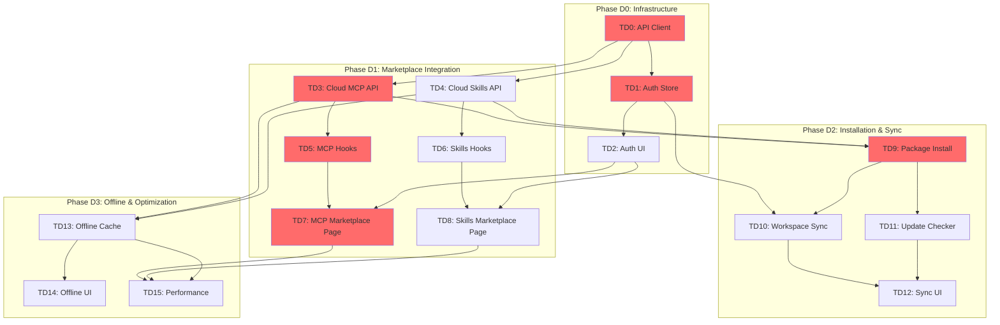

# Desktop Application Platform Integration - Task DAG

> Task Directed Acyclic Graph for integrating the Desktop app with the Viben Platform (v3.0).

---

## Overview

**Goal**: Integrate the Tauri Desktop application with the Web Platform to enable:
- User authentication (synced with Web accounts)
- MCP Marketplace browsing and installation
- Skills Marketplace browsing and installation
- Workspace synchronization
- Package update management
- Offline support

**Technology Stack**:
- Tauri 2.0 (Rust backend)
- React 19 + TypeScript (frontend)
- Zustand (state management)
- Radix UI + Tailwind CSS (UI)

**Relation to Main DAG**: This file details the sub-tasks for `T20: Desktop Integration` in [task-dag.md](./task-dag.md).

---

## Visual DAG

```
                                    ┌─────────────────┐
                                    │  TD0: API       │
                                    │   Client        │
                                    └────────┬────────┘
                                             │
                         ┌───────────────────┼───────────────────┐
                         │                   │                   │
                         ▼                   ▼                   ▼
                ┌─────────────────┐ ┌─────────────────┐ ┌─────────────────┐
                │  TD1: Auth      │ │  TD3: Cloud     │ │  TD4: Cloud     │
                │    Store        │ │   MCP API       │ │   Skills API    │
                └────────┬────────┘ └────────┬────────┘ └────────┬────────┘
                         │                   │                   │
                         ▼                   ▼                   ▼
                ┌─────────────────┐ ┌─────────────────┐ ┌─────────────────┐
                │  TD2: Auth UI   │ │  TD5: MCP       │ │  TD6: Skills    │
                │    Components   │ │    Hooks        │ │    Hooks        │
                └────────┬────────┘ └────────┬────────┘ └────────┬────────┘
                         │                   │                   │
                         └─────────┬─────────┴─────────┬─────────┘
                                   │                   │
                                   ▼                   ▼
                         ┌─────────────────┐ ┌─────────────────┐
                         │  TD7: MCP       │ │  TD8: Skills    │
                         │   Marketplace   │ │   Marketplace   │
                         └────────┬────────┘ └────────┬────────┘
                                  │                   │
                         ┌────────┴───────────────────┤
                         │                            │
                         ▼                            │
                ┌─────────────────┐                   │
                │  TD9: Package   │◀──────────────────┘
                │   Install       │
                └────────┬────────┘
                         │
              ┌──────────┼──────────┐
              │          │          │
              ▼          ▼          ▼
     ┌─────────────┐ ┌─────────────┐ ┌─────────────┐
     │TD10: Work-  │ │TD11: Update │ │TD13: Offline│
     │  space Sync │ │   Checker   │ │   Cache     │
     └──────┬──────┘ └──────┬──────┘ └──────┬──────┘
            │               │               │
            └───────┬───────┘               │
                    │                       │
                    ▼                       ▼
           ┌─────────────────┐     ┌─────────────────┐
           │  TD12: Sync UI  │     │  TD14: Offline  │
           │    Components   │     │    Mode UI      │
           └────────┬────────┘     └────────┬────────┘
                    │                       │
                    └───────────┬───────────┘
                                │
                                ▼
                       ┌─────────────────┐
                       │  TD15: Perf     │
                       │   Optimization  │
                       └─────────────────┘
```

---

## Mermaid DAG



---

## Task Definitions

### Phase D0: Infrastructure

| Task | Name | Type | Dependencies | Deliverables |
|------|------|------|--------------|--------------|
| TD0 | API Client Infrastructure | Rust + TS | - | `src-tauri/src/commands/api_client.rs`, `src/lib/api-client.ts` |
| TD1 | Auth Store & OAuth Flow | Rust + TS | TD0 | `src-tauri/src/commands/auth.rs`, `src/stores/auth-store.ts`, `src/hooks/use-auth.ts` |
| TD2 | Auth UI Components | React | TD1 | `src/components/auth/login-dialog.tsx`, `src/components/auth/user-menu.tsx` |

### Phase D1: Marketplace Integration

| Task | Name | Type | Dependencies | Deliverables |
|------|------|------|--------------|--------------|
| TD3 | Cloud MCP API Module | Rust | TD0 | `src-tauri/src/commands/cloud_mcp.rs` |
| TD4 | Cloud Skills API Module | Rust | TD0 | `src-tauri/src/commands/cloud_skills.rs` |
| TD5 | MCP Marketplace Hooks | React | TD3 | `src/hooks/use-cloud-mcp.ts` |
| TD6 | Skills Marketplace Hooks | React | TD4 | `src/hooks/use-cloud-skills.ts` |
| TD7 | MCP Marketplace Page | React | TD2, TD5 | `src/pages/marketplace.tsx`, `src/components/marketplace/*` |
| TD8 | Skills Marketplace Page | React | TD2, TD6 | `src/pages/skills-market.tsx`, `src/components/skills/*` |

### Phase D2: Installation & Sync

| Task | Name | Type | Dependencies | Deliverables |
|------|------|------|--------------|--------------|
| TD9 | Package Installation Engine | Rust | TD3, TD4 | `src-tauri/src/commands/package_install.rs` |
| TD10 | Workspace Sync Engine | Rust | TD1, TD9 | `src-tauri/src/commands/workspace_sync.rs` |
| TD11 | Package Update Checker | React | TD9 | `src/hooks/use-package-updates.ts`, `src/components/updates/*` |
| TD12 | Sync UI Components | React | TD10, TD11 | `src/components/sync/*` |

### Phase D3: Offline & Optimization

| Task | Name | Type | Dependencies | Deliverables |
|------|------|------|--------------|--------------|
| TD13 | Offline Cache System | Rust | TD3, TD4 | `src-tauri/src/commands/offline_cache.rs` |
| TD14 | Offline Mode UI | React | TD13 | `src/components/offline/*` |
| TD15 | Performance Optimization | Rust + React | TD7, TD8, TD13 | Code splitting, virtual scrolling, cache optimization |

---

## Key Task Details

### TD0: API Client Infrastructure

**Purpose**: Foundation layer for all platform API communication.

**Rust Commands** (`src-tauri/src/commands/api_client.rs`):

```rust
use serde::{Deserialize, Serialize};
use serde_json::Value;
use tauri::State;
use std::sync::Mutex;

pub struct ApiClientState {
    pub base_url: Mutex<String>,
}

impl Default for ApiClientState {
    fn default() -> Self {
        Self {
            base_url: Mutex::new("https://viben.vercel.app".to_string()),
        }
    }
}

#[derive(Debug, Serialize, Deserialize)]
pub struct ApiResponse<T> {
    pub data: T,
    pub error: Option<String>,
}

#[tauri::command]
pub async fn api_request(
    method: String,
    endpoint: String,
    body: Option<Value>,
    auth_token: Option<String>,
    state: State<'_, ApiClientState>,
) -> Result<Value, String> {
    let base_url = state.base_url.lock().unwrap().clone();
    let url = format!("{}{}", base_url, endpoint);

    let client = reqwest::Client::new();
    let mut request = match method.to_uppercase().as_str() {
        "GET" => client.get(&url),
        "POST" => client.post(&url),
        "PUT" => client.put(&url),
        "DELETE" => client.delete(&url),
        "PATCH" => client.patch(&url),
        _ => return Err(format!("Unsupported method: {}", method)),
    };

    request = request.header("Content-Type", "application/json");

    if let Some(token) = auth_token {
        request = request.header("Authorization", format!("Bearer {}", token));
    }

    if let Some(data) = body {
        request = request.json(&data);
    }

    let response = request.send().await.map_err(|e| e.to_string())?;
    let json: Value = response.json().await.map_err(|e| e.to_string())?;

    Ok(json)
}

#[tauri::command]
pub fn get_api_base_url(state: State<'_, ApiClientState>) -> String {
    state.base_url.lock().unwrap().clone()
}

#[tauri::command]
pub fn set_api_base_url(url: String, state: State<'_, ApiClientState>) -> Result<(), String> {
    let mut base_url = state.base_url.lock().unwrap();
    *base_url = url;
    Ok(())
}
```

**TypeScript Wrapper** (`src/lib/api-client.ts`):

```typescript
import { invoke } from "@tauri-apps/api/core";

export interface ApiRequestOptions {
  method: "GET" | "POST" | "PUT" | "DELETE" | "PATCH";
  endpoint: string;
  body?: unknown;
  authToken?: string;
}

export interface PaginatedResponse<T> {
  data: T[];
  pagination: {
    page: number;
    limit: number;
    total: number;
    totalPages: number;
  };
}

export async function apiRequest<T>(options: ApiRequestOptions): Promise<T> {
  return invoke<T>("api_request", {
    method: options.method,
    endpoint: options.endpoint,
    body: options.body ?? null,
    authToken: options.authToken ?? null,
  });
}

export async function getApiBaseUrl(): Promise<string> {
  return invoke<string>("get_api_base_url");
}

export async function setApiBaseUrl(url: string): Promise<void> {
  return invoke<void>("set_api_base_url", { url });
}
```

---

### TD1: Auth Store & OAuth Flow

**Purpose**: Manage user authentication state and OAuth2 flow.

**Rust Commands** (`src-tauri/src/commands/auth.rs`):

```rust
use serde::{Deserialize, Serialize};
use tauri::{AppHandle, Manager};
use std::sync::Mutex;

#[derive(Debug, Clone, Serialize, Deserialize)]
pub struct UserSession {
    pub id: String,
    pub email: String,
    pub username: String,
    pub display_name: String,
    pub avatar_url: Option<String>,
    pub access_token: String,
    pub refresh_token: Option<String>,
    pub expires_at: i64,
}

pub struct AuthState {
    pub session: Mutex<Option<UserSession>>,
}

impl Default for AuthState {
    fn default() -> Self {
        Self {
            session: Mutex::new(None),
        }
    }
}

#[tauri::command]
pub async fn login_with_credentials(
    email: String,
    password: String,
    state: tauri::State<'_, crate::commands::api_client::ApiClientState>,
    auth_state: tauri::State<'_, AuthState>,
) -> Result<UserSession, String> {
    let body = serde_json::json!({
        "email": email,
        "password": password,
    });

    let response = crate::commands::api_client::api_request(
        "POST".to_string(),
        "/api/auth/login".to_string(),
        Some(body),
        None,
        state,
    ).await?;

    let session: UserSession = serde_json::from_value(response)
        .map_err(|e| format!("Failed to parse session: {}", e))?;

    let mut current = auth_state.session.lock().unwrap();
    *current = Some(session.clone());

    Ok(session)
}

#[tauri::command]
pub fn login_with_github(app: AppHandle) -> Result<String, String> {
    let oauth_url = "https://viben.vercel.app/api/auth/github";
    // Open OAuth URL in default browser
    tauri_plugin_opener::open_url(&app, oauth_url, None::<&str>)
        .map_err(|e| e.to_string())?;
    Ok(oauth_url.to_string())
}

#[tauri::command]
pub async fn handle_oauth_callback(
    code: String,
    state: tauri::State<'_, crate::commands::api_client::ApiClientState>,
    auth_state: tauri::State<'_, AuthState>,
) -> Result<UserSession, String> {
    let body = serde_json::json!({ "code": code });

    let response = crate::commands::api_client::api_request(
        "POST".to_string(),
        "/api/auth/callback/github".to_string(),
        Some(body),
        None,
        state,
    ).await?;

    let session: UserSession = serde_json::from_value(response)
        .map_err(|e| format!("Failed to parse session: {}", e))?;

    let mut current = auth_state.session.lock().unwrap();
    *current = Some(session.clone());

    Ok(session)
}

#[tauri::command]
pub fn logout(auth_state: tauri::State<'_, AuthState>) -> Result<(), String> {
    let mut session = auth_state.session.lock().unwrap();
    *session = None;
    Ok(())
}

#[tauri::command]
pub fn get_current_user(
    auth_state: tauri::State<'_, AuthState>,
) -> Result<Option<UserSession>, String> {
    let session = auth_state.session.lock().unwrap();
    Ok(session.clone())
}

#[tauri::command]
pub async fn refresh_session(
    state: tauri::State<'_, crate::commands::api_client::ApiClientState>,
    auth_state: tauri::State<'_, AuthState>,
) -> Result<UserSession, String> {
    let current = auth_state.session.lock().unwrap().clone();
    let session = current.ok_or("No active session")?;

    let refresh_token = session.refresh_token.ok_or("No refresh token")?;
    let body = serde_json::json!({ "refresh_token": refresh_token });

    let response = crate::commands::api_client::api_request(
        "POST".to_string(),
        "/api/auth/refresh".to_string(),
        Some(body),
        None,
        state,
    ).await?;

    let new_session: UserSession = serde_json::from_value(response)
        .map_err(|e| format!("Failed to parse session: {}", e))?;

    let mut current = auth_state.session.lock().unwrap();
    *current = Some(new_session.clone());

    Ok(new_session)
}
```

**Zustand Store** (`src/stores/auth-store.ts`):

```typescript
import { create } from "zustand";
import { persist } from "zustand/middleware";
import { invoke } from "@tauri-apps/api/core";

export interface UserSession {
  id: string;
  email: string;
  username: string;
  displayName: string;
  avatarUrl: string | null;
  accessToken: string;
  refreshToken: string | null;
  expiresAt: number;
}

interface AuthState {
  user: UserSession | null;
  isAuthenticated: boolean;
  isLoading: boolean;
  error: string | null;

  login: (email: string, password: string) => Promise<void>;
  loginWithGitHub: () => Promise<void>;
  handleOAuthCallback: (code: string) => Promise<void>;
  logout: () => Promise<void>;
  refreshSession: () => Promise<void>;
  clearError: () => void;
}

export const useAuthStore = create<AuthState>()(
  persist(
    (set, get) => ({
      user: null,
      isAuthenticated: false,
      isLoading: false,
      error: null,

      login: async (email: string, password: string) => {
        set({ isLoading: true, error: null });
        try {
          const session = await invoke<UserSession>("login_with_credentials", {
            email,
            password,
          });
          set({ user: session, isAuthenticated: true, isLoading: false });
        } catch (err) {
          set({
            error: err instanceof Error ? err.message : String(err),
            isLoading: false,
          });
          throw err;
        }
      },

      loginWithGitHub: async () => {
        set({ isLoading: true, error: null });
        try {
          await invoke<string>("login_with_github");
          // OAuth flow continues in browser, callback handled separately
        } catch (err) {
          set({
            error: err instanceof Error ? err.message : String(err),
            isLoading: false,
          });
          throw err;
        }
      },

      handleOAuthCallback: async (code: string) => {
        set({ isLoading: true, error: null });
        try {
          const session = await invoke<UserSession>("handle_oauth_callback", {
            code,
          });
          set({ user: session, isAuthenticated: true, isLoading: false });
        } catch (err) {
          set({
            error: err instanceof Error ? err.message : String(err),
            isLoading: false,
          });
          throw err;
        }
      },

      logout: async () => {
        try {
          await invoke("logout");
          set({ user: null, isAuthenticated: false });
        } catch (err) {
          console.error("Logout failed:", err);
        }
      },

      refreshSession: async () => {
        try {
          const session = await invoke<UserSession>("refresh_session");
          set({ user: session, isAuthenticated: true });
        } catch (err) {
          set({ user: null, isAuthenticated: false });
          throw err;
        }
      },

      clearError: () => set({ error: null }),
    }),
    {
      name: "auth-storage",
      partialize: (state) => ({
        user: state.user,
        isAuthenticated: state.isAuthenticated,
      }),
    }
  )
);
```

**Hook** (`src/hooks/use-auth.ts`):

```typescript
import { useCallback, useEffect } from "react";
import { useAuthStore } from "@/stores/auth-store";

export function useAuth() {
  const store = useAuthStore();

  // Auto-refresh session before expiry
  useEffect(() => {
    if (!store.user) return;

    const expiresIn = store.user.expiresAt - Date.now();
    const refreshThreshold = 5 * 60 * 1000; // 5 minutes before expiry

    if (expiresIn < refreshThreshold) {
      store.refreshSession().catch(console.error);
      return;
    }

    const timeout = setTimeout(() => {
      store.refreshSession().catch(console.error);
    }, expiresIn - refreshThreshold);

    return () => clearTimeout(timeout);
  }, [store.user?.expiresAt]);

  return {
    user: store.user,
    isAuthenticated: store.isAuthenticated,
    isLoading: store.isLoading,
    error: store.error,
    login: store.login,
    loginWithGitHub: store.loginWithGitHub,
    handleOAuthCallback: store.handleOAuthCallback,
    logout: store.logout,
    clearError: store.clearError,
  };
}
```

---

### TD7: MCP Marketplace Page

**New Files**:

```
src/pages/marketplace.tsx          - Main marketplace page
src/components/marketplace/
├── package-card.tsx               - Package display card
├── package-detail.tsx             - Package detail drawer/modal
├── category-filter.tsx            - Category sidebar filter
├── search-bar.tsx                 - Search input with suggestions
├── install-button.tsx             - Install/update button with progress
├── rating-stars.tsx               - Star rating display
└── index.ts                       - Barrel export
```

**Route Updates** (`src/App.tsx`):

```typescript
import { MarketplacePage, SkillsMarketPage } from "@/pages";

// Add routes:
<Route path="marketplace" element={<MarketplacePage />} />
<Route path="skills-market" element={<SkillsMarketPage />} />
```

**Sidebar Updates** (`src/components/layout/sidebar.tsx`):

```typescript
import { Store, Sparkles } from "lucide-react";

const mainNav: NavItem[] = [
  // ... existing items
  { titleKey: "nav.marketplace", href: "/marketplace", icon: Store },
  { titleKey: "nav.skillsMarket", href: "/skills-market", icon: Sparkles },
];
```

---

### TD9: Package Installation Engine

**Rust Commands** (`src-tauri/src/commands/package_install.rs`):

```rust
use serde::{Deserialize, Serialize};
use std::path::PathBuf;
use tokio::fs;

#[derive(Debug, Serialize, Deserialize)]
pub struct InstallResult {
    pub package_id: String,
    pub package_type: String,
    pub install_path: String,
    pub version: String,
    pub success: bool,
    pub error: Option<String>,
}

#[derive(Debug, Serialize, Deserialize)]
pub struct InstalledPackage {
    pub id: String,
    pub name: String,
    pub version: String,
    pub package_type: String,
    pub install_path: String,
    pub installed_at: String,
}

#[derive(Debug, Serialize, Deserialize)]
pub struct InstalledPackagesInfo {
    pub mcp: Vec<InstalledPackage>,
    pub skills: Vec<InstalledPackage>,
}

#[tauri::command]
pub async fn install_cloud_mcp_package(
    package_id: String,
    python_path: String,
    state: tauri::State<'_, crate::commands::api_client::ApiClientState>,
    auth_state: tauri::State<'_, crate::commands::auth::AuthState>,
) -> Result<InstallResult, String> {
    let session = auth_state.session.lock().unwrap().clone();
    let auth_token = session.map(|s| s.access_token);

    // 1. Fetch package metadata
    let pkg_response = crate::commands::api_client::api_request(
        "GET".to_string(),
        format!("/api/mcp/{}", package_id),
        None,
        auth_token.clone(),
        state.clone(),
    ).await?;

    // 2. Download package
    let download_url = format!("/api/packages/mcp/{}/download", package_id);
    let download_response = crate::commands::api_client::api_request(
        "GET".to_string(),
        download_url,
        None,
        auth_token,
        state,
    ).await?;

    // 3. Install via pip
    let package_name = pkg_response["package"]["name"]
        .as_str()
        .ok_or("Invalid package name")?;

    let output = tokio::process::Command::new(&python_path)
        .args(["-m", "pip", "install", package_name])
        .output()
        .await
        .map_err(|e| format!("Failed to run pip: {}", e))?;

    if !output.status.success() {
        let stderr = String::from_utf8_lossy(&output.stderr);
        return Ok(InstallResult {
            package_id,
            package_type: "mcp".to_string(),
            install_path: String::new(),
            version: String::new(),
            success: false,
            error: Some(stderr.to_string()),
        });
    }

    Ok(InstallResult {
        package_id,
        package_type: "mcp".to_string(),
        install_path: python_path,
        version: pkg_response["package"]["version"]
            .as_str()
            .unwrap_or("unknown")
            .to_string(),
        success: true,
        error: None,
    })
}

#[tauri::command]
pub async fn install_cloud_skill_package(
    package_id: String,
    install_path: String,
    state: tauri::State<'_, crate::commands::api_client::ApiClientState>,
    auth_state: tauri::State<'_, crate::commands::auth::AuthState>,
) -> Result<InstallResult, String> {
    let session = auth_state.session.lock().unwrap().clone();
    let auth_token = session.map(|s| s.access_token);

    // 1. Fetch skill metadata
    let skill_response = crate::commands::api_client::api_request(
        "GET".to_string(),
        format!("/api/skills/{}", package_id),
        None,
        auth_token.clone(),
        state.clone(),
    ).await?;

    // 2. Download skill files
    let download_url = format!("/api/packages/skills/{}/download", package_id);
    let download_response = crate::commands::api_client::api_request(
        "GET".to_string(),
        download_url,
        None,
        auth_token,
        state,
    ).await?;

    // 3. Extract to install path
    let skill_dir = PathBuf::from(&install_path)
        .join(skill_response["package"]["slug"].as_str().unwrap_or(&package_id));

    fs::create_dir_all(&skill_dir)
        .await
        .map_err(|e| format!("Failed to create skill directory: {}", e))?;

    // TODO: Extract downloaded zip to skill_dir

    Ok(InstallResult {
        package_id,
        package_type: "skill".to_string(),
        install_path: skill_dir.to_string_lossy().to_string(),
        version: skill_response["package"]["version"]
            .as_str()
            .unwrap_or("unknown")
            .to_string(),
        success: true,
        error: None,
    })
}

#[tauri::command]
pub async fn uninstall_package(
    package_id: String,
    package_type: String,
) -> Result<(), String> {
    match package_type.as_str() {
        "mcp" => {
            // Uninstall via pip
            let output = tokio::process::Command::new("pip")
                .args(["uninstall", "-y", &package_id])
                .output()
                .await
                .map_err(|e| format!("Failed to uninstall: {}", e))?;

            if !output.status.success() {
                return Err(String::from_utf8_lossy(&output.stderr).to_string());
            }
        }
        "skill" => {
            // Remove skill directory
            // TODO: Look up install path and remove
        }
        _ => return Err(format!("Unknown package type: {}", package_type)),
    }

    Ok(())
}

#[tauri::command]
pub async fn get_installed_packages() -> Result<InstalledPackagesInfo, String> {
    // TODO: Read from local package registry
    Ok(InstalledPackagesInfo {
        mcp: vec![],
        skills: vec![],
    })
}

#[tauri::command]
pub async fn update_package(
    package_id: String,
    package_type: String,
    state: tauri::State<'_, crate::commands::api_client::ApiClientState>,
    auth_state: tauri::State<'_, crate::commands::auth::AuthState>,
) -> Result<InstallResult, String> {
    // Re-install to update
    match package_type.as_str() {
        "mcp" => {
            install_cloud_mcp_package(
                package_id,
                "python".to_string(), // TODO: Get from config
                state,
                auth_state,
            ).await
        }
        "skill" => {
            install_cloud_skill_package(
                package_id,
                "~/.claude/skills".to_string(), // TODO: Get from config
                state,
                auth_state,
            ).await
        }
        _ => Err(format!("Unknown package type: {}", package_type)),
    }
}
```

---

## Dependency Matrix

```
Task  | TD0 | TD1 | TD2 | TD3 | TD4 | TD5 | TD6 | TD7 | TD8 | TD9 | TD10| TD11| TD12| TD13| TD14| TD15
------|-----|-----|-----|-----|-----|-----|-----|-----|-----|-----|-----|-----|-----|-----|-----|-----
TD0   |     |     |     |     |     |     |     |     |     |     |     |     |     |     |     |
TD1   |  X  |     |     |     |     |     |     |     |     |     |     |     |     |     |     |
TD2   |     |  X  |     |     |     |     |     |     |     |     |     |     |     |     |     |
TD3   |  X  |     |     |     |     |     |     |     |     |     |     |     |     |     |     |
TD4   |  X  |     |     |     |     |     |     |     |     |     |     |     |     |     |     |
TD5   |     |     |     |  X  |     |     |     |     |     |     |     |     |     |     |     |
TD6   |     |     |     |     |  X  |     |     |     |     |     |     |     |     |     |     |
TD7   |     |     |  X  |     |     |  X  |     |     |     |     |     |     |     |     |     |
TD8   |     |     |  X  |     |     |     |  X  |     |     |     |     |     |     |     |     |
TD9   |     |     |     |  X  |  X  |     |     |     |     |     |     |     |     |     |     |
TD10  |     |  X  |     |     |     |     |     |     |     |  X  |     |     |     |     |     |
TD11  |     |     |     |     |     |     |     |     |     |  X  |     |     |     |     |     |
TD12  |     |     |     |     |     |     |     |     |     |     |  X  |  X  |     |     |     |
TD13  |     |     |     |  X  |  X  |     |     |     |     |     |     |     |     |     |     |
TD14  |     |     |     |     |     |     |     |     |     |     |     |     |     |  X  |     |
TD15  |     |     |     |     |     |     |     |  X  |  X  |     |     |     |     |  X  |     |
```

---

## Parallel Execution Groups

| Group | Tasks | Description |
|-------|-------|-------------|
| G-A | TD0 → TD1 → TD2 | Infrastructure (sequential) |
| G-B | TD3, TD4 | API Modules (parallel after TD0) |
| G-C | TD5, TD6 | React Hooks (parallel after respective APIs) |
| G-D | TD7, TD8 | Marketplace Pages (parallel after TD2 + hooks) |
| G-E | TD9 → TD10/TD11 | Install → Sync/Updates (TD10/TD11 parallel) |
| G-F | TD12 | Sync UI (after TD10 + TD11) |
| G-G | TD13 → TD14 | Offline system (sequential) |
| G-H | TD15 | Performance (last, after TD7/TD8/TD13) |

---

## Critical Path

```
TD0 → TD1 → TD3 → TD5 → TD7 → TD9 → TD10 → TD12
```

**Minimum Viable Feature Set**:
1. **TD0**: API Client Infrastructure
2. **TD1**: Auth Store & OAuth
3. **TD3**: Cloud MCP API
4. **TD5**: MCP Marketplace Hooks
5. **TD7**: MCP Marketplace Page
6. **TD9**: Package Installation

---

## Integration with Existing Features

### Features NOT to Break

- **Providers** (`/providers`) - Local data source management unchanged, add "Cloud" tab
- **Search Service** (`/search-service`) - Existing server management unchanged
- **Inspector** (`/inspector`) - No modifications needed
- **Agents** (`/agents`) - No modifications needed

### Reusable Components

- UI components: `Button`, `Card`, `Badge`, `Dialog`, `Input`, `Select`
- Layouts: `PageWrapper`, `BentoGrid`
- Hooks: `useAppStore`, `usePython`, `useMcp`

### Key Modifications

| File | Change |
|------|--------|
| `src-tauri/src/commands/mod.rs` | Register new command modules |
| `src-tauri/src/lib.rs` | Add new state managers |
| `src/stores/app-store.ts` | Extend with cloud package state |
| `src/stores/index.ts` | Export auth-store |
| `src/types/index.ts` | Add cloud package types |
| `src/App.tsx` | Add marketplace routes |
| `src/components/layout/sidebar.tsx` | Add marketplace navigation |
| `src/i18n/locales/en.json` | Add marketplace translations |
| `src/i18n/locales/zh-CN.json` | Add marketplace translations |

---

## Type Definitions

Add to `src/types/index.ts`:

```typescript
// Cloud Package Types

export interface CloudMcpPackage {
  id: string;
  name: string;
  slug: string;
  version: string;
  description: string | null;
  longDescription: string | null;
  category: string | null;
  transport: "stdio" | "sse";
  tags: string[] | null;
  repositoryUrl: string | null;
  favoritesCount: number;
  downloadsCount: number;
  ratingAvg: number;
  ratingCount: number;
  author: {
    id: string;
    username: string;
    displayName: string;
    avatarUrl: string | null;
  } | null;
  createdAt: string;
  updatedAt: string;
}

export interface CloudSkillPackage {
  id: string;
  name: string;
  slug: string;
  version: string;
  description: string | null;
  longDescription: string | null;
  category: string | null;
  skillType: string;
  triggerPatterns: string[] | null;
  tags: string[] | null;
  repositoryUrl: string | null;
  favoritesCount: number;
  downloadsCount: number;
  ratingAvg: number;
  ratingCount: number;
  author: {
    id: string;
    username: string;
    displayName: string;
    avatarUrl: string | null;
  } | null;
  createdAt: string;
  updatedAt: string;
}

export interface InstallResult {
  packageId: string;
  packageType: "mcp" | "skill";
  installPath: string;
  version: string;
  success: boolean;
  error: string | null;
}

export interface InstalledPackage {
  id: string;
  name: string;
  version: string;
  packageType: "mcp" | "skill";
  installPath: string;
  installedAt: string;
  hasUpdate?: boolean;
  latestVersion?: string;
}
```

---

## Verification Plan

### Unit Tests

- [ ] API Client request/response handling
- [ ] Auth Store state transitions
- [ ] OAuth callback handling
- [ ] Package install/uninstall logic
- [ ] Offline cache read/write

### Integration Tests

- [ ] Complete login flow (email + GitHub OAuth)
- [ ] MCP package browse → install → use
- [ ] Skills package browse → install → use
- [ ] Workspace sync flow
- [ ] Offline mode transitions

### E2E Tests

- [ ] New user onboarding flow
- [ ] Package search and install
- [ ] Multi-device workspace sync
- [ ] Offline browsing with cached data
- [ ] Package update workflow

---

## Notes

- API client uses Tauri's Rust backend for secure token storage
- OAuth flow uses deep linking for callback handling
- Package installation uses pip for MCP packages, file extraction for skills
- Offline cache stores package metadata locally for offline browsing
- Performance optimization includes virtual scrolling for large package lists
