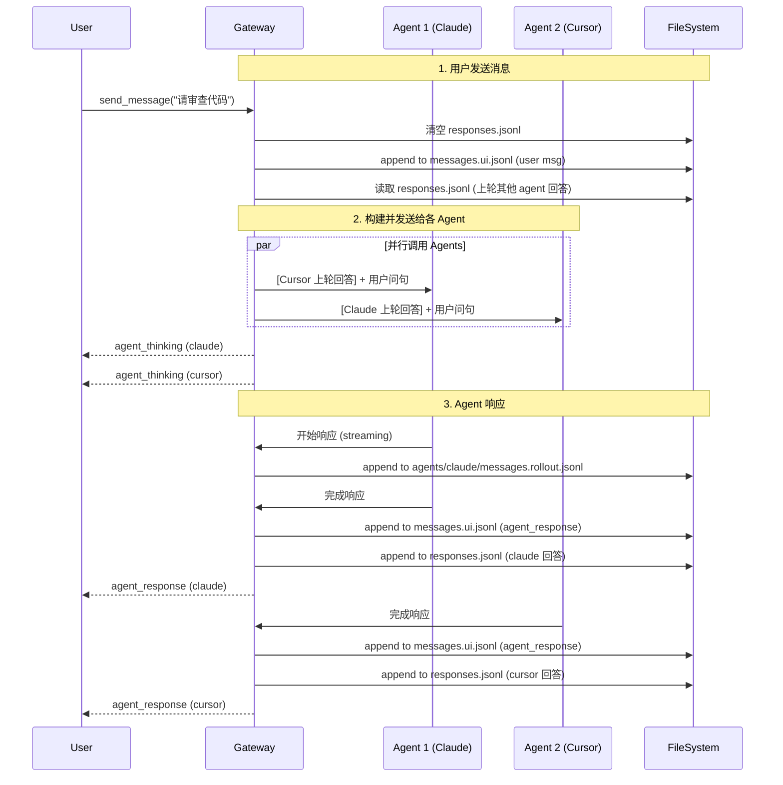

# Gateway 群聊功能规范

> 基于文件系统的群聊功能，支持人类用户与多个 AI 智能体在群聊中进行实时讨论和协作。

---

## Overview

| 属性 | 值 |
|------|-----|
| 模块 | `viben-core/gateway` |
| 存储 | **文件系统** (非数据库) |
| 状态 | **Draft v2** |
| 优先级 | P1 |

---

## 核心概念

### 用户视角 vs Agent 视角

| 视角 | 文件 | 内容 |
|------|------|------|
| **用户视角** | `messages.ui.jsonl` | 用户看到的消息流，不包含工具调用细节 |
| **Agent 视角** | `<agent-id>/messages.agent.jsonl` | 某个 Agent 的原始消息，包含工具调用 |

用户发送一句话后：
1. 群聊里所有 Agent **并行思考**
2. 用户视角只看到 "Agent 正在思考..."
3. 每个 Agent 思考完成后给出答案
4. 工具调用在后台进行，用户视角不显示

### 参与者类型

| 类型 | 标识 | 说明 |
|------|------|------|
| `human` | 用户 ID | 人类用户，通过 UI 发送消息 |
| `agent` | Agent ID | AI 智能体，如 Claude、GPT 等 |

---

## 文件系统结构

### 存储位置

```
<workspace>/.viben/group-chats/
```

### 目录结构

```
group-chats/
└── <group-chat-id>/
    ├── config.yaml              # 群聊配置
    ├── files/                   # 群文件（共享文件）
    ├── pictures/                # 群相册（共享图片）
    └── sessions/                # 对话记录
        └── <session-id>/
            ├── config.yaml          # Session 配置
            ├── messages.ui.jsonl    # 用户视角消息（append-only）
            ├── responses.jsonl      # 当前轮次各 agent 的回答（每轮清空重写）
            └── agents/
                └── <agent-id>/
                    ├── messages.rollout.jsonl  # Agent 消息记录（含工具调用）
                    └── subagents/              # 子 agent 消息（如有）
                        └── agent-<subagent-id>.jsonl
```

### 关键文件说明

| 文件 | 生命周期 | 用途 |
|------|----------|------|
| `messages.ui.jsonl` | append-only | 用户视角的完整对话历史 |
| `responses.jsonl` | 每轮清空 | 临时存储当前轮次各 agent 回答，用于构建下轮上下文 |
| `messages.rollout.jsonl` | append-only | agent 完整消息记录（含工具调用） |
| `subagents/agent-*.jsonl` | append-only | 子 agent 消息记录（跟随 Claude Code 设计） |

---

## 数据模型

### config.yaml (群聊配置)

```yaml
# <group-chat-id>/config.yaml
id: "gc-uuid"
name: "代码审查讨论"
description: "PR #123 的代码审查"
created_by: "user-1"
created_at: "2026-02-10T12:00:00Z"
updated_at: "2026-02-10T12:00:00Z"

# 群聊成员
members:
  - id: "user-1"
    type: human
    display_name: "张三"
    role: owner
    joined_at: "2026-02-10T12:00:00Z"

  - id: "claude-code"
    type: agent
    display_name: "Claude Code"
    model: "claude-sonnet-4-20250514"
    role: member
    joined_at: "2026-02-10T12:00:00Z"

  - id: "cursor"
    type: agent
    display_name: "Cursor AI"
    model: "gpt-4o"
    role: member
    joined_at: "2026-02-10T12:00:00Z"

# 群聊设置
settings:
  # 消息广播模式
  broadcast_mode: all  # all | mention_only
  # 是否显示 agent 思考过程
  show_thinking: false
  # 历史消息加载数量
  history_limit: 10
```

### config.yaml (Session 配置)

```yaml
# sessions/<session-id>/config.yaml
id: "session-uuid"
group_chat_id: "gc-uuid"
title: "讨论会话 1"
created_at: "2026-02-10T12:05:00Z"
updated_at: "2026-02-10T12:30:00Z"

# 本次会话参与的 agents
active_agents:
  - claude-code
  - cursor

# 会话状态
status: active  # active | archived
```

### messages.ui.jsonl (用户视角消息)

每行一条 JSON 消息，用于 UI 渲染：

```jsonl
{"id":"msg-1","type":"user","sender_id":"user-1","sender_name":"张三","content":"请帮我审查这段代码","timestamp":"2026-02-10T12:05:00Z"}
{"id":"msg-2","type":"agent_thinking","agent_id":"claude-code","agent_name":"Claude Code","status":"thinking","timestamp":"2026-02-10T12:05:01Z"}
{"id":"msg-3","type":"agent_thinking","agent_id":"cursor","agent_name":"Cursor AI","status":"thinking","timestamp":"2026-02-10T12:05:01Z"}
{"id":"msg-4","type":"agent_response","agent_id":"claude-code","agent_name":"Claude Code","content":"这段代码有几个问题...","timestamp":"2026-02-10T12:05:30Z"}
{"id":"msg-5","type":"agent_response","agent_id":"cursor","agent_name":"Cursor AI","content":"我同意 Claude 的观点，另外...","timestamp":"2026-02-10T12:05:35Z"}
```

#### UI 消息类型

```typescript
type UIMessageType =
  | "user"           // 用户消息
  | "agent_thinking" // Agent 正在思考
  | "agent_response" // Agent 回复
  | "system"         // 系统消息（成员加入/退出等）

interface UIMessage {
  id: string
  type: UIMessageType
  timestamp: string

  // user 消息
  sender_id?: string
  sender_name?: string
  content?: string

  // agent_thinking 消息
  agent_id?: string
  agent_name?: string
  status?: "thinking" | "done" | "error"

  // agent_response 消息
  // agent_id, agent_name, content

  // system 消息
  event?: "member_joined" | "member_left" | "session_created"
  data?: Record<string, unknown>
}
```

### responses.jsonl (当前轮次 Agent 回答)

临时存储当前轮次各 agent 的最终回答，**不包含工具调用过程**：

```jsonl
{"agent_id":"claude-code","agent_name":"Claude Code","content":"这段代码有几个问题...","timestamp":"2026-02-10T12:05:30Z"}
{"agent_id":"cursor","agent_name":"Cursor AI","content":"我同意 Claude 的观点，另外...","timestamp":"2026-02-10T12:05:35Z"}
```

**生命周期**：
- 用户发送消息后，`responses.jsonl` 被**清空**
- 每个 agent 完成回答后，追加到 `responses.jsonl`
- 下次用户发送消息时，读取 `responses.jsonl` 构建其他 agent 的回答上下文

### messages.rollout.jsonl (Agent 消息记录)

Agent 的完整消息记录，包含工具调用。**关键点**：发给某个 agent 的消息会 **prepend 其他 agent 的回答**。

```jsonl
{"role":"system","content":"你是 Claude Code，一个代码审查助手..."}
{"role":"user","content":"请帮我审查这段代码","name":"张三"}
{"role":"assistant","content":"让我先分析这段代码...","tool_calls":[{"id":"tc-1","type":"function","function":{"name":"read_file","arguments":"{\"path\":\"src/main.rs\"}"}}]}
{"role":"tool","tool_call_id":"tc-1","content":"fn main() { ... }"}
{"role":"assistant","content":"这段代码有几个问题..."}
{"role":"user","content":"[Cursor AI]: 我同意 Claude 的观点，另外...\n\n[用户]: 那具体应该怎么改？"}
{"role":"assistant","content":"好的，让我给出具体修改建议..."}
```

**消息构建逻辑**（以发送给 Claude 为例）：
```
1. 读取 responses.jsonl 中非 Claude 的回答
2. 格式化为: "[Cursor AI]: xxx\n\n[用户]: 用户新问句"
3. 作为新的 user message 追加到 messages.rollout.jsonl
```

### subagents/agent-*.jsonl (子 Agent 消息)

当主 Agent 调用子 Agent 时（如 Claude Code 的 Task tool），子 Agent 的消息记录在此：

```
agents/claude-code/
├── messages.rollout.jsonl           # 主 agent 消息
└── subagents/
    ├── agent-explore-1.jsonl        # 探索子 agent
    └── agent-implement-2.jsonl      # 实现子 agent
```

子 agent 消息格式与主 agent 相同：

```jsonl
{"role":"system","content":"你是一个代码探索助手..."}
{"role":"user","content":"请分析 src/main.rs 的结构"}
{"role":"assistant","content":"这个文件包含..."}
```

---

## Gateway API

### REST Endpoints

#### 群聊管理

```
POST   /api/workspaces/:workspace_id/group-chats              创建群聊
GET    /api/workspaces/:workspace_id/group-chats              列出群聊
GET    /api/workspaces/:workspace_id/group-chats/:id          获取群聊详情
PATCH  /api/workspaces/:workspace_id/group-chats/:id          更新群聊配置
DELETE /api/workspaces/:workspace_id/group-chats/:id          删除群聊
```

#### 成员管理

```
GET    /api/group-chats/:id/members                添加成员
POST   /api/group-chats/:id/members                添加成员
DELETE /api/group-chats/:id/members/:member_id     移除成员
```

#### Session 管理

```
POST   /api/group-chats/:id/sessions               创建新 Session
GET    /api/group-chats/:id/sessions               列出 Sessions
GET    /api/group-chats/:id/sessions/:session_id   获取 Session 详情
DELETE /api/group-chats/:id/sessions/:session_id   删除 Session
```

#### 消息

```
GET    /api/group-chats/:id/sessions/:session_id/messages
       ?view=ui|agent&agent_id=xxx&limit=10&before=timestamp

POST   /api/group-chats/:id/sessions/:session_id/messages
       发送消息（触发所有 agent 响应）
```

### WebSocket Endpoints

#### 群聊实时通信

```
WS /api/group-chats/:id/sessions/:session_id/ws
```

**连接参数**:
```
?member_type=human&member_id=user-1
```

**客户端命令**:
```typescript
// 发送消息
{ "type": "send_message", "content": "Hello everyone!" }

// 切换视角
{ "type": "switch_view", "view": "ui" | "agent", "agent_id": "claude-code" }

// 中断 agent 思考
{ "type": "interrupt", "agent_id": "claude-code" }
```

**服务端事件**:
```typescript
// Agent 开始思考
{ "type": "agent_thinking", "agent_id": "string", "agent_name": "string" }

// Agent 思考进度（可选，用于显示 token 流）
{ "type": "agent_progress", "agent_id": "string", "delta": "string" }

// Agent 完成回复
{ "type": "agent_response", "agent_id": "string", "agent_name": "string", "content": "string" }

// Agent 出错
{ "type": "agent_error", "agent_id": "string", "error": "string" }

// 视角数据（切换视角后返回）
{ "type": "view_data", "view": "ui" | "agent", "messages": Message[] }
```

---

## 交互流程

### 用户发送消息



### 切换视角

用户可以在 UI 标题栏右上角切换查看不同视角：

| 视角 | 数据来源 | 可发送消息 | 说明 |
|------|----------|------------|------|
| **群聊视角** (默认) | `messages.ui.jsonl` | ✅ 是 | 简洁的消息流，用户正常交互 |
| **Agent 视角** | `agents/<id>/messages.rollout.jsonl` | ❌ 否（只读） | 查看特定 Agent 的工具调用过程 |

**切换行为**：
- 切换后保持在**同一消息位置**（同一轮对话）
- Agent 视角下，消息输入框**禁用**
- 需要用户**手动切换**，不会自动切换

### Session 切换

标题栏可以切换 Session（类似其他对话页面的 session 切换）：

```
┌──────────────────────────────────────────────────┐
│  代码审查讨论  ▼  │  Session 1 ▼  │  👁 群聊视角 ▼  │
├──────────────────────────────────────────────────┤
│                                                  │
│  [消息列表]                                       │
│                                                  │
└──────────────────────────────────────────────────┘
```

---

## API Request/Response 示例

### 创建群聊

**Request**:
```http
POST /api/workspaces/ws-1/group-chats
Content-Type: application/json

{
  "name": "代码审查讨论",
  "description": "PR #123 的代码审查",
  "members": [
    { "type": "human", "id": "user-1", "display_name": "张三", "role": "owner" },
    { "type": "agent", "id": "claude-code", "display_name": "Claude Code", "model": "claude-sonnet-4-20250514" },
    { "type": "agent", "id": "cursor", "display_name": "Cursor AI", "model": "gpt-4o" }
  ]
}
```

**Response**:
```json
{
  "id": "gc-uuid",
  "name": "代码审查讨论",
  "path": "/workspace/path/.viben/group-chats/gc-uuid",
  "members": [
    { "type": "human", "id": "user-1", "display_name": "张三", "role": "owner" },
    { "type": "agent", "id": "claude-code", "display_name": "Claude Code" },
    { "type": "agent", "id": "cursor", "display_name": "Cursor AI" }
  ],
  "created_at": "2026-02-10T12:00:00Z"
}
```

### 发送消息

**Request**:
```http
POST /api/group-chats/gc-uuid/sessions/session-1/messages
Content-Type: application/json

{
  "content": "请帮我审查这段代码"
}
```

**Response** (立即返回，agent 响应通过 WebSocket 推送):
```json
{
  "message": {
    "id": "msg-uuid",
    "type": "user",
    "content": "请帮我审查这段代码",
    "timestamp": "2026-02-10T12:05:00Z"
  },
  "agents_triggered": ["claude-code", "cursor"]
}
```

### 获取消息历史

**Request**:
```http
GET /api/group-chats/gc-uuid/sessions/session-1/messages?view=ui&limit=10
```

**Response**:
```json
{
  "messages": [
    { "id": "msg-1", "type": "user", "sender_name": "张三", "content": "请帮我审查这段代码", "timestamp": "..." },
    { "id": "msg-2", "type": "agent_response", "agent_name": "Claude Code", "content": "这段代码有几个问题...", "timestamp": "..." },
    { "id": "msg-3", "type": "agent_response", "agent_name": "Cursor AI", "content": "我同意...", "timestamp": "..." }
  ],
  "has_more": true
}
```

### 切换到 Agent 视角

**Request**:
```http
GET /api/group-chats/gc-uuid/sessions/session-1/messages?view=agent&agent_id=claude-code&limit=10
```

**Response**:
```json
{
  "messages": [
    { "role": "system", "content": "你是 Claude Code..." },
    { "role": "user", "content": "请帮我审查这段代码", "name": "张三" },
    { "role": "assistant", "content": null, "tool_calls": [{ "id": "tc-1", "function": { "name": "read_file", "arguments": "..." } }] },
    { "role": "tool", "tool_call_id": "tc-1", "content": "fn main() { ... }" },
    { "role": "assistant", "content": "这段代码有几个问题..." }
  ],
  "has_more": false
}
```

---

## 消息构建逻辑

### 发送给 Agent 的消息构建

当用户发送消息时，Gateway 需要为每个 Agent 构建独立的上下文：

```rust
/// 为特定 agent 构建发送消息
fn build_message_for_agent(
    agent_id: &str,
    user_message: &str,
    responses: &[AgentResponse],  // 从 responses.jsonl 读取
) -> String {
    // 1. 收集其他 agent 的回答
    let other_responses: Vec<_> = responses
        .iter()
        .filter(|r| r.agent_id != agent_id)
        .collect();

    // 2. 构建消息
    if other_responses.is_empty() {
        // 第一轮对话，直接发送用户消息
        user_message.to_string()
    } else {
        // 后续轮次，prepend 其他 agent 回答
        let mut parts = Vec::new();
        for resp in other_responses {
            parts.push(format!("[{}]: {}", resp.agent_name, resp.content));
        }
        parts.push(format!("[用户]: {}", user_message));
        parts.join("\n\n")
    }
}
```

### 示例：3 个 Agent 的群聊

假设群聊有 Claude、Cursor、Codex 三个 Agent：

**用户第一轮**: "请帮我审查代码"
- → 发给 Claude: "请帮我审查代码"
- → 发给 Cursor: "请帮我审查代码"
- → 发给 Codex: "请帮我审查代码"

**各 Agent 回答后，responses.jsonl**:
```jsonl
{"agent_id":"claude","agent_name":"Claude","content":"代码有3个问题..."}
{"agent_id":"cursor","agent_name":"Cursor","content":"我发现2个bug..."}
{"agent_id":"codex","agent_name":"Codex","content":"建议重构这部分..."}
```

**用户第二轮**: "那具体怎么改？"
- → 发给 Claude:
  ```
  [Cursor]: 我发现2个bug...

  [Codex]: 建议重构这部分...

  [用户]: 那具体怎么改？
  ```
- → 发给 Cursor:
  ```
  [Claude]: 代码有3个问题...

  [Codex]: 建议重构这部分...

  [用户]: 那具体怎么改？
  ```
- → 发给 Codex:
  ```
  [Claude]: 代码有3个问题...

  [Cursor]: 我发现2个bug...

  [用户]: 那具体怎么改？
  ```

---

## 文件操作

### Rust 实现要点

```rust
use std::path::PathBuf;
use tokio::fs;
use tokio::io::{AsyncBufReadExt, AsyncWriteExt, BufReader};

/// 群聊服务
pub struct GroupChatService {
    workspace_path: PathBuf,
}

impl GroupChatService {
    /// 获取群聊根目录
    fn group_chats_dir(&self) -> PathBuf {
        self.workspace_path.join(".viben/group-chats")
    }

    /// 获取特定群聊目录
    fn group_chat_dir(&self, id: &str) -> PathBuf {
        self.group_chats_dir().join(id)
    }

    /// 追加消息到 JSONL 文件
    async fn append_message(&self, path: &PathBuf, message: &impl Serialize) -> Result<()> {
        let mut file = fs::OpenOptions::new()
            .create(true)
            .append(true)
            .open(path)
            .await?;

        let line = serde_json::to_string(message)?;
        file.write_all(format!("{}\n", line).as_bytes()).await?;
        Ok(())
    }

    /// 读取最后 N 条消息
    async fn read_last_messages<T: DeserializeOwned>(
        &self,
        path: &PathBuf,
        limit: usize
    ) -> Result<Vec<T>> {
        let file = fs::File::open(path).await?;
        let reader = BufReader::new(file);
        let mut lines = reader.lines();

        let mut messages = Vec::new();
        while let Some(line) = lines.next_line().await? {
            let msg: T = serde_json::from_str(&line)?;
            messages.push(msg);
        }

        // 返回最后 limit 条
        let start = messages.len().saturating_sub(limit);
        Ok(messages[start..].to_vec())
    }
}
```

### 文件锁定策略

使用文件级别的追加写入 (append-only)，无需复杂锁定：

```rust
// JSONL 追加写入天然支持并发
// 每次写入一行，原子性由文件系统保证
fs::OpenOptions::new()
    .create(true)
    .append(true)  // 追加模式
    .open(path)
```

---

## 实现优先级

### Phase 1: 基础框架

- [ ] 文件系统目录结构创建
- [ ] config.yaml 读写
- [ ] messages.ui.jsonl 读写
- [ ] REST API: CRUD 群聊

### Phase 2: 消息流

- [ ] 用户消息发送
- [ ] Agent 并行调用
- [ ] messages.agent.jsonl 记录
- [ ] WebSocket 实时推送

### Phase 3: 视角切换

- [ ] UI 视角读取
- [ ] Agent 视角读取
- [ ] 前端视角切换 UI

### Phase 4: 高级功能

- [ ] 群文件上传/下载
- [ ] 群相册管理
- [ ] 历史 Session 浏览

---

## 文件清单

### 需要创建

| 文件 | 说明 |
|------|------|
| `src/group_chat/mod.rs` | 群聊模块入口 |
| `src/group_chat/types.rs` | 数据类型定义 |
| `src/group_chat/service.rs` | 群聊服务（文件操作） |
| `src/group_chat/config.rs` | Config YAML 读写 |
| `src/group_chat/messages.rs` | JSONL 消息读写 |
| `src/gateway/routes/group_chats.rs` | REST API 路由 |

### 需要修改

| 文件 | 变更 |
|------|------|
| `src/lib.rs` | 导出 group_chat 模块 |
| `src/gateway/routes/mod.rs` | 注册新路由 |

---

## 与现有系统的区别

| 对比项 | 普通 Chat Session | Group Chat |
|--------|-------------------|------------|
| 参与者 | 1 用户 + 1 Agent | 1 用户 + N Agents |
| Agent 响应 | 串行 | **并行** |
| 工具调用 | 显示在 UI | **隐藏在后台** |
| 存储 | 数据库 | **文件系统** |
| 视角 | 单一 | **可切换** |
