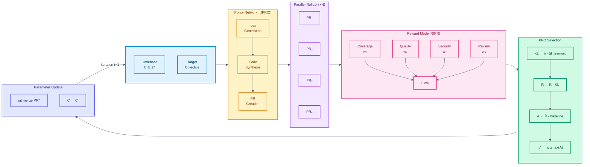
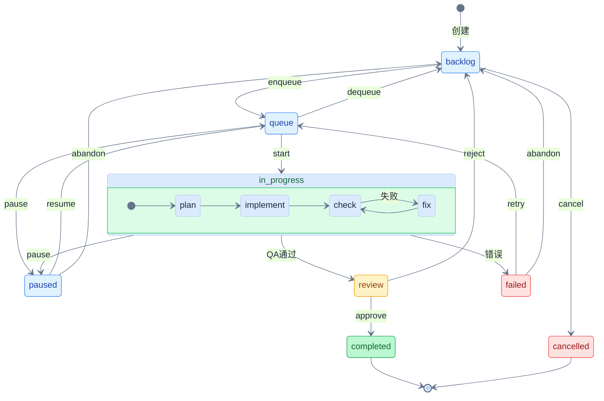

**中文 | [English](./README_EN.md)**

<div align="center">


# 微本

### Agent 集群 × 代码进化

##### 把代码库当作模型参数，针对文件使用强化学习持续优化

[](https://github.com/LinXueyuanStdio/viben/releases)
[](./LICENSE)
[](https://nodejs.org)
[](https://www.typescriptlang.org/)
[](https://tauri.app/)
[](https://github.com/LinXueyuanStdio/viben/pulls)

</div>

---

## 🧬 FileRL: 代码库强化学习

<div align="center">



</div>

**算法形式化定义**

| 符号 | LLM PPO | FileRL | 描述 |
|:----:|:-------:|:------:|------|
| **θ** | 模型参数 ∈ ℝᵈ | 代码库 C ∈ Σ* | 优化目标 |
| **π** | π_θ(y\|x) | π(PR\|C) | 生成策略 |
| **a** | token yₜ | Pull Request | 单步动作 |
| **∇** | ∇L | git diff | 梯度/变化 |
| **update** | θ ← θ - η∇L | git merge | 参数更新 |
| **R** | R(x,y) | CI + Review | 奖励函数 |

**PPO 目标函数**

$$L^{PPO}(\theta) = \mathbb{E}\left[\min\left(r_t(\theta)\hat{A}_t, \text{clip}(r_t(\theta), 1-\epsilon, 1+\epsilon)\hat{A}_t\right)\right] - \lambda \cdot D_{KL}$$

其中 FileRL 的 KL 散度近似为代码变更规模：$D_{KL} \approx \frac{|\Delta\text{lines}|}{\text{max\_diff}}$

<details>
<summary><b>FileRL CLI 命令</b></summary>

**基础命令**
```bash
viben filerl create <name>       # 创建 FileRL 目标文件
viben filerl start <target.md>   # 启动 FileRL 优化循环
viben filerl status <name>       # 查看运行状态
viben filerl list                # 列出所有运行
viben filerl stop <name>         # 停止运行
viben filerl resume <name>       # 恢复运行
```

**Idea 生成与任务转换**
```bash
viben idea generate --types <types>          # 生成优化想法
viben idea list                              # 列出生成的想法
viben idea promote <id> --worktree --start   # 转为任务并启动
```

**奖励计算与 PPO 选择**
```bash
viben task compute-reward <task>             # 计算 PR 奖励
viben reward select <tasks...>               # PPO 选择最佳 PR
viben reward list-types                      # 列出奖励类型
```

**监控与清理**
```bash
viben swarm status --watch    # 实时监控 Agent
viben task approve <task>     # 批准并合并 PR
viben task cleanup <task>     # 清理 worktree
```

</details>

---

## ✨ 特性

| 特性 | 描述 |
|------|------|
| 🤖 **多智能体编排** | 在本地工作空间中协调 AI Agent 集群 |
| 🔌 **MCP 协议** | 完整支持 Model Context Protocol |
| 🖥️ **跨平台** | CLI、桌面应用、Web 应用三端统一 |
| 📋 **看板管理** | 可拖拽的任务看板，实时追踪进度 |
| 📡 **会话监控** | 实时查看 Agent 对话和工具调用 |

---

## 📦 下载

### 🖥️ 桌面应用

| 平台 | 下载 |
|:----:|------|
| 🍎 **macOS** | [.dmg](https://github.com/LinXueyuanStdio/viben/releases/latest) (Universal) |
| 🪟 **Windows** | [.msi](https://github.com/LinXueyuanStdio/viben/releases/latest) / [.exe](https://github.com/LinXueyuanStdio/viben/releases/latest) (64-bit) |
| 🐧 **Linux** | [.AppImage](https://github.com/LinXueyuanStdio/viben/releases/latest) / [.deb](https://github.com/LinXueyuanStdio/viben/releases/latest) |

### 💻 CLI

```bash
# Shell (macOS/Linux)
curl -fsSL https://github.com/LinXueyuanStdio/viben/releases/latest/download/install.sh | bash

# npm
npm install -g viben

# Homebrew
brew tap LinXueyuanStdio/viben && brew install viben

# 或直接运行 (无需安装)
npx viben
```

---

## 📋 任务系统

基于 XState 状态机的任务生命周期管理，支持看板、队列和自动化执行。

### 任务生命周期



> **内部流程**: `in_progress` 状态内部执行 plan → implement → check → fix 循环

| 状态 | 说明 | 触发命令 |
|------|------|----------|
| `backlog` | 待办，等待排队 | `task create` |
| `queue` | 已排队，等待执行 | `task enqueue` |
| `in_progress` | 执行中 (plan → implement → check) | `task start` |
| `paused` | 已暂停，保留进度 | `task pause` |
| `review` | 等待人工审核 | 自动 (QA 通过) |
| `completed` | 已完成 | `task approve` |
| `failed` | 执行失败 | 自动 |
| `cancelled` | 已取消 | `task cancel` |

### 任务目录结构

```
.viben/tasks/<date>-<slug>/
├── task.json           # 任务元数据 (状态、配置、时间戳)
├── events.jsonl        # 事件历史 (状态转换记录)
├── prd.md              # 产品需求文档
├── implement.jsonl     # 实现阶段上下文注入
├── check.jsonl         # 检查阶段上下文注入
└── logs/               # 执行日志
```

<details>
<summary><b>CLI 命令速查</b></summary>

**创建与配置**
```bash
viben task create "<title>" --slug <name>    # 创建任务
viben task init-context <task>               # 初始化上下文文件
viben task add-context <task> <file> -r "原因"  # 添加上下文文件
viben task set-agent <task> -a <agent>       # 设置智能体
```

**执行流程**
```bash
viben task enqueue <task>    # backlog → queue
viben task start <task>      # queue → in_progress
viben task pause <task>      # 暂停执行
viben task resume <task>     # 恢复执行
viben task status <task>     # 查看状态
```

**审核与完成**
```bash
viben task review <task>     # 用户手动审核任务
viben task approve <task>    # review → completed
viben task reject <task>     # review → backlog
viben task retry <task>      # failed → queue
viben task cancel <task>     # * → cancelled
```

**辅助命令**
```bash
viben task list              # 列出所有任务
viben task context <task>    # 获取指定任务的会话上下文
viben task plan-phase <task> # 执行计划阶段
viben task work-phase <task> # 执行工作阶段
viben task create-worktree <task> # 创建 Git 工作树
viben task create-pr <task>  # 从任务创建 PR
viben task archive <task>    # 归档已完成任务
```

</details>

---

## 💡 Idea 生成

AI 驱动的代码库分析，自动生成改进建议并转化为任务。

| 内置类型 | 说明 |
|----------|------|
| `code_improvements` | 基于现有模式的代码改进 |
| `security_hardening` | 安全漏洞和加固措施 |
| `performance_optimizations` | 性能瓶颈和优化 |
| `documentation_gaps` | 缺失的文档 |
| `ui_ux_improvements` | UI/UX 增强 |
| `code_quality` | 代码质量和重构 |

```bash
# 生成代码改进建议
viben idea generate --types code_improvements security_hardening

# 查看生成的想法
viben idea list

# 将想法转为任务
viben idea promote ci-001

# 将想法转为任务并立即启动（支持 task create 的所有选项）
viben idea promote ci-001 --start --worktree
```

> 支持在 `docs/idea-types/*.md` 创建自定义类型 prompt 模板

---

## ⚙️ 配置

```
~/.viben/
├── providers.yaml    # API Keys, Endpoints
├── models.yaml       # 模型参数
├── agents/           # Agent 定义
│   └── <name>/
│       └── AGENTS.md
├── cron.yaml         # 定时任务
├── channels.yaml     # 通知渠道
└── workspaces.yaml   # 工作空间
```

---

<details>
<summary><b>🛠️ 开发者指南</b></summary>

### 📋 环境要求

- Node.js >= 20
- pnpm >= 9.15
- Rust (桌面应用)

### 🚀 快速开始

```bash
git clone https://github.com/LinXueyuanStdio/viben.git
cd viben && pnpm install

pnpm build              # 构建
pnpm desktop:restart    # 桌面应用开发
pnpm gateway:restart    # 启动 Gateway
```

### 📁 项目结构

```
apps/
├── cli/        # viben 命令行
├── desktop/    # Tauri 桌面应用
└── web/        # Next.js (MCP 市场)

packages/
├── core/       # 核心库 + Gateway
├── ui/         # UI 组件库
├── chat/       # 聊天组件
└── kanban/     # 看板组件
```

### 🔧 技术栈

| 类别 | 技术 |
|:----:|------|
| 📝 语言 | TypeScript |
| 🖥️ 桌面 | Tauri 2 + React 19 + Vite |
| 🌐 Web | Next.js 15 |
| 🎨 样式 | Tailwind CSS 4 + Radix UI |
| 📊 状态 | Zustand |
| 🔨 构建 | pnpm + Turborepo |

</details>

---

## 📄 许可证

[MIT](./LICENSE)
