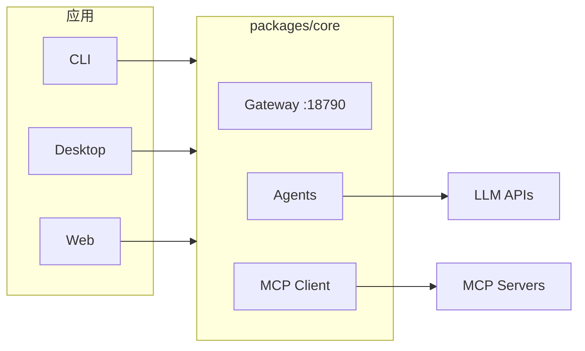

# Viben

> 多智能体工作空间管理器 — 在本地编排 AI Agent 集群，统一管理看板、日历、时间线和任务。

[](https://github.com/LinXueyuanStdio/viben/releases)
[](./LICENSE)

## 特性

| 特性 | 描述 |
|------|------|
| 🤖 **多智能体编排** | 在本地工作空间中协调 AI Agent 集群 |
| 🔌 **MCP 协议** | 完整支持 Model Context Protocol |
| 🖥️ **跨平台** | CLI、桌面应用、Web 应用三端统一 |
| 📋 **看板管理** | 可拖拽的任务看板，实时追踪进度 |
| 📡 **会话监控** | 实时查看 Agent 对话和工具调用 |

## 下载

### 桌面应用

| 平台 | 下载 |
|------|------|
| **macOS** | [.dmg](https://github.com/LinXueyuanStdio/viben/releases/latest) (Universal) |
| **Windows** | [.msi](https://github.com/LinXueyuanStdio/viben/releases/latest) / [.exe](https://github.com/LinXueyuanStdio/viben/releases/latest) (64-bit) |
| **Linux** | [.AppImage](https://github.com/LinXueyuanStdio/viben/releases/latest) / [.deb](https://github.com/LinXueyuanStdio/viben/releases/latest) |

### CLI

```bash
# Shell (macOS/Linux)
curl -fsSL https://github.com/LinXueyuanStdio/viben/releases/latest/download/install.sh | bash

# npm
npm install -g viben

# Homebrew
brew tap LinXueyuanStdio/viben && brew install viben

# 或直接运行 (无需安装)
npx viben
```

## 架构



`packages/core` 是所有应用的唯一边界，配置存储在 `~/.viben/` (YAML)。

## 配置

```
~/.viben/
├── providers.yaml    # API Keys, Endpoints
├── models.yaml       # 模型参数
├── agents/           # Agent 定义
│   └── <name>/
│       └── AGENTS.md
├── cron.yaml         # 定时任务
├── channels.yaml     # 通知渠道
└── workspaces.yaml   # 工作空间
```

<details>
<summary><b>开发者指南</b></summary>

### 环境要求

- Node.js >= 20
- pnpm >= 9.15
- Rust (桌面应用)

### 快速开始

```bash
git clone https://github.com/LinXueyuanStdio/viben.git
cd viben && pnpm install

pnpm build              # 构建
pnpm desktop:dev        # 桌面应用开发
pnpm gateway:restart    # 启动 Gateway
```

### 项目结构

```
apps/
├── cli/        # viben 命令行
├── desktop/    # Tauri 桌面应用
└── web/        # Next.js (MCP 市场)

packages/
├── core/       # 核心库 + Gateway
├── ui/         # UI 组件库
├── chat/       # 聊天组件
└── kanban/     # 看板组件
```

### 技术栈

TypeScript · Tauri · Next.js 15 · Tailwind CSS · Radix UI · Zustand · pnpm + Turbo

</details>

## 许可证

[MIT](./LICENSE) © 2025 OPENAGS
