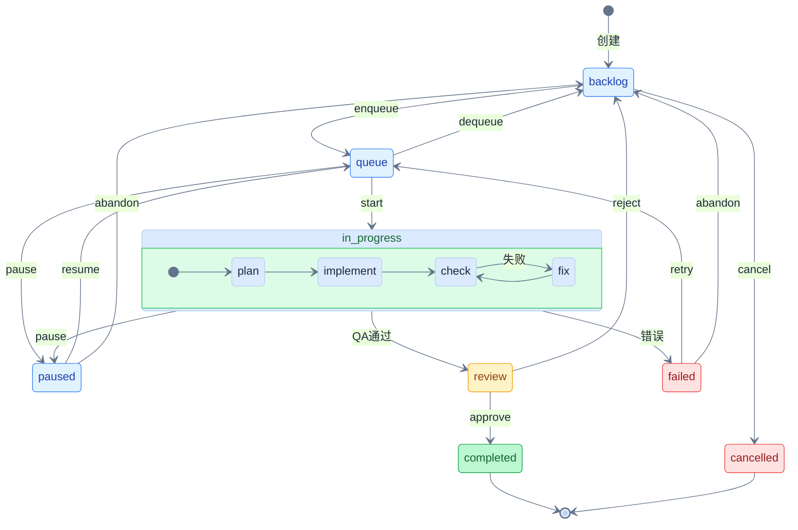

**中文 | [English](./README_EN.md)**

<div align="center">


# 微本

### Agent 集群 × 代码进化

##### FileEvo: 生成多个候选方案 → 多维度评估 → 选择最优合并

[](https://github.com/LinXueyuanStdio/viben/releases)
[](./LICENSE)
[](https://linxueyuan.online/viben/)
[](https://nodejs.org)
[](https://www.typescriptlang.org/)
[](https://tauri.app/)
[](https://github.com/LinXueyuanStdio/viben/pulls)

</div>

---

## ✨ 特性

<table>
<tr>
<td align="center" width="33%">
<h3>🧬 FileEvo</h3>
<b>代码迭代优化</b><br/>
多候选采样 + 质量评估<br/>
自动选择最优方案合并
</td>
<td align="center" width="33%">
<h3>🤖 多智能体</h3>
<b>Agent 集群编排</b><br/>
并行 Worktree 隔离<br/>
自动化任务分发与监控
</td>
<td align="center" width="33%">
<h3>🔌 MCP 协议</h3>
<b>Model Context Protocol</b><br/>
工具注册与调用<br/>
扩展 Agent 能力边界
</td>
</tr>
<tr>
<td align="center">
<h3>📋 任务系统</h3>
<b>状态机驱动</b><br/>
看板 + 队列 + 自动执行<br/>
完整的任务生命周期管理
</td>
<td align="center">
<h3>💡 Idea 生成</h3>
<b>AI 驱动代码分析</b><br/>
自动发现改进点<br/>
一键转化为可执行任务
</td>
<td align="center">
<h3>🖥️ 跨平台</h3>
<b>CLI / Desktop / Web</b><br/>
Tauri 2 桌面应用<br/>
三端统一体验
</td>
</tr>
</table>

---

## 🧬 FileEvo: 代码迭代优化

> FileEvo 是一种启发式迭代优化方法，核心思想是"生成多个候选方案 → 多维度评估 → 选择最优合并"

### 算法概述

<table>
<tr>
<th colspan="3" style="text-align:center;background:#f8fafc;">🧠 系统组件：Codebase + Agent + Evaluator</th>
</tr>
<tr>
<td align="center" width="33%" style="background:#fef3c7;border:2px solid #d97706;">
<b>🔀 候选生成器</b><br/><br/>
📂 Worktree (隔离环境)<br/>
代码库副本 𝒞'<br/><br/>
🤖 Agent → 生成 PR
</td>
<td align="center" width="33%" style="background:#e0f2fe;border:2px solid #0284c7;">
<b>🔒 参考基准</b><br/><br/>
📂 Main Branch<br/>
原始代码库 𝒞<br/><br/>
用于计算变更量
</td>
<td align="center" width="33%" style="background:#fce7f3;border:2px solid #db2777;">
<b>⚖️ 质量评估器</b><br/><br/>
📂 Worktree<br/>
变更内容 Δ𝒞<br/><br/>
CI + Agent → 多维度评分
</td>
</tr>
</table>

<br/>

<table>
<tr>
<th colspan="4" style="text-align:center;background:#f1f5f9;">🔄 迭代优化循环</th>
</tr>
<tr>
<td align="center" width="25%" style="background:#fff;border:1px solid #475569;">
<b>① 采样</b><br/><br/>
<b>批量:</b> B 个想法<br/>
idea₁, idea₂, ..., idea<sub>B</sub><br/><br/>
<b>并行展开:</b> 每个 N 次<br/>
PR₁₁...PR₁ₙ<br/>
PR₂₁...PR₂ₙ<br/>
...<br/><br/>
<i>总计 B×N 个候选</i>
</td>
<td align="center" width="25%" style="background:#fff;border:1px solid #475569;">
<b>② 评估</b><br/><br/>
<b>多目标评分:</b><br/>
R = Σ wᵢ·rᵢ<br/>
<sub>(测试、质量、安全...)</sub><br/><br/>
<b>变更量:</b><br/>
d = |Δlines| / max_diff<br/><br/>
<b>调整后得分:</b><br/>
R̃ = R − λ·d
</td>
<td align="center" width="25%" style="background:#fff;border:1px solid #475569;">
<b>③ 选择</b><br/><br/>
<b>变更惩罚权重:</b><br/>
w = exp(−β·d)<br/><br/>
<b>相对得分:</b><br/>
S = R̃ − mean(R̃)<br/><br/>
<b>两阶段筛选:</b><br/>
1. 每idea选最优PR<br/>
2. 全局选最优PR<br/>
(R̃ < τ 则跳过)
</td>
<td align="center" width="25%" style="background:#fff;border:1px solid #475569;">
<b>④ 更新</b><br/><br/>
<b>合并最佳 PR:</b><br/>
git merge PR* → main<br/><br/>
<b>更新代码库:</b><br/>
𝒞 ← 𝒞'<br/><br/>
<b>停止检查:</b><br/>
ΔR̃ < δ ?<br/><br/>
✅ 满足 → 终止迭代<br/>
🔄 否则 → 继续迭代
</td>
</tr>
</table>

<details>
<summary><b>形式化定义</b></summary>

**多目标评分函数**

$$R(\text{PR}) = \sum_{i=1}^{k} w_i \cdot r_i(\text{PR}), \quad \sum_{i=1}^{k} w_i = 1, \quad r_i \in [0, 1]$$

其中 $r_i$ 为各维度的归一化评分（测试通过率、代码质量、安全性、Agent 评审等）

**代码变更量** (规模度量)

$$d = \min\left(1,\frac{|\Delta\text{lines}|}{\text{max\\\_diff}}\right)$$

- $|\Delta\text{lines}|$：PR 的代码变更行数（`git diff --stat`）
- $\text{max\\\_diff}$：单次 PR 允许的最大变更行数（超参数，如 500 行）
- $d \in [0, 1]$：归一化变更量，超过 max_diff 时截断为 1

> ⚠️ **注意**：$d$ 不是严格的距离度量（不满足距离公理），仅作为变更规模的简单指标。
>
> **已知局限**：
> - **语义盲**：重命名 1000 行 vs 修改 1 行核心逻辑，$d$ 无法区分
> - **非对称**：添加代码 vs 删除代码可能有不同影响
> - **类型无关**：配置文件 vs 核心代码的行数权重相同

**变更惩罚权重**

$$r_t = e^{-\beta \cdot d}$$

- $d = 0$ 时：$r_t = 1$（无变更，无惩罚）
- $d \to 1$ 时：$r_t \to e^{-\beta}$（大变更，权重降低）
- $\beta$：敏感度参数（超参数，经验值 1.0 ~ 3.0）

> 📐 **设计选择**：采用指数衰减而非线性惩罚，保证 $r_t > 0$ 且对小变更宽容、大变更敏感。

**调整后得分**

$$\tilde{R} = R - \lambda \cdot d$$

其中 $\lambda$ 为变更惩罚系数（超参数，经验值 0.01 ~ 0.1）

**相对得分**（批内归一化）

$$S(\text{PR}) = \tilde{R}(\text{PR}) - \bar{R}, \quad \bar{R} = \frac{1}{N}\sum_{i=1}^{N}\tilde{R}(\text{PR}_i)$$

**综合评分函数**

$$L(\text{PR}) = \min\left(r_t \cdot S,\ \text{clip}(r_t, 1{-}\epsilon, 1{+}\epsilon) \cdot S\right)$$

clip 操作限制变更惩罚权重的影响范围，$\epsilon$ 为截断参数（经验值 0.1 ~ 0.2）

**两阶段选择**

$$\text{PR}^*\_{\text{idea}} = \arg\max\_{\text{PR} \in \text{Rollouts}\_{\text{idea}}} L(\text{PR})$$

$$\text{PR}^* = \arg\max\_{\text{PR}^\*\_{\text{idea}}}  L(\text{PR}^\*\_{\text{idea}}) , \quad \text{s.t. } \tilde{R}(\text{PR}^*\_{\text{idea}}) \geq \tau$$

其中 $\tau$ 为质量阈值（经验值 0.5 ~ 0.7），低于此阈值的候选不予合并

**边界情况处理**

| 情况 | 处理 |
|------|------|
| $\|\Delta\text{lines}\| > \text{max\\\_diff}$ | $d$ 截断为 1，PR 受最大变更惩罚 |
| 所有候选 $\tilde{R} < \tau$ | 本轮不合并，跳过更新阶段 |
| 连续 5 轮无合并 | 触发早停，报告优化停滞 |

**超参数说明**

| 参数 | 含义 | 经验值 | 来源 |
|------|------|--------|------|
| $\beta$ | 变更惩罚敏感度 | 1.0 ~ 3.0 | 未经充分验证 |
| $\lambda$ | 变更惩罚系数 | 0.01 ~ 0.1 | 未经充分验证 |
| $\epsilon$ | 权重截断范围 | 0.1 ~ 0.2 | 借鉴 PPO |
| $\tau$ | 质量阈值 | 0.5 ~ 0.7 | 未经充分验证 |
| max_diff | 最大变更行数 | 500 | 经验估计 |

</details>

<details>
<summary><b>算法伪代码</b></summary>

```
Algorithm: FileEvo — 启发式迭代优化
────────────────────────────────────────────────────
输入:   C₀                  // 初始代码库
超参数:
        T = 50              // 最大迭代次数
        B = 3               // 批大小 (想法数)，约束: B ≤ K
        N = 2               // 每个方向的候选数
        K                   // 想法类型数量
        max_diff = 500      // 单次 PR 最大变更行数
        λ = 0.05            // 变更惩罚系数
        β = 2.0             // 变更惩罚敏感度
        ε = 0.2             // 权重截断参数
        τ = 0.6             // 质量阈值
        δ = 0.01            // 停止阈值
输出:   C*                  // 优化后的代码库 (当前解，非保证最优)

 1  C ← C₀
 2  history ← []
 3  no_merge_count ← 0                        // 连续无合并计数
 4  for t = 1 to T do
 5  │
 6  │   // 阶段 1: 批量采样 (生成 B 个不同类型的想法)
 7  │   Ideas ← SampleIdeas(C, B, K)          // |Ideas| = B, 类型互不相同
 8  │
 9  │   // 阶段 2: 并行展开 (B×N 个 worktree 并行执行)
10  │   PRs ← ∅
11  │   for each idea ∈ Ideas do in parallel
12  │   │   for j = 1 to N do in parallel     // 每个方向展开 N 次
13  │   │   │   PR ← CodeSynthesis(C, idea)   // 在 worktree_{idea,j} 中生成代码
14  │   │   │   PRs ← PRs ∪ {PR}
15  │   │   end
16  │   end                                   // 总共 B×N 个候选 PR
17  │
18  │   // 阶段 3: 评分与变更量计算
19  │   for each PR ∈ PRs do
20  │   │   R(PR) ← Σᵢ wᵢ · rᵢ(PR)           // 多目标评分
21  │   │   d(PR) ← min(1, |Δlines|/max_diff) // 变更量 (截断到 [0,1])
22  │   │   R̃(PR) ← R(PR) - λ · d(PR)         // 调整后得分
23  │   │   w(PR) ← exp(-β · d(PR))           // 变更惩罚权重
24  │   end
25  │
26  │   // 阶段 4: 选择最优 PR (带惩罚的贪婪选择)
27  │   R̄ ← mean({R̃(PR) : PR ∈ PRs})         // 批均值 (用于归一化)
28  │   for each PR ∈ PRs do
29  │   │   S(PR) ← R̃(PR) - R̄                 // 相对得分
30  │   │   L(PR) ← min(w(PR)·S(PR), clip(w(PR),1-ε,1+ε)·S(PR))
31  │   end
32  │   // 4a: 每个方向选最优候选
33  │   Candidates ← ∅
34  │   for each idea ∈ Ideas do
35  │   │   PRs_idea ← {PR ∈ PRs : PR.idea = idea}
36  │   │   PR_best ← argmax_{PR ∈ PRs_idea} L(PR)
37  │   │   Candidates ← Candidates ∪ {PR_best}
38  │   end
39  │   // 4b: 从 B 个候选中选全局最优 (需满足质量阈值)
40  │   Qualified ← {PR ∈ Candidates : R̃(PR) ≥ τ}
41  │   if Qualified = ∅ then
42  │   │   PR* ← ∅                            // 无合格候选
43  │   else
44  │   │   PR* ← argmax_{PR ∈ Qualified} L(PR)
45  │   end
46  │
47  │   // 阶段 5: 更新代码库 (离散选择，非梯度更新)
48  │   if PR* ≠ ∅ then
49  │   │   C ← Merge(C, PR*)                  // git merge
50  │   │   history.append(R̃(PR*))
51  │   │   no_merge_count ← 0
52  │   else
53  │   │   no_merge_count ← no_merge_count + 1
54  │   │   if no_merge_count ≥ 5 then
55  │   │   │   break                          // 连续无合并，早停
56  │   │   end
57  │   end
58  │
59  │   // 阶段 6: 停止条件检查 (非收敛保证)
60  │   if len(history) ≥ 10 and
61  │      |mean(history[-5:]) - mean(history[-10:-5])| < δ then
62  │   │   break                              // 得分提升趋于平稳
63  │   end
64  │
65  end
66  return C                                   // 返回当前解
```

</details>

<details>
<summary><b>CLI 命令速查</b></summary>

```bash
# 目标文件管理
viben evo create <name>                  # 创建 target.md 配置文件
viben evo create <name> -d "描述"        # 带描述创建

# 运行生命周期
viben evo start <target.md>              # 启动 FileEvo 循环
viben evo start <name>                   # 恢复已有运行
viben evo start <target.md> --dry-run    # 验证配置
viben evo status <name>                  # 查看状态
viben evo stop <name>                    # 停止运行
viben evo resume <name>                  # 恢复运行
viben evo list                           # 列出所有运行

# Idea 管理
viben evo generate-ideas <name> --types <types...>  # 生成 idea
viben evo generate-ideas <name> --iter 2            # 指定迭代
viben evo list-ideas <name>                         # 列出 idea
viben evo add-idea <name> <idea.md>                 # 添加外部 idea
viben evo promote-ideas <name> --ideas <id...>      # 转为任务
viben evo promote-ideas <name> --ideas <id> --start # 创建并启动

# 评估与选择
viben evo compute-reward <name>                # 计算奖励
viben evo compute-reward <name> --idea <id>    # 指定 idea
viben evo select <name>                        # PPO 选择最佳
viben evo select <name> --threshold 0.7        # 自定义阈值

# 任务合并与清理
viben task approve <task>        # 合并 winner PR
viben task cleanup <task>        # 清理 loser worktree

# 监控
viben swarm status --watch       # 实时监控 Agent 集群
viben swarm list                 # 列出所有 worktree
```

</details>

<details>
<summary><b>完整工作流示例</b></summary>

```bash
# 1. 创建目标文件
viben evo create my-optimization -d "优化代码质量"

# 2. 启动 FileEvo 循环
viben evo start my-optimization.md

# 3. 生成 idea (在 iter1/ 下)
viben evo generate-ideas my-optimization --types code_improvements

# 4. 查看生成的 idea
viben evo list-ideas my-optimization

# 5. 将 idea 转为 task 并启动
viben evo promote-ideas my-optimization --ideas po-a1b2c3d4 --start

# 6. 查看状态
viben evo status my-optimization

# 7. 监控任务执行
viben swarm status --watch

# 8. 计算奖励
viben evo compute-reward my-optimization --iter 1

# 9. 选择最佳候选
viben evo select my-optimization

# 10. 合并 winner，清理 loser
viben task approve <winner-task>
viben task cleanup <loser-task>
```

</details>

<details>
<summary><b>目录结构</b></summary>

```
.viben/evo/<run-name>/
├── state.json                      # FileEvo 状态
└── iter{N}/                        # 第 N 次迭代
    └── <idea-id>/                  # idea 目录
        ├── idea.md                 # idea 定义
        └── <task-name>/            # rollout task
            ├── reward.json         # reward 结果
            └── reward.log.jsonl    # reward agent 执行日志
```

**Reward 格式**:
```json
{
  "total_score": 0.825,
  "diff_lines": 50,
  "scores": {
    "code_quality": { "score": 0.85, "reasoning": "..." },
    "agent_review": { "score": 0.80, "reasoning": "..." }
  },
  "computed_at": "2026-03-27T10:30:00Z"
}
```

</details>

---

## 📋 任务系统

状态机驱动的任务生命周期管理，支持看板、队列和自动化执行。

### 任务生命周期



> **内部流程**: `in_progress` 状态内部执行 plan → implement → check → fix 循环

| 状态 | 说明 | 触发命令 |
|------|------|----------|
| `backlog` | 待办，等待排队 | `task create` |
| `queue` | 已排队，等待执行 | `task enqueue` |
| `in_progress` | 执行中 (plan → implement → check) | `task start` |
| `paused` | 已暂停，保留进度 | `task pause` |
| `review` | 等待人工审核 | 自动 (QA 通过) |
| `completed` | 已完成 | `task approve` |
| `failed` | 执行失败 | 自动 |
| `cancelled` | 已取消 | `task cancel` |

### 任务目录结构

```
.viben/tasks/<date>-<slug>/
├── task.json           # 任务元数据 (状态、配置、时间戳)
├── events.jsonl        # 事件历史 (状态转换记录)
├── prd.md              # 产品需求文档
├── implement.jsonl     # 实现阶段上下文注入
├── check.jsonl         # 检查阶段上下文注入
└── logs/               # 执行日志
```

<details>
<summary><b>CLI 命令速查</b></summary>

**创建与配置**
```bash
viben task create "<title>" --slug <name>    # 创建任务
viben task init-context <task>               # 初始化上下文文件
viben task add-context <task> <file> -r "原因"  # 添加上下文文件
viben task set-agent <task> -a <agent>       # 设置智能体
```

**执行流程**
```bash
viben task enqueue <task>    # backlog → queue
viben task start <task>      # queue → in_progress
viben task pause <task>      # 暂停执行
viben task resume <task>     # 恢复执行
viben task status <task>     # 查看状态
```

**审核与完成**
```bash
viben task review <task>     # 用户手动审核任务
viben task approve <task>    # review → completed
viben task reject <task>     # review → backlog
viben task retry <task>      # failed → queue
viben task cancel <task>     # * → cancelled
```

**辅助命令**
```bash
viben task list              # 列出所有任务
viben task context <task>    # 获取指定任务的会话上下文
viben task plan-phase <task> # 执行计划阶段
viben task work-phase <task> # 执行工作阶段
viben task create-worktree <task> # 创建 Git 工作树
viben task create-pr <task>  # 从任务创建 PR
viben task archive <task>    # 归档已完成任务
```

</details>

---

## 💡 Idea 生成

AI 驱动的代码库分析，自动生成改进建议并转化为任务。

| 内置类型 | 说明 |
|----------|------|
| `code_improvements` | 基于现有模式的代码改进 |
| `security_hardening` | 安全漏洞和加固措施 |
| `performance_optimizations` | 性能瓶颈和优化 |
| `documentation_gaps` | 缺失的文档 |
| `ui_ux_improvements` | UI/UX 增强 |
| `code_quality` | 代码质量和重构 |

```bash
# 生成代码改进建议
viben idea generate --types code_improvements security_hardening

# 查看生成的想法
viben idea list

# 将想法转为任务
viben idea promote ci-001

# 将想法转为任务并立即启动（支持 task create 的所有选项）
viben idea promote ci-001 --start --worktree
```

> 支持在 `docs/idea-types/*.md` 创建自定义类型 prompt 模板

---

## ⚙️ 配置

```
~/.viben/
├── providers.yaml    # API Keys, Endpoints
├── models.yaml       # 模型参数
├── agents/           # Agent 定义
│   └── <name>/
│       └── AGENTS.md
├── cron.yaml         # 定时任务
├── channels.yaml     # 通知渠道
└── workspaces.yaml   # 工作空间
```

---

## 📚 文档

完整文档请访问：**[linxueyuan.online/viben](https://linxueyuan.online/viben/)**

---

## 📦 下载

### 🖥️ 桌面应用

| 平台 | 下载 |
|:----:|------|
| 🍎 **macOS (Apple Silicon)** | [.dmg](https://github.com/LinXueyuanStdio/viben/releases/latest) (M1/M2/M3/M4) |
| 🍎 **macOS (Intel)** | [.dmg](https://github.com/LinXueyuanStdio/viben/releases/latest) (x86_64) |
| 🪟 **Windows** | [.msi](https://github.com/LinXueyuanStdio/viben/releases/latest) / [.exe](https://github.com/LinXueyuanStdio/viben/releases/latest) (64-bit) |
| 🐧 **Linux** | [.deb](https://github.com/LinXueyuanStdio/viben/releases/latest) (Debian/Ubuntu) |

> 💡 桌面应用已内置 Viben CLI，无需单独安装。

### 💻 CLI

```bash
# Shell (macOS/Linux)
curl -fsSL https://github.com/LinXueyuanStdio/viben/releases/latest/download/install.sh | bash

# npm (macOS/Linux/Windows)
npm install -g viben

# Homebrew (macOS/Linux)
brew tap LinXueyuanStdio/viben && brew install viben

# 或直接运行 (无需安装, macOS/Linux/Windows)
npx viben
```

> 💡 **Windows 用户**: 推荐使用 `npm install -g viben` 或 `npx viben`，需要先安装 [Node.js 18+](https://nodejs.org)。

---


<details>
<summary><b>🛠️ 开发者指南</b></summary>

### 📋 环境要求

- Node.js >= 20
- pnpm >= 9.15
- Rust (桌面应用)

### 🚀 快速开始

```bash
git clone https://github.com/LinXueyuanStdio/viben.git
cd viben && pnpm install

pnpm build              # 构建
pnpm desktop:restart    # 桌面应用开发
pnpm gateway:restart    # 启动 Gateway
```

### 📁 项目结构

```
apps/
├── cli/        # viben 命令行
├── desktop/    # Tauri 桌面应用
└── web/        # Next.js (MCP 市场)

packages/
├── core/       # 核心库 + Gateway
├── ui/         # UI 组件库
├── chat/       # 聊天组件
└── kanban/     # 看板组件
```

### 🔧 技术栈

| 类别 | 技术 |
|:----:|------|
| 📝 语言 | TypeScript |
| 🖥️ 桌面 | Tauri 2 + React 19 + Vite |
| 🌐 Web | Next.js 15 |
| 🎨 样式 | Tailwind CSS 4 + Radix UI |
| 📊 状态 | Zustand |
| 🔨 构建 | pnpm + Turborepo |

</details>

---

## 📄 许可证

[MIT](./LICENSE)
