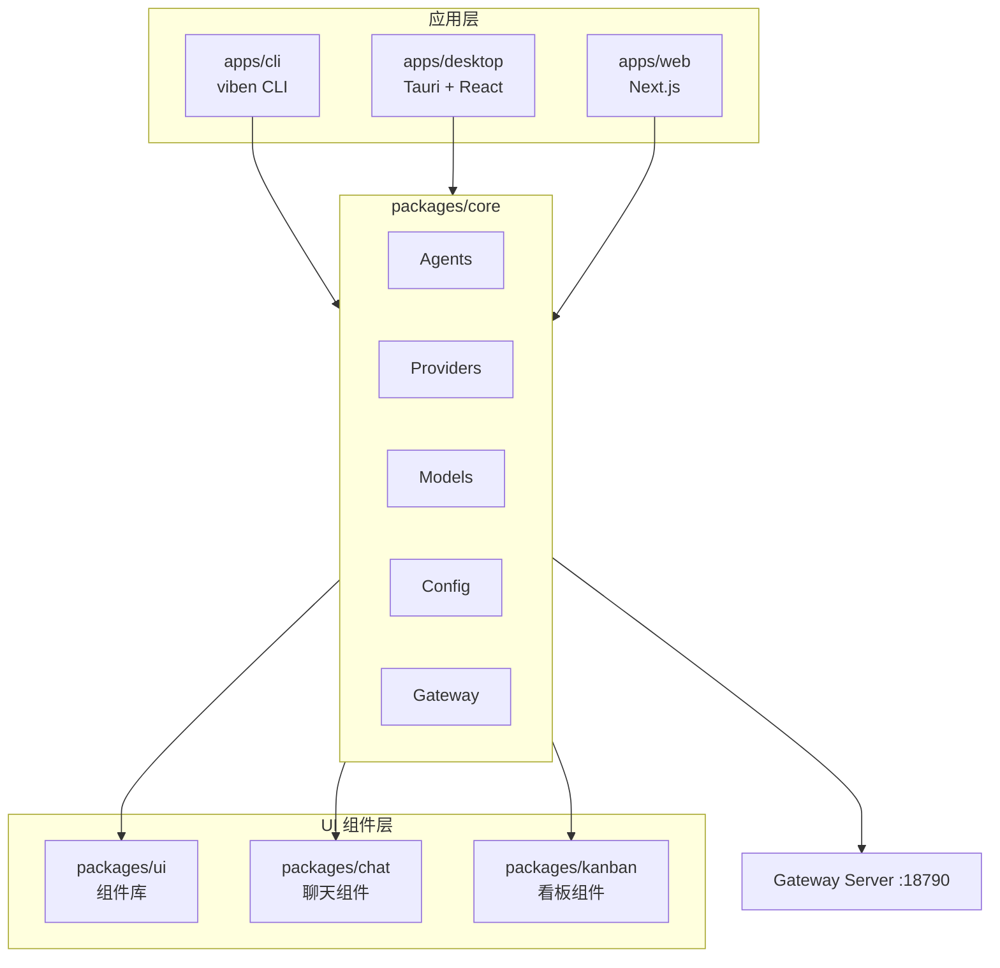

# Viben

多智能体工作空间管理器，提供看板、日历、时间线和任务管理功能。

## 核心特性

- **多智能体编排** - 在本地工作空间中协调 AI Agent 集群
- **MCP 协议支持** - 完整支持 Model Context Protocol
- **跨平台应用** - CLI、桌面应用、Web 应用三端统一
- **灵活配置** - 基于 YAML 的 Provider/Model 配置管理
- **看板管理** - 可拖拽的任务看板组件
- **会话追踪** - 实时监控 Agent 对话和工具调用

## 架构概览



## 快速开始

### 环境要求

- Node.js >= 20.0.0
- pnpm >= 9.15.0
- Rust (桌面应用需要)

### 安装依赖

```bash
git clone https://github.com/LinXueyuanStdio/viben.git
cd viben
pnpm install
```

### 运行 CLI

```bash
# 全局构建
pnpm build

# 运行 CLI
pnpm viben <command>

# 或直接运行
node apps/cli/bin/viben.js
```

### 运行桌面应用

```bash
# 开发模式
pnpm desktop:dev

# 构建
pnpm desktop:build
```

### 运行 Web 应用

```bash
# 开发模式
cd apps/web
pnpm dev

# 构建
pnpm build
```

### 启动 Gateway 服务

```bash
pnpm gateway:restart
```

Gateway 服务运行在 `http://127.0.0.1:18790`。

## 项目结构

```
viben/
├── apps/
│   ├── cli/              # 命令行工具 (viben)
│   ├── desktop/          # Tauri 桌面应用
│   ├── web/              # Next.js Web 应用
│   ├── docs/             # 文档站点
│   └── landingpage/      # 落地页
│
├── packages/
│   ├── core/             # 核心功能库
│   │   ├── agents/       # Agent 管理
│   │   ├── providers/    # Provider 配置
│   │   ├── models/       # Model 管理
│   │   ├── config/       # 配置管理
│   │   └── gateway/      # HTTP Gateway 服务
│   ├── ui/               # 共享 UI 组件库
│   ├── chat/             # 聊天 UI 组件
│   ├── kanban/           # 看板组件
│   ├── api-client/       # API 客户端
│   └── vibe-kanban/      # Kanban 扩展
│
├── docs/                 # 开发文档
├── scripts/              # 构建脚本
└── ~/.viben/             # 用户配置目录 (YAML)
```

## 配置

配置文件存储在 `~/.viben/` 目录，使用 YAML 格式：

```
~/.viben/
├── providers.yaml        # Provider 配置
├── models.yaml           # Model 配置
└── agents/               # Agent 定义
```

## 开发

```bash
# 安装依赖
pnpm install

# 全量构建
pnpm build

# 类型检查
pnpm typecheck

# 代码检查
pnpm lint

# 清理构建产物
pnpm clean
```

### 重启服务

```bash
# 重启桌面应用开发服务器
pnpm desktop:restart

# 重启 Gateway
pnpm gateway:restart
```

## 技术栈

- **构建工具**: pnpm + Turbo
- **语言**: TypeScript
- **桌面应用**: Tauri + React + Vite
- **Web 应用**: Next.js 15
- **UI 框架**: Tailwind CSS + Radix UI
- **状态管理**: Zustand
- **数据库** (Web): Drizzle ORM + PostgreSQL

## 贡献

欢迎提交 Issue 和 Pull Request。

## 许可证

[MIT License](./LICENSE)

Copyright (c) 2025 OPENAGS
