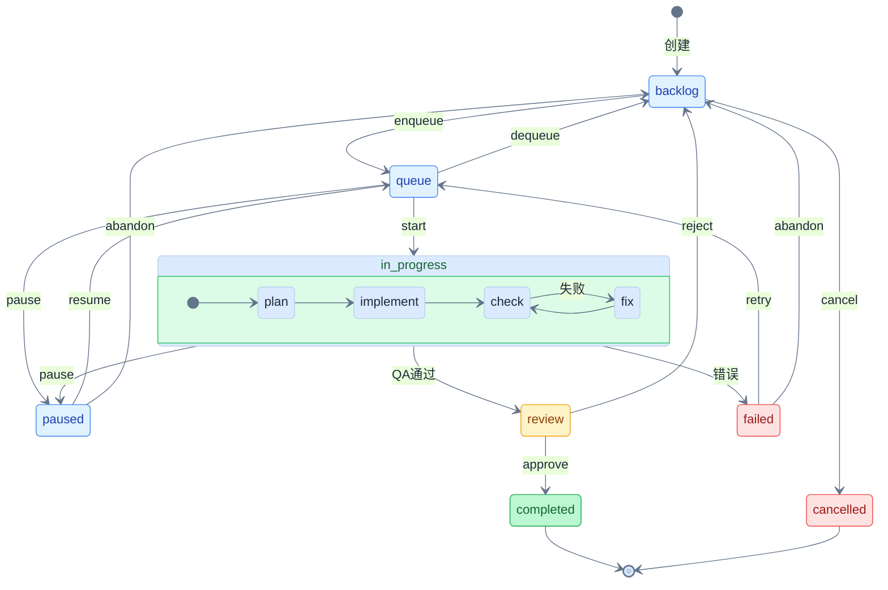

**中文 | [English](./README_EN.md)**

<div align="center">


# 微本

### Agent 集群 × 代码进化

##### 把代码库当作模型参数，针对文件使用强化学习持续优化

[](https://github.com/LinXueyuanStdio/viben/releases)
[](./LICENSE)
[](https://nodejs.org)
[](https://www.typescriptlang.org/)
[](https://tauri.app/)
[](https://github.com/LinXueyuanStdio/viben/pulls)

</div>

---

## ✨ 特性

<table>
<tr>
<td align="center" width="33%">
<h3>🧬 FileRL</h3>
<b>代码库强化学习</b><br/>
把代码库当模型参数<br/>
通过 RL 算法持续优化
</td>
<td align="center" width="33%">
<h3>🤖 多智能体</h3>
<b>Agent 集群编排</b><br/>
并行 Worktree 隔离<br/>
自动化任务分发与监控
</td>
<td align="center" width="33%">
<h3>🔌 MCP 协议</h3>
<b>Model Context Protocol</b><br/>
工具注册与调用<br/>
扩展 Agent 能力边界
</td>
</tr>
<tr>
<td align="center">
<h3>📋 任务系统</h3>
<b>XState 状态机驱动</b><br/>
看板 + 队列 + 自动执行<br/>
完整的任务生命周期管理
</td>
<td align="center">
<h3>💡 Idea 生成</h3>
<b>AI 驱动代码分析</b><br/>
自动发现改进点<br/>
一键转化为可执行任务
</td>
<td align="center">
<h3>🖥️ 跨平台</h3>
<b>CLI / Desktop / Web</b><br/>
Tauri 2 桌面应用<br/>
三端统一体验
</td>
</tr>
</table>

---

## 🧬 FileRL: 代码库强化学习

> *将代码库视为可优化的参数空间，通过类强化学习算法迭代提升代码质量*

> ⚠️ **方法定位**：FileRL 是一种 **RL-inspired 启发式优化方法**，借鉴强化学习思想但并非严格 RL 实现。核心差异：使用代码行数近似策略距离、通过离散选择（git merge）更新、缺乏理论收敛保证。

由于代码库是 Agent 的上下文输入，直接优化代码库等同于优化 Agent 的行为分布。我们将代码库和 Agent 视为一个整体模型，通过迭代采样、评估、选择来提升代码质量，即通过类强化学习不断调整代码库以提升整体表现。

### 算法概述

<table>
<tr>
<th colspan="4" style="text-align:center;background:#f8fafc;">🧠 Model = Codebase(θ) + Agent(f)，Agent 架构固定，只优化代码库 θ</th>
</tr>
<tr>
<td align="center" width="25%" style="background:#fef3c7;border:2px solid #d97706;">
<b>π<sub>θ</sub> Policy (Actor)</b><br/><br/>
📂 Worktree<br/>
<code>𝒞<sub>θ</sub></code> 可变<br/><br/>
🤖 Agent → 生成 PR
</td>
<td align="center" width="25%" style="background:#e0f2fe;border:2px solid #0284c7;">
<b>π<sub>ref</sub> Reference</b><br/><br/>
📂 Main Branch<br/>
<code>𝒞<sub>ref</sub></code> 固定<br/><br/>
🔒 Agent → 作为参考
</td>
<td align="center" width="25%" style="background:#fce7f3;border:2px solid #db2777;">
<b>R Reward Model</b><br/><br/>
📂 Worktree<br/>
<code>Δ𝒞</code> 变更<br/><br/>
⚖️ Agent → 质量评分
</td>
<td align="center" width="25%" style="background:#d1fae5;border:2px solid #059669;">
<b>V Value (Critic)</b><br/><br/>
📂 Main Branch<br/>
<code>𝒞<sub>ref</sub></code> (同 π<sub>ref</sub>)<br/><br/>
📈 Agent → V(𝒞) 期望回报
</td>
</tr>
</table>

<br/>

<!-- 🔄 PPO Optimization Loop -->

<table>
<tr>
<th colspan="4" style="text-align:center;background:#f1f5f9;">🔄 优化循环 (RL-inspired)</th>
</tr>
<tr>
<td align="center" width="25%" style="background:#fff;border:1px solid #475569;">
<b>① SAMPLE</b><br/><br/>
<b>Batch:</b> B ideas (B ≤ K types)<br/>
idea₁, idea₂, ..., idea<sub>B</sub><br/><br/>
<b>Rollout:</b> N worktrees/idea<br/>
PR₁₁...PR₁ₙ<br/>
PR₂₁...PR₂ₙ<br/>
...<br/>
PR<sub>B</sub>₁...PR<sub>B</sub>ₙ<br/><br/>
<i>总计 B×N 个 PR</i>
</td>
<td align="center" width="25%" style="background:#fff;border:1px solid #475569;">
<b>② REWARD</b><br/><br/>
<b>多目标奖励:</b><br/>
R = Σ wᵢ·rᵢ<br/>
<sub>(Quality, Security, Review...)</sub><br/><br/>
<b>代码库距离:</b><br/>
d = |Δlines| / max_diff<br/><br/>
<b>调整后奖励:</b><br/>
R̃ = R − λ·d
</td>
<td align="center" width="25%" style="background:#fff;border:1px solid #475569;">
<b>③ SELECT</b><br/><br/>
<b>距离惩罚:</b><br/>
r = exp(−β·d)<br/><br/>
<b>相对优势:</b><br/>
 = R̃ − mean(R̃)<br/><br/>
<b>两阶段选择:</b><br/>
1. 每 idea 选最优 rollout<br/>
2. 从候选中选全局最优<br/>
(若无 R̃ ≥ τ 则跳过)
</td>
<td align="center" width="25%" style="background:#fff;border:1px solid #475569;">
<b>④ UPDATE</b><br/><br/>
<b>合并最佳 PR:</b><br/>
git merge PR* → main<br/><br/>
<b>更新代码库:</b><br/>
θ ← θ' (𝒞 updated)<br/><br/>
<b>收敛检查:</b><br/>
ΔL < δ ?<br/><br/>
✅ 收敛 → θ* 得到最优<br/>
🔄 否则 → t ← t+1 循环
</td>
</tr>
</table>

形式化定义

**符号映射**: LLM PPO → FileRL

| 符号 | LLM PPO | FileRL |
|:----:|:-------:|:------:|
| **θ** | 模型参数 ∈ ℝᵈ | 代码库 $\mathcal{C} \in \Sigma^*$ |
| **π** | $\pi_\theta(y \mid x)$ | $\pi(\text{PR} \mid \mathcal{C})$ |
| **a** | token $y_t$ | Pull Request |
| **∇** | $\nabla_\theta \mathcal{L}$ | `git diff` |
| **⊕** | $\theta \leftarrow \theta - \eta \nabla \mathcal{L}$ | `git merge` |
| **R** | $R(x, y)$ | CI + Agent Review |

**多目标奖励函数**

$$R(\text{PR}) = \sum_{i=1}^{k} w_i \cdot r_i(\text{PR}), \quad \sum_{i=1}^{k} w_i = 1$$

其中 $r_i$ 为各维度评分 (测试覆盖率、代码质量、安全性、Agent 评审等)

**代码库距离** (核心度量，无需计算 LLM log probability)

$$d = \min\left(1,\ \frac{|\Delta\text{lines}|}{\text{max\_diff}}\right)$$

- $|\Delta\text{lines}|$：PR 的代码变更行数
- $\text{max\_diff}$：单次 PR 允许的最大变更行数（超参数，如 500 行）
- $d \in [0, 1]$：归一化距离，超过 max_diff 时 clip 到 1

**策略距离近似** (工程启发式)

我们用代码行数变化 $d$ 作为策略距离的代理度量（而非严格计算 KL 散度）：

> 📐 **设计动机**：
> - **计算可行性**：严格计算 $D_{\text{KL}}(\pi_\theta \| \pi_{\text{ref}})$ 需要对所有可能 PR 求和，计算不可行
> - **经验假设**：代码变化量与行为变化量正相关——小改动通常导致小行为变化
> - **工程简化**：$d$ 易于计算（`git diff --stat`），且提供直观的变更约束
>
> **已知局限**：
> - 语义盲：重命名 1000 行 vs 修改 1 行核心逻辑，$d$ 无法区分
> - 非对称：添加代码 vs 删除代码可能有不同影响
> - 文件类型：配置文件 vs 核心代码的行数权重应不同
>
> **适用场景**：增量式代码改进（bug fix、小功能）；**不适用**：大规模重构、架构变更

**策略比率** (基于距离的启发式)

$$r_t = e^{-\beta \cdot d}$$

- $d = 0$ 时：$r_t = 1$（无变更，策略一致）
- $d \to 1$ 时：$r_t \to e^{-\beta}$（大变更，策略偏离受抑制）
- $\beta$：敏感度参数（超参数，推荐值 1.0 ~ 3.0）

> 📐 **设计选择**：采用指数衰减形式而非线性（如 $1-d$）是为了：(1) 保证 $r_t > 0$；(2) 小变更时 $r_t \approx 1$，大变更时快速衰减，符合 PPO 信任域直觉。

**调整后奖励**

$$\tilde{R} = R - \lambda \cdot d$$

其中 $\lambda$ 为 KL 惩罚系数（超参数，推荐值 0.01 ~ 0.1）

**优势估计**

$$\hat{A}(\text{PR}) = \tilde{R}(\text{PR}) - \bar{R}, \quad \bar{R} = \frac{1}{N}\sum_{i=1}^{N}\tilde{R}(\text{PR}_i)$$

**PPO 目标函数**

$$\mathcal{L} = \mathbb{E}\left[\min\left(r_t \hat{A},\ \text{clip}(r_t, 1{-}\epsilon, 1{+}\epsilon)\hat{A}\right)\right]$$

其中 $\epsilon$ 为 clip 参数（超参数，推荐值 0.1 ~ 0.2）

**选择最优 PR** (两阶段)

$$\text{PR}^*_{\text{idea}} = \arg\max_{\text{PR} \in \text{Rollouts}_{\text{idea}}} \mathcal{L}(\text{PR})$$

$$\text{PR}^* = \arg\max_{\text{PR}^*_{\text{idea}}} \mathcal{L}(\text{PR}^*_{\text{idea}}), \quad \text{s.t. } \tilde{R}(\text{PR}^*_{\text{idea}}) \geq \tau$$

其中 $\tau$ 为奖励阈值（超参数，推荐值 0.5 ~ 0.7）

**边界情况处理**

| 情况 | 处理 |
|------|------|
| $\|\Delta\text{lines}\| > \text{max\_diff}$ | $d$ clip 到 1，PR 受到最大 KL 惩罚 |
| 所有候选 $\tilde{R} < \tau$ | 本轮不合并，跳过 UPDATE 阶段 |
| 连续 5 轮无合并 | 触发早停，报告优化停滞 |

<details>
<summary><b>算法伪代码</b></summary>

```
Algorithm: FileRL — 代码库强化学习 (PPO-inspired)
────────────────────────────────────────────────────
输入:   C₀                  // 初始代码库
超参数:
        T = 50              // 最大迭代次数
        B = 3               // 批大小 (idea 数量)，约束: B ≤ K
        N = 2               // 每个 idea 的 rollout 数
        K                   // idea 类型数量
        max_diff = 500      // 单次 PR 最大变更行数
        λ = 0.05            // KL 惩罚系数
        β = 2.0             // 策略比率敏感度
        ε = 0.2             // PPO clip 参数
        τ = 0.6             // 奖励阈值
        δ = 0.01            // 收敛阈值
输出:   C*                  // 优化后的代码库

 1  C ← C₀
 2  history ← []
 3  no_merge_count ← 0                        // 连续无合并计数
 4  for t = 1 to T do
 5  │
 6  │   // 阶段 1: 批量采样 (生成 B 个不同类型的 idea)
 7  │   Ideas ← SampleIdeas(C, B, K)          // |Ideas| = B, 类型互不相同
 8  │
 9  │   // 阶段 2: 并行展开 (B×N 个 worktree 并行执行)
10  │   PRs ← ∅
11  │   for each idea ∈ Ideas do in parallel
12  │   │   for j = 1 to N do in parallel     // 每个 idea 展开 N 次
13  │   │   │   PR ← CodeSynthesis(C, idea)   // 在 worktree_{idea,j} 中生成代码
14  │   │   │   PRs ← PRs ∪ {PR}
15  │   │   end
16  │   end                                   // 总共 B×N 个 PR
17  │
18  │   // 阶段 3: 奖励与距离计算
19  │   for each PR ∈ PRs do
20  │   │   R(PR) ← Σᵢ wᵢ · rᵢ(PR)           // 多目标奖励
21  │   │   d(PR) ← min(1, |Δlines|/max_diff) // 代码库距离 (clip 到 [0,1])
22  │   │   R̃(PR) ← R(PR) - λ · d(PR)         // 调整后奖励
23  │   │   r(PR) ← exp(-β · d(PR))           // 策略比率
24  │   end
25  │
26  │   // 阶段 4: 选择最优 PR (启发式，借鉴 PPO clipped objective)
27  │   // 注: 使用批均值作为简化 baseline，非严格 PPO value function
28  │   R̄ ← mean({R̃(PR) : PR ∈ PRs})         // 简化 baseline
29  │   for each PR ∈ PRs do
30  │   │   Â(PR) ← R̃(PR) - R̄                 // 相对优势
31  │   │   L(PR) ← min(r(PR)·Â(PR), clip(r(PR),1-ε,1+ε)·Â(PR))
32  │   end
33  │   // 4a: 每个 idea 选最优 rollout
34  │   Candidates ← ∅
35  │   for each idea ∈ Ideas do
36  │   │   PRs_idea ← {PR ∈ PRs : PR.idea = idea}
37  │   │   PR_best ← argmax_{PR ∈ PRs_idea} L(PR)
38  │   │   Candidates ← Candidates ∪ {PR_best}
39  │   end
40  │   // 4b: 从 B 个候选中选全局最优 (需满足阈值)
41  │   Qualified ← {PR ∈ Candidates : R̃(PR) ≥ τ}
42  │   if Qualified = ∅ then
43  │   │   PR* ← ∅                            // 无合格候选
44  │   else
45  │   │   PR* ← argmax_{PR ∈ Qualified} L(PR)
46  │   end
47  │
48  │   // 阶段 5: 更新代码库 (离散选择)
49  │   if PR* ≠ ∅ then
50  │   │   C ← Merge(C, PR*)                  // git merge
51  │   │   history.append(R̃(PR*))
52  │   │   no_merge_count ← 0
53  │   else
54  │   │   no_merge_count ← no_merge_count + 1
55  │   │   if no_merge_count ≥ 5 then
56  │   │   │   break                          // 连续无合并，早停
57  │   │   end
58  │   end
59  │
60  │   // 阶段 6: 收敛检查
61  │   if len(history) ≥ 10 and
62  │      |mean(history[-5:]) - mean(history[-10:-5])| < δ then
63  │   │   break                              // 奖励提升趋于平稳
64  │   end
65  │
66  end
67  return C
```

</details>

<details>
<summary><b>CLI 命令速查</b></summary>

```bash
# 生命周期
viben filerl create <name>       # 创建优化目标
viben filerl start <target.md>   # 启动优化循环
viben filerl status <name>       # 查看状态
viben filerl stop <name>         # 停止
viben filerl resume <name>       # 恢复

# Idea → Task
viben idea generate --types <t>  # 生成想法
viben idea promote <id> --start  # 转为任务

# 奖励与选择
viben reward select <tasks...>   # PPO 选择最佳
viben task approve <task>        # 合并 PR

# 监控
viben swarm status --watch       # 实时监控
```

</details>

---

## 📋 任务系统

基于 XState 状态机的任务生命周期管理，支持看板、队列和自动化执行。

### 任务生命周期



> **内部流程**: `in_progress` 状态内部执行 plan → implement → check → fix 循环

| 状态 | 说明 | 触发命令 |
|------|------|----------|
| `backlog` | 待办，等待排队 | `task create` |
| `queue` | 已排队，等待执行 | `task enqueue` |
| `in_progress` | 执行中 (plan → implement → check) | `task start` |
| `paused` | 已暂停，保留进度 | `task pause` |
| `review` | 等待人工审核 | 自动 (QA 通过) |
| `completed` | 已完成 | `task approve` |
| `failed` | 执行失败 | 自动 |
| `cancelled` | 已取消 | `task cancel` |

### 任务目录结构

```
.viben/tasks/<date>-<slug>/
├── task.json           # 任务元数据 (状态、配置、时间戳)
├── events.jsonl        # 事件历史 (状态转换记录)
├── prd.md              # 产品需求文档
├── implement.jsonl     # 实现阶段上下文注入
├── check.jsonl         # 检查阶段上下文注入
└── logs/               # 执行日志
```

<details>
<summary><b>CLI 命令速查</b></summary>

**创建与配置**
```bash
viben task create "<title>" --slug <name>    # 创建任务
viben task init-context <task>               # 初始化上下文文件
viben task add-context <task> <file> -r "原因"  # 添加上下文文件
viben task set-agent <task> -a <agent>       # 设置智能体
```

**执行流程**
```bash
viben task enqueue <task>    # backlog → queue
viben task start <task>      # queue → in_progress
viben task pause <task>      # 暂停执行
viben task resume <task>     # 恢复执行
viben task status <task>     # 查看状态
```

**审核与完成**
```bash
viben task review <task>     # 用户手动审核任务
viben task approve <task>    # review → completed
viben task reject <task>     # review → backlog
viben task retry <task>      # failed → queue
viben task cancel <task>     # * → cancelled
```

**辅助命令**
```bash
viben task list              # 列出所有任务
viben task context <task>    # 获取指定任务的会话上下文
viben task plan-phase <task> # 执行计划阶段
viben task work-phase <task> # 执行工作阶段
viben task create-worktree <task> # 创建 Git 工作树
viben task create-pr <task>  # 从任务创建 PR
viben task archive <task>    # 归档已完成任务
```

</details>

---

## 💡 Idea 生成

AI 驱动的代码库分析，自动生成改进建议并转化为任务。

| 内置类型 | 说明 |
|----------|------|
| `code_improvements` | 基于现有模式的代码改进 |
| `security_hardening` | 安全漏洞和加固措施 |
| `performance_optimizations` | 性能瓶颈和优化 |
| `documentation_gaps` | 缺失的文档 |
| `ui_ux_improvements` | UI/UX 增强 |
| `code_quality` | 代码质量和重构 |

```bash
# 生成代码改进建议
viben idea generate --types code_improvements security_hardening

# 查看生成的想法
viben idea list

# 将想法转为任务
viben idea promote ci-001

# 将想法转为任务并立即启动（支持 task create 的所有选项）
viben idea promote ci-001 --start --worktree
```

> 支持在 `docs/idea-types/*.md` 创建自定义类型 prompt 模板

---

## ⚙️ 配置

```
~/.viben/
├── providers.yaml    # API Keys, Endpoints
├── models.yaml       # 模型参数
├── agents/           # Agent 定义
│   └── <name>/
│       └── AGENTS.md
├── cron.yaml         # 定时任务
├── channels.yaml     # 通知渠道
└── workspaces.yaml   # 工作空间
```

---

## 📦 下载

### 🖥️ 桌面应用

| 平台 | 下载 |
|:----:|------|
| 🍎 **macOS** | [.dmg](https://github.com/LinXueyuanStdio/viben/releases/latest) (Universal) |
| 🪟 **Windows** | [.msi](https://github.com/LinXueyuanStdio/viben/releases/latest) / [.exe](https://github.com/LinXueyuanStdio/viben/releases/latest) (64-bit) |
| 🐧 **Linux** | [.AppImage](https://github.com/LinXueyuanStdio/viben/releases/latest) / [.deb](https://github.com/LinXueyuanStdio/viben/releases/latest) |

### 💻 CLI

```bash
# Shell (macOS/Linux)
curl -fsSL https://github.com/LinXueyuanStdio/viben/releases/latest/download/install.sh | bash

# npm
npm install -g viben

# Homebrew
brew tap LinXueyuanStdio/viben && brew install viben

# 或直接运行 (无需安装)
npx viben
```

---


<details>
<summary><b>🛠️ 开发者指南</b></summary>

### 📋 环境要求

- Node.js >= 20
- pnpm >= 9.15
- Rust (桌面应用)

### 🚀 快速开始

```bash
git clone https://github.com/LinXueyuanStdio/viben.git
cd viben && pnpm install

pnpm build              # 构建
pnpm desktop:restart    # 桌面应用开发
pnpm gateway:restart    # 启动 Gateway
```

### 📁 项目结构

```
apps/
├── cli/        # viben 命令行
├── desktop/    # Tauri 桌面应用
└── web/        # Next.js (MCP 市场)

packages/
├── core/       # 核心库 + Gateway
├── ui/         # UI 组件库
├── chat/       # 聊天组件
└── kanban/     # 看板组件
```

### 🔧 技术栈

| 类别 | 技术 |
|:----:|------|
| 📝 语言 | TypeScript |
| 🖥️ 桌面 | Tauri 2 + React 19 + Vite |
| 🌐 Web | Next.js 15 |
| 🎨 样式 | Tailwind CSS 4 + Radix UI |
| 📊 状态 | Zustand |
| 🔨 构建 | pnpm + Turborepo |

</details>

---

## 📄 许可证

[MIT](./LICENSE)
