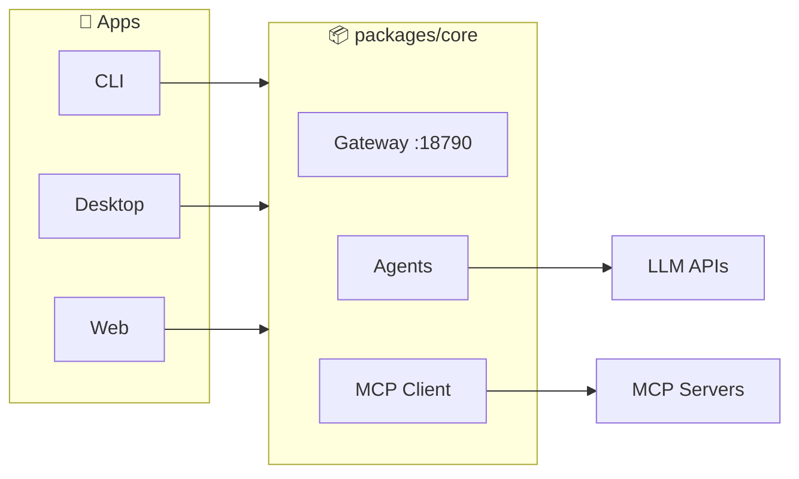

<div align="center">

**[中文](./README.md) | English**

# 🚀 Viben

### Multi-Agent Workspace Manager

*Orchestrate AI Agent clusters locally, unified management of kanban, calendar, timeline and tasks*

[](https://github.com/LinXueyuanStdio/viben/releases)
[](./LICENSE)
[](https://nodejs.org)
[](https://www.typescriptlang.org/)
[](https://tauri.app/)
[](https://github.com/LinXueyuanStdio/viben/pulls)

</div>

---

## ✨ Features

| Feature | Description |
|---------|-------------|
| 🤖 **Multi-Agent Orchestration** | Coordinate AI Agent clusters in local workspace |
| 🔌 **MCP Protocol** | Full support for Model Context Protocol |
| 🖥️ **Cross-Platform** | CLI, Desktop, and Web apps unified |
| 📋 **Kanban Board** | Drag-and-drop task management with real-time tracking |
| 📡 **Session Monitoring** | Real-time view of Agent conversations and tool calls |

---

## 📦 Download

### 🖥️ Desktop App

| Platform | Download |
|:--------:|----------|
| 🍎 **macOS** | [.dmg](https://github.com/LinXueyuanStdio/viben/releases/latest) (Universal) |
| 🪟 **Windows** | [.msi](https://github.com/LinXueyuanStdio/viben/releases/latest) / [.exe](https://github.com/LinXueyuanStdio/viben/releases/latest) (64-bit) |
| 🐧 **Linux** | [.AppImage](https://github.com/LinXueyuanStdio/viben/releases/latest) / [.deb](https://github.com/LinXueyuanStdio/viben/releases/latest) |

### 💻 CLI

```bash
# Shell (macOS/Linux)
curl -fsSL https://github.com/LinXueyuanStdio/viben/releases/latest/download/install.sh | bash

# npm
npm install -g viben

# Homebrew
brew tap LinXueyuanStdio/viben && brew install viben

# Or run directly (no installation)
npx viben
```

---

## 🏗️ Architecture



> `packages/core` is the single boundary for all apps, config stored in `~/.viben/` (YAML)

---

## ⚙️ Configuration

```
~/.viben/
├── providers.yaml    # API Keys, Endpoints
├── models.yaml       # Model parameters
├── agents/           # Agent definitions
│   └── <name>/
│       └── AGENTS.md
├── cron.yaml         # Scheduled tasks
├── channels.yaml     # Notification channels
└── workspaces.yaml   # Workspaces
```

---

<details>
<summary><b>🛠️ Developer Guide</b></summary>

### 📋 Requirements

- Node.js >= 20
- pnpm >= 9.15
- Rust (for desktop app)

### 🚀 Quick Start

```bash
git clone https://github.com/LinXueyuanStdio/viben.git
cd viben && pnpm install

pnpm build              # Build
pnpm desktop:restart    # Desktop app dev
pnpm gateway:restart    # Start Gateway
```

### 📁 Project Structure

```
apps/
├── cli/        # viben CLI
├── desktop/    # Tauri desktop app
└── web/        # Next.js (MCP marketplace)

packages/
├── core/       # Core library + Gateway
├── ui/         # UI component library
├── chat/       # Chat components
└── kanban/     # Kanban components
```

### 🔧 Tech Stack

| Category | Technology |
|:--------:|------------|
| 📝 Language | TypeScript |
| 🖥️ Desktop | Tauri 2 + React 19 + Vite |
| 🌐 Web | Next.js 15 |
| 🎨 Styling | Tailwind CSS 4 + Radix UI |
| 📊 State | Zustand |
| 🔨 Build | pnpm + Turborepo |

</details>

---

## 📄 License

[MIT](./LICENSE) © 2025 OPENAGS
