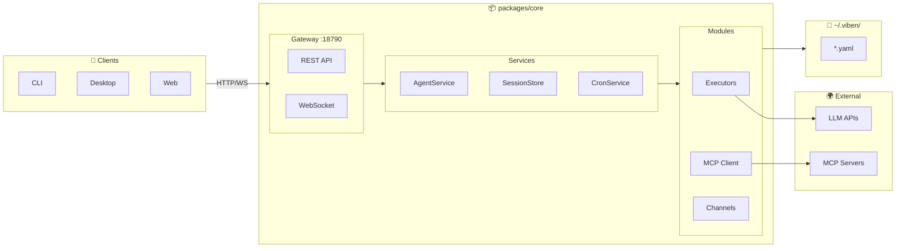
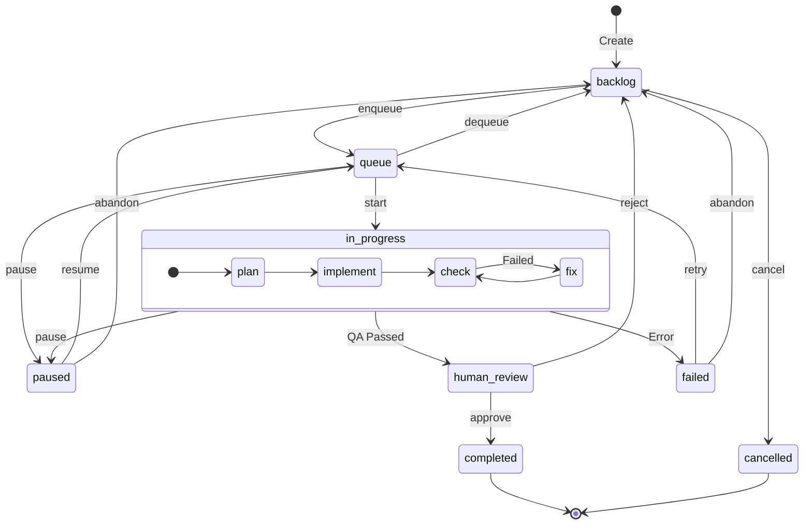

<div align="center">

**[中文](./README.md) | English**

# 🚀 Viben

### Multi-Agent Workspace Manager

*Orchestrate AI Agent clusters locally, unified management of kanban, calendar, timeline and tasks*

[](https://github.com/LinXueyuanStdio/viben/releases)
[](./LICENSE)
[](https://nodejs.org)
[](https://www.typescriptlang.org/)
[](https://tauri.app/)
[](https://github.com/LinXueyuanStdio/viben/pulls)

</div>

---

## ✨ Features

| Feature | Description |
|---------|-------------|
| 🤖 **Multi-Agent Orchestration** | Coordinate AI Agent clusters in local workspace |
| 🔌 **MCP Protocol** | Full support for Model Context Protocol |
| 🖥️ **Cross-Platform** | CLI, Desktop, and Web apps unified |
| 📋 **Kanban Board** | Drag-and-drop task management with real-time tracking |
| 📡 **Session Monitoring** | Real-time view of Agent conversations and tool calls |

---

## 📦 Download

### 🖥️ Desktop App

| Platform | Download |
|:--------:|----------|
| 🍎 **macOS** | [.dmg](https://github.com/LinXueyuanStdio/viben/releases/latest) (Universal) |
| 🪟 **Windows** | [.msi](https://github.com/LinXueyuanStdio/viben/releases/latest) / [.exe](https://github.com/LinXueyuanStdio/viben/releases/latest) (64-bit) |
| 🐧 **Linux** | [.AppImage](https://github.com/LinXueyuanStdio/viben/releases/latest) / [.deb](https://github.com/LinXueyuanStdio/viben/releases/latest) |

### 💻 CLI

```bash
# Shell (macOS/Linux)
curl -fsSL https://github.com/LinXueyuanStdio/viben/releases/latest/download/install.sh | bash

# npm
npm install -g viben

# Homebrew
brew tap LinXueyuanStdio/viben && brew install viben

# Or run directly (no installation)
npx viben
```

---

## 🏗️ Architecture



> **Design Principles**: `packages/core` as single boundary · file-native config (YAML) · unified REST/WebSocket API · multi-provider support

---

## 📋 Task System

XState-based task lifecycle management with kanban, queue, and automated execution.

### Task Lifecycle



| Status | Description | Trigger Command |
|--------|-------------|-----------------|
| `backlog` | Pending, waiting to be queued | `task create` |
| `queue` | Queued, waiting for execution | `task enqueue` |
| `in_progress` | Executing (plan → implement → check) | `task start` |
| `paused` | Paused, progress preserved | `task pause` |
| `human_review` | Awaiting human review | Auto (QA passed) |
| `completed` | Completed | `task approve` |
| `failed` | Execution failed | Auto |
| `cancelled` | Cancelled | `task cancel` |

### Task Directory Structure

```
.viben/tasks/<date>-<slug>/
├── task.json           # Task metadata (status, config, timestamps)
├── events.jsonl        # Event history (state transitions)
├── prd.md              # Product requirements document
├── implement.jsonl     # Implementation phase context injection
├── check.jsonl         # Check phase context injection
└── logs/               # Execution logs
```

<details>
<summary><b>CLI Command Reference</b></summary>

**Create & Configure**
```bash
viben task create "<title>" --slug <name>    # Create task
viben task init-context <task> -t <type>     # Init context (backend/frontend/fullstack)
viben task add-context <task> <file> -r "reason"  # Add context file
viben task set-agent <task> -a <agent>       # Set agent
```

**Execution Flow**
```bash
viben task enqueue <task>    # backlog → queue
viben task start <task>      # queue → in_progress
viben task pause <task>      # Pause execution
viben task resume <task>     # Resume execution
viben task status <task>     # View status
```

**Review & Complete**
```bash
viben task review <task>     # View task for review
viben task approve <task>    # human_review → completed
viben task reject <task>     # human_review → backlog
viben task retry <task>      # failed → queue
viben task cancel <task>     # * → cancelled
```

**Utilities**
```bash
viben task list              # List all tasks
viben task context           # Get session context
viben task create-pr <task>  # Create PR from task
viben task archive <task>    # Archive completed task
```

</details>

---

## 💡 Idea Generation

AI-driven codebase analysis that auto-generates improvement suggestions and converts them to tasks.

| Built-in Types | Description |
|----------------|-------------|
| `code_improvements` | Code improvements based on existing patterns |
| `security_hardening` | Security vulnerabilities and hardening |
| `performance_optimizations` | Performance bottlenecks and optimizations |
| `documentation_gaps` | Missing documentation |
| `ui_ux_improvements` | UI/UX enhancements |
| `code_quality` | Code quality and refactoring |

```bash
# Generate improvement suggestions
viben idea generate --types code_improvements security_hardening

# List generated ideas
viben idea list

# Promote idea to task
viben idea promote ci-001
```

> Custom type prompt templates can be created in `docs/idea-types/*.md`

---

## ⚙️ Configuration

```
~/.viben/
├── providers.yaml    # API Keys, Endpoints
├── models.yaml       # Model parameters
├── agents/           # Agent definitions
│   └── <name>/
│       └── AGENTS.md
├── cron.yaml         # Scheduled tasks
├── channels.yaml     # Notification channels
└── workspaces.yaml   # Workspaces
```

---

<details>
<summary><b>🛠️ Developer Guide</b></summary>

### 📋 Requirements

- Node.js >= 20
- pnpm >= 9.15
- Rust (for desktop app)

### 🚀 Quick Start

```bash
git clone https://github.com/LinXueyuanStdio/viben.git
cd viben && pnpm install

pnpm build              # Build
pnpm desktop:restart    # Desktop app dev
pnpm gateway:restart    # Start Gateway
```

### 📁 Project Structure

```
apps/
├── cli/        # viben CLI
├── desktop/    # Tauri desktop app
└── web/        # Next.js (MCP marketplace)

packages/
├── core/       # Core library + Gateway
├── ui/         # UI component library
├── chat/       # Chat components
└── kanban/     # Kanban components
```

### 🔧 Tech Stack

| Category | Technology |
|:--------:|------------|
| 📝 Language | TypeScript |
| 🖥️ Desktop | Tauri 2 + React 19 + Vite |
| 🌐 Web | Next.js 15 |
| 🎨 Styling | Tailwind CSS 4 + Radix UI |
| 📊 State | Zustand |
| 🔨 Build | pnpm + Turborepo |

</details>

---

## 📄 License

[MIT](./LICENSE)
