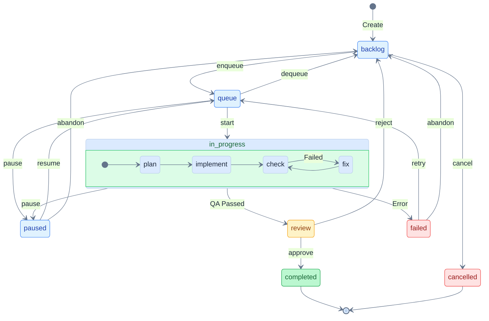

**[中文](./README.md) | English**

<div align="center">


# Viben

### Agent Swarm × Code Evolution

##### FileEvo: Generate multiple candidates → Multi-dimensional evaluation → Select best and merge

[](https://github.com/LinXueyuanStdio/viben/releases)
[](./LICENSE)
[](https://linxueyuan.online/viben/)
[](https://nodejs.org)
[](https://www.typescriptlang.org/)
[](https://tauri.app/)
[](https://github.com/LinXueyuanStdio/viben/pulls)

</div>

---

## ✨ Features

<table>
<tr>
<td align="center" width="33%">
<h3>🧬 FileEvo</h3>
<b>Code Iterative Optimization</b><br/>
Multi-candidate sampling + Quality evaluation<br/>
Auto-select and merge best solution
</td>
<td align="center" width="33%">
<h3>🤖 Multi-Agent</h3>
<b>Agent Swarm Orchestration</b><br/>
Parallel Worktree isolation<br/>
Automated task distribution & monitoring
</td>
<td align="center" width="33%">
<h3>🔌 MCP Protocol</h3>
<b>Model Context Protocol</b><br/>
Tool registration & invocation<br/>
Extend Agent capabilities
</td>
</tr>
<tr>
<td align="center">
<h3>📋 Task System</h3>
<b>State Machine Driven</b><br/>
Kanban + Queue + Auto-execution<br/>
Complete task lifecycle management
</td>
<td align="center">
<h3>💡 Idea Generation</h3>
<b>AI-Driven Code Analysis</b><br/>
Auto-discover improvements<br/>
One-click convert to executable tasks
</td>
<td align="center">
<h3>🖥️ Cross-Platform</h3>
<b>CLI / Desktop / Web</b><br/>
Tauri 2 desktop app<br/>
Unified experience across platforms
</td>
</tr>
</table>

---

## 🧬 FileEvo: Code Iterative Optimization

> FileEvo is a heuristic iterative optimization method. The core idea is "generate multiple candidate solutions → multi-dimensional evaluation → select best and merge".

### Algorithm Overview

<table>
<tr>
<th colspan="3" style="text-align:center;background:#f8fafc;">🧠 System Components: Codebase + Agent + Evaluator</th>
</tr>
<tr>
<td align="center" width="33%" style="background:#fef3c7;border:2px solid #d97706;">
<b>🔀 Candidate Generator</b><br/><br/>
📂 Worktree (Isolated Env)<br/>
Codebase copy 𝒞'<br/><br/>
🤖 Agent → Generate PR
</td>
<td align="center" width="33%" style="background:#e0f2fe;border:2px solid #0284c7;">
<b>🔒 Reference Baseline</b><br/><br/>
📂 Main Branch<br/>
Original codebase 𝒞<br/><br/>
Used to calculate diff
</td>
<td align="center" width="33%" style="background:#fce7f3;border:2px solid #db2777;">
<b>⚖️ Quality Evaluator</b><br/><br/>
📂 Worktree<br/>
Changes Δ𝒞<br/><br/>
CI + Agent → Multi-dimensional scoring
</td>
</tr>
</table>

<br/>

<table>
<tr>
<th colspan="4" style="text-align:center;background:#f1f5f9;">🔄 Iterative Optimization Loop</th>
</tr>
<tr>
<td align="center" width="25%" style="background:#fff;border:1px solid #475569;">
<b>① Sampling</b><br/><br/>
<b>Batch:</b> B ideas<br/>
idea₁, idea₂, ..., idea<sub>B</sub><br/><br/>
<b>Parallel rollout:</b> N each<br/>
PR₁₁...PR₁ₙ<br/>
PR₂₁...PR₂ₙ<br/>
...<br/><br/>
<i>Total B×N candidates</i>
</td>
<td align="center" width="25%" style="background:#fff;border:1px solid #475569;">
<b>② Evaluation</b><br/><br/>
<b>Multi-objective scoring:</b><br/>
R = Σ wᵢ·rᵢ<br/>
<sub>(tests, quality, security...)</sub><br/><br/>
<b>Change magnitude:</b><br/>
d = |Δlines| / max_diff<br/><br/>
<b>Adjusted score:</b><br/>
R̃ = R − λ·d
</td>
<td align="center" width="25%" style="background:#fff;border:1px solid #475569;">
<b>③ Selection</b><br/><br/>
<b>Change penalty weight:</b><br/>
w = exp(−β·d)<br/><br/>
<b>Relative score:</b><br/>
S = R̃ − mean(R̃)<br/><br/>
<b>Two-stage filtering:</b><br/>
1. Best PR per idea<br/>
2. Global best PR<br/>
(Skip if R̃ < τ)
</td>
<td align="center" width="25%" style="background:#fff;border:1px solid #475569;">
<b>④ Update</b><br/><br/>
<b>Merge best PR:</b><br/>
git merge PR* → main<br/><br/>
<b>Update codebase:</b><br/>
𝒞 ← 𝒞'<br/><br/>
<b>Stop check:</b><br/>
ΔR̃ < δ ?<br/><br/>
✅ Yes → Stop iteration<br/>
🔄 No → Continue iteration
</td>
</tr>
</table>

<details>
<summary><b>Formal Definitions</b></summary>

**Multi-objective Scoring Function**

$$R(\text{PR}) = \sum_{i=1}^{k} w_i \cdot r_i(\text{PR}), \quad \sum_{i=1}^{k} w_i = 1, \quad r_i \in [0, 1]$$

Where $r_i$ are normalized scores for each dimension (test pass rate, code quality, security, Agent review, etc.)

**Code Change Magnitude** (Scale Metric)

$$d = \min\left(1,\frac{|\Delta\text{lines}|}{\text{max\_diff}}\right)$$

- $|\Delta\text{lines}|$: PR code change lines (`git diff --stat`)
- $\text{max\_diff}$: Maximum allowed change lines per PR (hyperparameter, e.g., 500 lines)
- $d \in [0, 1]$: Normalized change magnitude, truncated to 1 when exceeding max_diff

> ⚠️ **Note**: $d$ is not a strict distance metric (doesn't satisfy distance axioms), only serves as a simple indicator of change scale.
>
> **Known Limitations**:
> - **Semantic blind**: Cannot distinguish renaming 1000 lines vs modifying 1 line of core logic
> - **Asymmetric**: Adding code vs deleting code may have different impacts
> - **Type agnostic**: Config files vs core code have same line weight

**Change Penalty Weight**

$$r_t = e^{-\beta \cdot d}$$

- $d = 0$: $r_t = 1$ (no change, no penalty)
- $d \to 1$: $r_t \to e^{-\beta}$ (large change, weight decreases)
- $\beta$: Sensitivity parameter (hyperparameter, empirical value 1.0 ~ 3.0)

> 📐 **Design Choice**: Using exponential decay instead of linear penalty ensures $r_t > 0$ and is tolerant to small changes while sensitive to large changes.

**Adjusted Score**

$$\tilde{R} = R - \lambda \cdot d$$

Where $\lambda$ is the change penalty coefficient (hyperparameter, empirical value 0.01 ~ 0.1)

**Relative Score** (Batch Normalization)

$$S(\text{PR}) = \tilde{R}(\text{PR}) - \bar{R}, \quad \bar{R} = \frac{1}{N}\sum_{i=1}^{N}\tilde{R}(\text{PR}_i)$$

**Composite Scoring Function**

$$L(\text{PR}) = \min\left(r_t \cdot S,\ \text{clip}(r_t, 1{-}\epsilon, 1{+}\epsilon) \cdot S\right)$$

The clip operation limits the influence range of change penalty weight, $\epsilon$ is the truncation parameter (empirical value 0.1 ~ 0.2)

**Two-stage Selection**

$$\text{PR}^*\_{\text{idea}} = \arg\max\_{\text{PR} \in \text{Rollouts}\_{\text{idea}}} L(\text{PR})$$

$$\text{PR}^* = \arg\max\_{\text{PR}^\*\_{\text{idea}}}  L(\text{PR}^\*\_{\text{idea}}) , \quad \text{s.t. } \tilde{R}(\text{PR}^*\_{\text{idea}}) \geq \tau$$

Where $\tau$ is the quality threshold (empirical value 0.5 ~ 0.7), candidates below this threshold are not merged

**Edge Case Handling**

| Case | Handling |
|------|----------|
| $\|\Delta\text{lines}\| > \text{max\_diff}$ | $d$ truncated to 1, PR receives maximum change penalty |
| All candidates $\tilde{R} < \tau$ | No merge this round, skip update phase |
| 5 consecutive rounds without merge | Trigger early stop, report optimization stalled |

**Hyperparameter Description**

| Parameter | Meaning | Empirical Value | Source |
|-----------|---------|-----------------|--------|
| $\beta$ | Change penalty sensitivity | 1.0 ~ 3.0 | Not fully validated |
| $\lambda$ | Change penalty coefficient | 0.01 ~ 0.1 | Not fully validated |
| $\epsilon$ | Weight clipping range | 0.1 ~ 0.2 | Borrowed from PPO |
| $\tau$ | Quality threshold | 0.5 ~ 0.7 | Not fully validated |
| max_diff | Max change lines | 500 | Empirical estimate |

</details>

<details>
<summary><b>Algorithm Pseudocode</b></summary>

```
Algorithm: FileEvo — Heuristic Iterative Optimization
────────────────────────────────────────────────────
Input:   C₀                  // Initial codebase
Hyperparameters:
        T = 50              // Max iterations
        B = 3               // Batch size (number of ideas), constraint: B ≤ K
        N = 2               // Candidates per direction
        K                   // Number of idea types
        max_diff = 500      // Max change lines per PR
        λ = 0.05            // Change penalty coefficient
        β = 2.0             // Change penalty sensitivity
        ε = 0.2             // Weight clipping parameter
        τ = 0.6             // Quality threshold
        δ = 0.01            // Stop threshold
Output:   C*                  // Optimized codebase (current solution, not guaranteed optimal)

 1  C ← C₀
 2  history ← []
 3  no_merge_count ← 0                        // Consecutive no-merge count
 4  for t = 1 to T do
 5  │
 6  │   // Phase 1: Batch sampling (generate B different types of ideas)
 7  │   Ideas ← SampleIdeas(C, B, K)          // |Ideas| = B, types are distinct
 8  │
 9  │   // Phase 2: Parallel rollout (B×N worktrees execute in parallel)
10  │   PRs ← ∅
11  │   for each idea ∈ Ideas do in parallel
12  │   │   for j = 1 to N do in parallel     // Rollout N times per direction
13  │   │   │   PR ← CodeSynthesis(C, idea)   // Generate code in worktree_{idea,j}
14  │   │   │   PRs ← PRs ∪ {PR}
15  │   │   end
16  │   end                                   // Total B×N candidate PRs
17  │
18  │   // Phase 3: Scoring and change magnitude calculation
19  │   for each PR ∈ PRs do
20  │   │   R(PR) ← Σᵢ wᵢ · rᵢ(PR)           // Multi-objective scoring
21  │   │   d(PR) ← min(1, |Δlines|/max_diff) // Change magnitude (truncated to [0,1])
22  │   │   R̃(PR) ← R(PR) - λ · d(PR)         // Adjusted score
23  │   │   w(PR) ← exp(-β · d(PR))           // Change penalty weight
24  │   end
25  │
26  │   // Phase 4: Select best PR (greedy selection with penalty)
27  │   R̄ ← mean({R̃(PR) : PR ∈ PRs})         // Batch mean (for normalization)
28  │   for each PR ∈ PRs do
29  │   │   S(PR) ← R̃(PR) - R̄                 // Relative score
30  │   │   L(PR) ← min(w(PR)·S(PR), clip(w(PR),1-ε,1+ε)·S(PR))
31  │   end
32  │   // 4a: Select best candidate per direction
33  │   Candidates ← ∅
34  │   for each idea ∈ Ideas do
35  │   │   PRs_idea ← {PR ∈ PRs : PR.idea = idea}
36  │   │   PR_best ← argmax_{PR ∈ PRs_idea} L(PR)
37  │   │   Candidates ← Candidates ∪ {PR_best}
38  │   end
39  │   // 4b: Select global best from B candidates (must meet quality threshold)
40  │   Qualified ← {PR ∈ Candidates : R̃(PR) ≥ τ}
41  │   if Qualified = ∅ then
42  │   │   PR* ← ∅                            // No qualified candidate
43  │   else
44  │   │   PR* ← argmax_{PR ∈ Qualified} L(PR)
45  │   end
46  │
47  │   // Phase 5: Update codebase (discrete selection, not gradient update)
48  │   if PR* ≠ ∅ then
49  │   │   C ← Merge(C, PR*)                  // git merge
50  │   │   history.append(R̃(PR*))
51  │   │   no_merge_count ← 0
52  │   else
53  │   │   no_merge_count ← no_merge_count + 1
54  │   │   if no_merge_count ≥ 5 then
55  │   │   │   break                          // Consecutive no-merge, early stop
56  │   │   end
57  │   end
58  │
59  │   // Phase 6: Stop condition check (no convergence guarantee)
60  │   if len(history) ≥ 10 and
61  │      |mean(history[-5:]) - mean(history[-10:-5])| < δ then
62  │   │   break                              // Score improvement plateaued
63  │   end
64  │
65  end
66  return C                                   // Return current solution
```

</details>

<details>
<summary><b>CLI Command Reference</b></summary>

```bash
# Target File Management
viben evo create <name>                  # Create target.md config file
viben evo create <name> -d "description" # Create with description

# Run Lifecycle
viben evo start <target.md>              # Start FileEvo loop
viben evo start <name>                   # Resume existing run
viben evo start <target.md> --dry-run    # Validate config
viben evo status <name>                  # View status
viben evo stop <name>                    # Stop run
viben evo resume <name>                  # Resume run
viben evo list                           # List all runs

# Idea Management
viben evo generate-ideas <name> --types <types...>  # Generate ideas
viben evo generate-ideas <name> --iter 2            # Specify iteration
viben evo list-ideas <name>                         # List ideas
viben evo add-idea <name> <idea.md>                 # Add external idea
viben evo promote-ideas <name> --ideas <id...>      # Convert to tasks
viben evo promote-ideas <name> --ideas <id> --start # Create and start

# Evaluation & Selection
viben evo compute-reward <name>                # Compute rewards
viben evo compute-reward <name> --idea <id>    # Specify idea
viben evo select <name>                        # PPO select best
viben evo select <name> --threshold 0.7        # Custom threshold

# Task Merge & Cleanup
viben task approve <task>        # Merge winner PR
viben task cleanup <task>        # Cleanup loser worktree

# Monitoring
viben swarm status --watch       # Real-time Agent swarm monitoring
viben swarm list                 # List all worktrees
```

</details>

<details>
<summary><b>Complete Workflow Example</b></summary>

```bash
# 1. Create target file
viben evo create my-optimization -d "Optimize code quality"

# 2. Start FileEvo loop
viben evo start my-optimization.md

# 3. Generate ideas (under iter1/)
viben evo generate-ideas my-optimization --types code_improvements

# 4. List generated ideas
viben evo list-ideas my-optimization

# 5. Promote ideas to tasks and start
viben evo promote-ideas my-optimization --ideas po-a1b2c3d4 --start

# 6. Check status
viben evo status my-optimization

# 7. Monitor task execution
viben swarm status --watch

# 8. Compute rewards
viben evo compute-reward my-optimization --iter 1

# 9. Select best candidate
viben evo select my-optimization

# 10. Merge winner, cleanup loser
viben task approve <winner-task>
viben task cleanup <loser-task>
```

</details>

<details>
<summary><b>Directory Structure</b></summary>

```
.viben/evo/<run-name>/
├── state.json                      # FileEvo state
└── iter{N}/                        # Iteration N
    └── <idea-id>/                  # idea directory
        ├── idea.md                 # idea definition
        └── <task-name>/            # rollout task
            ├── reward.json         # reward result
            └── reward.log.jsonl    # reward agent execution log
```

**Reward Format**:
```json
{
  "total_score": 0.825,
  "diff_lines": 50,
  "scores": {
    "code_quality": { "score": 0.85, "reasoning": "..." },
    "agent_review": { "score": 0.80, "reasoning": "..." }
  },
  "computed_at": "2026-03-27T10:30:00Z"
}
```

</details>

---

## 📋 Task System

State machine-driven task lifecycle management with kanban, queue, and automated execution.

### Task Lifecycle



> **Internal Flow**: `in_progress` state internally executes plan → implement → check → fix loop

| Status | Description | Trigger Command |
|--------|-------------|-----------------|
| `backlog` | Pending, waiting to be queued | `task create` |
| `queue` | Queued, waiting for execution | `task enqueue` |
| `in_progress` | Executing (plan → implement → check) | `task start` |
| `paused` | Paused, progress preserved | `task pause` |
| `review` | Awaiting manual review | Auto (QA passed) |
| `completed` | Completed | `task approve` |
| `failed` | Execution failed | Auto |
| `cancelled` | Cancelled | `task cancel` |

### Task Directory Structure

```
.viben/tasks/<date>-<slug>/
├── task.json           # Task metadata (status, config, timestamps)
├── events.jsonl        # Event history (state transitions)
├── prd.md              # Product requirements document
├── implement.jsonl     # Implementation phase context injection
├── check.jsonl         # Check phase context injection
└── logs/               # Execution logs
```

<details>
<summary><b>CLI Command Reference</b></summary>

**Create & Configure**
```bash
viben task create "<title>" --slug <name>    # Create task
viben task init-context <task>               # Init context files
viben task add-context <task> <file> -r "reason"  # Add context file
viben task set-agent <task> -a <agent>       # Set agent
```

**Execution Flow**
```bash
viben task enqueue <task>    # backlog → queue
viben task start <task>      # queue → in_progress
viben task pause <task>      # Pause execution
viben task resume <task>     # Resume execution
viben task status <task>     # View status
```

**Review & Complete**
```bash
viben task review <task>     # User manually reviews task
viben task approve <task>    # review → completed
viben task reject <task>     # review → backlog
viben task retry <task>      # failed → queue
viben task cancel <task>     # * → cancelled
```

**Utilities**
```bash
viben task list              # List all tasks
viben task context <task>    # Get session context for task
viben task plan-phase <task> # Execute plan phase
viben task work-phase <task> # Execute work phase
viben task create-worktree <task> # Create Git worktree
viben task create-pr <task>  # Create PR from task
viben task archive <task>    # Archive completed task
```

</details>

---

## 💡 Idea Generation

AI-driven codebase analysis that auto-generates improvement suggestions and converts them to tasks.

| Built-in Types | Description |
|----------------|-------------|
| `code_improvements` | Code improvements based on existing patterns |
| `security_hardening` | Security vulnerabilities and hardening |
| `performance_optimizations` | Performance bottlenecks and optimizations |
| `documentation_gaps` | Missing documentation |
| `ui_ux_improvements` | UI/UX enhancements |
| `code_quality` | Code quality and refactoring |

```bash
# Generate improvement suggestions
viben idea generate --types code_improvements security_hardening

# List generated ideas
viben idea list

# Promote idea to task
viben idea promote ci-001

# Promote idea and start execution (supports all task create options)
viben idea promote ci-001 --start --worktree
```

> Custom type prompt templates can be created in `docs/idea-types/*.md`

---

## ⚙️ Configuration

```
~/.viben/
├── providers.yaml    # API Keys, Endpoints
├── models.yaml       # Model parameters
├── agents/           # Agent definitions
│   └── <name>/
│       └── AGENTS.md
├── cron.yaml         # Scheduled tasks
├── channels.yaml     # Notification channels
└── workspaces.yaml   # Workspaces
```

---

## 📚 Documentation

For full documentation, visit: **[linxueyuan.online/viben](https://linxueyuan.online/viben/)**

---

## 📦 Download

### 🖥️ Desktop App

| Platform | Download |
|:--------:|----------|
| 🍎 **macOS** | [.dmg](https://github.com/LinXueyuanStdio/viben/releases/latest) (Universal) |
| 🪟 **Windows** | [.msi](https://github.com/LinXueyuanStdio/viben/releases/latest) / [.exe](https://github.com/LinXueyuanStdio/viben/releases/latest) (64-bit) |
| 🐧 **Linux** | [.AppImage](https://github.com/LinXueyuanStdio/viben/releases/latest) / [.deb](https://github.com/LinXueyuanStdio/viben/releases/latest) |

### 💻 CLI

```bash
# Shell (macOS/Linux)
curl -fsSL https://github.com/LinXueyuanStdio/viben/releases/latest/download/install.sh | bash

# npm (macOS/Linux/Windows)
npm install -g viben

# Homebrew (macOS/Linux)
brew tap LinXueyuanStdio/viben && brew install viben

# Or run directly (no installation, macOS/Linux/Windows)
npx viben
```

> 💡 **Windows users**: Use `npm install -g viben` or `npx viben`. Requires [Node.js 18+](https://nodejs.org).

---

<details>
<summary><b>🛠️ Developer Guide</b></summary>

### 📋 Requirements

- Node.js >= 20
- pnpm >= 9.15
- Rust (for desktop app)

### 🚀 Quick Start

```bash
git clone https://github.com/LinXueyuanStdio/viben.git
cd viben && pnpm install

pnpm build              # Build
pnpm desktop:restart    # Desktop app dev
pnpm gateway:restart    # Start Gateway
```

### 📁 Project Structure

```
apps/
├── cli/        # viben CLI
├── desktop/    # Tauri desktop app
└── web/        # Next.js (MCP marketplace)

packages/
├── core/       # Core library + Gateway
├── ui/         # UI component library
├── chat/       # Chat components
└── kanban/     # Kanban components
```

### 🔧 Tech Stack

| Category | Technology |
|:--------:|------------|
| 📝 Language | TypeScript |
| 🖥️ Desktop | Tauri 2 + React 19 + Vite |
| 🌐 Web | Next.js 15 |
| 🎨 Styling | Tailwind CSS 4 + Radix UI |
| 📊 State | Zustand |
| 🔨 Build | pnpm + Turborepo |

</details>

---

## 📄 License

[MIT](./LICENSE)
