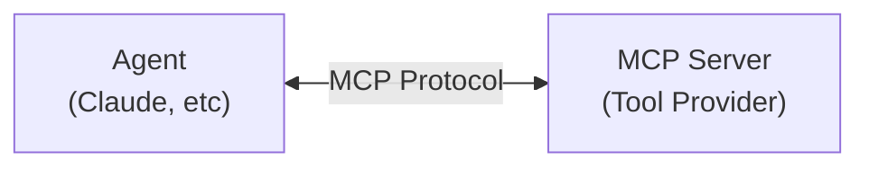

# MCP Development Guide

MCP (Model Context Protocol) Server is the bridge between Agents and external data sources and tools. This document introduces how to develop and configure MCP Servers for the Viben platform.

## Overview

### What is MCP?

MCP (Model Context Protocol) is an open protocol for standardizing the interaction between AI models and external tools and data sources. Through MCP, Agents can:

- Access the file system
- Execute Git operations
- Query databases
- Call external APIs
- Execute custom tools

### MCP Architecture



## Quick Start

### 1. Using Existing MCP Servers

```bash
# Add filesystem MCP to an agent
viben mcp add filesystem --agent my-agent \
  --command npx \
  --args @anthropic-ai/mcp-server-filesystem /home/user

# Add git MCP to an agent
viben mcp add git --agent my-agent \
  --command npx \
  --args @anthropic-ai/mcp-server-git

# View configured MCP servers
viben mcp list --agent my-agent
```

### 2. MCP Configuration File

MCP configuration is stored in the Agent directory:

```json
// ~/.viben/agents/my-agent/mcp_servers.json
{
  "mcpServers": {
    "filesystem": {
      "command": "npx",
      "args": ["-y", "@anthropic-ai/mcp-server-filesystem", "/home/user"],
      "env": {}
    },
    "git": {
      "command": "npx",
      "args": ["-y", "@anthropic-ai/mcp-server-git"]
    },
    "custom-api": {
      "command": "node",
      "args": ["./my-mcp-server/index.js"],
      "env": {
        "API_KEY": "${API_KEY}"
      }
    }
  }
}
```

## Developing Custom MCP Servers

### Directory Structure

```
my-mcp-server/
├── package.json
├── README.md
├── src/
│   └── index.ts
└── tests/
    └── server.test.ts
```

### TypeScript Implementation

```typescript
// src/index.ts
import { Server } from '@modelcontextprotocol/sdk/server/index.js';
import { StdioServerTransport } from '@modelcontextprotocol/sdk/server/stdio.js';
import {
  CallToolRequestSchema,
  ListToolsRequestSchema,
} from '@modelcontextprotocol/sdk/types.js';

const server = new Server(
  {
    name: 'my-mcp-server',
    version: '1.0.0',
  },
  {
    capabilities: {
      tools: {},
    },
  }
);

// Register tool list
server.setRequestHandler(ListToolsRequestSchema, async () => {
  return {
    tools: [
      {
        name: 'search',
        description: 'Search data',
        inputSchema: {
          type: 'object',
          properties: {
            query: {
              type: 'string',
              description: 'Search keyword',
            },
          },
          required: ['query'],
        },
      },
    ],
  };
});

// Handle tool calls
server.setRequestHandler(CallToolRequestSchema, async (request) => {
  const { name, arguments: args } = request.params;

  if (name === 'search') {
    const query = args?.query as string;
    // Implement search logic
    const results = await performSearch(query);
    return {
      content: [
        {
          type: 'text',
          text: JSON.stringify(results, null, 2),
        },
      ],
    };
  }

  throw new Error(`Unknown tool: ${name}`);
});

async function performSearch(query: string) {
  // Implement your search logic
  return [{ title: 'Result 1', url: 'https://example.com' }];
}

// Start server
async function main() {
  const transport = new StdioServerTransport();
  await server.connect(transport);
}

main().catch(console.error);
```

### Python Implementation

```python
# server.py
from mcp.server import Server, NotificationOptions
from mcp.server.models import InitializationOptions
import mcp.server.stdio
import mcp.types as types

server = Server("my-mcp-server")

@server.list_tools()
async def list_tools() -> list[types.Tool]:
    return [
        types.Tool(
            name="search",
            description="Search data",
            inputSchema={
                "type": "object",
                "properties": {
                    "query": {
                        "type": "string",
                        "description": "Search keyword"
                    }
                },
                "required": ["query"]
            }
        )
    ]

@server.call_tool()
async def call_tool(name: str, arguments: dict) -> list[types.TextContent]:
    if name == "search":
        query = arguments.get("query", "")
        # Implement search logic
        results = await perform_search(query)
        return [types.TextContent(
            type="text",
            text=str(results)
        )]
    raise ValueError(f"Unknown tool: {name}")

async def perform_search(query: str):
    # Implement your search logic
    return [{"title": "Result 1", "url": "https://example.com"}]

async def main():
    async with mcp.server.stdio.stdio_server() as (read_stream, write_stream):
        await server.run(
            read_stream,
            write_stream,
            InitializationOptions(
                server_name="my-mcp-server",
                server_version="1.0.0",
                capabilities=server.get_capabilities(
                    notification_options=NotificationOptions(),
                    experimental_capabilities={},
                ),
            ),
        )

if __name__ == "__main__":
    import asyncio
    asyncio.run(main())
```

## MCP CLI Commands

### List MCP Servers

```bash
# List globally installed MCP servers
viben mcp list

# List MCP servers configured for a specific agent
viben mcp list --agent my-agent

# JSON format output
viben mcp list --json
```

### View MCP Server Details

```bash
# View MCP server details
viben mcp show filesystem --agent my-agent

# JSON output
viben mcp show filesystem --json
```

Output example:

```
MCP Server: filesystem

  Name:          filesystem
  Command:       npx
  Args:          @anthropic-ai/mcp-server-filesystem /home/user
  Enabled:       yes

Environment Variables:

  API_KEY:       secr****5678
  DEBUG:         true
```

> **Note**: Environment variable values containing `secret`, `token`, or `key` are automatically masked in the display.

### Add MCP Server

```bash
# Basic usage
viben mcp add <name> --agent <agent-id> --command <cmd>

# With arguments
viben mcp add filesystem --agent my-agent \
  --command npx \
  --args @anthropic-ai/mcp-server-filesystem /home/user

# With environment variables
viben mcp add api-mcp --agent my-agent \
  --command node \
  --env API_KEY=secret123 \
  --env DEBUG=true

# Add in disabled state
viben mcp add filesystem --agent my-agent \
  --command npx \
  --disabled
```

### Remove MCP Server

```bash
viben mcp remove <name> --agent <agent-id>
```

### MCP Inspector

Use MCP Inspector to test and debug MCP servers:

```bash
# Start Inspector
viben mcp inspector

# Specify MCP server command
viben mcp inspector node build/index.js

# Pass environment variables
viben mcp inspector -e API_KEY=value node build/index.js

# Use configuration file
viben mcp inspector --config mcp.json --server myserver
```

After starting, access the output URL to use the Web UI for debugging.

## Common MCP Servers

### Official MCP Servers

| Name | Package | Description |
|------|---------|-------------|
| Filesystem | `@anthropic-ai/mcp-server-filesystem` | File system access |
| Git | `@anthropic-ai/mcp-server-git` | Git operations |
| GitHub | `@anthropic-ai/mcp-server-github` | GitHub API |
| Slack | `@anthropic-ai/mcp-server-slack` | Slack integration |
| PostgreSQL | `@anthropic-ai/mcp-server-postgres` | PostgreSQL queries |

### Installing Official MCP Servers

```bash
# Filesystem
viben mcp add filesystem --agent my-agent \
  --command npx \
  --args -y @anthropic-ai/mcp-server-filesystem /path/to/dir

# Git
viben mcp add git --agent my-agent \
  --command npx \
  --args -y @anthropic-ai/mcp-server-git

# GitHub (requires token)
viben mcp add github --agent my-agent \
  --command npx \
  --args -y @anthropic-ai/mcp-server-github \
  --env GITHUB_TOKEN=${GITHUB_TOKEN}
```

## Best Practices

### Error Handling

```typescript
server.setRequestHandler(CallToolRequestSchema, async (request) => {
  try {
    const { name, arguments: args } = request.params;
    // Tool logic
    return { content: [{ type: 'text', text: 'Success' }] };
  } catch (error) {
    // Return error message to Agent
    return {
      content: [
        {
          type: 'text',
          text: `Error: ${error.message}`,
        },
      ],
      isError: true,
    };
  }
});
```

### Configuration Management

```typescript
// Use environment variables to manage sensitive information
const apiKey = process.env.MY_API_KEY;
if (!apiKey) {
  throw new Error('MY_API_KEY environment variable is required');
}
```

### Logging

```typescript
import { Logger } from '@modelcontextprotocol/sdk/logging.js';

const logger = new Logger('my-mcp-server');

server.setRequestHandler(CallToolRequestSchema, async (request) => {
  logger.info(`Tool called: ${request.params.name}`);
  // ...
});
```

### Input Validation

```typescript
import { z } from 'zod';

const SearchArgsSchema = z.object({
  query: z.string().min(1).max(1000),
  limit: z.number().int().positive().max(100).optional().default(10),
});

server.setRequestHandler(CallToolRequestSchema, async (request) => {
  if (request.params.name === 'search') {
    const args = SearchArgsSchema.parse(request.params.arguments);
    // Use validated arguments
  }
});
```

## Debugging Tips

### 1. Using Inspector

```bash
viben mcp inspector node ./my-server/index.js
```

### 2. Viewing Logs

```bash
# Enable verbose logging
DEBUG=mcp:* node ./my-server/index.js
```

### 3. Testing Individual Tools

```bash
# Call tools directly in Inspector for testing
```

## Related Documentation

- [MCP Official Specification](https://spec.modelcontextprotocol.io/)
- [MCP SDK Documentation](https://github.com/modelcontextprotocol/sdk)
- [Agent Development Guide](./index.md)
- [CLI Integration Guide](./cli-integration.md)
