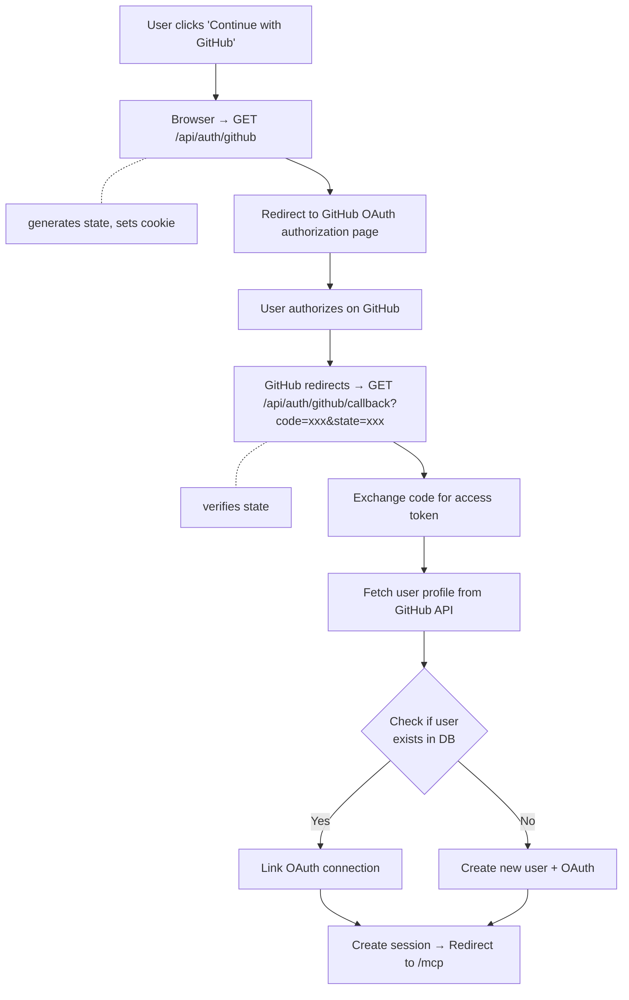

# GitHub OAuth Integration Guide

> Complete guide for integrating GitHub OAuth login in Viben platform

---

## Table of Contents

1. [Overview](#overview)
2. [Architecture](#architecture)
3. [Setup Guide](#setup-guide)
4. [Implementation Details](#implementation-details)
5. [Security Considerations](#security-considerations)
6. [Testing](#testing)
7. [Troubleshooting](#troubleshooting)
8. [API Reference](#api-reference)

---

## Overview

Viben uses GitHub OAuth 2.0 for social login, allowing users to:
- Sign in with their GitHub account
- Automatically link GitHub profile to user account
- Skip email verification (GitHub email is pre-verified)
- Sync username, display name, and avatar from GitHub

### Features

- ✅ OAuth 2.0 Authorization Code Flow
- ✅ CSRF protection with state parameter
- ✅ Automatic user creation or account linking
- ✅ Secure token storage
- ✅ Session management with JWE tokens
- ✅ Email verification bypass for GitHub users

---

## Architecture

### Flow Diagram



### Database Schema

**`oauth_connections` table:**
```typescript
{
  id: string (UUID)
  userId: string (FK to users)
  provider: 'github' | 'google' | ...
  providerId: string (GitHub user ID)
  accessToken: string (encrypted)
  createdAt: Date
  updatedAt: Date
}
```

**`users` table** (relevant fields):
```typescript
{
  id: string
  email: string
  username: string
  displayName: string
  avatarUrl: string | null
  githubUsername: string | null
  emailVerified: boolean
  role: 'user' | 'developer' | 'admin'
}
```

---

## Setup Guide

### Step 1: Create GitHub OAuth App

1. **Navigate to GitHub**:
   - Go to https://github.com/settings/developers
   - Click "OAuth Apps" → "New OAuth App"

2. **Configure Application**:
   - **Application name**: `Viben` (or your app name)
   - **Homepage URL**: `https://your-domain.com` (or `http://localhost:3000` for dev)
   - **Authorization callback URL**: `https://your-domain.com/api/auth/github/callback`
     - For development: `http://localhost:3000/api/auth/github/callback`
     - For production: `https://your-actual-domain.vercel.app/api/auth/github/callback`

3. **Get Credentials**:
   - After creating, copy:
     - **Client ID** (starts with `Iv1.`)
     - **Client Secret** (click "Generate a new client secret")

### Step 2: Environment Variables

Add to `.env.local` (development) or Vercel Environment Variables (production):

```bash
# OAuth - GitHub
NEXT_PUBLIC_GITHUB_CLIENT_ID="Iv1.abc123xyz456"
GITHUB_CLIENT_SECRET="ghp_abc123xyz456..."

# Required for OAuth flow
NEXT_PUBLIC_APP_URL="http://localhost:3000"  # Production: https://your-domain.com
JWE_SECRET="your-32-byte-secret-for-session-encryption"
```

**Generate secrets:**
```bash
# Generate JWE_SECRET
openssl rand -base64 32
```

### Step 3: Update Callback URL for Different Environments

For multi-environment setups:

**Development:**
```
http://localhost:3000/api/auth/github/callback
```

**Staging:**
```
https://staging.your-domain.com/api/auth/github/callback
```

**Production:**
```
https://your-domain.com/api/auth/github/callback
```

**Note**: You can add multiple OAuth Apps in GitHub for different environments, or use one app with multiple callback URLs (GitHub allows multiple callbacks).

---

## Implementation Details

### 1. OAuth Initiation Route

**File:** `app/api/auth/github/route.ts`

```typescript
export async function GET() {
  const clientId = process.env.NEXT_PUBLIC_GITHUB_CLIENT_ID;
  const appUrl = process.env.NEXT_PUBLIC_APP_URL || 'http://localhost:3000';

  // Generate random state for CSRF protection
  const state = generateId();

  // Store state in httpOnly cookie
  const cookieStore = await cookies();
  cookieStore.set('oauth_state', state, {
    httpOnly: true,
    secure: process.env.NODE_ENV === 'production',
    sameSite: 'lax',
    maxAge: 600, // 10 minutes
  });

  // Build GitHub authorization URL
  const params = new URLSearchParams({
    client_id: clientId,
    redirect_uri: `${appUrl}/api/auth/github/callback`,
    scope: 'read:user user:email',
    state,
  });

  return NextResponse.redirect(
    `https://github.com/login/oauth/authorize?${params}`
  );
}
```

**Scopes requested:**
- `read:user` - Read user profile information
- `user:email` - Read user email addresses

### 2. OAuth Callback Route

**File:** `app/api/auth/github/callback/route.ts`

**Key steps:**

1. **Verify State (CSRF Protection)**
   ```typescript
   const storedState = cookieStore.get('oauth_state')?.value;
   if (!code || !state || state !== storedState) {
     return NextResponse.redirect(`${appUrl}/login?error=invalid_state`);
   }
   ```

2. **Exchange Code for Access Token**
   ```typescript
   const tokenResponse = await fetch(
     'https://github.com/login/oauth/access_token',
     {
       method: 'POST',
       headers: {
         Accept: 'application/json',
         'Content-Type': 'application/json',
       },
       body: JSON.stringify({
         client_id: process.env.NEXT_PUBLIC_GITHUB_CLIENT_ID,
         client_secret: process.env.GITHUB_CLIENT_SECRET,
         code,
       }),
     }
   );
   const { access_token } = await tokenResponse.json();
   ```

3. **Fetch User Profile**
   ```typescript
   // Get user info
   const userResponse = await fetch('https://api.github.com/user', {
     headers: { Authorization: `Bearer ${accessToken}` },
   });
   const githubUser = await userResponse.json();

   // Get primary email
   const emailResponse = await fetch('https://api.github.com/user/emails', {
     headers: { Authorization: `Bearer ${accessToken}` },
   });
   const emails = await emailResponse.json();
   const primaryEmail = emails.find(e => e.primary)?.email;
   ```

4. **User Matching Logic**

   **Case A: OAuth connection exists** → Link to existing user
   ```typescript
   const existingConnection = await db.query.oauthConnections.findFirst({
     where: and(
       eq(oauthConnections.provider, 'github'),
       eq(oauthConnections.providerId, String(githubUser.id))
     ),
     with: { user: true },
   });

   if (existingConnection) {
     // Update access token and use existing user
     await db.update(oauthConnections)
       .set({ accessToken })
       .where(eq(oauthConnections.id, existingConnection.id));
     user = existingConnection.user;
   }
   ```

   **Case B: User with email exists** → Link OAuth to existing user
   ```typescript
   const existingUser = await db.query.users.findFirst({
     where: eq(users.email, primaryEmail),
   });

   if (existingUser) {
     // Create OAuth connection
     await db.insert(oauthConnections).values({
       id: generateId(),
       userId: existingUser.id,
       provider: 'github',
       providerId: String(githubUser.id),
       accessToken,
     });
     user = existingUser;
   }
   ```

   **Case C: New user** → Create user + OAuth connection
   ```typescript
   const userId = generateId();
   await db.insert(users).values({
     id: userId,
     email: primaryEmail,
     username: githubUser.login,
     displayName: githubUser.name || githubUser.login,
     avatarUrl: githubUser.avatar_url,
     githubUsername: githubUser.login,
     role: 'user',
     emailVerified: true, // Skip verification for GitHub users
   });

   await db.insert(oauthConnections).values({
     id: generateId(),
     userId,
     provider: 'github',
     providerId: String(githubUser.id),
     accessToken,
   });
   ```

5. **Create Session**
   ```typescript
   await setSessionCookie({
     userId: user.id,
     username: user.username,
     email: user.email,
     role: user.role,
     avatarUrl: user.avatarUrl,
   });

   return NextResponse.redirect(`${appUrl}/mcp`);
   ```

### 3. Frontend OAuth Button

**File:** `components/auth/oauth-buttons.tsx`

```typescript
'use client';

import { Button } from '@/components/ui/button';
import { Github } from 'lucide-react';

export function OAuthButtons() {
  const handleGitHubLogin = () => {
    window.location.href = '/api/auth/github';
  };

  return (
    <Button variant="outline" onClick={handleGitHubLogin}>
      <Github className="mr-2 h-4 w-4" />
      Continue with GitHub
    </Button>
  );
}
```

**Usage in login page:**

```typescript
// app/(auth)/login/page.tsx
import { OAuthButtons } from '@/components/auth/oauth-buttons';

export default function LoginPage() {
  return (
    <div>
      <h1>Welcome back</h1>
      <OAuthButtons />
      {/* ...other login forms... */}
    </div>
  );
}
```

---

## Security Considerations

### 1. CSRF Protection

**Problem**: Attackers can trick users into authorizing malicious OAuth flows.

**Solution**: State parameter validation
```typescript
// Generate random state
const state = generateId(); // or crypto.randomBytes(32).toString('hex')

// Store in secure cookie
cookieStore.set('oauth_state', state, {
  httpOnly: true,
  secure: true,
  sameSite: 'lax',
  maxAge: 600,
});

// Verify on callback
if (state !== storedState) {
  throw new Error('Invalid state');
}
```

### 2. Token Storage

**Access Token Storage:**
- ✅ **DO**: Store in database (encrypted at rest)
- ❌ **DON'T**: Store in localStorage or sessionStorage
- ❌ **DON'T**: Expose to client-side JavaScript

**Session Token:**
- ✅ **DO**: Use httpOnly cookies with JWE encryption
- ✅ **DO**: Set `secure: true` in production
- ✅ **DO**: Use `sameSite: 'lax'` for CSRF protection

### 3. Scope Minimization

Only request necessary scopes:
```typescript
scope: 'read:user user:email'  // ✅ Minimal
scope: 'repo admin:org'         // ❌ Too broad
```

### 4. Environment Variable Protection

- ✅ Never commit `.env` files to Git
- ✅ Use different OAuth apps for dev/staging/prod
- ✅ Rotate client secrets periodically
- ✅ Use Vercel environment variables for production

### 5. Redirect URI Validation

GitHub validates redirect URIs automatically, but ensure:
- Exact match with configured callback URL
- No open redirects after authentication
- Whitelist allowed domains

---

## Testing

### Local Development

1. **Start development server:**
   ```bash
   pnpm dev
   ```

2. **Test OAuth flow:**
   - Navigate to http://localhost:3000/login
   - Click "Continue with GitHub"
   - Should redirect to GitHub authorization page
   - Authorize the app
   - Should redirect back to http://localhost:3000/mcp

3. **Verify database:**
   ```bash
   pnpm db:studio
   ```
   Check:
   - `users` table has new entry
   - `oauth_connections` table has GitHub connection
   - `emailVerified` is `true`

### Testing Different User Scenarios

**Scenario 1: New User (First-time GitHub login)**
- Expected: Creates new user + OAuth connection
- Verify: Check `users` and `oauth_connections` tables

**Scenario 2: Existing User (Email match)**
- Precondition: User registered with email/password
- Expected: Links OAuth to existing user account
- Verify: User has both password and GitHub login

**Scenario 3: Returning User (OAuth exists)**
- Precondition: User logged in with GitHub before
- Expected: Updates access token, logs in
- Verify: `oauth_connections.accessToken` is updated

**Scenario 4: Email Mismatch**
- Precondition: User changes primary email on GitHub
- Expected: May create duplicate account (by design)
- Note: Consider email change detection logic

### Error Testing

Test error handling:

```bash
# Invalid state
curl "http://localhost:3000/api/auth/github/callback?code=xxx&state=invalid"
# Expected: Redirect to /login?error=invalid_state

# Missing code
curl "http://localhost:3000/api/auth/github/callback?state=xxx"
# Expected: Redirect to /login?error=invalid_state

# Invalid credentials
# Remove GITHUB_CLIENT_SECRET from .env
# Expected: Redirect to /login?error=oauth_failed
```

---

## Troubleshooting

### Error: "GitHub OAuth not configured"

**Cause**: Missing `NEXT_PUBLIC_GITHUB_CLIENT_ID`

**Fix**:
```bash
# Add to .env.local
NEXT_PUBLIC_GITHUB_CLIENT_ID="Iv1.xxx"
```

### Error: "Invalid state" or "invalid_state"

**Cause**: State parameter mismatch (CSRF protection)

**Possible reasons:**
1. Cookie not set (check browser dev tools → Application → Cookies)
2. Cookie expired (10-minute timeout)
3. SameSite cookie issues in development

**Fix**:
- Clear cookies and try again
- Check `sameSite` cookie setting
- Verify `NEXT_PUBLIC_APP_URL` matches actual URL

### Error: "Redirect URI mismatch"

**Cause**: Callback URL doesn't match GitHub OAuth App settings

**Fix**:
1. Check GitHub OAuth App settings
2. Ensure callback URL is exact: `https://your-domain.com/api/auth/github/callback`
3. No trailing slash
4. Protocol must match (http vs https)

### Error: "No access token received"

**Cause**: Invalid client credentials or code

**Debug**:
```typescript
// Add logging in callback route
console.error('Token data:', tokenData);
```

**Common causes:**
- Wrong `GITHUB_CLIENT_SECRET`
- Code already used (refresh during callback)
- Code expired (5-minute lifetime)

### Error: "No email available"

**Cause**: User's GitHub account has no public email

**Fix**: Request email scope and fetch from `/user/emails` endpoint (already implemented)

**Alternative**: Allow users to add email manually after OAuth login

### Error: Database connection issues

**Cause**: Missing `POSTGRES_URL` or database schema

**Fix**:
```bash
# Check environment variable
echo $POSTGRES_URL

# Push schema to database
pnpm db:push
```

---

## API Reference

### GET /api/auth/github

Initiates OAuth flow by redirecting to GitHub.

**Query Parameters**: None

**Response**: HTTP 302 Redirect to GitHub

**Headers Set**:
- `Set-Cookie: oauth_state={state}; HttpOnly; Secure; SameSite=Lax`

---

### GET /api/auth/github/callback

Handles OAuth callback from GitHub.

**Query Parameters**:
- `code` (required) - Authorization code from GitHub
- `state` (required) - CSRF protection token

**Success Response**: HTTP 302 Redirect to `/mcp`
- Creates session cookie
- Creates/updates user and OAuth connection

**Error Responses**:
| Error | Redirect | Cause |
|-------|----------|-------|
| `invalid_state` | `/login?error=invalid_state` | State mismatch or missing |
| `no_token` | `/login?error=no_token` | Failed to get access token |
| `no_email` | `/login?error=no_email` | GitHub account has no email |
| `oauth_failed` | `/login?error=oauth_failed` | General OAuth error |

---

### GitHub API Endpoints Used

**1. Exchange Code for Token**
```
POST https://github.com/login/oauth/access_token
Body: { client_id, client_secret, code }
Response: { access_token, token_type, scope }
```

**2. Get User Profile**
```
GET https://api.github.com/user
Headers: { Authorization: Bearer {access_token} }
Response: { id, login, name, email, avatar_url, ... }
```

**3. Get User Emails**
```
GET https://api.github.com/user/emails
Headers: { Authorization: Bearer {access_token} }
Response: [{ email, primary, verified, ... }]
```

---

## Advanced Topics

### Adding More OAuth Providers

To add Google, Twitter, etc.:

1. **Create provider route**: `app/api/auth/{provider}/route.ts`
2. **Create callback route**: `app/api/auth/{provider}/callback/route.ts`
3. **Update database**: Add provider to `oauth_connections.provider` enum
4. **Update UI**: Add button to `OAuthButtons` component

**Example structure:**
```typescript
// Provider-specific config
const OAUTH_CONFIG = {
  github: {
    authUrl: 'https://github.com/login/oauth/authorize',
    tokenUrl: 'https://github.com/login/oauth/access_token',
    userUrl: 'https://api.github.com/user',
    scope: 'read:user user:email',
  },
  google: {
    authUrl: 'https://accounts.google.com/o/oauth2/v2/auth',
    tokenUrl: 'https://oauth2.googleapis.com/token',
    userUrl: 'https://www.googleapis.com/oauth2/v2/userinfo',
    scope: 'openid email profile',
  },
};
```

### Refresh Token Support

GitHub access tokens don't expire, but for providers that use refresh tokens:

1. **Store refresh token** in `oauth_connections` table:
   ```typescript
   refreshToken: text('refresh_token'),
   tokenExpiresAt: timestamp('token_expires_at'),
   ```

2. **Check expiry** before API calls:
   ```typescript
   if (Date.now() > connection.tokenExpiresAt) {
     const newToken = await refreshAccessToken(connection.refreshToken);
     await updateConnection(newToken);
   }
   ```

### Account Unlinking

Allow users to unlink OAuth accounts:

```typescript
// app/api/auth/oauth/unlink/route.ts
export async function DELETE(request: Request) {
  const session = await getSession(request);
  const { provider } = await request.json();

  // Check user has alternative login method
  const user = await db.query.users.findFirst({
    where: eq(users.id, session.userId),
    with: { oauthConnections: true },
  });

  if (!user.passwordHash && user.oauthConnections.length <= 1) {
    return NextResponse.json(
      { error: 'Cannot unlink last login method' },
      { status: 400 }
    );
  }

  // Delete OAuth connection
  await db.delete(oauthConnections).where(
    and(
      eq(oauthConnections.userId, session.userId),
      eq(oauthConnections.provider, provider)
    )
  );

  return NextResponse.json({ success: true });
}
```

---

## Summary

**GitHub OAuth Integration Checklist:**

- [x] Create GitHub OAuth App
- [x] Configure environment variables
- [x] Implement initiation route (`/api/auth/github`)
- [x] Implement callback route (`/api/auth/github/callback`)
- [x] Add CSRF protection with state parameter
- [x] Handle user creation and account linking
- [x] Store OAuth connections in database
- [x] Create session after successful auth
- [x] Add frontend OAuth button
- [x] Test all user scenarios
- [x] Deploy and configure production callback URL

**Key Files:**
- `app/api/auth/github/route.ts` - OAuth initiation
- `app/api/auth/github/callback/route.ts` - OAuth callback
- `components/auth/oauth-buttons.tsx` - Frontend button
- `lib/db/schema.ts` - Database schema (oauth_connections)
- `.env.local` - Environment variables

**Production Deployment:**
- Update GitHub OAuth App callback URL
- Set environment variables in Vercel
- Test OAuth flow in production
- Monitor error logs

---

**Last Updated**: 2026-02-05
