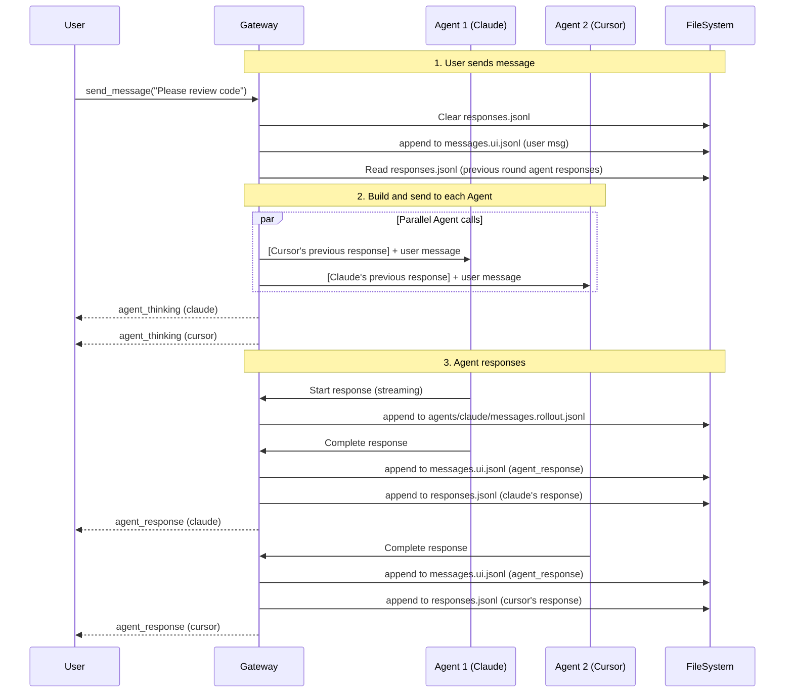

# Group Chat Design

File-based group chat feature supporting human users and multiple AI agents in real-time discussions and collaboration.

---

## Overview

| Property | Value |
|----------|-------|
| Module | `viben-core/gateway` |
| Storage | **File System** (not database) |
| Status | **Draft v2** |
| Priority | P1 |

---

## Core Concepts

### User View vs Agent View

| View | File | Content |
|------|------|---------|
| **User View** | `messages.ui.jsonl` | Message stream seen by users, without tool call details |
| **Agent View** | `<agent-id>/messages.agent.jsonl` | Raw messages from an Agent, including tool calls |

After a user sends a message:
1. All Agents in the group chat **think in parallel**
2. User view only shows "Agent is thinking..."
3. Each Agent gives an answer after thinking
4. Tool calls happen in the background, not shown in user view

### Participant Types

| Type | Identifier | Description |
|------|------------|-------------|
| `human` | User ID | Human user, sends messages via UI |
| `agent` | Agent ID | AI agent, such as Claude, GPT, etc. |

---

## File System Structure

### Storage Location

```
<workspace>/.viben/group-chats/
```

### Directory Structure

```
group-chats/
└── <group-chat-id>/
    ├── config.yaml              # Group chat configuration
    ├── files/                   # Group files (shared files)
    ├── pictures/                # Group album (shared images)
    └── sessions/                # Conversation records
        └── <session-id>/
            ├── config.yaml          # Session configuration
            ├── messages.ui.jsonl    # User view messages (append-only)
            ├── responses.jsonl      # Current round agent responses (cleared each round)
            └── agents/
                └── <agent-id>/
                    ├── messages.rollout.jsonl  # Agent message records (with tool calls)
                    └── subagents/              # Sub-agent messages (if any)
                        └── agent-<subagent-id>.jsonl
```

### Key File Descriptions

| File | Lifecycle | Purpose |
|------|-----------|---------|
| `messages.ui.jsonl` | append-only | Complete conversation history from user view |
| `responses.jsonl` | cleared each round | Temporary storage for current round agent responses, used to build next round context |
| `messages.rollout.jsonl` | append-only | Complete agent message records (with tool calls) |
| `subagents/agent-*.jsonl` | append-only | Sub-agent message records (following Claude Code design) |

---

## Data Models

### config.yaml (Group Chat Configuration)

```yaml
# <group-chat-id>/config.yaml
id: "gc-uuid"
name: "Code Review Discussion"
description: "Code review for PR #123"
created_by: "user-1"
created_at: "2026-02-10T12:00:00Z"
updated_at: "2026-02-10T12:00:00Z"

# Group chat members
members:
  - id: "user-1"
    type: human
    display_name: "John Doe"
    role: owner
    joined_at: "2026-02-10T12:00:00Z"

  - id: "claude-code"
    type: agent
    display_name: "Claude Code"
    model: "claude-sonnet-4-20250514"
    role: member
    joined_at: "2026-02-10T12:00:00Z"

  - id: "cursor"
    type: agent
    display_name: "Cursor AI"
    model: "gpt-4o"
    role: member
    joined_at: "2026-02-10T12:00:00Z"

# Group chat settings
settings:
  # Message broadcast mode
  broadcast_mode: all  # all | mention_only
  # Whether to show agent thinking process
  show_thinking: false
  # Number of history messages to load
  history_limit: 10
```

### config.yaml (Session Configuration)

```yaml
# sessions/<session-id>/config.yaml
id: "session-uuid"
group_chat_id: "gc-uuid"
title: "Discussion Session 1"
created_at: "2026-02-10T12:05:00Z"
updated_at: "2026-02-10T12:30:00Z"

# Agents active in this session
active_agents:
  - claude-code
  - cursor

# Session status
status: active  # active | archived
```

### messages.ui.jsonl (User View Messages)

One JSON message per line, for UI rendering:

```jsonl
{"id":"msg-1","type":"user","sender_id":"user-1","sender_name":"John","content":"Please help me review this code","timestamp":"2026-02-10T12:05:00Z"}
{"id":"msg-2","type":"agent_thinking","agent_id":"claude-code","agent_name":"Claude Code","status":"thinking","timestamp":"2026-02-10T12:05:01Z"}
{"id":"msg-3","type":"agent_thinking","agent_id":"cursor","agent_name":"Cursor AI","status":"thinking","timestamp":"2026-02-10T12:05:01Z"}
{"id":"msg-4","type":"agent_response","agent_id":"claude-code","agent_name":"Claude Code","content":"This code has several issues...","timestamp":"2026-02-10T12:05:30Z"}
{"id":"msg-5","type":"agent_response","agent_id":"cursor","agent_name":"Cursor AI","content":"I agree with Claude, also...","timestamp":"2026-02-10T12:05:35Z"}
```

#### UI Message Types

```typescript
type UIMessageType =
  | "user"           // User message
  | "agent_thinking" // Agent is thinking
  | "agent_response" // Agent response
  | "system"         // System message (member join/leave, etc.)

interface UIMessage {
  id: string
  type: UIMessageType
  timestamp: string

  // user message
  sender_id?: string
  sender_name?: string
  content?: string

  // agent_thinking message
  agent_id?: string
  agent_name?: string
  status?: "thinking" | "done" | "error"

  // agent_response message
  // agent_id, agent_name, content

  // system message
  event?: "member_joined" | "member_left" | "session_created"
  data?: Record<string, unknown>
}
```

### responses.jsonl (Current Round Agent Responses)

Temporary storage for current round agent final responses, **excluding tool call process**:

```jsonl
{"agent_id":"claude-code","agent_name":"Claude Code","content":"This code has several issues...","timestamp":"2026-02-10T12:05:30Z"}
{"agent_id":"cursor","agent_name":"Cursor AI","content":"I agree with Claude, also...","timestamp":"2026-02-10T12:05:35Z"}
```

**Lifecycle**:
- After user sends message, `responses.jsonl` is **cleared**
- After each agent completes response, append to `responses.jsonl`
- When user sends next message, read `responses.jsonl` to build other agents' response context

### messages.rollout.jsonl (Agent Message Records)

Complete agent message records, including tool calls. **Key point**: Messages sent to an agent **prepend other agents' responses**.

```jsonl
{"role":"system","content":"You are Claude Code, a code review assistant..."}
{"role":"user","content":"Please help me review this code","name":"John"}
{"role":"assistant","content":"Let me analyze this code first...","tool_calls":[{"id":"tc-1","type":"function","function":{"name":"read_file","arguments":"{\"path\":\"src/main.rs\"}"}}]}
{"role":"tool","tool_call_id":"tc-1","content":"fn main() { ... }"}
{"role":"assistant","content":"This code has several issues..."}
{"role":"user","content":"[Cursor AI]: I agree with Claude, also...\n\n[User]: How should I fix it specifically?"}
{"role":"assistant","content":"Okay, let me give you specific suggestions..."}
```

**Message Building Logic** (example for sending to Claude):
```
1. Read non-Claude responses from responses.jsonl
2. Format as: "[Cursor AI]: xxx\n\n[User]: user's new message"
3. Append as new user message to messages.rollout.jsonl
```

---

## Gateway API

### REST Endpoints

#### Group Chat Management

```
POST   /api/workspaces/:workspace_id/group-chats              Create group chat
GET    /api/workspaces/:workspace_id/group-chats              List group chats
GET    /api/workspaces/:workspace_id/group-chats/:id          Get group chat details
PATCH  /api/workspaces/:workspace_id/group-chats/:id          Update group chat config
DELETE /api/workspaces/:workspace_id/group-chats/:id          Delete group chat
```

#### Member Management

```
GET    /api/group-chats/:id/members                List members
POST   /api/group-chats/:id/members                Add member
DELETE /api/group-chats/:id/members/:member_id     Remove member
```

#### Session Management

```
POST   /api/group-chats/:id/sessions               Create new session
GET    /api/group-chats/:id/sessions               List sessions
GET    /api/group-chats/:id/sessions/:session_id   Get session details
DELETE /api/group-chats/:id/sessions/:session_id   Delete session
```

#### Messages

```
GET    /api/group-chats/:id/sessions/:session_id/messages
       ?view=ui|agent&agent_id=xxx&limit=10&before=timestamp

POST   /api/group-chats/:id/sessions/:session_id/messages
       Send message (triggers all agent responses)
```

### WebSocket Endpoints

#### Group Chat Real-time Communication

```
WS /api/group-chats/:id/sessions/:session_id/ws
```

**Connection Parameters**:
```
?member_type=human&member_id=user-1
```

**Client Commands**:
```typescript
// Send message
{ "type": "send_message", "content": "Hello everyone!" }

// Switch view
{ "type": "switch_view", "view": "ui" | "agent", "agent_id": "claude-code" }

// Interrupt agent thinking
{ "type": "interrupt", "agent_id": "claude-code" }
```

**Server Events**:
```typescript
// Agent starts thinking
{ "type": "agent_thinking", "agent_id": "string", "agent_name": "string" }

// Agent thinking progress (optional, for token streaming)
{ "type": "agent_progress", "agent_id": "string", "delta": "string" }

// Agent completes response
{ "type": "agent_response", "agent_id": "string", "agent_name": "string", "content": "string" }

// Agent error
{ "type": "agent_error", "agent_id": "string", "error": "string" }

// View data (returned after view switch)
{ "type": "view_data", "view": "ui" | "agent", "messages": Message[] }
```

---

## Interaction Flow

### User Sends Message



### View Switching

Users can switch between different views in the UI title bar:

| View | Data Source | Can Send Messages | Description |
|------|-------------|-------------------|-------------|
| **Group Chat View** (default) | `messages.ui.jsonl` | Yes | Clean message stream, normal user interaction |
| **Agent View** | `agents/<id>/messages.rollout.jsonl` | No (read-only) | View specific Agent's tool call process |

**Switch Behavior**:
- Stay at **same message position** (same conversation round) after switching
- Message input box is **disabled** in Agent view
- Requires **manual switch**, no automatic switching

### Session Switching

Title bar can switch sessions (similar to other chat page session switching):

```
┌──────────────────────────────────────────────────┐
│  Code Review  ▼  │  Session 1 ▼  │  Group View ▼  │
├──────────────────────────────────────────────────┤
│                                                  │
│  [Message List]                                  │
│                                                  │
└──────────────────────────────────────────────────┘
```

---

## API Request/Response Examples

### Create Group Chat

**Request**:
```http
POST /api/workspaces/ws-1/group-chats
Content-Type: application/json

{
  "name": "Code Review Discussion",
  "description": "Code review for PR #123",
  "members": [
    { "type": "human", "id": "user-1", "display_name": "John", "role": "owner" },
    { "type": "agent", "id": "claude-code", "display_name": "Claude Code", "model": "claude-sonnet-4-20250514" },
    { "type": "agent", "id": "cursor", "display_name": "Cursor AI", "model": "gpt-4o" }
  ]
}
```

**Response**:
```json
{
  "id": "gc-uuid",
  "name": "Code Review Discussion",
  "path": "/workspace/path/.viben/group-chats/gc-uuid",
  "members": [
    { "type": "human", "id": "user-1", "display_name": "John", "role": "owner" },
    { "type": "agent", "id": "claude-code", "display_name": "Claude Code" },
    { "type": "agent", "id": "cursor", "display_name": "Cursor AI" }
  ],
  "created_at": "2026-02-10T12:00:00Z"
}
```

### Send Message

**Request**:
```http
POST /api/group-chats/gc-uuid/sessions/session-1/messages
Content-Type: application/json

{
  "content": "Please help me review this code"
}
```

**Response** (returns immediately, agent responses pushed via WebSocket):
```json
{
  "message": {
    "id": "msg-uuid",
    "type": "user",
    "content": "Please help me review this code",
    "timestamp": "2026-02-10T12:05:00Z"
  },
  "agents_triggered": ["claude-code", "cursor"]
}
```

### Get Message History

**Request**:
```http
GET /api/group-chats/gc-uuid/sessions/session-1/messages?view=ui&limit=10
```

**Response**:
```json
{
  "messages": [
    { "id": "msg-1", "type": "user", "sender_name": "John", "content": "Please help me review this code", "timestamp": "..." },
    { "id": "msg-2", "type": "agent_response", "agent_name": "Claude Code", "content": "This code has several issues...", "timestamp": "..." },
    { "id": "msg-3", "type": "agent_response", "agent_name": "Cursor AI", "content": "I agree...", "timestamp": "..." }
  ],
  "has_more": true
}
```

### Switch to Agent View

**Request**:
```http
GET /api/group-chats/gc-uuid/sessions/session-1/messages?view=agent&agent_id=claude-code&limit=10
```

**Response**:
```json
{
  "messages": [
    { "role": "system", "content": "You are Claude Code..." },
    { "role": "user", "content": "Please help me review this code", "name": "John" },
    { "role": "assistant", "content": null, "tool_calls": [{ "id": "tc-1", "function": { "name": "read_file", "arguments": "..." } }] },
    { "role": "tool", "tool_call_id": "tc-1", "content": "fn main() { ... }" },
    { "role": "assistant", "content": "This code has several issues..." }
  ],
  "has_more": false
}
```

---

## Comparison with Existing Systems

| Comparison | Regular Chat Session | Group Chat |
|------------|---------------------|------------|
| Participants | 1 User + 1 Agent | 1 User + N Agents |
| Agent Response | Serial | **Parallel** |
| Tool Calls | Shown in UI | **Hidden in background** |
| Storage | Database | **File System** |
| View | Single | **Switchable** |

---

## Related

- [Group Chats API](./group-chats.md) - Group chat API documentation
- [WebSocket API](./websocket.md) - WebSocket endpoints
