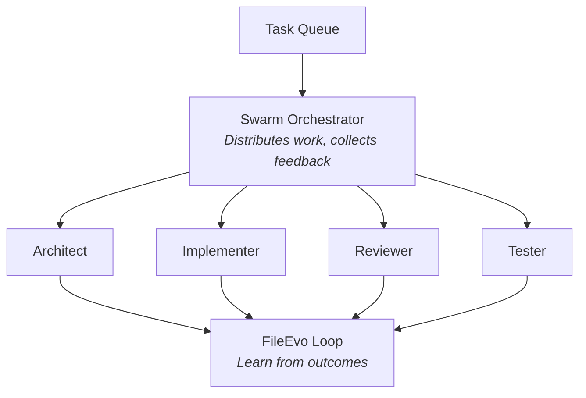

# Agent Management

Viben CLI provides comprehensive tools for managing AI agents and orchestrating **Agent Swarms** - coordinated groups of specialized agents that work together to evolve your codebase.

## Multi-Agent Orchestration

In the **Agent Swarm x Code Evolution** paradigm, multiple agents collaborate with different specializations:

| Agent Role | Description |
|------------|-------------|
| **Architect** | Designs system structure and evaluates architectural decisions |
| **Implementer** | Writes and modifies code based on task specifications |
| **Reviewer** | Reviews code changes and provides quality feedback |
| **Tester** | Generates and runs tests, validates implementations |
| **Optimizer** | Applies FileEvo to iteratively improve code quality metrics |

### Swarm Coordination



### Quick Swarm Commands

```bash
# Start a swarm session for a task
viben swarm start --task "implement-auth"

# List active swarm agents
viben swarm status

# Configure swarm roles
viben swarm config --roles architect,implementer,reviewer
```

## Key Concepts

| Concept | Description |
|---------|-------------|
| **Agent** | An independent AI assistant instance with its own configuration, memory, and sessions |
| **Swarm** | A coordinated group of agents working together on related tasks |
| **Template** | A regular agent marked with `isTemplate: true`, used as a blueprint for creating new agents |
| **Memory** | Agent's long-term memory (MEMORY.md + daily logs) |
| **Session** | Agent's conversation history and state |
| **Workspace Config** | Project-specific agent type configuration (e.g., `.claude/`) |

## Architecture Overview

```
Viben CLI
+---------------------------------------------------------+
|  Agent Template (Reusable agent configuration template)  |
|    │                                                     |
|    └── Agent Instance (Independent agent instance)       |
|          ├── config.yaml (Agent configuration)           |
|          ├── mcp_servers.json (MCP configuration)        |
|          ├── skills/ (Agent-specific skills)             |
|          ├── memory/ (Agent memory)                      |
|          │   ├── MEMORY.md (Main memory)                 |
|          │   └── YYYY-MM-DD.md (Daily logs, append-only) |
|          ├── .agentrc (Startup configuration)            |
|          ├── .agent_history (Command history)            |
|          └── .agent_sessions/<session_id>/ (Sessions)    |
+---------------------------------------------------------+
```

## Agent Directory Structure

Each agent is stored in `~/.viben/agents/<agent-id>/`:

```
~/.viben/agents/<agent-id>/
├── config.yaml              # Agent configuration
├── mcp_servers.json         # MCP servers configuration
├── skills/                  # Agent-specific skills
├── memory/                  # Agent memory
│   ├── MEMORY.md            # Main memory file (structured knowledge)
│   ├── 2024-01-15.md        # Daily log (append-only)
│   ├── 2024-01-16.md        # Read today + yesterday at session start
│   └── ...
├── .agentrc                 # Agent startup configuration
├── .agent_history           # Command history
└── .agent_sessions/         # Session storage
    └── <session_id>/
        ├── config.yaml              # Session configuration
        └── messages.rollout.jsonl   # Message history (JSONL)
```

## Runtime Config Merging

When an agent runs, configuration is merged in the following order:

```
1. ~/.viben/agents/<id>/config.yaml    # Agent base configuration
2. <project>/.claude/ (or other type)  # Workspace agent type config
3. Command line arguments              # Runtime overrides
```

For example: Running agent `main` in `/projects/my-app` directory will first load `~/.viben/agents/main/config.yaml`, then overlay `/projects/my-app/.claude/` configuration.

## Agent vs Template

Templates are regular agents with the `isTemplate: true` flag. They serve as blueprints for creating new agents.

| Aspect | Agent | Template |
|--------|-------|----------|
| **Purpose** | Active AI assistant instance | Reusable configuration blueprint |
| **Storage** | `~/.viben/agents/<id>/` | `~/.viben/agents/<id>/` (same location) |
| **Config Flag** | `isTemplate: false` (default) | `isTemplate: true` |
| **Memory** | Has memory and sessions | Initial structure only |
| **Usage** | Direct interaction | Create new agents via `--from-template` |

## Quick Commands

```bash
# List all agents
viben agent list

# List templates only
viben agent list --templates

# Create a new agent
viben agent create my-agent

# Create from template
viben agent create my-agent --from-template coding-assistant

# Clone existing agent
viben agent create my-agent --clone existing-agent

# Mark an agent as a template
viben agent update my-agent --is-template true

# Show agent details
viben agent show my-agent

# Configure agent
viben agent config my-agent set model gpt-4

# Remove agent
viben agent remove my-agent

# Set default agent
viben agent set-default my-agent

# Check agent status
viben agent status
```

## Command Output Formats

All agent commands support the `--json` flag for machine-readable output:

**Human-readable output:**
```
Agents:
  main*         claude-code   3 sessions   ~/.viben/agents/main/
  my-agent      claude-code   1 session    ~/.viben/agents/my-agent/
  research-bot  gemini        0 sessions   ~/.viben/agents/research-bot/

* = current agent
```

**JSON output (`--json` flag):**
```json
{
  "success": true,
  "data": {
    "current": "main",
    "agents": [
      {
        "id": "main",
        "name": "Main Agent",
        "type": "claude-code",
        "path": "~/.viben/agents/main/",
        "session_count": 3,
        "memory_size": "5.6 KB"
      }
    ]
  }
}
```

## Supported Agent Types

| Type | Description |
|------|-------------|
| `claude-code` | Claude Code (Anthropic) |
| `cursor` | Cursor AI |
| `gemini` | Google Gemini |
| `codex` | OpenAI Codex |
| `windsurf` | Windsurf |
| `amp` | Amp |
| `opencode` | OpenCode |
| `qwen-code` | Qwen Code |
| `droid` | Droid |

## Next Steps

- [Creating Agents](./creating-agents.md) - Create and manage agents
- [Agent Configuration](./agent-configuration.md) - Configure agent settings
- [Memory System](./memory-system.md) - Understand agent memory
- [Sessions](./sessions.md) - Manage agent sessions
- [Templates](./templates.md) - Use agent templates
