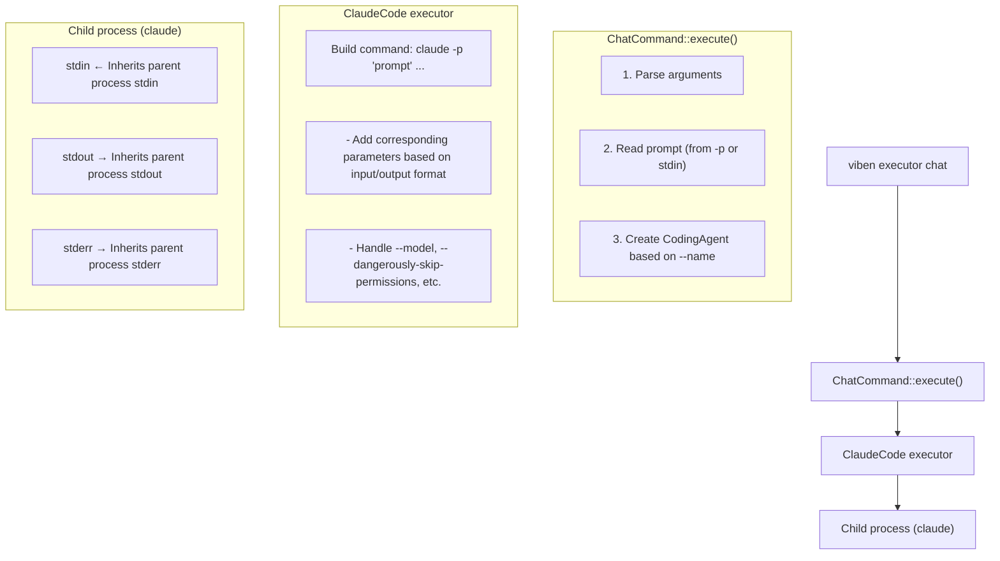

# Executor Chat Command Design

## Overview

Add a `chat` subcommand to `viben executor`, supporting non-interactive invocation of AI coding agents (such as Claude Code), providing the same input/output experience as `claude -p`.

## Command Interface

```
viben executor chat [OPTIONS] -n <EXECUTOR_NAME>

OPTIONS:
    -n, --name <NAME>           Executor name (e.g., CLAUDE_CODE, GEMINI)
    -p, --prompt <PROMPT>       Prompt (optional, reads from stdin if not provided)
    -C, --cwd <DIR>             Working directory (defaults to current directory)

    --input-format <FORMAT>     Input format: text (default), stream-json
    --output-format <FORMAT>    Output format: text (default), stream-json
    --verbose                   Verbose output

    --session-id <ID>           Specify session ID
    --resume <SESSION_ID>       Resume existing session

    --model <MODEL>             Specify model (when supported by executor)
    --dangerously-skip-permissions  Skip permission checks
```

## Usage Examples

```bash
# Basic usage
viben executor chat -n CLAUDE_CODE -p "Analyze this code"

# Read plain text from stdin
echo "Write a sorting function" | viben executor chat -n CLAUDE_CODE

# JSON stream input/output (for programmatic invocation)
echo '{"type":"user","message":{"role":"user","content":"Analyze code"}}' | \
  viben executor chat -n CLAUDE_CODE --input-format stream-json --output-format stream-json

# Resume session
viben executor chat -n CLAUDE_CODE -p "Continue the previous work" --resume abc123
```

## Data Flow Architecture



## Code Implementation

### 1. ChatOptions Interface

File: `packages/core/src/cli/commands/executor.ts`

```typescript
// ExecutorAction chat subcommand
export interface ChatOptions {
  name: string;           // Executor name (e.g., CLAUDE_CODE, GEMINI)
  prompt?: string;        // Prompt (optional, reads from stdin if not provided)
  cwd?: string;           // Working directory (defaults to current directory)
  inputFormat?: string;   // Input format: text (default), stream-json
  outputFormat?: string;  // Output format: text (default), stream-json
  verbose?: boolean;      // Verbose output
  sessionId?: string;     // Specify session ID
  resume?: string;        // Resume existing session
  model?: string;         // Specify model (when supported by executor)
  dangerouslySkipPermissions?: boolean;  // Skip permission checks
}
```

### 2. executeChat Function

```typescript
// packages/core/src/cli/commands/executor.ts
export async function executeChat(options: ChatOptions): Promise<void> {
  // 1. Determine working directory
  const workDir = options.cwd || process.cwd();

  // 2. Read prompt (-p takes priority, otherwise from stdin)
  let prompt = options.prompt;
  if (!prompt) {
    prompt = await readStdin();
  }

  // 3. Create executor based on name (using spawnChat)
  const result = await spawnChat(options.name, {
    prompt,
    cwd: workDir,
    inputFormat: options.inputFormat || 'text',
    outputFormat: options.outputFormat || 'text',
    verbose: options.verbose,
    sessionId: options.sessionId,
    resume: options.resume,
    model: options.model,
    dangerouslySkipPermissions: options.dangerouslySkipPermissions,
  });

  // 4. Wait for exit and return status code
  process.exit(result.exitCode);
}
```

### 3. spawnChat Function

Reference the `spawnChat` function implementation in `packages/core/src/executors/chat.ts`:

```typescript
// packages/core/src/executors/chat.ts
export async function spawnChat(
  executorType: string,
  options: ChatOptions
): Promise<ChatSpawnResult> {
  // Check if executor supports chat
  if (!executorSupportsChat(executorType)) {
    throw new ExecutorError(`Chat not supported for executor: ${executorType}`);
  }

  // Create executor instance
  const executor = createExecutor(executorType);

  // Build command arguments
  const args = buildChatArgs(options);

  // Spawn child process, inherit IO
  const child = spawn(executor.command, args, {
    cwd: options.cwd,
    stdio: 'inherit',
  });

  // Wait for exit
  const exitCode = await new Promise<number>((resolve) => {
    child.on('exit', (code) => resolve(code ?? 1));
  });

  return { exitCode };
}
```

### 4. Error Type Extension

File: `packages/core/src/error.ts`

```typescript
export class ExecutorError extends VibenError {
  constructor(message: string) {
    super(message, 'EXECUTOR_ERROR');
  }

  static chatNotSupported(executor: string): ExecutorError {
    return new ExecutorError(`Chat not supported for executor: ${executor}`);
  }

  static noPromptProvided(): ExecutorError {
    return new ExecutorError('No prompt provided and stdin is empty');
  }
}
```

### 5. Chat Support Check

File: `packages/core/src/executors/chat.ts`

```typescript
// Executor types that support chat
export const CHAT_SUPPORTED_EXECUTORS = ['CLAUDE_CODE', 'GEMINI', 'CODEX'] as const;

export function executorSupportsChat(executorType: string): boolean {
  return CHAT_SUPPORTED_EXECUTORS.includes(
    executorType.toUpperCase() as typeof CHAT_SUPPORTED_EXECUTORS[number]
  );
}
```

## File Changes Summary

| File | Changes |
|------|---------|
| `packages/core/src/cli/commands/executor.ts` | Add `chat` subcommand and `executeChat` function |
| `packages/core/src/error.ts` | Add `ExecutorError.chatNotSupported`, `noPromptProvided` methods |
| `packages/core/src/executors/chat.ts` | Add `executorSupportsChat()`, `spawnChat()` functions |

## Design Decisions

1. **Direct use of `claude` command** - Assumes user has Claude Code CLI installed, rather than installing via npx temporarily
2. **IO passthrough** - Use `Stdio::inherit()` to maintain identical input/output experience with claude
3. **Safe permissions by default** - Follow claude code's design, permission checks required by default
4. **Extensible architecture** - Support adding other executors in the future through `supports_chat()` and `chat_command()` methods
