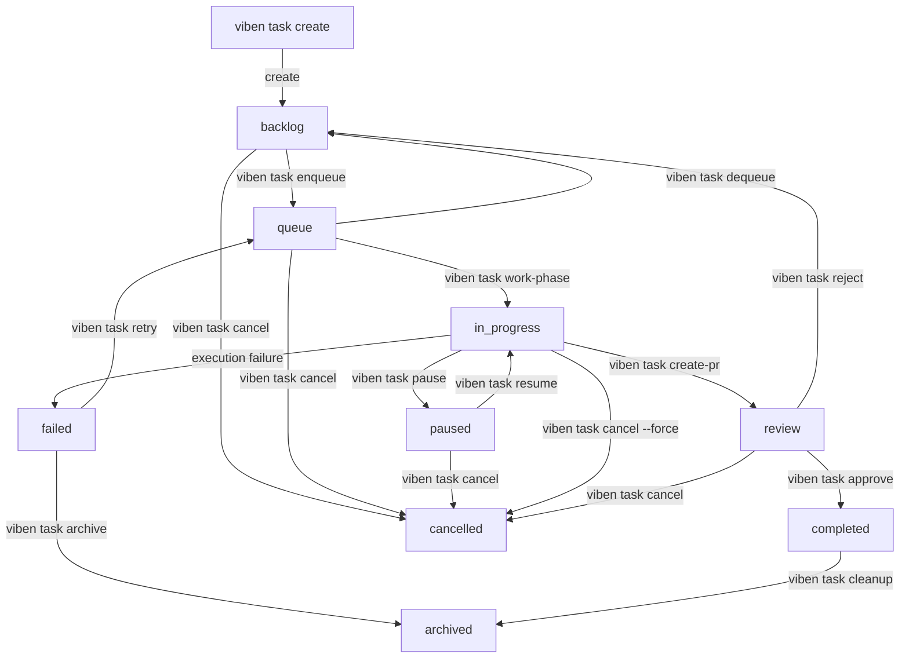
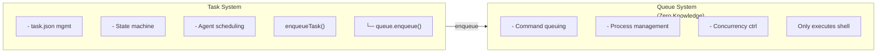

# viben task

Task management command with full lifecycle management support.

## Overview

The `viben task` command is used to manage development tasks, including task creation, configuration, context management, planning, and monitoring.

## Command Structure

```bash
viben task <subcommand> [options]
```

## Subcommand Overview

| Subcommand | Description |
|------------|-------------|
| `list` | List tasks |
| `create` | Create a new task |
| `view` | View task details |
| `edit` | Edit a task |
| `delete` | Delete a task |
| `finish` | Complete a task |
| `archive` | Archive a task |
| `list-archive` | List archived tasks |
| `enqueue` | Enqueue a task |
| `dequeue` | Remove from queue |
| `pause` | Pause a task |
| `resume` | Resume a task |
| `review` | View tasks pending review |
| `approve` | Approve completion |
| `reject` | Reject and rework |
| `retry` | Retry a failed task |
| `cancel` | Cancel a task |
| `stop` | Alias for cancel |
| `start` | Start task execution |
| `plan-phase` | Run Plan phase |
| `work-phase` | Run Work phase |
| `implement-phase` | Run Implement phase |
| `check-phase` | Run Check phase |
| `status` | View task status |
| `create-pr` | Create a Pull Request |
| `set-branch` | Set task branch name |
| `set-base` | Set base branch for PR |
| `set-agent` | Set agent configuration |
| `create-worktree` | Create git worktree for task |
| `validate-check-phase-passed` | Validate check phase passed |
| `check-stuck` | Check if task is stuck |
| `cleanup` | Clean up worktree and resources |

## Task CRUD

### List Tasks

```bash
viben task list [--mine] [--status <status>] [--json]
```

**Options**:

| Option | Description |
|--------|-------------|
| `--mine`, `-m` | Show only tasks assigned to the current developer |
| `--status`, `-s` | Filter by status (backlog, in_progress, completed) |
| `--json` | JSON format output |

**Examples**:

```bash
viben task list
viben task list --mine
viben task list --status in_progress --json
```

### Create Task

```bash
viben task create <title> [options]
```

**Options**:

| Option | Description |
|--------|-------------|
| `--slug <name>` | Task identifier, defaults to generated from title |
| `--assignee <dev>` | Assign to whom, defaults to current developer |
| `--priority <P0-P3>` | Priority, defaults to P2 |
| `--agent <agent-id>` | Associated agent configuration |

**Examples**:

```bash
viben task create "Add user authentication"
viben task create "Fix login bug" --slug fix-login --priority P1
viben task create "Implement API" --assignee john --agent coding-assistant
```

### View Task

```bash
viben task view <task>
```

**Examples**:

```bash
viben task view add-user-auth
viben task view .viben/tasks/03-03-add-user-auth
```

### Edit Task

```bash
viben task edit <task>
```

### Delete Task

```bash
viben task delete <task> [--force]
```

## Status Lifecycle Management

### Design Principles

1. **Unified task_dir identifier** - All commands use the task directory name as the identifier
2. **Explicit parameters** - `viben task <command> <task>` must specify the task
3. **Local-first** - Directly operate on `task.json` and `events.jsonl`, no Gateway dependency
4. **Atomic commands** - Each command is responsible for a single state transition

### Command Overview

```
viben task <command> <task>

State transition commands:
  enqueue <task>     backlog -> queue        Enqueue for execution
  dequeue <task>     queue -> backlog        Remove from queue
  pause <task>       in_progress -> paused   Pause execution
  resume <task>      paused -> restore       Resume execution
  review <task>      Display review info     View task pending review
  approve <task>     review -> completed     Approve completion
  reject <task>      review -> backlog       Reject and rework
  retry <task>       failed -> queue         Retry failed task
  cancel <task>      * -> cancelled          Cancel task
  stop <task>        Alias for cancel
```

### Enqueue Task

Move a task from backlog status to queue status and submit it to the Command Queue system.

```bash
viben task enqueue <task> [options]
```

**Options**:

| Option | Description |
|--------|-------------|
| `--agent <id>` | Execution agent ID |
| `--executor <type>` | Executor type (CLAUDE_CODE, CURSOR, OPENCODE, etc.) |
| `--model <id>` | Model ID |
| `--priority <p>` | Priority (P0/P1/P2/P3) |
| `--skip-queue` | Only update status, don't submit to queue system |

**Behavior**:

1. Validates task status is `backlog`
2. Sets `agent/executor/model` (if specified, locked after enqueue)
3. Sets `queuedAt` timestamp (used for FIFO ordering)
4. Status transition: `backlog` -> `queue`
5. Writes `QUEUE` event to `events.jsonl`

**Examples**:

```bash
# Basic enqueue - submits to command queue
viben task enqueue 03-10-feature-xyz

# Specify execution configuration
viben task enqueue 03-10-feature-xyz --agent my-agent --executor CLAUDE_CODE --model claude-sonnet-4-20250514

# Only update status without submitting to queue
viben task enqueue 03-10-feature-xyz --skip-queue
```

**How It Works**:

When you run `viben task enqueue`, the following happens:

1. Task status is updated from `backlog` to `queue`
2. The command `viben task start <task>` is submitted to the Command Queue system
3. The queue task ID is saved to `task.json` as `queue_id`
4. The queue system executes the command when capacity is available

```bash
# View the queue status
viben queue status

# View queue task list
viben queue list
# ID              STATUS   COMMAND                          CWD
# q_7kA9OXDz71T7  pending  viben task start my-feature      /path/to/repo

# View task.json
cat .viben/tasks/03-15-my-feature/task.json
# {
#   "status": "queue",
#   "queue_id": "q_7kA9OXDz71T7",
#   ...
# }
```

### Dequeue Task

Remove a task from the queue and return it to backlog status.

```bash
viben task dequeue <task>
```

**Behavior**:

1. Validates status is `queue`
2. Clears `queuedAt`
3. Status transition: `queue` -> `backlog`
4. Writes `DEQUEUE` event

**Examples**:

```bash
# Dequeue via task system
viben task dequeue my-feature

# Alternative: cancel via queue system directly
viben queue cancel q_7kA9OXDz71T7
```

### Pause Task

Pause an executing or queued task.

```bash
viben task pause <task>
```

**Behavior**:

1. Validates status is `in_progress` or `queue`
2. Saves `pausedSnapshot`:
   ```json
   {
     "fromState": "in_progress",
     "subtaskIndex": 2,
     "pausedAt": "2026-03-11T10:00:00Z"
   }
   ```
3. Status transition: `in_progress`/`queue` -> `paused`
4. Writes `PAUSE` event

### Resume Task

Resume a paused task.

```bash
viben task resume <task>
```

**Behavior**:

1. Validates status is `paused`
2. Reads `pausedSnapshot.fromState`
3. Restores to the state before pause
4. Clears `pausedSnapshot`
5. Writes `RESUME` event

### View Tasks Pending Review

View detailed information about a task pending review.

```bash
viben task review <task>
```

**Behavior**:

1. Reads `task.json`
2. If `pr_url` exists, fetches PR statistics (via `gh` CLI)
3. Displays task details and next-step action hints

**Output**:

```
=== Task Review: 03-10-feature-xyz ===

Title:    Implement user authentication feature
Status:   review
Priority: P1

PR URL:   https://github.com/org/repo/pull/123
Branch:   feature/03-10-feature-xyz

Files Changed: 12
+425 -89

Next steps:
  viben task approve 03-10-feature-xyz   # Approve completion
  viben task reject 03-10-feature-xyz    # Reject and rework
```

### Approve Task

Approve a task as completed.

```bash
viben task approve <task>
```

**Behavior**:

1. Validates status is `review`
2. Sets `completedAt` to current time
3. Status transition: `review` -> `completed`
4. Writes `APPROVED` event

### Reject Task

Reject a task and return it to backlog for rework.

```bash
viben task reject <task> [--reason <text>]
```

**Behavior**:

1. Validates status is `review`
2. Clears `pr_url` (PR may need to be closed or resubmitted)
3. Records `reviewReason: "rejected"` and `rejectReason` (if specified)
4. Status transition: `review` -> `backlog`
5. Writes `REJECTED` event

### Retry Task

Retry a failed task by re-enqueuing it.

```bash
viben task retry <task>
```

**Behavior**:

1. Validates status is `failed`
2. Clears error-related fields
3. Re-sets `queuedAt`
4. Status transition: `failed` -> `queue`
5. Writes `RETRY` event

### Cancel Task

Cancel a task, moving it directly to the `cancelled` terminal state.

```bash
viben task cancel <task> [--reason <text>] [--force]
viben task stop <task>   # Alias for cancel
```

**Options**:

| Option | Description |
|--------|-------------|
| `--reason <text>` | Cancellation reason (optional) |
| `--force`, `-f` | Force cancel tasks in in_progress status |

**Behavior**:

1. Validates task status is in the allowed list: `backlog`, `queue`, `paused`, `in_progress`, `review`
2. If status is `in_progress` and `--force` is not specified, exits with error:
   ```
   Error: Task is in_progress. Use --force to cancel a running task.
   ```
3. Records `cancelReason` (if specified)
4. Sets `cancelledAt` to current time
5. Status transition -> `cancelled`
6. Writes `CANCEL` event to `events.jsonl`

**Statuses that cannot be cancelled**:
- `completed` - Already completed, use archive instead
- `failed` - Already failed, use retry or archive instead
- `cancelled` - Already cancelled

## Task Execution

### Execution Architecture

Task execution uses a layered architecture:

```
+---------------------------------------------------------------------------------+
|                           TASK EXECUTION LIFECYCLE                               |
+---------------------------------------------------------------------------------+
|                                                                                 |
|  [Start] viben task start <task>                                                |
|       |                                                                         |
|       v                                                                         |
|  startTask() --> Read start.md as prompt --> AI executes the following flow:     |
|       |                                                                         |
|       |   +-------------------------------------------------------------+       |
|       |   |  start.md Flow (AI execution)                               |       |
|       |   +-------------------------------------------------------------+       |
|       |   |                                                             |       |
|       |   |  Phase 1: Plan                                              |       |
|       |   |       |                                                     |       |
|       |   |       v                                                     |       |
|       |   |  viben task plan-phase --> Plan Agent                       |       |
|       |   |       +-- Validate requirement                              |       |
|       |   |       +-- Research codebase                                 |       |
|       |   |       +-- Configure context (jsonl)                         |       |
|       |   |       +-- Write prd.md                                      |       |
|       |   |                                                             |       |
|       |   |  Phase 2: Work                                              |       |
|       |   |       |                                                     |       |
|       |   |       v                                                     |       |
|       |   |  viben task work-phase --> Work Agent                       |       |
|       |   |       |                                                     |       |
|       |   |       |   [Auto-create worktree when worktree=true          |       |
|       |   |       |    or branch is set]                                |       |
|       |   |       |                                                     |       |
|       |   |       +-- Dispatch sub-agents (in next_action order):       |       |
|       |   |               +-- Task(implement) --> Implement code        |       |
|       |   |               +-- Task(check)     --> Check code            |       |
|       |   |               +-- Task(finish)    --> Final verification    |       |
|       |   |                                                             |       |
|       |   |  Phase 3: Create PR (worktree mode)                         |       |
|       |   |       +-- viben task create-pr --> Create PR                |       |
|       |   |                                                             |       |
|       |   |  Phase 4: Report Status                                     |       |
|       |   |       +-- Output monitoring commands                        |       |
|       |   |                                                             |       |
|       |   +-------------------------------------------------------------+       |
|       |                                                                         |
|       v                                                                         |
|  status: in_progress -> review                                                  |
|                                                                                 |
+---------------------------------------------------------------------------------+
```

### Command Classification

| Command | Nature | Description |
|---------|--------|-------------|
| `viben task start` | **Standard entry point** | Executes full flow (plan -> work -> report) |
| `viben task plan-phase` | Phase command | Called by start internally, also usable standalone |
| `viben task work-phase` | Phase command | Called by start internally, also usable standalone |
| `viben task implement-phase` | Phase command | Called by work internally, also usable standalone |
| `viben task check-phase` | Phase command | Called by work internally, also usable standalone |
| `viben task create-worktree` | Utility command | Create worktree independently |

### Start Task

```bash
viben task start <task> [options]
```

**Options**:

| Option | Description |
|--------|-------------|
| `--executor <type>` | Executor type (CLAUDE_CODE, CURSOR, OPENCODE, etc.) |
| `--detach` | Run in background |
| `--worktree` | Run in an isolated git worktree (parallel mode) |
| `--resume` | Resume an existing agent session |
| `--session <id>` | Specify session-id (used with --resume) |

**Execution Flow**:
1. Call `startTask()` (phase/start.ts)
2. Read `/viben:start` command content (start.md)
3. Send to Claude as a prompt
4. AI executes the flow defined in start.md:
   - Phase 1: `viben task plan-phase` -> Plan Agent
   - Phase 2: `viben task work-phase` -> Work Agent
   - Phase 3: Report Status
5. Register agent to registry

**Examples**:

```bash
viben task start add-user-auth
viben task start add-user-auth --executor CURSOR
viben task start add-user-auth --resume
```

### Plan Phase

Run the Plan Phase, launching the Plan Agent to plan the task.

```bash
viben task plan-phase <task> [options]
```

**Options**:

| Option | Description |
|--------|-------------|
| `-p, --platform <platform>` | Platform (claude, cursor, iflow, opencode), default claude |
| `-v, --verbose` | Enable verbose output |

**Preconditions**:
- `task.json` must exist
- `title` or `description` field serves as the requirement

**Plan Agent Flow**:
1. Evaluate the requirement (may reject unclear or overly large requirements)
2. Call research agent to analyze the codebase
3. Configure context files (implement.jsonl, check.jsonl, fix.jsonl)
4. Generate prd.md requirements document
5. Set branch name

**Examples**:

```bash
viben task plan-phase 03-11-user-auth
viben task plan-phase 03-11-user-auth --platform cursor
```

### Work Phase

Run the Work Phase, launching the Work Agent to execute the task.

```bash
viben task work-phase <task> [options]
```

**Options**:

| Option | Description |
|--------|-------------|
| `-p, --platform <platform>` | Platform (claude, cursor, iflow, opencode), default claude |
| `-v, --verbose` | Enable verbose output |
| `--no-detach` | Run in foreground (default is background) |

**Preconditions**:
- `task.json` must exist
- `prd.md` must exist (plan phase completed)
- `work` agent must exist

**Automatic Worktree Creation**:

When `task.json` has `worktree=true` or a `branch` field, a git worktree is automatically created.

**Work Agent Flow**:
1. Reads `next_action` array from `task.json`
2. Executes each action in order:
   - `implement` -> calls implement agent
   - `check` -> calls check agent
   - `fix` -> calls fix agent
   - `finish` -> calls check agent (with [finish] marker)

:::note
`create-pr` and `compute-reward` are called by the **start agent** in the main repo, not handled by the work agent.
:::

**Examples**:

```bash
viben task work-phase 03-11-user-auth
viben task work-phase 03-11-user-auth --platform cursor
```

### Implement Phase

Run the Implement Phase directly (standalone usage).

```bash
viben task implement-phase <task> [options]
```

**Options**:

| Option | Description |
|--------|-------------|
| `-p, --platform <platform>` | Platform (claude, cursor, iflow, opencode), default claude |
| `-v, --verbose` | Enable verbose output |

**Preconditions**:
- `task.json` must exist
- `prd.md` must exist
- `implement` agent must exist
- `implement.jsonl` optional (provides code-spec file list)

**Examples**:

```bash
viben task implement-phase 03-11-user-auth
```

### Check Phase

Run the Check Phase directly (standalone usage).

```bash
viben task check-phase <task> [options]
```

**Options**:

| Option | Description |
|--------|-------------|
| `-p, --platform <platform>` | Platform (claude, cursor, iflow, opencode), default claude |
| `-v, --verbose` | Enable verbose output |

**Preconditions**:
- `task.json` must exist
- `prd.md` must exist
- `check` agent must exist
- `check.jsonl` optional (provides code-spec file list)

**Examples**:

```bash
viben task check-phase 03-11-user-auth
```

### View Status

```bash
# View all task statuses
viben task status

# View specific task status
viben task status <task> [--detail] [--watch] [--log]
```

**Options**:

| Option | Description |
|--------|-------------|
| `--assignee`, `-a` | Filter by assignee |
| `--status`, `-s` | Filter by status |
| `--running` | Show only tasks with running agents |
| `--json` | JSON format output |
| `--detail` | Show detailed status |
| `--watch` | Real-time monitoring of agent logs |
| `--log` | Show recent log entries |

### Create PR

```bash
viben task create-pr <task> [--dry-run]
```

## Task Configuration

### Set Branch

Set the Git branch name for a task.

```bash
viben task set-branch <task> --branch <branch-name>
```

**Options**:

| Option | Description |
|--------|-------------|
| `--branch <name>` | Branch name to set |

**Examples**:

```bash
viben task set-branch add-user-auth --branch feature/user-auth
```

### Set Base Branch

Set the PR target (base) branch for a task.

```bash
viben task set-base <task> --branch <branch-name>
```

**Options**:

| Option | Description |
|--------|-------------|
| `--branch <name>` | Base branch name |

**Examples**:

```bash
viben task set-base add-user-auth --branch develop
```

### Set Agent

Set the associated agent configuration for a task.

```bash
viben task set-agent <task> --agent <agent-id>
```

**Options**:

| Option | Description |
|--------|-------------|
| `--agent <id>` | Agent ID to associate |

**Examples**:

```bash
viben task set-agent add-user-auth --agent coding-assistant
```

## Worktree Management

### Create Worktree

Create an isolated git worktree for a task.

```bash
viben task create-worktree <task> [--skip-prd]
```

**Options**:

| Option | Description |
|--------|-------------|
| `--skip-prd` | Skip prd.md validation |

**How It Works**:

1. Validates task status (rejected tasks cannot create worktrees)
2. Checks that `prd.md` exists (unless `--skip-prd`)
3. Creates a git worktree and sets up the branch
4. Updates `task.json` with the `worktree_path`

**Examples**:

```bash
viben task create-worktree 03-11-user-auth
viben task create-worktree 03-11-user-auth --skip-prd
```

## Validation

### Validate Check Phase Passed

Validate that the check phase has passed for a task.

```bash
viben task validate-check-phase-passed <task> [options]
```

**Options**:

| Option | Description |
|--------|-------------|
| `-o, --output <text>` | Agent output text (for completion markers validation) |
| `-f, --output-file <file>` | File containing agent output |

**Validation Methods**:

1. `verify_commands` - Runs verification commands to check
2. `completion_markers` - Checks output for completion markers

**Examples**:

```bash
viben task validate-check-phase-passed 03-11-user-auth
viben task validate-check-phase-passed 03-11-user-auth -f .check-log
```

## Stuck Detection

### Check Stuck

Detect whether a task is stuck (detection only, does not perform recovery).

```bash
viben task check-stuck <task> [options]
```

**Options**:

| Option | Description |
|--------|-------------|
| `-t, --threshold <ms>` | Stuck threshold in milliseconds (default: 120000 / 2 minutes) |
| `-v, --verbose` | Show detailed detection data |
| `--json` | JSON format output |

**Detection Mechanism**:

The command runs 4 checks to determine if a task is stuck:

| Check | Description | Stuck Condition |
|-------|-------------|-----------------|
| `status` | Task status check | Only `in_progress` or `queue` states can be stuck |
| `event_timestamp` | Event timestamp | No new events beyond threshold |
| `process` | Agent process status | PID process does not exist |
| `log_activity` | Log activity | Log file not modified for extended period |

**Stuck Determination Logic**:

```
isStuck = process_not_running OR (event_timeout AND log_inactive)
```

- Process not running -> determined stuck
- Event timeout AND log inactive -> determined stuck

**Output Example**:

```
=== Stuck Check: 03-11-feature-xyz ===

Status: STUCK
  Task appears stuck: process not running, no recent events

Checks:
  ok status: Task is in active state: in_progress
  FAIL event_timestamp: No events for 5m 32s (threshold: 2m)
  FAIL process: Agent process not running (PID: 12345)
  FAIL log_activity: Log file not modified for 5m 30s

Task Info:
  Status:   in_progress
  Assignee: john
  Last Event: AGENT_OUTPUT_CHUNK @ 2026-03-11T10:00:00Z
  Updated:  2026-03-11T10:00:00Z
```

**JSON Output**:

```json
{
  "success": true,
  "data": {
    "success": true,
    "taskDir": "03-11-feature-xyz",
    "isStuck": true,
    "summary": "Task appears stuck: process not running, no recent events",
    "checks": [
      {
        "name": "status",
        "isStuck": false,
        "reason": "Task is in active state: in_progress"
      },
      {
        "name": "event_timestamp",
        "isStuck": true,
        "reason": "No events for 5m 32s (threshold: 2m)"
      },
      {
        "name": "process",
        "isStuck": true,
        "reason": "Agent process not running (PID: 12345)"
      },
      {
        "name": "log_activity",
        "isStuck": true,
        "reason": "Log file not modified for 5m 30s"
      }
    ]
  }
}
```

**Examples**:

```bash
# Basic check
viben task check-stuck 03-11-feature-xyz

# Custom threshold (5 minutes)
viben task check-stuck 03-11-feature-xyz -t 300000

# Verbose output
viben task check-stuck 03-11-feature-xyz --verbose

# JSON output (for scripts or API)
viben task check-stuck 03-11-feature-xyz --json
```

:::note
The `check-stuck` command only detects stuck tasks. Automatic recovery is handled by the Gateway's `TaskRecoveryService`.
:::

## Context Management

### Initialize Context

```bash
viben task init-context <task>
```

Creates `implement.jsonl`, `check.jsonl`, and `fix.jsonl` files.

### Add Context

```bash
viben task add-context <task> <file>... [--reason <text>] [--recursive]
```

**Examples**:

```bash
viben task add-context add-user-auth src/auth/
viben task add-context add-user-auth docs/api.md --reason "API reference documentation"
```

### Remove Context

```bash
viben task remove-context <task> <file>...
```

### List Context

```bash
viben task list-context <task>
```

### Validate Context

```bash
viben task validate-context <task>
```

## Archive Management

### Complete Task

```bash
viben task finish <task>
```

### Archive Task

```bash
viben task archive <task>
```

The task will be moved to the `archive/YYYY-MM/` directory.

### List Archived Tasks

```bash
viben task list-archive [YYYY-MM]
```

### Clean Up Worktree

```bash
# Clean up worktree for a specific branch
viben task cleanup <branch> [--keep-branch] [--yes]

# Clean up merged worktrees
viben task cleanup --merged [--yes]

# Clean up all worktrees
viben task cleanup --all [--yes]

# List all worktrees
viben task cleanup --list
```

## State Lifecycle Diagram



## Status Transitions

| Command | Allowed Starting Status | Target Status |
|---------|------------------------|---------------|
| enqueue | backlog | queue |
| dequeue | queue | backlog |
| pause | queue, in_progress | paused |
| resume | paused | queue or in_progress |
| approve | review | completed |
| reject | review | backlog |
| retry | failed | queue |
| cancel / stop | backlog, queue, paused, in_progress*, review | cancelled |

> *`in_progress` status requires the `--force` parameter

## Task Directory Structure

```
.viben/tasks/
├── 03-03-add-user-auth/
│   ├── task.json           # Task metadata
│   ├── prd.md              # Product Requirements Document (generated by Plan Agent)
│   ├── implement.jsonl     # Implementation phase context
│   ├── check.jsonl         # Check phase context
│   ├── fix.jsonl           # Fix phase context
│   └── .plan-log           # Plan Agent log
└── archive/
    └── 2024-02/
        └── 02-15-old-task/
```

## task.json Format

```json
{
  "id": "add-user-auth",
  "name": "add-user-auth",
  "title": "Add user authentication",
  "description": "",
  "status": "backlog",
  "priority": "P2",
  "creator": "john",
  "assignee": "john",
  "createdAt": "2024-03-03",
  "completedAt": null,
  "branch": "feature/user-auth",
  "base_branch": "main",
  "worktree_path": null,
  "current_phase": 0,
  "next_action": [
    {"phase": 1, "action": "implement"},
    {"phase": 2, "action": "check"},
    {"phase": 3, "action": "finish"}
  ],
  "commit": null,
  "pr_url": null,
  "subtasks": [],
  "relatedFiles": [],
  "notes": ""
}
```

## Task + Queue Integration

The Task system integrates with the Command Queue system to enable queued task execution with concurrency control and background processing.

### Architecture

**Key Principle**: The Queue system has zero knowledge of the Task system. Queue only executes shell commands and doesn't understand task semantics.



### Data Flow

When you run `viben task enqueue <task>`:

1. Task status is updated to `queue` in `task.json`
2. Queue system receives command: `viben task start <task>`
3. Queue ID is saved to `task.json`

When the Queue system executes the command:

1. `viben task start` updates status to `in_progress`
2. Agent executes the task
3. On completion, status becomes `completed` or `failed`

### Status Mapping

| Task Status | Queue Status | Description |
|-------------|--------------|-------------|
| `backlog` | - | Task not submitted to queue |
| `queue` | `pending` | Task waiting for execution |
| `in_progress` | `running` | Task currently executing |
| `completed` | `completed` (exit 0) | Task completed successfully |
| `failed` | `completed` (exit != 0) | Task execution failed |

### task.json Queue Field

When a task is enqueued, the `queue_id` field is added to `task.json`:

```json
{
  "id": "my-feature",
  "status": "queue",
  "queue_id": "q_7kA9OXDz71T7",
  ...
}
```

### Workflow Example

```bash
# 1. Create task
viben task create "My feature" --slug my-feature

# 2. Submit to queue
viben task enqueue my-feature

# 3. View queue status
viben queue status
# Queue Status
# ────────────────────────────────────────
#   Pending:     1 task(s)
#   Running:     0 / 3 (max concurrency)

# 4. View queue list
viben queue list
# ID              STATUS   COMMAND                          CWD
# q_7kA9OXDz71T7  pending  viben task start my-feature      /path/to/repo

# 5. Monitor execution
viben queue logs q_7kA9OXDz71T7 --follow

# 6. View task status
viben task status my-feature
```

### Direct Execution (Skip Queue)

To execute a task immediately without going through the queue:

```bash
# Option 1: Use --skip-queue flag
viben task enqueue my-feature --skip-queue
viben task start my-feature

# Option 2: Use start directly
viben task start my-feature
```

## Related Commands

- [viben queue](./queue) - Command queue management
- [viben swarm](./swarm) - Agent swarm scheduling
- [viben session](./session) - Session record management
- [viben evo](./evo) - File-based Self-Evolution
