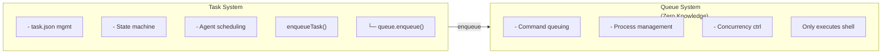

# viben task

Task management command with full lifecycle management support.

## Overview

The `viben task` command is used to manage development tasks, including task creation, configuration, context management, planning, and monitoring.

## Command Structure

```bash
viben task <subcommand> [options]
```

## Subcommand Overview

| Subcommand | Description |
|------------|-------------|
| `list` | List tasks |
| `create` | Create a new task |
| `view` | View task details |
| `edit` | Edit a task |
| `delete` | Delete a task |
| `finish` | Complete a task |
| `archive` | Archive a task |
| `list-archive` | List archived tasks |
| `enqueue` | Enqueue a task |
| `dequeue` | Remove from queue |
| `pause` | Pause a task |
| `resume` | Resume a task |
| `review` | View tasks pending review |
| `approve` | Approve completion |
| `reject` | Reject and rework |
| `retry` | Retry a failed task |
| `cancel` | Cancel a task |
| `start` | Start task execution |
| `status` | View task status |
| `create-pr` | Create a Pull Request |

## Task CRUD

### List Tasks

```bash
viben task list [--mine] [--status <status>] [--json]
```

**Options**:

| Option | Description |
|--------|-------------|
| `--mine`, `-m` | Show only tasks assigned to the current developer |
| `--status`, `-s` | Filter by status (backlog, in_progress, completed) |
| `--json` | JSON format output |

**Examples**:

```bash
viben task list
viben task list --mine
viben task list --status in_progress --json
```

### Create Task

```bash
viben task create <title> [options]
```

**Options**:

| Option | Description |
|--------|-------------|
| `--slug <name>` | Task identifier, defaults to generated from title |
| `--assignee <dev>` | Assign to whom, defaults to current developer |
| `--priority <P0-P3>` | Priority, defaults to P2 |
| `--agent <agent-id>` | Associated agent configuration |

**Examples**:

```bash
viben task create "Add user authentication"
viben task create "Fix login bug" --slug fix-login --priority P1
viben task create "Implement API" --assignee john --agent coding-assistant
```

### View Task

```bash
viben task view <task>
```

**Examples**:

```bash
viben task view add-user-auth
viben task view .viben/tasks/03-03-add-user-auth
```

### Edit Task

```bash
viben task edit <task>
```

### Delete Task

```bash
viben task delete <task> [--force]
```

## Status Lifecycle Management

### Enqueue Task

Move a task from backlog status to queue status and submit it to the Command Queue system.

```bash
viben task enqueue <task> [options]
```

**Options**:

| Option | Description |
|--------|-------------|
| `--agent <id>` | Execution agent ID |
| `--executor <type>` | Executor type (CLAUDE_CODE, CURSOR, OPENCODE, etc.) |
| `--model <id>` | Model ID |
| `--priority <p>` | Priority (P0/P1/P2/P3) |
| `--skip-queue` | Only update status, don't submit to queue system |

**Examples**:

```bash
# Basic enqueue - submits to command queue
viben task enqueue 03-10-feature-xyz

# Specify execution configuration
viben task enqueue 03-10-feature-xyz --agent my-agent --executor CLAUDE_CODE

# Only update status without submitting to queue
viben task enqueue 03-10-feature-xyz --skip-queue
```

**How It Works**:

When you run `viben task enqueue`, the following happens:

1. Task status is updated from `backlog` to `queue`
2. The command `viben task start <task>` is submitted to the Command Queue system
3. The queue task ID is saved to `task.json` as `queue_id`
4. The queue system executes the command when capacity is available

```bash
# View the queue status
viben queue status

# View queue task list
viben queue list
# ID              STATUS   COMMAND                          CWD
# q_7kA9OXDz71T7  pending  viben task start my-feature      /path/to/repo

# View task.json
cat .viben/tasks/03-15-my-feature/task.json
# {
#   "status": "queue",
#   "queue_id": "q_7kA9OXDz71T7",
#   ...
# }
```

### Dequeue Task

Remove a task from the queue and return it to backlog status.

```bash
viben task dequeue <task>
```

**Examples**:

```bash
# Dequeue via task system
viben task dequeue my-feature

# Alternative: cancel via queue system directly
viben queue cancel q_7kA9OXDz71T7
```

### Pause Task

```bash
viben task pause <task>
```

### Resume Task

```bash
viben task resume <task>
```

### View Tasks Pending Review

```bash
viben task review <task>
```

**Output**:

```
=== Task Review: 03-10-feature-xyz ===

Title:    Implement user authentication feature
Status:   review
Priority: P1

PR URL:   https://github.com/org/repo/pull/123
Branch:   feature/03-10-feature-xyz

Files Changed: 12
+425 -89

Next steps:
  viben task approve 03-10-feature-xyz   # Approve completion
  viben task reject 03-10-feature-xyz    # Reject and rework
```

### Approve Task

```bash
viben task approve <task>
```

### Reject Task

```bash
viben task reject <task> [--reason <text>]
```

### Retry Task

```bash
viben task retry <task>
```

### Cancel Task

```bash
viben task cancel <task> [--reason <text>] [--force]
viben task stop <task>   # Alias for cancel
```

**Options**:

| Option | Description |
|--------|-------------|
| `--reason <text>` | Cancellation reason |
| `--force`, `-f` | Force cancel tasks in in_progress status |

## Task Execution

### Start Task

```bash
viben task start <task> [options]
```

**Options**:

| Option | Description |
|--------|-------------|
| `--executor <type>` | Executor type |
| `--detach` | Run in background |
| `--worktree` | Run in an isolated git worktree |
| `--resume` | Resume an existing agent session |
| `--session <id>` | Specify session-id |

**Execution Flow**:
1. Call Plan Agent to plan the task
2. Call Work Agent to execute the task
3. Automatically create worktree (if configured)
4. Enter review status upon completion

**Examples**:

```bash
viben task start add-user-auth
viben task start add-user-auth --executor CURSOR
viben task start add-user-auth --resume
```

### Phase Commands

```bash
# Run Plan phase
viben task plan-phase <task> [--platform <platform>] [--verbose]

# Run Work phase
viben task work-phase <task> [--platform <platform>] [--no-detach]

# Run Implement phase
viben task implement-phase <task>

# Run Check phase
viben task check-phase <task>
```

### View Status

```bash
# View all task statuses
viben task status

# View specific task status
viben task status <task> [--detail] [--watch] [--log]
```

**Options**:

| Option | Description |
|--------|-------------|
| `--assignee`, `-a` | Filter by assignee |
| `--status`, `-s` | Filter by status |
| `--running` | Show only tasks with running agents |
| `--json` | JSON format output |
| `--detail` | Show detailed status |
| `--watch` | Real-time monitoring of agent logs |
| `--log` | Show recent log entries |

### Create PR

```bash
viben task create-pr <task> [--dry-run]
```

## Context Management

### Initialize Context

```bash
viben task init-context <task>
```

Creates `implement.jsonl`, `check.jsonl`, and `fix.jsonl` files.

### Add Context

```bash
viben task add-context <task> <file>... [--reason <text>] [--recursive]
```

**Examples**:

```bash
viben task add-context add-user-auth src/auth/
viben task add-context add-user-auth docs/api.md --reason "API reference documentation"
```

### Remove Context

```bash
viben task remove-context <task> <file>...
```

### List Context

```bash
viben task list-context <task>
```

### Validate Context

```bash
viben task validate-context <task>
```

## Archive Management

### Complete Task

```bash
viben task finish <task>
```

### Archive Task

```bash
viben task archive <task>
```

The task will be moved to the `archive/YYYY-MM/` directory.

### List Archived Tasks

```bash
viben task list-archive [YYYY-MM]
```

### Clean Up Worktree

```bash
# Clean up worktree for a specific branch
viben task cleanup <branch> [--keep-branch] [--yes]

# Clean up merged worktrees
viben task cleanup --merged [--yes]

# Clean up all worktrees
viben task cleanup --all [--yes]

# List all worktrees
viben task cleanup --list
```

## Status Transitions

| Command | Allowed Starting Status | Target Status |
|---------|------------------------|---------------|
| enqueue | backlog | queue |
| dequeue | queue | backlog |
| pause | queue, in_progress | paused |
| resume | paused | queue or in_progress |
| approve | review | completed |
| reject | review | backlog |
| retry | failed | queue |
| cancel | backlog, queue, paused, in_progress*, review | cancelled |

> *`in_progress` status requires the `--force` parameter

## Task Directory Structure

```
.viben/tasks/
├── 03-03-add-user-auth/
│   ├── task.json           # Task metadata
│   ├── prd.md              # Product Requirements Document (generated by Plan Agent)
│   ├── implement.jsonl     # Implementation phase context
│   ├── check.jsonl         # Check phase context
│   ├── fix.jsonl           # Fix phase context
│   └── .plan-log           # Plan Agent log
└── archive/
    └── 2024-02/
        └── 02-15-old-task/
```

## task.json Format

```json
{
  "id": "add-user-auth",
  "name": "add-user-auth",
  "title": "Add user authentication",
  "description": "",
  "status": "backlog",
  "priority": "P2",
  "creator": "john",
  "assignee": "john",
  "createdAt": "2024-03-03",
  "completedAt": null,
  "branch": "feature/user-auth",
  "base_branch": "main",
  "worktree_path": null,
  "current_phase": 0,
  "next_action": [
    {"phase": 1, "action": "implement"},
    {"phase": 2, "action": "check"},
    {"phase": 3, "action": "finish"}
  ],
  "commit": null,
  "pr_url": null,
  "subtasks": [],
  "relatedFiles": [],
  "notes": ""
}
```

## Task + Queue Integration

The Task system integrates with the Command Queue system to enable queued task execution with concurrency control and background processing.

### Architecture

**Key Principle**: The Queue system has zero knowledge of the Task system. Queue only executes shell commands and doesn't understand task semantics.



### Data Flow

When you run `viben task enqueue <task>`:

1. Task status is updated to `queue` in `task.json`
2. Queue system receives command: `viben task start <task>`
3. Queue ID is saved to `task.json`

When the Queue system executes the command:

1. `viben task start` updates status to `in_progress`
2. Agent executes the task
3. On completion, status becomes `completed` or `failed`

### Status Mapping

| Task Status | Queue Status | Description |
|-------------|--------------|-------------|
| `backlog` | - | Task not submitted to queue |
| `queue` | `pending` | Task waiting for execution |
| `in_progress` | `running` | Task currently executing |
| `completed` | `completed` (exit 0) | Task completed successfully |
| `failed` | `completed` (exit != 0) | Task execution failed |

### task.json Queue Field

When a task is enqueued, the `queue_id` field is added to `task.json`:

```json
{
  "id": "my-feature",
  "status": "queue",
  "queue_id": "q_7kA9OXDz71T7",
  ...
}
```

### Workflow Example

```bash
# 1. Create task
viben task create "My feature" --slug my-feature

# 2. Submit to queue
viben task enqueue my-feature

# 3. View queue status
viben queue status
# Queue Status
# ────────────────────────────────────────
#   Pending:     1 task(s)
#   Running:     0 / 3 (max concurrency)

# 4. View queue list
viben queue list
# ID              STATUS   COMMAND                          CWD
# q_7kA9OXDz71T7  pending  viben task start my-feature      /path/to/repo

# 5. Monitor execution
viben queue logs q_7kA9OXDz71T7 --follow

# 6. View task status
viben task status my-feature
```

### Direct Execution (Skip Queue)

To execute a task immediately without going through the queue:

```bash
# Option 1: Use --skip-queue flag
viben task enqueue my-feature --skip-queue
viben task start my-feature

# Option 2: Use start directly
viben task start my-feature
```

## Related Commands

- [viben queue](./queue) - Command queue management
- [viben swarm](./swarm) - Agent swarm scheduling
- [viben session](./session) - Session record management
- [viben evo](./evo) - File-based Self-Evolution
