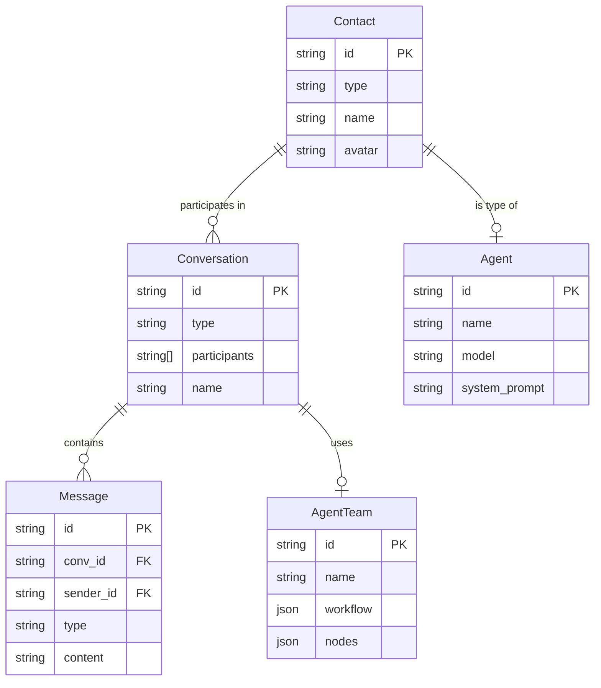

# Data Model Design

> Data structure definitions for the Social Chat module

---

## 1. Core Entities

### 1.1 Entity Relationship Diagram



---

## 2. Type Definitions

### 2.1 Contact

```typescript
// apps/desktop/src/types/social-chat.ts

/**
 * Contact type
 */
export type ContactType = "agent" | "user" | "group" | "team";

/**
 * Contact entity
 */
export interface Contact {
  id: string;
  type: ContactType;
  name: string;
  avatar?: string;
  description?: string;
  created_at: string;
  updated_at: string;

  // Type-specific fields
  agent?: AgentInfo;      // type === "agent"
  user?: UserInfo;        // type === "user"
  group?: GroupInfo;      // type === "group"
  team?: TeamInfo;        // type === "team"
}

/**
 * Agent information
 */
export interface AgentInfo {
  model: string;
  system_prompt: string;
  capabilities: AgentCapability[];
  temperature?: number;
  max_tokens?: number;
}

export type AgentCapability =
  | "web_search"
  | "code_execution"
  | "file_access"
  | "image_generation";

/**
 * User information
 */
export interface UserInfo {
  email?: string;
  online_status: "online" | "offline" | "away";
  last_seen_at?: string;
}

/**
 * Group chat information
 */
export interface GroupInfo {
  member_count: number;
  owner_id: string;
  admins: string[];
  announcement?: string;
}

/**
 * Agent team information
 */
export interface TeamInfo {
  node_count: number;
  last_execution_at?: string;
  execution_count: number;
}
```

### 2.2 Conversation

```typescript
/**
 * Conversation type
 */
export type ConversationType =
  | "agent"      // One-on-one with agent
  | "private"    // Private chat with user
  | "group"      // Group chat
  | "workspace"; // Workspace context

/**
 * Conversation entity
 */
export interface Conversation {
  id: string;
  type: ConversationType;
  name: string;
  avatar?: string;

  // Participants
  participants: ConversationParticipant[];

  // Status
  is_pinned: boolean;
  is_muted: boolean;
  unread_count: number;

  // Latest message preview
  last_message?: MessagePreview;

  // Metadata
  created_at: string;
  updated_at: string;

  // Type-specific additional data
  workspace_id?: string;  // type === "workspace"
  group_settings?: GroupSettings;
}

export interface ConversationParticipant {
  contact_id: string;
  role: "owner" | "admin" | "member";
  joined_at: string;
  nickname?: string;  // Group nickname
}

export interface GroupSettings {
  allow_invite: boolean;
  show_member_nickname: boolean;
  announcement?: string;
}

export interface MessagePreview {
  id: string;
  sender_name: string;
  content: string;
  timestamp: string;
}
```

### 2.3 Message

```typescript
/**
 * Message type
 */
export type SocialMessageType =
  | "text"           // Text message
  | "image"          // Image message
  | "file"           // File message
  | "code"           // Code message
  | "agent_response" // Agent response
  | "tool_use"       // Tool call
  | "tool_result"    // Tool result
  | "system";        // System message

/**
 * Message entity
 */
export interface SocialMessage {
  id: string;
  conversation_id: string;
  sender_id: string;
  sender_type: "user" | "agent" | "system";

  type: SocialMessageType;
  content: string;

  // Attachments
  attachments?: MessageAttachment[];

  // @mentions
  mentions?: MessageMention[];

  // Reply reference
  reply_to?: string;

  // Status
  status: "sending" | "sent" | "delivered" | "read" | "failed";

  // Timestamps
  created_at: string;
  updated_at?: string;

  // Agent-specific
  agent_metadata?: AgentMessageMetadata;
}

export interface MessageAttachment {
  id: string;
  type: "image" | "file" | "code";
  name: string;
  size?: number;
  url?: string;
  mime_type?: string;

  // Code attachment
  language?: string;
  code?: string;
}

export interface MessageMention {
  contact_id: string;
  contact_type: "user" | "agent";
  start_index: number;
  end_index: number;
}

export interface AgentMessageMetadata {
  model: string;
  tokens_used?: number;
  tool_calls?: ToolCallInfo[];
  thinking_time_ms?: number;
}

export interface ToolCallInfo {
  tool_name: string;
  input: Record<string, unknown>;
  output?: string;
  duration_ms?: number;
}
```

### 2.4 Agent Team

```typescript
/**
 * Agent team (workflow)
 */
export interface AgentTeam {
  id: string;
  name: string;
  description?: string;
  avatar?: string;

  // Workflow definition
  workflow: Workflow;

  // Statistics
  execution_count: number;
  success_count: number;
  last_execution_at?: string;

  // Metadata
  created_at: string;
  updated_at: string;
}

/**
 * Workflow definition
 */
export interface Workflow {
  nodes: WorkflowNode[];
  edges: WorkflowEdge[];
  viewport?: { x: number; y: number; zoom: number };
}

/**
 * Workflow node type
 */
export type WorkflowNodeType =
  | "trigger"   // Trigger
  | "agent"     // Agent
  | "condition" // Conditional branch
  | "loop"      // Loop
  | "parallel"  // Parallel
  | "merge"     // Merge
  | "http"      // HTTP request
  | "code"      // Code execution
  | "transform" // Data transformation
  | "output";   // Output

/**
 * Workflow node
 */
export interface WorkflowNode {
  id: string;
  type: WorkflowNodeType;
  position: { x: number; y: number };
  data: WorkflowNodeData;
}

export type WorkflowNodeData =
  | TriggerNodeData
  | AgentNodeData
  | ConditionNodeData
  | LoopNodeData
  | HttpNodeData
  | CodeNodeData
  | OutputNodeData;

export interface TriggerNodeData {
  type: "trigger";
  trigger_type: "manual" | "cron" | "webhook" | "event";
  config: Record<string, unknown>;
}

export interface AgentNodeData {
  type: "agent";
  agent_id: string;
  input_template: string;
  output_format: "text" | "json" | "custom";
  output_schema?: Record<string, unknown>;
}

export interface ConditionNodeData {
  type: "condition";
  expression: string;  // e.g., "{{input.score}} > 80"
}

export interface LoopNodeData {
  type: "loop";
  iterator: string;  // e.g., "{{input.items}}"
  max_iterations?: number;
}

export interface HttpNodeData {
  type: "http";
  method: "GET" | "POST" | "PUT" | "DELETE";
  url: string;
  headers?: Record<string, string>;
  body?: string;
}

export interface CodeNodeData {
  type: "code";
  language: "javascript" | "python";
  code: string;
}

export interface OutputNodeData {
  type: "output";
  output_type: "message" | "file" | "api";
  config: Record<string, unknown>;
}

/**
 * Workflow edge (connection)
 */
export interface WorkflowEdge {
  id: string;
  source: string;
  target: string;
  source_handle?: string;  // For condition node true/false branches
  target_handle?: string;
}

/**
 * Workflow execution record
 */
export interface WorkflowExecution {
  id: string;
  team_id: string;
  status: "running" | "completed" | "failed" | "cancelled";

  // Trigger information
  trigger_type: string;
  trigger_data?: Record<string, unknown>;

  // Execution results
  node_results: NodeExecutionResult[];
  output?: unknown;
  error?: string;

  // Timestamps
  started_at: string;
  completed_at?: string;
  duration_ms?: number;
}

export interface NodeExecutionResult {
  node_id: string;
  status: "pending" | "running" | "completed" | "failed" | "skipped";
  input?: unknown;
  output?: unknown;
  error?: string;
  started_at?: string;
  completed_at?: string;
  duration_ms?: number;
}
```

---

## 3. Database Schema

### 3.1 SQLite Schema (Desktop)

```sql
-- Contacts table
CREATE TABLE contacts (
  id TEXT PRIMARY KEY,
  type TEXT NOT NULL CHECK (type IN ('agent', 'user', 'group', 'team')),
  name TEXT NOT NULL,
  avatar TEXT,
  description TEXT,
  metadata TEXT,  -- JSON: AgentInfo | UserInfo | GroupInfo | TeamInfo
  created_at TEXT NOT NULL DEFAULT (datetime('now')),
  updated_at TEXT NOT NULL DEFAULT (datetime('now'))
);

CREATE INDEX idx_contacts_type ON contacts(type);

-- Conversations table
CREATE TABLE conversations (
  id TEXT PRIMARY KEY,
  type TEXT NOT NULL CHECK (type IN ('agent', 'private', 'group', 'workspace')),
  name TEXT NOT NULL,
  avatar TEXT,
  workspace_id TEXT,

  is_pinned INTEGER NOT NULL DEFAULT 0,
  is_muted INTEGER NOT NULL DEFAULT 0,
  unread_count INTEGER NOT NULL DEFAULT 0,

  last_message_id TEXT,
  last_message_preview TEXT,
  last_message_at TEXT,

  settings TEXT,  -- JSON: GroupSettings
  created_at TEXT NOT NULL DEFAULT (datetime('now')),
  updated_at TEXT NOT NULL DEFAULT (datetime('now'))
);

CREATE INDEX idx_conversations_type ON conversations(type);
CREATE INDEX idx_conversations_pinned ON conversations(is_pinned, updated_at);

-- Conversation participants table
CREATE TABLE conversation_participants (
  conversation_id TEXT NOT NULL,
  contact_id TEXT NOT NULL,
  role TEXT NOT NULL DEFAULT 'member' CHECK (role IN ('owner', 'admin', 'member')),
  nickname TEXT,
  joined_at TEXT NOT NULL DEFAULT (datetime('now')),

  PRIMARY KEY (conversation_id, contact_id),
  FOREIGN KEY (conversation_id) REFERENCES conversations(id) ON DELETE CASCADE,
  FOREIGN KEY (contact_id) REFERENCES contacts(id) ON DELETE CASCADE
);

-- Messages table
CREATE TABLE social_messages (
  id TEXT PRIMARY KEY,
  conversation_id TEXT NOT NULL,
  sender_id TEXT NOT NULL,
  sender_type TEXT NOT NULL CHECK (sender_type IN ('user', 'agent', 'system')),

  type TEXT NOT NULL,
  content TEXT NOT NULL,

  attachments TEXT,  -- JSON: MessageAttachment[]
  mentions TEXT,     -- JSON: MessageMention[]
  reply_to TEXT,

  status TEXT NOT NULL DEFAULT 'sent',
  agent_metadata TEXT,  -- JSON: AgentMessageMetadata

  created_at TEXT NOT NULL DEFAULT (datetime('now')),
  updated_at TEXT
);

CREATE INDEX idx_messages_conversation ON social_messages(conversation_id, created_at);
CREATE INDEX idx_messages_sender ON social_messages(sender_id);

-- Agent teams table
CREATE TABLE agent_teams (
  id TEXT PRIMARY KEY,
  name TEXT NOT NULL,
  description TEXT,
  avatar TEXT,

  workflow TEXT NOT NULL,  -- JSON: Workflow

  execution_count INTEGER NOT NULL DEFAULT 0,
  success_count INTEGER NOT NULL DEFAULT 0,
  last_execution_at TEXT,

  created_at TEXT NOT NULL DEFAULT (datetime('now')),
  updated_at TEXT NOT NULL DEFAULT (datetime('now'))
);

-- Workflow executions table
CREATE TABLE workflow_executions (
  id TEXT PRIMARY KEY,
  team_id TEXT NOT NULL,
  status TEXT NOT NULL CHECK (status IN ('running', 'completed', 'failed', 'cancelled')),

  trigger_type TEXT NOT NULL,
  trigger_data TEXT,  -- JSON

  node_results TEXT,  -- JSON: NodeExecutionResult[]
  output TEXT,        -- JSON
  error TEXT,

  started_at TEXT NOT NULL DEFAULT (datetime('now')),
  completed_at TEXT,
  duration_ms INTEGER,

  FOREIGN KEY (team_id) REFERENCES agent_teams(id) ON DELETE CASCADE
);

CREATE INDEX idx_executions_team ON workflow_executions(team_id, started_at);
```

---

## 4. Store Definitions

### 4.1 Social Chat Store

```typescript
// apps/desktop/src/stores/social-chat-store.ts

import { create } from "zustand";
import { persist } from "zustand/middleware";

interface SocialChatState {
  // Contacts
  contacts: Contact[];
  contactsLoading: boolean;

  // Conversations
  conversations: Conversation[];
  activeConversationId: string | null;
  conversationsLoading: boolean;

  // Messages
  messages: Record<string, SocialMessage[]>;  // conversationId -> messages
  messagesLoading: boolean;

  // Agent teams
  teams: AgentTeam[];
  teamsLoading: boolean;

  // Group collapse state
  collapsedGroups: {
    agents: boolean;
    groups: boolean;
    teams: boolean;
  };
}

interface SocialChatActions {
  // Contacts
  setContacts: (contacts: Contact[]) => void;
  addContact: (contact: Contact) => void;
  updateContact: (id: string, updates: Partial<Contact>) => void;
  deleteContact: (id: string) => void;

  // Conversations
  setConversations: (conversations: Conversation[]) => void;
  setActiveConversation: (id: string | null) => void;
  createConversation: (conversation: Conversation) => void;
  updateConversation: (id: string, updates: Partial<Conversation>) => void;
  deleteConversation: (id: string) => void;
  pinConversation: (id: string, pinned: boolean) => void;
  muteConversation: (id: string, muted: boolean) => void;
  markAsRead: (id: string) => void;

  // Messages
  setMessages: (conversationId: string, messages: SocialMessage[]) => void;
  addMessage: (conversationId: string, message: SocialMessage) => void;
  updateMessage: (conversationId: string, messageId: string, updates: Partial<SocialMessage>) => void;

  // Agent teams
  setTeams: (teams: AgentTeam[]) => void;
  addTeam: (team: AgentTeam) => void;
  updateTeam: (id: string, updates: Partial<AgentTeam>) => void;
  deleteTeam: (id: string) => void;

  // UI state
  toggleGroup: (group: "agents" | "groups" | "teams") => void;

  // Getters
  getConversation: (id: string) => Conversation | undefined;
  getContact: (id: string) => Contact | undefined;
  getAgents: () => Contact[];
  getGroups: () => Contact[];
  getTeams: () => AgentTeam[];
  getSortedConversations: () => Conversation[];
}

export const useSocialChatStore = create<SocialChatState & SocialChatActions>()(
  persist(
    (set, get) => ({
      // Initial state
      contacts: [],
      contactsLoading: false,
      conversations: [],
      activeConversationId: null,
      conversationsLoading: false,
      messages: {},
      messagesLoading: false,
      teams: [],
      teamsLoading: false,
      collapsedGroups: {
        agents: false,
        groups: false,
        teams: false,
      },

      // Actions
      setContacts: (contacts) => set({ contacts }),

      addContact: (contact) => set((state) => ({
        contacts: [...state.contacts, contact],
      })),

      updateContact: (id, updates) => set((state) => ({
        contacts: state.contacts.map((c) =>
          c.id === id ? { ...c, ...updates } : c
        ),
      })),

      deleteContact: (id) => set((state) => ({
        contacts: state.contacts.filter((c) => c.id !== id),
      })),

      setConversations: (conversations) => set({ conversations }),

      setActiveConversation: (id) => set({ activeConversationId: id }),

      createConversation: (conversation) => set((state) => ({
        conversations: [conversation, ...state.conversations],
      })),

      updateConversation: (id, updates) => set((state) => ({
        conversations: state.conversations.map((c) =>
          c.id === id ? { ...c, ...updates, updated_at: new Date().toISOString() } : c
        ),
      })),

      deleteConversation: (id) => set((state) => ({
        conversations: state.conversations.filter((c) => c.id !== id),
        activeConversationId:
          state.activeConversationId === id ? null : state.activeConversationId,
      })),

      pinConversation: (id, pinned) => set((state) => ({
        conversations: state.conversations.map((c) =>
          c.id === id ? { ...c, is_pinned: pinned } : c
        ),
      })),

      muteConversation: (id, muted) => set((state) => ({
        conversations: state.conversations.map((c) =>
          c.id === id ? { ...c, is_muted: muted } : c
        ),
      })),

      markAsRead: (id) => set((state) => ({
        conversations: state.conversations.map((c) =>
          c.id === id ? { ...c, unread_count: 0 } : c
        ),
      })),

      setMessages: (conversationId, messages) => set((state) => ({
        messages: { ...state.messages, [conversationId]: messages },
      })),

      addMessage: (conversationId, message) => set((state) => ({
        messages: {
          ...state.messages,
          [conversationId]: [...(state.messages[conversationId] || []), message],
        },
      })),

      updateMessage: (conversationId, messageId, updates) => set((state) => ({
        messages: {
          ...state.messages,
          [conversationId]: (state.messages[conversationId] || []).map((m) =>
            m.id === messageId ? { ...m, ...updates } : m
          ),
        },
      })),

      setTeams: (teams) => set({ teams }),

      addTeam: (team) => set((state) => ({
        teams: [...state.teams, team],
      })),

      updateTeam: (id, updates) => set((state) => ({
        teams: state.teams.map((t) =>
          t.id === id ? { ...t, ...updates } : t
        ),
      })),

      deleteTeam: (id) => set((state) => ({
        teams: state.teams.filter((t) => t.id !== id),
      })),

      toggleGroup: (group) => set((state) => ({
        collapsedGroups: {
          ...state.collapsedGroups,
          [group]: !state.collapsedGroups[group],
        },
      })),

      // Getters
      getConversation: (id) => get().conversations.find((c) => c.id === id),

      getContact: (id) => get().contacts.find((c) => c.id === id),

      getAgents: () => get().contacts.filter((c) => c.type === "agent"),

      getGroups: () => get().contacts.filter((c) => c.type === "group"),

      getTeams: () => get().teams,

      getSortedConversations: () => {
        const conversations = get().conversations;
        const pinned = conversations
          .filter((c) => c.is_pinned)
          .sort((a, b) =>
            new Date(b.updated_at).getTime() - new Date(a.updated_at).getTime()
          );
        const unpinned = conversations
          .filter((c) => !c.is_pinned)
          .sort((a, b) =>
            new Date(b.updated_at).getTime() - new Date(a.updated_at).getTime()
          );
        return [...pinned, ...unpinned];
      },
    }),
    {
      name: "social-chat-storage",
      partialize: (state) => ({
        activeConversationId: state.activeConversationId,
        collapsedGroups: state.collapsedGroups,
      }),
    }
  )
);
```

---

## 5. Integration with Existing Systems

### 5.1 Integration with Agent System

```typescript
// Convert existing Agent to Contact
function agentToContact(agent: LocalAgent): Contact {
  return {
    id: agent.id,
    type: "agent",
    name: agent.name,
    avatar: agent.avatar,
    description: agent.description,
    created_at: agent.created_at,
    updated_at: agent.updated_at,
    agent: {
      model: agent.model,
      system_prompt: agent.system_prompt,
      capabilities: agent.capabilities || [],
      temperature: agent.temperature,
      max_tokens: agent.max_tokens,
    },
  };
}
```

### 5.2 Integration with Workspace Chat

```typescript
// Workspace conversation type
interface WorkspaceConversation extends Conversation {
  type: "workspace";
  workspace_id: string;
  // Use existing useAgent hook for message handling
}

// Reuse existing message components
// - MessageList
// - MessageItem
// - AgentChatInput (with model selection)
```

---

## 6. Migration Guide

### 6.1 Existing Data Migration

```sql
-- Migrate from existing tasks/messages to new social messaging system
-- 1. Create corresponding conversation for each session with task
-- 2. Migrate messages to social_messages

INSERT INTO conversations (id, type, name, workspace_id, created_at, updated_at)
SELECT
  s.id,
  'workspace',
  COALESCE(w.name, 'Workspace Chat'),
  s.workspace_id,
  s.created_at,
  s.updated_at
FROM sessions s
LEFT JOIN workspaces w ON s.workspace_id = w.id;
```

### 6.2 Progressive Migration Strategy

1. **Phase 1**: Create new social_messages table, keep original messages table unchanged
2. **Phase 2**: Write new messages to both tables (dual-write)
3. **Phase 3**: Switch reads to new table
4. **Phase 4**: Migrate historical data
5. **Phase 5**: Deprecate old table
