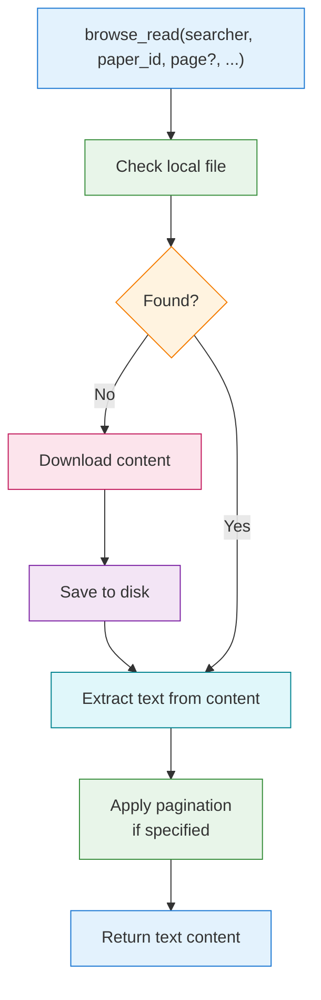

# browse_read

The `browse_read` tool extracts and reads text content from papers and other content sources. If the content has not been downloaded yet, it will automatically download it before extracting text.

## Basic Usage

```python
browse_read(searcher="arxiv", paper_id="2303.08774")
```

## Parameters

| Parameter | Type | Required | Default | Description |
|-----------|------|----------|---------|-------------|
| `searcher` | string | Yes | - | Source platform |
| `paper_id` | string | Yes | - | Content identifier (1-200 characters) |
| `page` | integer | No | - | Read specific page (1-indexed) |
| `start_page` | integer | No | - | Page range start (1-indexed) |
| `end_page` | integer | No | - | Page range end (1-indexed) |

## Pagination

The `browse_read` tool supports reading specific pages or page ranges from PDF documents. This is useful for:

- Reading only specific sections without loading the entire document
- Efficiently browsing long papers
- Reducing context length for AI assistants

### Pagination Parameters

| Parameter | Description | Example |
|-----------|-------------|---------|
| `page` | Read a single specific page | `page=3` returns only page 3 |
| `start_page` | Page range start (inclusive) | `start_page=1` starts from page 1 |
| `end_page` | Page range end (inclusive) | `end_page=5` ends at page 5 |

### Pagination Behavior

| Parameters | Result |
|------------|--------|
| None | Returns all pages |
| `page=3` | Returns only page 3 |
| `start_page=1, end_page=5` | Returns pages 1-5 |
| `start_page=10` | From page 10 to end |
| `end_page=5` | Returns pages 1-5 |

### Pagination Examples

```python
# Read only abstract (usually page 1)
browse_read(searcher="arxiv", paper_id="2303.08774", page=1)

# Read introduction (pages 1-3)
browse_read(searcher="arxiv", paper_id="2303.08774", start_page=1, end_page=3)

# Start reading from methods section (assuming it starts at page 5)
browse_read(searcher="arxiv", paper_id="2303.08774", start_page=5)

# Read up to conclusion (first 10 pages)
browse_read(searcher="arxiv", paper_id="2303.08774", end_page=10)
```

### Pagination Response Format

When using pagination, the response includes page markers:

```
--- Page 1 ---
Title: GPT-4 Technical Report

Abstract
We report the development of GPT-4, a large-scale, multimodal
model which can accept image and text inputs...

--- Page 2 ---
1 Introduction
This technical report presents GPT-4, a large multimodal model
capable of processing image and text inputs...
```

## Paper ID Formats

Each platform uses different identifier formats. See [browse_download](./browse-download#paper-id-formats) for complete format details.

| Searcher | Example |
|----------|---------|
| `arxiv` | `2303.08774` |
| `pubmed` | `32790614` |
| `pmc` | `PMC7419405` |
| `biorxiv` | `10.1101/2020.01.01.123456` |
| `medrxiv` | `10.1101/2020.01.01.123456` |
| `iacr` | `2009/101` |
| `crossref` | `10.1038/s41586-020-2649-2` |
| `semantic` | `DOI:10.18653/v1/N18-3011` |
| `core` | `123456789` |

## Reading Examples

### Read from Different Data Sources

```python
# Read from arXiv
browse_read(searcher="arxiv", paper_id="2106.12345")

# Read from PubMed
browse_read(searcher="pubmed", paper_id="32790614")

# Read from PubMed Central
browse_read(searcher="pmc", paper_id="PMC7419405")

# Read from bioRxiv
browse_read(searcher="biorxiv", paper_id="10.1101/2020.01.01.123456")

# Read from medRxiv
browse_read(searcher="medrxiv", paper_id="10.1101/2020.01.01.123456")

# Read from IACR
browse_read(searcher="iacr", paper_id="2009/101")

# Read from Semantic Scholar
browse_read(searcher="semantic", paper_id="DOI:10.18653/v1/N18-3011")

# Read from CrossRef
browse_read(searcher="crossref", paper_id="10.1038/s41586-020-2649-2")

# Read from CORE
browse_read(searcher="core", paper_id="123456789")
```

### Read from Plugin Data Sources

If the social media plugin is installed:

```python
# Read from GitHub
browse_read(searcher="github", paper_id="owner/repo")

# Read from Twitter
browse_read(searcher="twitter", paper_id="1234567890")

# Read from Zhihu
browse_read(searcher="zhihu", paper_id="123456789")
```

## How It Works

1. **Check local cache**: The tool first checks if the content has been downloaded
2. **Download if needed**: If not available locally, automatically downloads the content
3. **Extract text**: Uses appropriate parser (PDF, HTML, etc.) to extract text
4. **Apply pagination**: If pagination parameters are set, extracts only the requested pages
5. **Return content**: Returns the extracted text string



## Response Format

The tool returns extracted text content:

```
Title: GPT-4 Technical Report

Abstract
We report the development of GPT-4, a large-scale, multimodal
model which can accept image and text inputs and produce text
outputs. While less capable than humans in many real-world
scenarios, GPT-4 exhibits human-level performance on various
professional and academic benchmarks...

1 Introduction
This technical report presents GPT-4, a large multimodal model
capable of processing image and text inputs and producing text
outputs...

[Full paper text continues...]
```

## Input Validation

- **searcher**: Must be one of the enabled data sources
- **paper_id**: Must be 1-200 characters, cannot be empty or whitespace only
- **page**: Must be a positive integer (1 or greater)
- **start_page**: Must be a positive integer (1 or greater)
- **end_page**: Must be a positive integer, greater than or equal to start_page

## Error Handling

Common errors and their meanings:

| Error | Cause | Solution |
|-------|-------|----------|
| Searcher unavailable | Data source not enabled | Enable the data source in configuration |
| Paper ID cannot be empty | Empty or whitespace only ID | Provide a valid paper ID |
| Paper not found | Invalid paper ID | Verify paper ID format |
| Error converting paper to text | PDF parsing failed | Try re-downloading or use another data source |
| Invalid page number | Page number out of range | Use valid page numbers |

## Tips

:::tip Workflow
For best results, first use `browse_search` to search for papers, then use the returned paper ID with `browse_read` to extract content.
:::

:::tip Pagination for Long Papers
For long papers, use pagination to read specific sections:
- `page=1` to get abstract
- `start_page=1, end_page=3` to get introduction
- Only read full paper when needed
:::

- The tool automatically downloads papers, so you don't need to call `browse_download` first
- Downloaded papers are cached for faster subsequent reads
- Text extraction quality depends on PDF structure (some scanned PDFs may have poor extraction results)
- Pagination only works for PDF content; other content types return full text

## Use Cases

### Research Summary

Ask your AI assistant:
> "Read page 1 of paper 2303.08774 from arXiv and summarize the abstract"

### Literature Review

After searching:
> "Search for papers about transformer architecture on arXiv, then read pages 1-5 of the top result"

### Citation Extraction

> "Read the last 3 pages of this paper to find the references section"

### Progressive Reading

> "Read pages 1-5 first, if more details are needed, then read pages 6-10"

## Next Steps

- [browse_search](./browse-search) - Search for papers to read
- [browse_download](./browse-download) - Download papers for offline access
- [MCP Configuration](../configuration) - Configure download path
- [Plugins](../../plugins/overview) - Extend with more content sources
