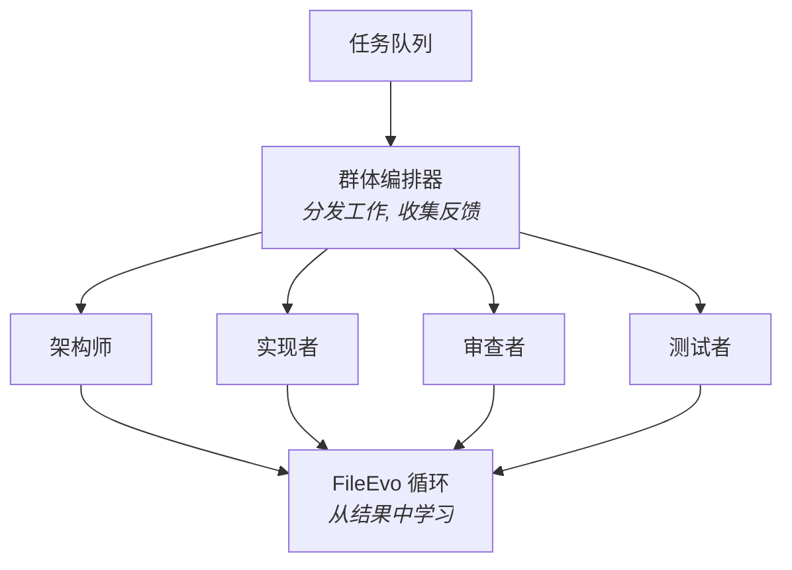

# 智能体管理

Viben CLI 提供了全面的智能体管理和 **Agent Swarm** 编排工具 - 协调专业化智能体群体共同工作，持续进化你的代码库。

## 多智能体编排

在 **Agent Swarm x Code Evolution** 范式中，多个智能体以不同专业分工进行协作：

| 智能体角色 | 说明 |
|------------|------|
| **架构师 (Architect)** | 设计系统结构并评估架构决策 |
| **实现者 (Implementer)** | 根据任务规范编写和修改代码 |
| **审查者 (Reviewer)** | 审查代码变更并提供质量反馈 |
| **测试者 (Tester)** | 生成和运行测试，验证实现 |
| **优化者 (Optimizer)** | 应用 FileEvo 迭代改进代码质量指标 |

### 群体协调



### 快速群体命令

```bash
# 为任务启动群体会话
viben swarm start --task "implement-auth"

# 列出活跃的群体智能体
viben swarm status

# 配置群体角色
viben swarm config --roles architect,implementer,reviewer
```

## 关键概念

| 概念 | 说明 |
|------|------|
| **智能体 (Agent)** | 独立的 AI 助手实例，拥有自己的配置、记忆和会话 |
| **群体 (Swarm)** | 协调一组智能体共同处理相关任务 |
| **模板 (Template)** | 带有 `isTemplate: true` 标记的普通智能体，用作创建新智能体的蓝图 |
| **记忆 (Memory)** | 智能体的长期记忆 (MEMORY.md + 每日日志) |
| **会话 (Session)** | 智能体的对话历史和状态 |
| **工作区配置 (Workspace Config)** | 项目特定的智能体类型配置 (如 `.claude/`) |

## 架构概述

```
                          Viben CLI
+---------------------------------------------------------+
|  Agent Template (可复用的智能体配置模板)                   |
|    |                                                     |
|    +-- Agent Instance (独立的智能体实例)                  |
|          |-- config.yaml (智能体配置)                     |
|          |-- mcp_servers.json (MCP 配置)                 |
|          |-- skills/ (智能体专属技能)                     |
|          |-- memory/ (智能体记忆)                         |
|          |   |-- MEMORY.md (主记忆)                       |
|          |   +-- YYYY-MM-DD.md (每日日志, append-only)    |
|          |-- .agentrc (启动配置)                          |
|          |-- .agent_history (命令历史)                    |
|          +-- .agent_sessions/<session_id>/ (会话)        |
+---------------------------------------------------------+
```

## 智能体目录结构

每个智能体存储在 `~/.viben/agents/<agent-id>/`:

```
~/.viben/agents/<agent-id>/
|-- config.yaml              # 智能体配置
|-- mcp_servers.json         # MCP 服务器配置
|-- skills/                  # 智能体专属技能
|-- memory/                  # 智能体记忆
|   |-- MEMORY.md            # 主记忆文件 (结构化知识)
|   |-- 2024-01-15.md        # 每日日志 (append-only)
|   |-- 2024-01-16.md        # 会话启动时读取今天+昨天
|   +-- ...
|-- .agentrc                 # 智能体启动配置
|-- .agent_history           # 命令历史
+-- .agent_sessions/         # 会话存储
    +-- <session_id>/
        |-- config.yaml              # 会话配置
        +-- messages.rollout.jsonl   # 消息历史 (JSONL)
```

## 运行时配置合并

智能体运行时，配置按以下顺序合并:

```
1. ~/.viben/agents/<id>/config.yaml     # 智能体基础配置
2. <project>/.claude/ (或其他类型)       # 工作区智能体类型配置
3. 命令行参数                            # 运行时覆盖
```

例如：在 `/projects/my-app` 目录下运行智能体 `main`，会先加载 `~/.viben/agents/main/config.yaml`，再叠加 `/projects/my-app/.claude/` 的配置。

## 智能体 vs 模板

模板是带有 `isTemplate: true` 标记的普通智能体。它们作为创建新智能体的蓝图。

| 方面 | 智能体 | 模板 |
|------|--------|------|
| **用途** | 活跃的 AI 助手实例 | 可复用的配置蓝图 |
| **存储** | `~/.viben/agents/<id>/` | `~/.viben/agents/<id>/`（相同位置） |
| **配置标记** | `isTemplate: false`（默认） | `isTemplate: true` |
| **记忆** | 有记忆和会话 | 仅初始结构 |
| **使用** | 直接交互 | 通过 `--from-template` 创建新智能体 |

## 快速命令

```bash
# 列出所有智能体
viben agent list

# 仅列出模板
viben agent list --templates

# 创建新智能体
viben agent create my-agent

# 从模板创建
viben agent create my-agent --from-template coding-assistant

# 克隆现有智能体
viben agent create my-agent --clone existing-agent

# 将智能体标记为模板
viben agent update my-agent --is-template true

# 查看智能体详情
viben agent show my-agent

# 配置智能体
viben agent config my-agent set model gpt-4

# 删除智能体
viben agent remove my-agent

# 设置默认智能体
viben agent set-default my-agent

# 查看智能体状态
viben agent status
```

## 命令输出格式

所有智能体命令都支持 `--json` 标志以获得机器可读的输出：

**人类可读输出:**
```
Agents:
  main*         claude-code   3 sessions   ~/.viben/agents/main/
  my-agent      claude-code   1 session    ~/.viben/agents/my-agent/
  research-bot  gemini        0 sessions   ~/.viben/agents/research-bot/

* = 当前智能体
```

**JSON 输出 (`--json` 标志):**
```json
{
  "success": true,
  "data": {
    "current": "main",
    "agents": [
      {
        "id": "main",
        "name": "Main Agent",
        "type": "claude-code",
        "path": "~/.viben/agents/main/",
        "session_count": 3,
        "memory_size": "5.6 KB"
      }
    ]
  }
}
```

## 支持的执行器类型

### 运行时执行器

运行时执行器可以被 Viben 启动并执行任务：

| ID | CLI 工具 | 说明 |
|----|----------|------|
| `CLAUDE_CODE` | `claude` | Claude Code CLI |
| `AMP` | `amp` | Amp Code Agent |
| `GEMINI` | `gemini` | Google Gemini CLI |
| `CODEX` | `codex` | OpenAI Codex |
| `OPENCODE` | `opencode` | OpenCode CLI |
| `CURSOR_AGENT` | `cursor` | Cursor Agent |
| `QWEN_CODE` | `qwen` | Qwen Code |
| `COPILOT` | `copilot` | GitHub Copilot |
| `DROID` | `droid` | Droid Agent |

### 仅模板执行器

仅模板执行器用于 `viben init` 工作空间配置，不支持运行时启动：

| ID | 说明 |
|----|------|
| `CURSOR` | Cursor IDE |
| `IFLOW` | iFlow |
| `KILO` | Kilo |
| `KIRO` | Kiro |
| `ANTIGRAVITY` | Antigravity |
| `WINDSURF` | Windsurf |
| `AIDER` | Aider |
| `CONTINUE` | Continue |

## 下一步

- [创建智能体](./creating-agents.md) - 创建和管理智能体
- [智能体配置](./agent-configuration.md) - 配置智能体设置
- [记忆系统](./memory-system.md) - 了解智能体记忆
- [会话](./sessions.md) - 管理智能体会话
- [模板](./templates.md) - 使用智能体模板
