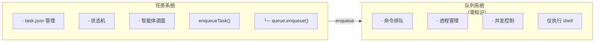

# viben task

任务管理命令，支持任务的完整生命周期管理。

## 概述

`viben task` 命令用于管理开发任务，包括任务的创建、配置、上下文管理、规划和监控。

## 命令结构

```bash
viben task <subcommand> [options]
```

## 子命令概览

| 子命令 | 说明 |
|--------|------|
| `list` | 列出任务 |
| `create` | 创建新任务 |
| `view` | 查看任务详情 |
| `edit` | 编辑任务 |
| `delete` | 删除任务 |
| `finish` | 完成任务 |
| `archive` | 归档任务 |
| `list-archive` | 列出归档任务 |
| `enqueue` | 入队任务 |
| `dequeue` | 移出队列 |
| `pause` | 暂停任务 |
| `resume` | 恢复任务 |
| `review` | 查看待审查任务 |
| `approve` | 批准完成 |
| `reject` | 拒绝返工 |
| `retry` | 重试失败任务 |
| `cancel` | 取消任务 |
| `start` | 启动任务执行 |
| `status` | 查看任务状态 |
| `create-pr` | 创建 Pull Request |
| `set-branch` | 设置任务分支名称 |
| `set-base` | 设置 PR 目标（基础）分支 |
| `set-agent` | 设置任务关联的智能体配置 |
| `create-worktree` | 为任务创建 git worktree |
| `validate-check-phase-passed` | 验证检查阶段是否通过 |
| `check-stuck` | 检测任务是否卡住 |
| `cleanup` | 清理 worktree 及相关资源 |

## 任务 CRUD

### 列出任务

```bash
viben task list [--mine] [--status <status>] [--json]
```

**选项**:

| 选项 | 说明 |
|------|------|
| `--mine`, `-m` | 只显示分配给当前开发者的任务 |
| `--status`, `-s` | 按状态过滤 (backlog, in_progress, completed) |
| `--json` | JSON 格式输出 |

**示例**:

```bash
viben task list
viben task list --mine
viben task list --status in_progress --json
```

### 创建任务

```bash
viben task create <title> [options]
```

**选项**:

| 选项 | 说明 |
|------|------|
| `--slug <name>` | 任务标识符，默认从 title 生成 |
| `--assignee <dev>` | 分配给谁，默认当前开发者 |
| `--priority <P0-P3>` | 优先级，默认 P2 |
| `--agent <agent-id>` | 关联的智能体配置 |

**示例**:

```bash
viben task create "Add user authentication"
viben task create "Fix login bug" --slug fix-login --priority P1
viben task create "Implement API" --assignee john --agent coding-assistant
```

### 查看任务

```bash
viben task view <task>
```

**示例**:

```bash
viben task view add-user-auth
viben task view .viben/tasks/03-03-add-user-auth
```

### 编辑任务

```bash
viben task edit <task>
```

### 删除任务

```bash
viben task delete <task> [--force]
```

## 状态生命周期管理

### 入队任务

将任务从 backlog 状态移入 queue 状态，并提交到命令队列系统。

```bash
viben task enqueue <task> [options]
```

**选项**:

| 选项 | 说明 |
|------|------|
| `--agent <id>` | 执行智能体 ID |
| `--executor <type>` | 执行器类型 (CLAUDE_CODE, CURSOR, OPENCODE, etc.) |
| `--model <id>` | 模型 ID |
| `--priority <p>` | 优先级 (P0/P1/P2/P3) |
| `--skip-queue` | 仅更新状态，不提交到队列系统 |

**示例**:

```bash
# 基本入队 - 提交到命令队列
viben task enqueue 03-10-feature-xyz

# 指定执行配置
viben task enqueue 03-10-feature-xyz --agent my-agent --executor CLAUDE_CODE

# 仅更新状态，不提交到队列
viben task enqueue 03-10-feature-xyz --skip-queue
```

**工作原理**:

运行 `viben task enqueue` 时，会发生以下操作:

1. 任务状态从 `backlog` 更新为 `queue`
2. 命令 `viben task start <task>` 被提交到命令队列系统
3. 队列任务 ID 保存到 `task.json` 的 `queue_id` 字段
4. 队列系统在有空闲容量时执行命令

```bash
# 查看队列状态
viben queue status

# 查看队列任务列表
viben queue list
# ID              STATUS   COMMAND                          CWD
# q_7kA9OXDz71T7  pending  viben task start my-feature      /path/to/repo

# 查看 task.json
cat .viben/tasks/03-15-my-feature/task.json
# {
#   "status": "queue",
#   "queue_id": "q_7kA9OXDz71T7",
#   ...
# }
```

### 移出队列

将任务从队列中移除，恢复为 backlog 状态。

```bash
viben task dequeue <task>
```

**示例**:

```bash
# 通过任务系统移出队列
viben task dequeue my-feature

# 也可以直接通过队列系统取消
viben queue cancel q_7kA9OXDz71T7
```

### 暂停任务

```bash
viben task pause <task>
```

### 恢复任务

```bash
viben task resume <task>
```

### 查看待审查任务

```bash
viben task review <task>
```

**输出**:

```
=== Task Review: 03-10-feature-xyz ===

Title:    实现用户认证功能
Status:   review
Priority: P1

PR URL:   https://github.com/org/repo/pull/123
Branch:   feature/03-10-feature-xyz

Files Changed: 12
+425 -89

Next steps:
  viben task approve 03-10-feature-xyz   # 批准完成
  viben task reject 03-10-feature-xyz    # 拒绝返工
```

### 批准任务

```bash
viben task approve <task>
```

### 拒绝任务

```bash
viben task reject <task> [--reason <text>]
```

### 重试任务

```bash
viben task retry <task>
```

### 取消任务

```bash
viben task cancel <task> [--reason <text>] [--force]
viben task stop <task>   # cancel 的别名
```

**选项**:

| 选项 | 说明 |
|------|------|
| `--reason <text>` | 取消原因 |
| `--force`, `-f` | 强制取消 in_progress 状态的任务 |

## 任务执行

### 启动任务

```bash
viben task start <task> [options]
```

**选项**:

| 选项 | 说明 |
|------|------|
| `--executor <type>` | 执行器类型 |
| `--detach` | 后台运行 |
| `--worktree` | 在隔离的 git worktree 中运行 |
| `--resume` | 恢复已有的智能体 session |
| `--session <id>` | 指定 session-id |

**执行流程**:
1. 调用 Plan Agent 规划任务
2. 调用 Work Agent 执行任务
3. 自动创建 worktree（如配置）
4. 完成后进入 review 状态

**示例**:

```bash
viben task start add-user-auth
viben task start add-user-auth --executor CURSOR
viben task start add-user-auth --resume
```

### 阶段命令

```bash
# 运行 Plan 阶段
viben task plan-phase <task> [--platform <platform>] [--verbose]

# 运行 Work 阶段
viben task work-phase <task> [--platform <platform>] [--no-detach]

# 运行 Implement 阶段
viben task implement-phase <task>

# 运行 Check 阶段
viben task check-phase <task>
```

### 查看状态

```bash
# 查看所有任务状态
viben task status

# 查看特定任务状态
viben task status <task> [--detail] [--watch] [--log]
```

**选项**:

| 选项 | 说明 |
|------|------|
| `--assignee`, `-a` | 按分配人过滤 |
| `--status`, `-s` | 按状态过滤 |
| `--running` | 只显示有运行中智能体的任务 |
| `--json` | JSON 格式输出 |
| `--detail` | 显示详细状态 |
| `--watch` | 实时监控智能体日志 |
| `--log` | 显示最近日志条目 |

### 创建 PR

```bash
viben task create-pr <task> [--dry-run]
```

## 任务配置

### 设置分支

为任务设置 Git 分支名称。

```bash
viben task set-branch <task> --branch <branch-name>
```

**选项**:

| 选项 | 说明 |
|------|------|
| `--branch <name>` | 要设置的分支名称 |

**示例**:

```bash
viben task set-branch add-user-auth --branch feature/user-auth
```

### 设置基础分支

为任务设置 PR 目标（基础）分支。

```bash
viben task set-base <task> --branch <branch-name>
```

**选项**:

| 选项 | 说明 |
|------|------|
| `--branch <name>` | 基础分支名称 |

**示例**:

```bash
viben task set-base add-user-auth --branch develop
```

### 设置智能体

为任务设置关联的智能体配置。

```bash
viben task set-agent <task> --agent <agent-id>
```

**选项**:

| 选项 | 说明 |
|------|------|
| `--agent <id>` | 要关联的智能体 ID |

**示例**:

```bash
viben task set-agent add-user-auth --agent coding-assistant
```

## Worktree 管理

### 创建 Worktree

为任务创建隔离的 git worktree。

```bash
viben task create-worktree <task> [--skip-prd]
```

**选项**:

| 选项 | 说明 |
|------|------|
| `--skip-prd` | 跳过 prd.md 验证 |

**工作原理**:

1. 验证任务状态（被拒绝的任务无法创建 worktree）
2. 检查 `prd.md` 是否存在（除非使用 `--skip-prd`）
3. 创建 git worktree 并设置分支
4. 更新 `task.json` 中的 `worktree_path`

**示例**:

```bash
viben task create-worktree 03-11-user-auth
viben task create-worktree 03-11-user-auth --skip-prd
```

## 验证

### 验证检查阶段通过

验证任务的检查阶段是否已通过。

```bash
viben task validate-check-phase-passed <task> [options]
```

**选项**:

| 选项 | 说明 |
|------|------|
| `-o, --output <text>` | 智能体输出文本（用于完成标记验证） |
| `-f, --output-file <file>` | 包含智能体输出的文件 |

**验证方式**:

1. `verify_commands` - 运行验证命令进行检查
2. `completion_markers` - 检查输出中的完成标记

**示例**:

```bash
viben task validate-check-phase-passed 03-11-user-auth
viben task validate-check-phase-passed 03-11-user-auth -f .check-log
```

## 卡住检测

### 检测卡住

检测任务是否卡住（仅检测，不执行恢复）。

```bash
viben task check-stuck <task> [options]
```

**选项**:

| 选项 | 说明 |
|------|------|
| `-t, --threshold <ms>` | 卡住阈值（毫秒），默认: 120000（2 分钟） |
| `-v, --verbose` | 显示详细检测数据 |
| `--json` | JSON 格式输出 |

**检测机制**:

该命令运行 4 项检查来判断任务是否卡住:

| 检查项 | 说明 | 卡住条件 |
|--------|------|----------|
| `status` | 任务状态检查 | 仅 `in_progress` 或 `queue` 状态可能卡住 |
| `event_timestamp` | 事件时间戳 | 超过阈值无新事件 |
| `process` | 智能体进程状态 | PID 进程不存在 |
| `log_activity` | 日志活动 | 日志文件长时间未修改 |

**卡住判定逻辑**:

```
isStuck = process_not_running OR (event_timeout AND log_inactive)
```

- 进程未运行 -> 判定为卡住
- 事件超时 且 日志不活跃 -> 判定为卡住

**示例**:

```bash
# 基本检测
viben task check-stuck 03-11-feature-xyz

# 自定义阈值（5 分钟）
viben task check-stuck 03-11-feature-xyz -t 300000

# 详细输出
viben task check-stuck 03-11-feature-xyz --verbose

# JSON 输出（用于脚本或 API）
viben task check-stuck 03-11-feature-xyz --json
```

:::note
`check-stuck` 命令仅检测卡住的任务。自动恢复由 Gateway 的 `TaskRecoveryService` 处理。
:::

## 上下文管理

### 初始化上下文

```bash
viben task init-context <task>
```

创建 `implement.jsonl`、`check.jsonl`、`fix.jsonl` 文件。

### 添加上下文

```bash
viben task add-context <task> <file>... [--reason <text>] [--recursive]
```

**示例**:

```bash
viben task add-context add-user-auth src/auth/
viben task add-context add-user-auth docs/api.md --reason "API 参考文档"
```

### 移除上下文

```bash
viben task remove-context <task> <file>...
```

### 列出上下文

```bash
viben task list-context <task>
```

### 验证上下文

```bash
viben task validate-context <task>
```

## 归档管理

### 完成任务

```bash
viben task finish <task>
```

### 归档任务

```bash
viben task archive <task>
```

任务会被移动到 `archive/YYYY-MM/` 目录。

### 列出归档任务

```bash
viben task list-archive [YYYY-MM]
```

### 清理 Worktree

```bash
# 清理指定分支的 worktree
viben task cleanup <branch> [--keep-branch] [--yes]

# 清理已合并的 worktree
viben task cleanup --merged [--yes]

# 清理所有 worktree
viben task cleanup --all [--yes]

# 列出所有 worktree
viben task cleanup --list
```

## 状态转换

| 命令 | 允许的起始状态 | 目标状态 |
|------|--------------|---------|
| enqueue | backlog | queue |
| dequeue | queue | backlog |
| pause | queue, in_progress | paused |
| resume | paused | queue 或 in_progress |
| approve | review | completed |
| reject | review | backlog |
| retry | failed | queue |
| cancel | backlog, queue, paused, in_progress*, review | cancelled |

> *`in_progress` 状态需要 `--force` 参数

## 任务目录结构

```
.viben/tasks/
├── 03-03-add-user-auth/
│   ├── task.json           # 任务元数据
│   ├── prd.md              # 产品需求文档 (Plan Agent 生成)
│   ├── implement.jsonl     # 实现阶段上下文
│   ├── check.jsonl         # 检查阶段上下文
│   ├── fix.jsonl           # 修复阶段上下文
│   └── .plan-log           # Plan Agent 日志
└── archive/
    └── 2024-02/
        └── 02-15-old-task/
```

## task.json 格式

```json
{
  "id": "add-user-auth",
  "name": "add-user-auth",
  "title": "Add user authentication",
  "description": "",
  "status": "backlog",
  "priority": "P2",
  "creator": "john",
  "assignee": "john",
  "createdAt": "2024-03-03",
  "completedAt": null,
  "branch": "feature/user-auth",
  "base_branch": "main",
  "worktree_path": null,
  "current_phase": 0,
  "next_action": [
    {"phase": 1, "action": "implement"},
    {"phase": 2, "action": "check"},
    {"phase": 3, "action": "finish"}
  ],
  "commit": null,
  "pr_url": null,
  "subtasks": [],
  "relatedFiles": [],
  "notes": ""
}
```

## Task + Queue 集成

任务系统与命令队列系统集成，支持排队执行任务，具备并发控制和后台处理能力。

### 架构

**关键原则**: 队列系统对任务系统**零知识**。队列只执行 shell 命令，不理解任务语义。



### 数据流

运行 `viben task enqueue <task>` 时:

1. 任务状态在 `task.json` 中更新为 `queue`
2. 队列系统收到命令: `viben task start <task>`
3. 队列 ID 保存到 `task.json`

队列系统执行命令时:

1. `viben task start` 将状态更新为 `in_progress`
2. 智能体执行任务
3. 完成后状态变为 `completed` 或 `failed`

### 状态映射

| 任务状态 | 队列状态 | 说明 |
|----------|----------|------|
| `backlog` | - | 任务未提交到队列 |
| `queue` | `pending` | 任务等待执行 |
| `in_progress` | `running` | 任务正在执行 |
| `completed` | `completed` (exit 0) | 任务成功完成 |
| `failed` | `completed` (exit != 0) | 任务执行失败 |

### task.json 队列字段

任务入队时，`queue_id` 字段会添加到 `task.json`:

```json
{
  "id": "my-feature",
  "status": "queue",
  "queue_id": "q_7kA9OXDz71T7",
  ...
}
```

### 工作流示例

```bash
# 1. 创建任务
viben task create "My feature" --slug my-feature

# 2. 提交到队列
viben task enqueue my-feature

# 3. 查看队列状态
viben queue status
# Queue Status
# ────────────────────────────────────────
#   Pending:     1 task(s)
#   Running:     0 / 3 (max concurrency)

# 4. 查看队列列表
viben queue list
# ID              STATUS   COMMAND                          CWD
# q_7kA9OXDz71T7  pending  viben task start my-feature      /path/to/repo

# 5. 监控执行
viben queue logs q_7kA9OXDz71T7 --follow

# 6. 查看任务状态
viben task status my-feature
```

### 直接执行（跳过队列）

不经过队列直接执行任务:

```bash
# 方式 1: 使用 --skip-queue 标志
viben task enqueue my-feature --skip-queue
viben task start my-feature

# 方式 2: 直接使用 start
viben task start my-feature
```

## 相关命令

- [viben queue](./queue) - 命令队列管理
- [viben swarm](./swarm) - 智能体集群调度
- [viben session](./session) - 会话记录管理
- [viben evo](./evo) - 基于文件的自我进化
