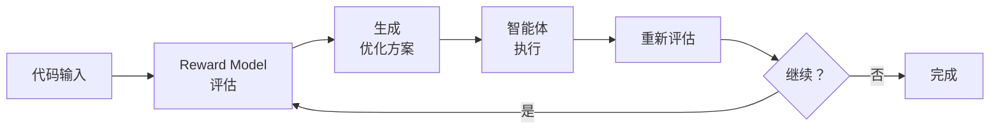
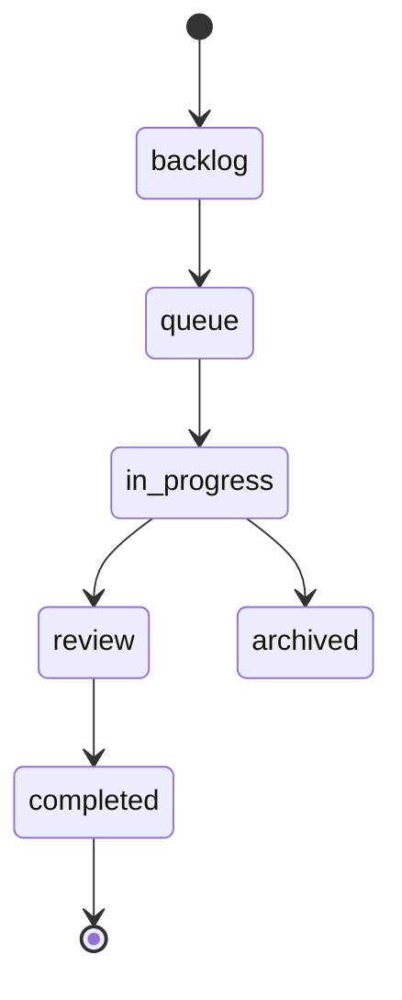

# 功能介绍

Viben Desktop 通过 **Agent Swarm（智能体集群）** 和 **Code Evolution（代码进化）** 实现自主代码迭代优化。

:::tip 核心概念
在了解功能之前，建议先阅读 [核心概念](/user/getting-started/concepts)，理解智能体与执行器的区别。
:::

---

## FileEvo 代码进化

FileEvo 是 Viben 的核心引擎，通过启发式评估和选择驱动代码迭代优化。

### 工作原理



### Reward Model 奖励模型

评估代码质量并生成优化信号：

| 维度 | 评估内容 |
|------|----------|
| **正确性** | 代码是否满足功能需求 |
| **质量** | 代码风格、可读性、可维护性 |
| **性能** | 运行时效率、资源使用 |
| **安全性** | 潜在漏洞、安全风险 |

### Evolution Loop 进化循环

迭代优化代码直至满足目标：

1. **初始评估** - Reward Model 分析当前代码
2. **生成方案** - 基于评估结果生成优化建议
3. **智能体执行** - Agent Swarm 执行代码修改
4. **验证结果** - 重新评估检查是否达成目标
5. **继续迭代** - 如未达标则继续优化

### History Tracking 历史追踪

追踪代码演进历史和决策过程：
- 每次迭代的代码快照
- 奖励分数变化曲线
- 智能体决策日志
- 回滚到任意历史版本

---

## Agent Swarm 集群编排

编排多个智能体协同完成复杂任务。

### 多执行器支持

Viben 自动检测系统中已安装的执行器：

| 执行器 | 检测方式 | MCP 支持 |
|--------|----------|----------|
| **Claude Code** | `which claude` | ✓ |
| **AMP** | `which amp` | ✓ |
| **Gemini** | `which gemini` | ✓ |
| **Codex** | `which codex` | ✓ |
| **OpenCode** | `which opencode` | ✓ |
| **Cursor Agent** | `which cursor` | ✓ |
| **Qwen Code** | `which qwen-code` | ✓ |
| **Copilot** | `which gh` | ✓ |
| **Droid** | `which droid` | ✓ |

执行器是**只读**的，由系统自动检测，用户无法创建或修改执行器。

### 任务分解

将复杂任务拆解给不同智能体：
- **架构设计** - 由高级智能体负责
- **代码实现** - 分配给专业智能体
- **测试编写** - 测试专用智能体
- **代码审查** - 审查智能体检查质量

### 协作模式

智能体之间的协作方式：

| 模式 | 说明 |
|------|------|
| **串行执行** | 一个智能体完成后，下一个继续 |
| **并行执行** | 多个智能体同时处理不同子任务 |
| **审查模式** | 一个智能体生成，另一个审查 |
| **竞争模式** | 多个智能体独立生成，选择最优结果 |

---

## Task System 任务系统

基于 XState 状态机的任务管理系统。

### 状态机

任务流经以下状态：



| 状态 | 说明 |
|------|------|
| `backlog` | 待规划，尚未进入执行队列 |
| `queue` | 排队等待智能体处理 |
| `in_progress` | 智能体正在执行 |
| `review` | 等待人工审核 |
| `completed` | 任务已完成 |
| `archived` | 已归档 |

### 核心命令

通过 CLI 管理任务：

```bash
viben task create "实现用户登录功能"
viben task enqueue <task-id>
viben task start <task-id>
viben task finish <task-id>
viben task archive <task-id>
```

### 看板视图

桌面应用提供可视化看板：

- **列管理**：自定义任务列（待办、进行中、已完成等）
- **卡片拖拽**：拖拽卡片在列间移动
- **优先级**：设置任务优先级
- **标签**：为任务添加标签分类

### 任务详情

每个任务卡片支持：
- 标题和描述
- 负责人分配
- 截止日期
- 子任务管理
- 依赖关系
- 评论和活动记录

### 智能体集成

可以将任务分配给智能体：
- 智能体可以读取任务描述
- 任务完成后自动更新状态
- 记录智能体的工作输出

---

## Idea Generation 创意生成

从项目上下文自动生成优化建议。

### 生成类型

| 类型 | 说明 |
|------|------|
| **代码重构** | 识别可重构的代码模式 |
| **性能优化** | 发现性能瓶颈和优化点 |
| **架构改进** | 提出架构层面的改进建议 |
| **技术债务** | 识别并量化技术债务 |
| **功能增强** | 基于现有代码的功能扩展建议 |

### 工作流程

1. **上下文分析** - 扫描项目代码和配置
2. **模式识别** - 识别常见问题和改进机会
3. **方案生成** - 生成具体的优化建议
4. **优先级排序** - 按影响力和难度排序
5. **一键创建任务** - 将建议转化为 Task 执行

---

## 工作空间管理

### 多工作空间支持

管理多个项目工作空间：

- **全局工作空间**：默认存在，代表 `~` 目录下的全局配置，不可删除
- **自定义工作空间**：用户添加的项目目录，可以添加和移除

### 添加工作空间

通过向导式流程添加工作空间：

1. **选择方式**
   - 打开现有文件夹 - 选择已有的项目目录
   - 创建新文件夹 - 在指定位置创建新目录

2. **配置选项**
   - 工作空间名称
   - 存储位置
   - 初始化 Git 仓库（如果不存在）
   - 初始化 .viben 配置

3. **高级选项**
   - 开发者名称
   - 项目类型（全栈/前端/后端）
   - 包含 Cursor 配置

### 配置优先级

配置按以下优先级合并（后者覆盖前者）：

```
全局配置 (~/.viben/) → 项目配置 (<project>/.viben/) → 运行时设置
```

### 智能检测

系统会自动检测：
- 已有的 `.git` 目录 - 隐藏"初始化 Git"选项
- 已有的 `.viben` 目录 - 显示警告和"重新初始化"选项

---

## 智能体管理

### 智能体配置

智能体是用户创建的配置，定义如何使用执行器：

| 操作 | 说明 |
|------|------|
| **创建智能体** | 从模板或空白创建 |
| **编辑智能体** | 修改配置、提示词、参数 |
| **删除智能体** | 移除自定义智能体 |
| **导出/导入** | 分享智能体配置 |

每个智能体可以配置：
- **执行器类型** (executor_type) - 使用哪个执行器运行
- **系统提示词** - 定义智能体行为
- **模型参数** - temperature、max_tokens 等
- **MCP 服务器** - 扩展智能体能力
- **Skills** - 可复用的能力包

### 全局 vs 项目智能体

| 范围 | 存储位置 | 说明 |
|------|----------|------|
| **全局** | `~/.viben/agents/` | 所有项目可用 |
| **项目** | `<project>/.viben/agents/` | 仅当前项目可用 |

---

## MCP 服务器管理

### 添加 MCP 服务器

为智能体添加 MCP 服务器：
- 服务器名称
- 执行命令
- 命令参数
- 环境变量

### 编辑和删除

- 编辑现有服务器配置
- 删除不需要的服务器（带确认）
- 启用/禁用服务器

### 配置示例

```json
{
  "mcpServers": {
    "filesystem": {
      "command": "npx",
      "args": ["-y", "@modelcontextprotocol/server-filesystem", "/path"],
      "env": {}
    },
    "github": {
      "command": "npx",
      "args": ["-y", "@modelcontextprotocol/server-github"],
      "env": {
        "GITHUB_TOKEN": "${GITHUB_TOKEN}"
      }
    }
  }
}
```

---

## MCP 市场

### 浏览和搜索

- 浏览官方和社区 MCP 服务器
- 按类别筛选
- 搜索特定功能

### 一键安装

- 查看 MCP 服务器详情
- 一键添加到工作空间
- 自动配置

---

## Skills Management

### Skills 概念

Skills 是可复用的能力包，可以为智能体添加特定功能。

### 来源

- **市场 Skills**：从 Skills 市场安装
- **本地 Skills**：自定义的本地能力包

### 管理操作

- 添加 Skills
- 查看已安装的 Skills
- 移除 Skills

---

## AI 聊天

### 智能体对话

与工作空间中的智能体进行对话：
- 选择智能体或执行器
- 发送消息
- 接收流式响应

### Provider 支持

支持多种 AI Provider：

| Provider | 说明 |
|----------|------|
| **OpenAI** | GPT-4、GPT-3.5 等 |
| **Anthropic** | Claude 3、Claude 2 等 |
| **Ollama** | 本地模型 |
| **自定义** | OpenAI 兼容 API |

### 模型配置

- 选择模型
- 调整温度、最大 Token 等参数
- 查看 Token 使用情况
- 配置模型别名和回退策略

### 会话管理

- 创建新会话
- 查看历史会话
- 恢复暂停的会话
- 删除会话

### Memory 系统

每个智能体维护独立的 Memory 系统：

| 文件 | 说明 |
|------|------|
| `MEMORY.md` | 长期记忆，存储项目上下文和用户偏好 |
| `logs/<date>.md` | 每日日志，记录当天的交互摘要 |

Memory 帮助智能体记住：
- 项目上下文和技术栈
- 用户偏好和编码风格
- 重要决策和约定

---

## 用户界面

### 深色模式

完整支持浅色和深色主题：
- 自动跟随系统主题
- 手动切换主题
- 所有组件样式一致

### 键盘快捷键

| 操作 | macOS | Windows/Linux |
|------|-------|---------------|
| 新建搜索 | Cmd + K | Ctrl + K |
| 设置 | Cmd + , | Ctrl + , |
| 退出 | Cmd + Q | Alt + F4 |

### 多语言支持

- 英文 (English)
- 中文 (简体)

### 辅助功能

- 屏幕阅读器支持
- 键盘导航
- 高对比度模式

---

## 隐私与安全

### 本地优先

- 所有数据存储在本地
- 无需账户
- 无遥测或追踪

### 安全通信

- API 请求使用 HTTPS
- 凭证不以明文存储

### 敏感数据

- 支持环境变量引用（如 `${GITHUB_TOKEN}`）
- 不在日志中显示 API 密钥

---

## 数据存储

### 存储位置

| 平台 | 位置 |
|------|------|
| macOS | `~/Library/Application Support/com.viben.app` |
| Windows | `%APPDATA%\com.viben.app` |
| Linux | `~/.config/viben` |

### Viben 配置

全局配置存储在 `~/.viben/`：

```
~/.viben/
├── agents/              # 全局智能体配置
├── providers.yaml       # Provider 配置
├── models.yaml          # 模型配置
├── channels.yaml        # 通道配置
├── tasks/               # 任务存储
├── queue/               # 命令队列
└── sessions/            # 会话存储
```

### 工作空间配置

每个工作空间的配置存储在 `<project>/.viben/`：

```
<project>/.viben/
├── agents/              # 工作空间智能体
├── tasks/               # 项目任务
├── group-chats/         # 群聊
└── config.yaml          # 工作空间配置
```

---

## 即将推出

以下功能正在计划中：

- **自动更新** - 应用自动更新
- **插件系统** - 通过插件扩展功能
- **云同步** - 可选的设置和收藏云同步
- **高级 FileEvo** - 更强大的代码进化策略
- **Swarm 模板** - 预定义的智能体协作模板

---

## 功能请求

有功能建议？在 [GitHub](https://github.com/LinXueyuanStdio/viben/issues/new?template=feature_request.md) 上提交 Issue。
