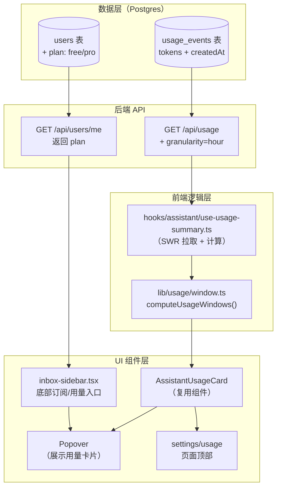
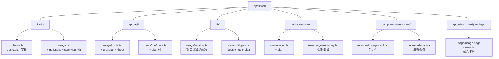
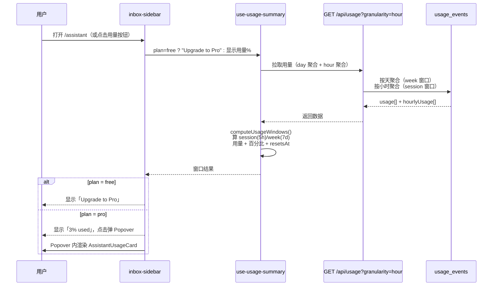

# 助手侧栏用量卡片与订阅入口

> 日期：2026-08-16　·　状态：设计中　·　范围：`apps/web`

## 1. 概述

为 `/assistant` 左侧侧栏底部新增「用量 / 订阅」入口，并在 `/settings/usage` 与侧栏 Popover 中复用一个 **Assistant Usage 用量卡片**，向用户展示 Free/Pro 计划下的 token 用量进度与滚动窗口重置时间。

核心诉求拆解：

1. **侧栏底部改造**：删除现有的「头像 / 用户名 / 邮箱 / leaderboard」卡片，替换为一行 ——
   - 左侧长条按钮：非 Pro 显示「Upgrade to Pro」；Pro 显示当前用量百分比，点击向上弹出用量 Popover。
   - 右侧设置图标按钮（注意图标颜色与 hover 颜色）。
2. **用量卡片**（`/settings/usage` 页面 + 侧栏 Popover 复用）：展示「Assistant Usage」标题、计划名、session(5h)/week(7d) 两个滚动窗口的用量进度与重置时间，以及升级引导。
3. **订阅计划字段**：新增 `users.plan`（free / pro），支撑「Upgrade to Pro」与「当前用量」的分支显示。

## 2. 背景与目标

### 2.1 背景

- 用量数据已有完整基础设施：`usage_events` 表（记录每次 LLM 调用的 input/output/cached tokens）+ `lib/db/usage.ts` 的 `recordUsage` / `getUsageHistory` + `GET /api/usage`（返回按天聚合 + insights + domain leaderboard）。
- **没有真正的订阅/计划系统**：`settings/subscription` 页面中 Pro 仍为「Coming Soon」、当前计划硬编码 Free；`users` 表只有 `role`，没有 `plan/tier/isPro`。
- 现有 `settings/usage` 页面顶部的 `UsageSection` 已展示详细用量（token 总量、成本、贡献图、饼图、insights），但**没有**「计划限额进度 + 滚动窗口重置时间」这类面向限额的卡片。
- 侧栏底部当前是「头像 + 用户名 + 邮箱 + leaderboard 排名 + 设置」，与右上角头像重复，且缺少订阅/用量入口。

### 2.2 目标

- 侧栏底部展示订阅状态与用量入口（不重复头像信息）。
- 用量卡片在 `settings/usage` 页与侧栏 Popover 两处复用，视觉与逻辑一致。
- `plan` 字段从后端透出到前端，支撑 free/pro 分支。

## 3. 现状（探索结论）

| 关注点 | 现状 |
|--------|------|
| 用量记录 | `usage_events` 表 + `recordUsage()`（`lib/db/usage.ts`），含 `createdAt`、`inputTokens`、`outputTokens`、`cachedInputTokens` 等 |
| 用量聚合 | `getUsageHistory()` 按 `date(createdAt)` **按天聚合**，无小时/事件级时间戳 |
| 用量 API | `GET /api/usage`（`app/api/usage/route.ts`），支持 `from/to` 日期过滤，返回 `{ usage, insights, domainLeaderboard }` |
| 计划字段 | `users` 表**无** `plan` 字段；`/api/users/me` 未返回 plan |
| 会话读取 | `useSession()`（`hooks/assistant/use-session.ts`）从 `/api/users/me` 取用户，映射到 `SessionUserInfo` |
| 侧栏底部 | `inbox-sidebar.tsx` 渲染头像/用户名/邮箱/leaderboard + 设置按钮 |
| usage 页面 | `settings/usage/usage-page-content.tsx` = `UsageSection` + 下载量分析 |

**关键约束**：现有 `/api/usage` 按天聚合，**无法**精确计算「Resets in 16m」这种 5 小时滚动窗口的重置时间（丢失了小时/分钟精度）。因此需要**轻微扩展** `/api/usage` 增加 `granularity=hour` 返回最近 24h 小时级聚合。

## 4. 架构图



## 5. 树状图（文件与组件结构）



## 6. 信息图（数据流时序）



## 7. 数据模型

### 7.1 `users.plan` 字段

```ts
// lib/db/schema.ts — users 表新增
plan: text('plan', {
  enum: ['free', 'pro'],
}).default('free').notNull(),
```

- `/api/users/me` 的 GET/PATCH 查询列新增 `plan: true`。
- `Session.user`（`lib/session/types.ts`）新增 `plan?: "free" | "pro"`。
- `useSession()` 的 `VibenUserResponse.user` 与映射新增 `plan`。

### 7.2 用量窗口与限额

| 窗口 | 时间跨度 | 限额（Free） | 说明 |
|------|---------|-------------|------|
| session | 最近 5h | 200,000 tokens | 滚动窗口，用于「This session (5h)」 |
| week | 最近 7d | 1,000,000 tokens | 滚动窗口，用于「This week (7d)」 |

> Pro 计划的限额留待订阅系统接入后再定义，当前 Free 硬编码为上面两个常量。

### 7.3 窗口结果结构

```ts
interface UsageWindowSummary {
  key: "session" | "week";
  windowMs: number;   // 5h / 7d 毫秒
  limit: number;      // 200000 / 1000000
  used: number;       // 窗口内 token 总量（input + output）
  percent: number;    // used / limit，向上取整，最小 1%
  resetsAt: Date | null; // 窗口内最早事件时间 + windowMs；无事件时为 null
}
```

## 8. 组件设计

### 8.1 `AssistantUsageCard`（新组件，复用）

`components/assistant/assistant-usage-card.tsx`

- Props：`plan`、`windows: { session: UsageWindowSummary; week: UsageWindowSummary }`、`loading`、可选 `onShowPlans`。
- 内容：
  - 标题「Assistant Usage」+ 计划名（Free / Pro）。
  - rolling-window 说明文案。
  - 两行窗口（This session / This week），每行显示：窗口时长、`Resets in …`、`N% used`（带进度条）。
  - 「Need more usage? / Upgrade to Pro for higher limits and premium model access. / Show plans」引导（仅 Free 显示升级引导）。
- 被 `settings/usage` 页面与侧栏 Popover 复用。

### 8.2 侧栏底部（`inbox-sidebar.tsx`）

删除现有头像卡片（`sidebarUser` 区块），替换为一行：

- **左侧长条按钮**（`flex-1`）：
  - `plan === "free"` → 文案「Upgrade to Pro」，点击跳转 `/settings/subscription`。
  - `plan === "pro"` → 显示 week 窗口百分比（如「3% used」），点击 `side="top"` 弹出 Popover 展示 `AssistantUsageCard`。
- **右侧设置图标按钮**：`Settings` 图标，`size="icon"`，点击跳转 `/settings`。
  - 图标颜色：默认 `text-muted-foreground`，hover `text-foreground`（与现有侧栏风格一致，避免沿用选中态深色逻辑）。

### 8.3 usage 页面（`settings/usage/usage-page-content.tsx`）

在页面顶部（`UsageSection` 之前）插入 `AssistantUsageCard`，作为限额进度概览。

## 9. 相关文件清单

| 文件 | 改动类型 | 说明 |
|------|----------|------|
| `lib/db/schema.ts` | 修改 | `users` 表新增 `plan` 字段 |
| `app/api/users/me/route.ts` | 修改 | GET/PATCH 查询列新增 `plan` |
| `hooks/assistant/use-session.ts` | 修改 | `VibenUserResponse` 与映射新增 `plan` |
| `lib/session/types.ts` | 修改 | `Session.user` 新增 `plan?` |
| `lib/db/usage.ts` | 修改 | 新增 `getUsageHistoryHourly()` 返回最近 24h 小时级聚合 |
| `app/api/usage/_lib/query-range.ts` | 修改 | 解析 `granularity` 参数 |
| `app/api/usage/route.ts` | 修改 | `granularity=hour` 时额外返回 `hourlyUsage` |
| `lib/usage/window.ts` | 新增 | 窗口计算纯函数 `computeUsageWindows()` |
| `lib/usage/window.test.ts` | 新增 | 窗口计算单测 |
| `hooks/assistant/use-usage-summary.ts` | 新增 | SWR 拉取 `/api/usage` 并计算窗口摘要 |
| `components/assistant/assistant-usage-card.tsx` | 新增 | 可复用用量卡片 |
| `components/assistant/inbox-sidebar.tsx` | 修改 | 底部订阅/用量入口 + Popover |
| `app/(dashboard)/settings/usage/usage-page-content.tsx` | 修改 | 顶部插入用量卡片 |
| `lib/i18n/locales/en.json` | 修改 | 新增翻译 key |
| `lib/i18n/locales/zh-CN.json` | 修改 | 新增中文翻译 |

## 10. 实现步骤

1. **plan 字段**：`schema.ts` → `/api/users/me` → `use-session.ts` → `session/types.ts`；跑 `pnpm db:push`。
2. **小时级聚合**：`usage.ts` 新增 `getUsageHistoryHourly`；`query-range.ts` + `route.ts` 支持 `granularity=hour`。
3. **窗口计算**：`lib/usage/window.ts` 实现 `computeUsageWindows`（session 5h / week 7d）+ 单测。
4. **用量摘要 hook**：`use-usage-summary.ts` 拉取 + 计算。
5. **用量卡片组件**：`assistant-usage-card.tsx` + i18n key。
6. **侧栏改造**：`inbox-sidebar.tsx` 底部替换 + Popover。
7. **usage 页面插入**。
8. **验证**：`pnpm typecheck` + 单测。

## 11. 测试计划

- **窗口计算单测**（`window.test.ts`）：
  - session 窗口只统计最近 5h 内事件。
  - week 窗口只统计最近 7d 内事件。
  - 百分比计算（含 0 用量、超限 clamp 到 100%）。
  - `resetsAt` = 最早事件时间 + 窗口长度；无事件时返回 null。
- **组件测试**（可选）：`assistant-usage-card` 在 free/pro 下文案分支。

## 12. i18n 翻译（en / zh-CN）

| key | en | zh-CN |
|-----|----|-------|
| `assistant.usage.title` | Assistant Usage | 助手用量 |
| `assistant.usage.free` | Free | 免费版 |
| `assistant.usage.pro` | Pro | Pro |
| `assistant.usage.description` | Track how close you are to your plan's limits. Usage resets on a rolling window, meaning you will regain your usage over time instead of all at once. | 追踪你距计划限额的进度。用量按滚动窗口重置，会随时间逐步恢复，而非一次性归零。 |
| `assistant.usage.thisSession` | This session | 本次会话 |
| `assistant.usage.thisWeek` | This week | 本周 |
| `assistant.usage.resetsIn` | Resets in | 将于…重置 |
| `assistant.usage.used` | used | 已用 |
| `assistant.usage.needMore` | Need more usage? | 需要更多用量？ |
| `assistant.usage.upgradePro` | Upgrade to Pro for higher limits and premium model access. | 升级到 Pro，获得更高限额与高级模型访问。 |
| `assistant.usage.showPlans` | Show plans | 查看套餐 |
| `assistant.sidebar.upgradeToPro` | Upgrade to Pro | 升级到 Pro |
