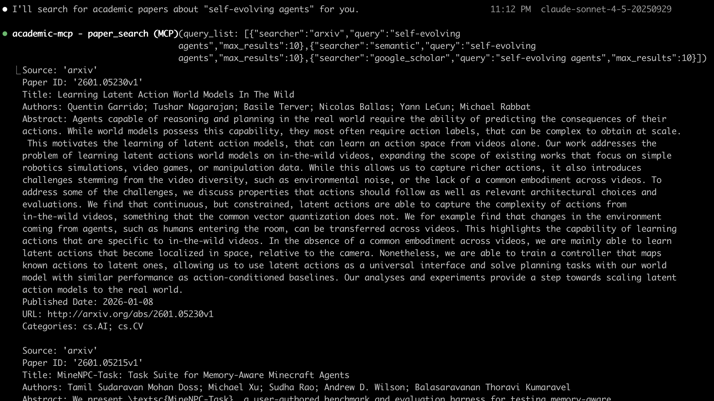

# Browse MCP

[English](README.md) | [中文](README_zh.md)

`browse-mcp` is a Python-based MCP server that enables users to search, download, and read academic papers from various platforms. It provides three main tools:
- **`browse_search`**: Search papers across multiple academic databases
- **`browse_download`**: Download paper PDFs, return paths of downloaded files
- **`browse_read`**: Extract and read text content from papers

  

---

## Table of Contents

- [Screenshot](#screenshot)
- [Features](#features)
- [Installation](#installation)
  - [Quick Start](#quick-start)
  - [For Development](#for-development)
- [Usage](#usage)
  - [Search Papers](#1-search-papers-browse_search)
  - [Download Papers](#2-download-papers-browse_download)
  - [Read Papers](#3-read-papers-browse_read)
  - [Environment Variables](#environment-variables)
- [Contributing](#contributing)
- [License](#license)

---

## Features

- **Multi-Source Support**: Search and download papers from 19+ academic databases including arXiv, PubMed, PubMed Central, bioRxiv, medRxiv, Google Scholar, IACR ePrint Archive, Semantic Scholar, CrossRef, Science Direct, Springer, IEEE Xplore, Scopus, CORE, and more.
- **Unified Interface**: All platforms accessible through consistent `browse_search`, `browse_download`, and `browse_read` tools.
- **Standardized Output**: Papers are returned in a consistent dictionary format via the `Paper` class.
- **Asynchronous Operations**: Efficiently handles concurrent searches and downloads using `httpx` and async/await.
- **MCP Integration**: Compatible with MCP clients for LLM context enhancement.
- **Extensible Design**: Easily add new academic platforms by extending the `sources` module.

## Screenshot



## Supported Academic Platforms

### Fully Implemented (19 sources)

**Free & Open Access:**
- [x] **arXiv** - Pre-print repository for physics, mathematics, CS, and more
- [x] **PubMed** - Biomedical literature database
- [x] **PubMed Central (PMC)** - Free full-text biomedical and life sciences articles
- [x] **bioRxiv** - Pre-print server for biology
- [x] **medRxiv** - Pre-print server for health sciences
- [x] **Semantic Scholar** - AI-powered research tool
- [x] **CrossRef** - DOI registration agency and metadata provider
- [x] **Google Scholar** - Academic search engine
- [x] **IACR ePrint Archive** - Cryptology pre-prints
- [x] **CORE** - Open access research papers aggregator

**API Key Required:**
- [x] **Science Direct** - Elsevier's full-text scientific database (requires Elsevier API key)
- [x] **Springer Link** - Springer's scientific publications (requires Springer API key)
- [x] **IEEE Xplore** - IEEE's digital library (requires IEEE API key)
- [x] **Scopus** - Elsevier's abstract and citation database (requires Scopus API key)

**Institutional Access Required:**
- [x] **ACM Digital Library** - ACM's computing literature (no public API)
- [x] **Web of Science** - Clarivate's citation database (requires subscription)
- [x] **JSTOR** - Digital library of academic journals (no public API)
- [x] **ResearchGate** - Academic social network (no official API)

**Retired Services:**
- [x] **Microsoft Academic** - Service retired December 31, 2021 (placeholder implementation)

## Installation

`browse-mcp` can be installed using multiple methods. Choose what works best for you.

### Quick Install

**Shell Script (macOS/Linux):**
```bash
curl -fsSL https://github.com/LinXueyuanStdio/viben/releases/latest/download/install.sh | bash
```

**npx (Node.js 18+):**
```bash
npx viben
```

**pip:**
```bash
pip install browse-mcp
```

**uv (faster):**
```bash
uv pip install browse-mcp
```

Start the MCP server:

```bash
browse-mcp
```

### MCP Client Configuration

Choose your MCP client and follow the configuration steps:

<details>
<summary><b>1. Claude Desktop</b></summary>

**Location:**
- macOS: `~/Library/Application Support/Claude/claude_desktop_config.json`
- Windows: `%APPDATA%\Claude\claude_desktop_config.json`

**Configuration:**
```json
{
  "mcpServers": {
    "browse-mcp": {
      "command": "python",
      "args": ["-m", "browse_mcp"],
      "env": {
        "SEMANTIC_SCHOLAR_API_KEY": "",
        "SCIENCEDIRECT_API_KEY": "",
        "SPRINGER_API_KEY": "",
        "IEEE_API_KEY": "",
        "SCOPUS_API_KEY": "",
        "CORE_API_KEY": "",
        "BROWSE_MCP_ENABLED_SOURCES": "arxiv,pubmed,pmc,biorxiv,medrxiv,semantic,core,crossref,google_scholar,iacr",
        "BROWSE_MCP_DISABLED_SOURCES": "ieee,scopus,springer,sciencedirect,wos,acm,jstor",
        "BROWSE_MCP_DOWNLOAD_PATH": "./downloads"
      }
    }
  }
}
```

</details>

<details>
<summary><b>2. Claude Code (CLI)</b></summary>

**Location:** `~/.config/claude/config.json`

**Configuration:**
```json
{
  "mcpServers": {
    "browse-mcp": {
      "command": "python",
      "args": ["-m", "browse_mcp"],
      "env": {
        "SEMANTIC_SCHOLAR_API_KEY": "",
        "SCIENCEDIRECT_API_KEY": "",
        "SPRINGER_API_KEY": "",
        "IEEE_API_KEY": "",
        "SCOPUS_API_KEY": "",
        "CORE_API_KEY": "",
        "BROWSE_MCP_ENABLED_SOURCES": "arxiv,pubmed,pmc,biorxiv,medrxiv,semantic,core,crossref,google_scholar,iacr",
        "BROWSE_MCP_DISABLED_SOURCES": "ieee,scopus,springer,sciencedirect,wos,acm,jstor",
        "BROWSE_MCP_DOWNLOAD_PATH": "./downloads"
      }
    }
  }
}
```

**Verify Installation:**
```bash
# Check if browse-mcp is loaded
claude mcp list

# Test the server
claude mcp test browse-mcp
```

</details>

<details>
<summary><b>3. Cline (VS Code Extension)</b></summary>

**Location:** VS Code Settings -> Extensions -> Cline -> MCP Settings

**Method 1: Through VS Code Settings UI**
1. Open VS Code Settings (Cmd/Ctrl + ,)
2. Search for "Cline MCP"
3. Click "Edit in settings.json"
4. Add the configuration:

```json
{
  "cline.mcpServers": {
    "browse-mcp": {
      "command": "python",
      "args": ["-m", "browse_mcp"],
      "env": {
        "SEMANTIC_SCHOLAR_API_KEY": "",
        "SCIENCEDIRECT_API_KEY": "",
        "SPRINGER_API_KEY": "",
        "IEEE_API_KEY": "",
        "SCOPUS_API_KEY": "",
        "CORE_API_KEY": "",
        "BROWSE_MCP_ENABLED_SOURCES": "arxiv,pubmed,pmc,biorxiv,medrxiv,semantic,core,crossref,google_scholar,iacr",
        "BROWSE_MCP_DISABLED_SOURCES": "ieee,scopus,springer,sciencedirect,wos,acm,jstor",
        "BROWSE_MCP_DOWNLOAD_PATH": "./downloads"
      }
    }
  }
}
```

**Method 2: Direct settings.json Edit**

Edit `~/.config/Code/User/settings.json` (Linux/macOS) or `%APPDATA%\Code\User\settings.json` (Windows):

```json
{
  "cline.mcpServers": {
    "browse-mcp": {
      "command": "python",
      "args": ["-m", "browse_mcp"],
      "env": {
        "SEMANTIC_SCHOLAR_API_KEY": "",
        "SCIENCEDIRECT_API_KEY": "",
        "SPRINGER_API_KEY": "",
        "IEEE_API_KEY": "",
        "SCOPUS_API_KEY": "",
        "CORE_API_KEY": "",
        "BROWSE_MCP_ENABLED_SOURCES": "arxiv,pubmed,pmc,biorxiv,medrxiv,semantic,core,crossref,google_scholar,iacr",
        "BROWSE_MCP_DISABLED_SOURCES": "ieee,scopus,springer,sciencedirect,wos,acm,jstor",
        "BROWSE_MCP_DOWNLOAD_PATH": "./downloads"
      }
    }
  }
}
```

</details>

<details>
<summary><b>4. Zed Editor</b></summary>

**Location:** `~/.config/zed/settings.json`

**Configuration:**
```json
{
  "context_servers": {
    "browse-mcp": {
      "command": {
        "path": "python",
        "args": ["-m", "browse_mcp"]
      },
      "settings": {
        "env": {
          "SEMANTIC_SCHOLAR_API_KEY": "",
          "SCIENCEDIRECT_API_KEY": "",
          "SPRINGER_API_KEY": "",
          "IEEE_API_KEY": "",
          "SCOPUS_API_KEY": "",
          "CORE_API_KEY": "",
          "BROWSE_MCP_ENABLED_SOURCES": "arxiv,pubmed,pmc,biorxiv,medrxiv,semantic,core,crossref,google_scholar,iacr",
          "BROWSE_MCP_DISABLED_SOURCES": "ieee,scopus,springer,sciencedirect,wos,acm,jstor",
          "BROWSE_MCP_DOWNLOAD_PATH": "./downloads"
        }
      }
    }
  }
}
```

</details>

<details>
<summary><b>5. Custom MCP Client</b></summary>

For other MCP clients, use the standard MCP server configuration:

**Server Command:**
```bash
python -m browse_mcp
```

**Environment Variables:**
- `SEMANTIC_SCHOLAR_API_KEY`: Optional API key for Semantic Scholar
- `SCIENCEDIRECT_API_KEY`: Optional API key for Science Direct
- `SPRINGER_API_KEY`: Optional API key for Springer Link
- `IEEE_API_KEY`: Optional API key for IEEE Xplore
- `SCOPUS_API_KEY`: Optional API key for Scopus
- `CORE_API_KEY`: Optional API key for CORE
- `BROWSE_MCP_DOWNLOAD_PATH`: Download directory (default: `./downloads`)

**Server Capabilities:**
- Tools: `browse_search`, `browse_download`, `browse_read`
- Transport: stdio
- Protocol: MCP 1.0

</details>

### Environment Variables

**API Keys** (optional - only for premium services):
- `SEMANTIC_SCHOLAR_API_KEY`: Semantic Scholar ([Get API Key](https://www.semanticscholar.org/product/api))
- `SCIENCEDIRECT_API_KEY`: Elsevier Science Direct ([Get API Key](https://dev.elsevier.com/))
- `SPRINGER_API_KEY`: Springer Nature ([Get API Key](https://dev.springernature.com/))
- `IEEE_API_KEY`: IEEE Xplore ([Get API Key](https://developer.ieee.org/))
- `SCOPUS_API_KEY`: Elsevier Scopus ([Get API Key](https://dev.elsevier.com/))
- `CORE_API_KEY`: CORE aggregator ([Get API Key](https://core.ac.uk/services/api))
- `WOS_API_KEY`: Web of Science (requires institutional subscription)

**General Settings:**
- `BROWSE_MCP_DOWNLOAD_PATH`: Directory for downloaded PDFs (default: `./downloads`)

**Source Control:**
- `BROWSE_MCP_ENABLED_SOURCES`: Comma-separated list to enable specific sources (whitelist)
- `BROWSE_MCP_DISABLED_SOURCES`: Comma-separated list to disable specific sources (blacklist)
- If both are set, `BROWSE_MCP_ENABLED_SOURCES` takes precedence
- If neither is set, all 18 sources are enabled by default

**Available Source Names (18 total):**

| Source Name | Type | API Key Required | Description |
|-------------|------|------------------|-------------|
| `arxiv` | Free | - | Preprint repository for physics, mathematics, computer science |
| `pubmed` | Free | - | Biomedical literature from MEDLINE |
| `pmc` | Free | - | PubMed Central full-text archive |
| `biorxiv` | Free | - | Preprint server for biology |
| `medrxiv` | Free | - | Preprint server for health sciences |
| `google_scholar` | Free | - | Google Scholar search |
| `iacr` | Free | - | International Association for Cryptologic Research |
| `semantic` | Free | `SEMANTIC_SCHOLAR_API_KEY` (optional)<br>[Get API Key](https://www.semanticscholar.org/product/api) | Semantic Scholar AI-powered search (higher rate limits with API key) |
| `crossref` | Free | - | Crossref DOI metadata |
| `core` | Free | `CORE_API_KEY`<br>[Get API Key](https://core.ac.uk/services/api) | CORE aggregator of open access papers |
| `ieee` | Premium | `IEEE_API_KEY`<br>[Get API Key](https://developer.ieee.org/) | IEEE Xplore digital library |
| `scopus` | Premium | `SCOPUS_API_KEY`<br>[Get API Key](https://dev.elsevier.com/) | Elsevier Scopus database |
| `springer` | Premium | `SPRINGER_API_KEY`<br>[Get API Key](https://dev.springernature.com/) | Springer publications |
| `sciencedirect` | Premium | `SCIENCEDIRECT_API_KEY`<br>[Get API Key](https://dev.elsevier.com/) | Elsevier ScienceDirect |
| `wos` | Premium | `WOS_API_KEY`<br>[Institutional Access](https://clarivate.com/webofsciencegroup/solutions/web-of-science/) | Web of Science (requires institutional subscription) |
| `acm` | Premium | - | ACM Digital Library |
| `jstor` | Premium | - | JSTOR archive |
| `researchgate` | Free | - | ResearchGate social network |


## Usage

Once configured, `browse-mcp` provides three main tools accessible through Claude Desktop or any MCP-compatible client.

### 1. Search Papers (`browse_search`)

Search for academic papers across multiple sources:

**Basic Search Examples:**
```python
# Search arXiv for machine learning papers
browse_search([
    {"searcher": "arxiv", "query": "machine learning", "max_results": 5}
])

# Search PubMed Central for biomedical papers
browse_search([
    {"searcher": "pmc", "query": "cancer treatment", "max_results": 5}
])

# Search CORE for open access papers
browse_search([
    {"searcher": "core", "query": "climate change", "max_results": 5}
])
```

**Multi-Platform Search:**
```python
# Search multiple platforms simultaneously
browse_search([
    {"searcher": "arxiv", "query": "deep learning", "max_results": 5},
    {"searcher": "pubmed", "query": "cancer immunotherapy", "max_results": 3},
    {"searcher": "pmc", "query": "diabetes treatment", "max_results": 3},
    {"searcher": "semantic", "query": "climate change", "max_results": 4, "year": "2020-2023"}
])
```

**Premium Sources (require API keys):**
```python
# Search IEEE Xplore (requires IEEE_API_KEY)
browse_search([
    {"searcher": "ieee", "query": "neural networks", "max_results": 5}
])

# Search Springer Link (requires SPRINGER_API_KEY)
browse_search([
    {"searcher": "springer", "query": "quantum computing", "max_results": 5}
])

# Search Scopus (requires SCOPUS_API_KEY)
browse_search([
    {"searcher": "scopus", "query": "artificial intelligence", "max_results": 5}
])
```

**Search All Platforms:**
```python
# Search all platforms (omit "searcher" parameter)
browse_search([
    {"query": "quantum computing", "max_results": 10}
])
```

### 2. Download Papers (`browse_download`)

Download paper PDFs using their identifiers:

```python
# Download from free sources
browse_download([
    {"searcher": "arxiv", "content_id": "2106.12345"},
    {"searcher": "pubmed", "content_id": "32790614"},
    {"searcher": "pmc", "content_id": "PMC7419405"},
    {"searcher": "biorxiv", "content_id": "10.1101/2020.01.01.123456"},
    {"searcher": "semantic", "content_id": "DOI:10.18653/v1/N18-3011"}
])

# Download from CORE (open access)
browse_download([
    {"searcher": "core", "content_id": "123456789"}
])
```

**Note:** Premium sources (IEEE, Springer, Science Direct, Scopus) require institutional access or subscriptions for PDF downloads.

### 3. Read Papers (`browse_read`)

Extract and read text content from papers:

```python
# Read papers from free sources
browse_read(searcher="arxiv", content_id="2106.12345")
browse_read(searcher="pubmed", content_id="32790614")
browse_read(searcher="pmc", content_id="PMC7419405")
browse_read(searcher="biorxiv", content_id="10.1101/2020.01.01.123456")
browse_read(searcher="semantic", content_id="DOI:10.18653/v1/N18-3011")
browse_read(searcher="core", content_id="123456789")
```

---

### For Development

For developers who want to modify the code or contribute:

1. **Setup Environment**:

   ```bash
   # Install uv if not installed
   curl -LsSf https://astral.sh/uv/install.sh | sh

   # Clone repository
   git clone https://github.com/LinXueyuanStdio/browse-mcp.git
   cd browse-mcp

   # Create and activate virtual environment
   uv venv
   source .venv/bin/activate  # On Windows: .venv\Scripts\activate
   ```

2. **Install Dependencies**:

   ```bash
   # Install dependencies (recommended)
   uv pip install -e .

   # Add development dependencies (optional)
   uv pip install pytest flake8
   ```

---

## Contributing

We welcome contributions! Here's how to get started:

1. **Fork the Repository**:
   Click "Fork" on GitHub.

2. **Clone and Set Up**:

   ```bash
   git clone https://github.com/yourusername/browse-mcp.git
   cd browse-mcp
   uv pip install -e .  # Install in development mode
   ```

3. **Make Changes**:

   - Add new platforms in `browse_mcp/sources/`.
   - Update tests in `tests/`.

4. **Submit a Pull Request**:
   Push changes and create a PR on GitHub.

## License

This project is licensed under the MIT License. See the LICENSE file for details.

---

Happy researching with `browse-mcp`! If you encounter issues, open a GitHub issue.
