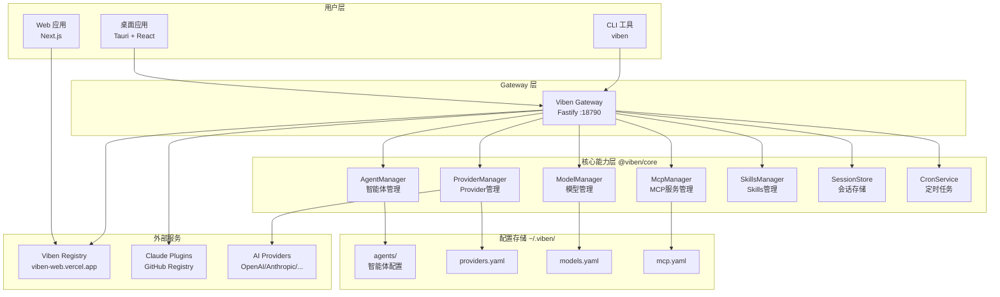
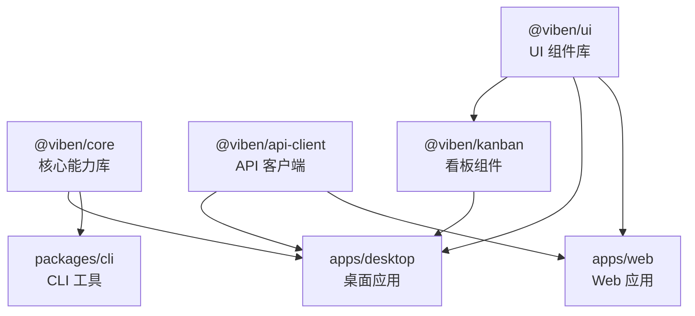
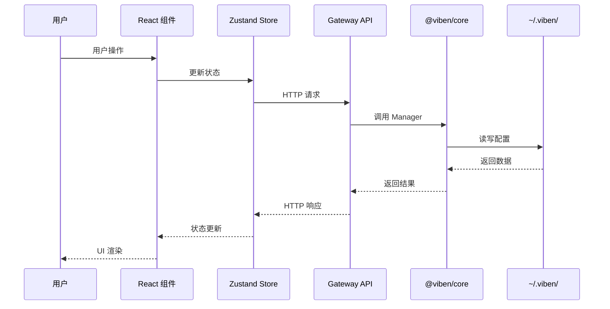
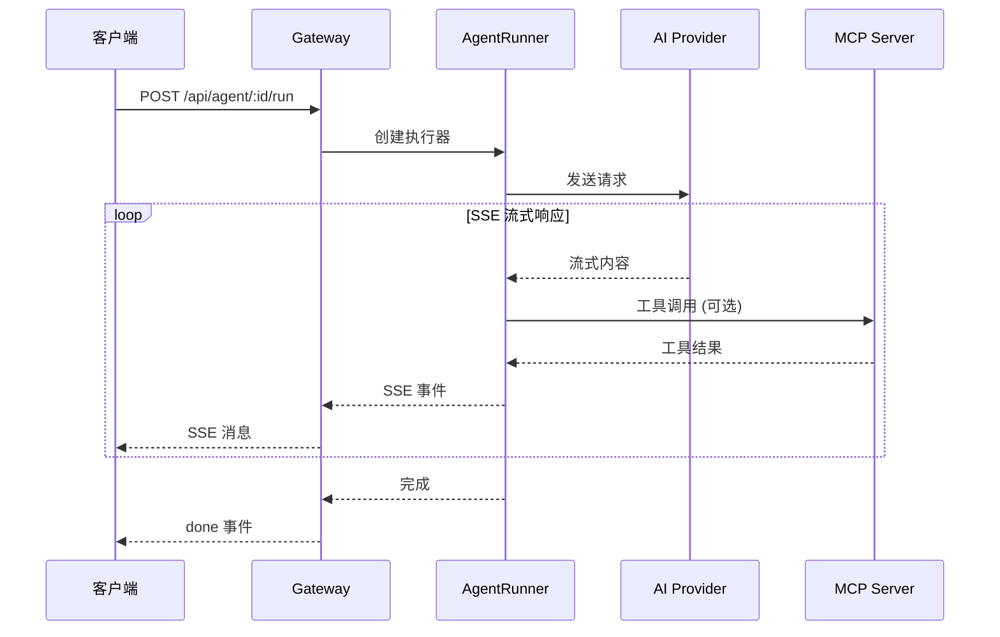
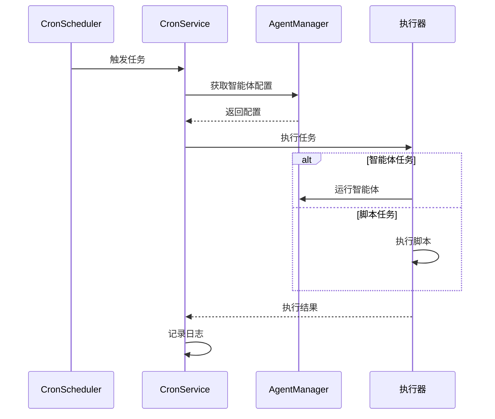

# Viben 系统架构文档

> **版本**: 1.0.0
> **更新日期**: 2026-02-28
> **项目描述**: 多智能体工作空间管理器，支持看板、日历、时间线和任务管理

---

## 目录

1. [系统概览](#1-系统概览)
2. [整体架构图](#2-整体架构图)
3. [核心模块说明](#3-核心模块说明)
4. [数据流说明](#4-数据流说明)
5. [服务通信](#5-服务通信)
6. [配置管理](#6-配置管理)
7. [部署架构](#7-部署架构)

---

## 1. 系统概览

### 1.1 产品矩阵

| 产品 | 描述 | 技术栈 |
|------|------|--------|
| **Web 应用** | MCP/Skill 包市场，社交功能 | Next.js 15 + PostgreSQL |
| **桌面应用** | 本地智能体编排与任务管理 | Tauri 2 + React 19 |
| **CLI 工具** | 命令行智能体管理 | TypeScript + Commander |
| **Gateway** | 本地 HTTP API 服务 | Fastify + Node.js |
| **MCP 服务器** | 学术论文搜索服务 (18 个数据源) | Python + FastMCP |

### 1.2 核心设计原则

- **packages/core 是所有前端应用的唯一能力边界**
- **file-native 配置范式**: Provider/Model 等配置使用 YAML，不使用数据库
- **配置存储**: `~/.viben/` 目录
- **API 命名约定**: Gateway API 查询参数使用 **snake_case** 格式

---

## 2. 整体架构图



### 2.1 包依赖关系



---

## 3. 核心模块说明

### 3.1 Gateway (@viben/core)

**定位**: 本地 HTTP API 服务，为桌面应用和 CLI 提供统一的后端接口

**端口**: `18790`

**主要功能**:
- 智能体 CRUD 和会话管理
- Provider/Model 配置管理
- MCP 服务器管理
- 定时任务调度
- 市场数据代理
- 终端和文件系统访问

**目录结构**:
```
packages/core/src/gateway/
├── index.ts              # Gateway 入口
├── state.ts              # 应用状态
└── routes/               # API 路由
    ├── index.ts          # 路由注册
    ├── agents.ts         # 智能体 API
    ├── sessions.ts       # 会话 API
    ├── providers.ts      # Provider API
    ├── models.ts         # Model API
    ├── cron.ts           # 定时任务 API
    ├── marketplace.ts    # 市场 API
    ├── mcp.ts            # MCP 管理 API
    ├── mcp-inspector.ts  # MCP 调试器
    └── ...
```

### 3.2 AgentManager

**定位**: 智能体配置的统一管理

**存储位置**: `~/.viben/agents/<agent-id>/config.yaml`

**核心功能**:
- 智能体 CRUD
- 模板管理
- 默认智能体设置
- 工作空间级别智能体支持

### 3.3 ProviderManager

**定位**: AI Provider 配置管理

**存储位置**: `~/.viben/providers.yaml`

**支持的 Provider 类型**:
- OpenAI
- Anthropic
- Google (Gemini)
- Azure OpenAI
- Ollama
- Groq
- Mistral
- DeepSeek
- OpenRouter

### 3.4 ModelManager

**定位**: 模型配置和别名管理

**存储位置**: `~/.viben/models.yaml`

**核心功能**:
- 模型启用/禁用
- 默认模型设置
- 模型别名
- 回退链配置

### 3.5 McpManager

**定位**: MCP (Model Context Protocol) 服务器管理

**核心功能**:
- 全局 MCP 安装管理
- 智能体级别 MCP 配置
- Browse-MCP 进程管理
- MCP Proxy 管理

### 3.6 SessionStore

**定位**: 智能体会话的文件持久化

**存储位置**: `<agent-path>/sessions/<session-id>/`

**存储内容**:
- `config.json` - 会话配置
- `messages.jsonl` - 对话消息 (rollout)
- `ui-messages.jsonl` - UI 消息 (前端渲染)

---

## 4. 数据流说明

### 4.1 桌面应用数据流



### 4.2 智能体执行流程



### 4.3 定时任务执行流程



---

## 5. 服务通信

### 5.1 通信协议

| 通信类型 | 协议 | 用途 |
|----------|------|------|
| Gateway API | HTTP/REST | 客户端与 Gateway 通信 |
| SSE | Server-Sent Events | 实时消息推送 |
| WebSocket | WS | 双向实时通信 |
| Tauri IPC | JSON-RPC | 桌面应用前后端通信 |

### 5.2 Gateway 端点概览

| 端点前缀 | 描述 |
|----------|------|
| `/health` | 健康检查 |
| `/api/agent` | 智能体管理 |
| `/api/sessions` | 会话管理 |
| `/api/providers` | Provider 管理 |
| `/api/models` | 模型管理 |
| `/api/cron` | 定时任务 |
| `/api/mcp` | MCP 服务管理 |
| `/api/marketplace` | 插件市场 |
| `/api/workspaces` | 工作空间 |
| `/api/executors` | 执行器管理 |

### 5.3 事件系统

Gateway 内部使用事件系统进行状态同步:

```typescript
// 事件类型
- sessionCreated    // 会话创建
- sessionUpdated    // 会话更新
- sessionDeleted    // 会话删除
- taskCreated       // 任务创建
- taskUpdated       // 任务更新
```

---

## 6. 配置管理

### 6.1 配置目录结构

```
~/.viben/
├── agents/                    # 智能体配置
│   └── <agent-id>/
│       ├── config.yaml        # 智能体配置
│       └── sessions/          # 会话数据
│           └── <session-id>/
│               ├── config.json
│               ├── messages.jsonl
│               └── ui-messages.jsonl
├── templates/                 # 智能体模板
│   └── <template-id>/
│       └── config.yaml
├── providers.yaml             # Provider 配置
├── models.yaml                # 模型配置
├── mcp.yaml                   # MCP 配置
├── cron.yaml                  # 定时任务配置
├── workspaces.yaml            # 工作空间配置
└── cache/                     # 缓存目录
    └── providers.json         # 市场数据缓存
```

### 6.2 工作空间配置

每个项目目录可以有自己的 `.viben/` 配置:

```
<project>/
└── .viben/
    ├── agents/               # 项目级智能体
    └── workspace.yaml        # 工作空间配置
```

工作空间智能体优先级高于全局智能体。

---

## 7. 部署架构

### 7.1 开发环境

```
                    ┌─────────────────────────────────┐
                    │         开发者机器               │
                    │                                 │
                    │  ┌─────────┐  ┌─────────────┐  │
                    │  │ Desktop │  │   Gateway   │  │
                    │  │  :1420  │  │   :18790    │  │
                    │  └────┬────┘  └──────┬──────┘  │
                    │       │              │         │
                    │       └──────────────┘         │
                    │              ↓                 │
                    │       ~/.viben/ 配置           │
                    └─────────────────────────────────┘
```

### 7.2 生产部署

**桌面应用**:
- 通过 GitHub Actions 构建
- 支持 macOS (ARM/Intel), Windows, Linux
- Gateway 作为 sidecar 进程运行

**Web 应用**:
- Vercel 自动部署
- PostgreSQL (Neon serverless)

**CLI**:
- npm publish
- Homebrew tap

### 7.3 关键端口

| 服务 | 端口 | 用途 |
|------|------|------|
| Gateway | 18790 | 本地 API 服务 |
| Desktop Dev | 1420 | Vite 开发服务器 |
| Browse-MCP | 可配置 | MCP SSE 服务 |
| MCP Proxy | 可配置 | MCP 代理服务 |

---

## 附录

### A. 技术栈总览

| 类别 | 技术 |
|------|------|
| **前端框架** | React 19, Next.js 15 |
| **桌面框架** | Tauri 2 (Rust) |
| **状态管理** | Zustand, TanStack Query |
| **样式** | TailwindCSS, Radix UI |
| **后端** | Fastify (Node.js) |
| **数据库** | PostgreSQL (Web), SQLite (Desktop) |
| **构建工具** | Turborepo, Vite, tsup |
| **包管理** | pnpm 9.x |

### B. 相关文档

- [Gateway API 文档](./API.md)
- [.trellis/spec/ARCHITECTURE.md](../.trellis/spec/ARCHITECTURE.md) - 详细架构规范
