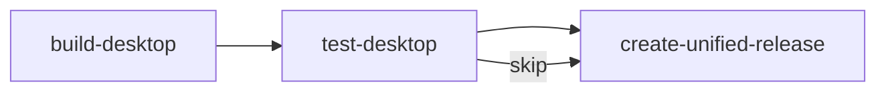

# Viben v1.2.10 更新日志

  

## 亮点

- **移动端全面支持**: Android / iOS 完整发布流程，含签名、安全区域、Tailwind v4 兼容性修复
- **Desktop E2E 测试**: 新增跨平台 Desktop UI 自动化测试，确保发布质量
- **代理网络修复**: 所有外部 HTTP 请求支持 `HTTP_PROXY` / `HTTPS_PROXY` 环境变量

## 新功能

### 移动端发布流程（Android & iOS）

为 Android 和 iOS 平台建立完整的 CI/CD 发布链路：

- **Android 签名支持**: `scripts/android/generate-android-keystore.sh` 生成发布 keystore，Gradle 自动注入签名配置
- **iOS 模拟器构建**: 支持 `aarch64-sim` 构建，无需证书即可在 CI 中运行
- **Maestro 冒烟测试**: 自动验证 App 启动、核心 UI 渲染、Tab 导航
- **详细测试报告**: 中文 UI 测试报告，含截图、步骤描述、崩溃日志折叠展示

### Desktop E2E 测试（`test-desktop` job）

- Linux / macOS / Windows 三端测试脚本
- Linux 使用 `xvfb` 无头测试；macOS 自动挂载 DMG 清除隔离；Windows 静默 MSI 安装
- 截图上传到 `ci-assets` 分支，嵌入 Job Summary

### 代理网络支持（`proxyFetch`）

全部外部 HTTP 请求迁移至 `proxyFetch`，自动读取系统代理环境变量：

| 受影响模块 | 说明 |
|-----------|------|
| CLI update / app-installer | viben 自更新和应用安装 |
| Gateway marketplace / official-registry | 市场和官方注册表 |
| Models discovery | OpenAI / Ollama / OpenRouter / Google AI 模型发现 |
| Services github / tunnel | GitHub API 和隧道服务 |
| Utils github-download | GitHub 资源下载 |

## 改进

### CI/CD 基础设施重构

- **共享上传库**: `scripts/lib/upload-ci-assets.sh` / `.bat`，统一 Git Data API 批量上传逻辑
- **pnpm 缓存优化**: 改用根目录 `pnpm-lock.yaml` 作为缓存 key，避免 macOS runner 扫描超时（>120s）
- **GitHub Pages 示例部署**: 新增 `scripts/deploy-pages/` 自动构建示例页面并生成索引

### 移动端体验改善

- **Android 安全区域**: 通过 `WindowInsets` 监听器注入 CSS 变量，正确处理刘海屏和底部导航栏
- **iOS 安全区域**: 优先使用插件，降级到 `CSS env(safe-area-inset-*)` 原生支持
- **透明系统栏**: Android 状态栏和导航栏透明，应用内容延伸至系统栏后方

### 代码质量

- `refactor(core)`: 移除 8 个废弃的 `*SourcePath` 别名函数，统一使用 `*TemplatePath`
- `refactor(desktop)`: 修复依赖倒置，移除死代码，将动态 import 替换为静态 import

## Bug 修复

### Android WebView 兼容性

Android WebView (API 30, Chrome ~86) 不支持现代 CSS：

| 问题 | 修复方案 |
|------|---------|
| `oklch()` 颜色渲染为透明 | `@supports` 降级到 `rgba/hex` 颜色 |
| `@layer` 不支持 | 添加 postcss-cascade-layers polyfill |
| Tailwind v4 CSS 变量失效 | 构建目标从 `esnext` 改为 `es2020/chrome86/safari14` |
| 白屏（高度为 0） | 为 `html/body/#root` 添加 `height: 100%` |

### CI 修复

- 修复 Android 签名 Gradle 脚本重复 import 导致编译错误
- 修复 iOS artifact 收集路径在 `cd` 后失效
- 修复 `release-mobile.yml` 多处参数和标志错误
- Maestro 测试失败现在会阻断发布（之前仅警告）

### 其他修复

- `fix(ios)`: 修正 Maestro `extendedWaitUntil` 和 `swipe` 命令语法
- `fix(mobile)`: 修复桌面专属组件（`OverlayRoot`、`ActionApprovalDialog`）在移动端加载失败
- `fix(mobile)`: 添加 OS 插件权限和平台检测错误处理，防止移动端白屏

## 文档

- 新增 `docs/game/` 游戏文档目录
- 新增 `docs/mobile-signing.md` Android / iOS 签名指南
- 新增 Viben Pets V1 设计规范（桌宠功能预研）

---

**完整变更日志**: https://github.com/LinXueyuanStdio/viben/compare/v1.2.8...v1.2.10
