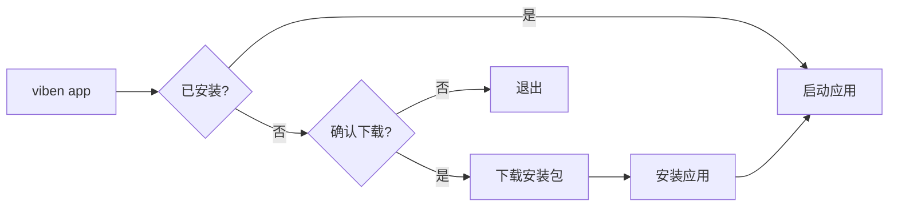

# Viben v1.2.4 更新日志

<p align="center">
  
</p>

## 亮点

- **viben app 命令**: 全新的桌面应用安装与启动命令，支持自动下载、进度显示和跨平台安装
- **首次启动体验优化**: Onboarding 完成后自动创建工作区标签页，避免空白界面

## 新功能

### viben app 命令

新增 `viben app` 命令，用于管理 Viben Desktop 桌面应用：

```bash
# 启动桌面应用（如未安装会提示下载）
viben app

# 安装指定版本
viben app install [version]

# 检查安装状态
viben app check
```

**特性**:
- 自动检测平台（macOS/Windows/Linux）
- 下载进度条显示
- GitHub Release 版本获取（支持 API 回退）
- 平台特定安装逻辑（DMG/NSIS/AppImage）



### Onboarding 初始标签页

完成 Onboarding 向导后，自动创建一个全局工作区标签页，确保用户首次进入应用时有内容可操作。

## 改进

- Desktop 全局工作区标签页支持 i18n 动态翻译（中文显示"全局工作空间"）
- Desktop CLI 安装日志增强：显示 Node.js 路径和完整 npm 命令
- 安装错误时自动展开日志节点，方便问题排查

## Bug 修复

- 修复了 Desktop CLI 安装时的竞态条件问题（Node.js 路径状态更新延迟）
- 修复了 Release 构建与 Dev 构建环境变量差异导致的安装失败问题

## 技术细节

| 变更项 | 文件数 | 新增行数 |
|--------|--------|----------|
| CLI app-installer | 3 | ~1,450 |
| Desktop 修复 | 7 | ~200 |
| 测试 | 1 | ~400 |

## 依赖更新

- 新增 `cli-progress` 用于下载进度显示

---

**完整变更日志**: https://github.com/LinXueyuanStdio/viben/compare/v1.2.3...v1.2.4
