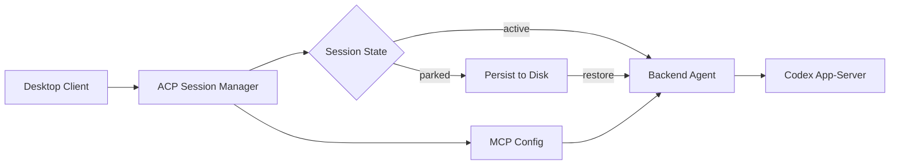

# Viben v1.3.1 更新日志

  

## 亮点

- **ACP 智能体通信协议**: 会话恢复、MCP 配置传递、Codex app-server 适配，多智能体协作体验大幅提升
- **Desktop Skills Market 重设计**: 双源技能市场（本地+云端），全新卡片 UI，统一安装流程
- **页面系统增强**: 静态页面云端发布、跨层级拖拽、页面模板 API
- **Provider 架构重构**: 统一 `provider_id` 命名，新增 OpenAI Responses 支持

---

## 新功能

### ACP 智能体通信协议

完整实现 ACP 会话生命周期管理，支持会话暂停/恢复、MCP 配置透传，以及 Codex app-server 适配。

- **会话恢复**: 页面刷新后自动恢复未完成的智能体会话
- **MCP 配置传递**: ACP 会话创建时自动携带 MCP 服务器配置
- **Codex app-server 适配**: 支持通过 ACP 协议连接 Codex 智能体服务
- **Thought Chunk 合并**: 相邻的 Claude Code 思考块自动合并，减少消息碎片
- **输入历史模块**: 新增会话输入历史记录

### Desktop Skills Market 重设计

全新设计的技能市场，支持本地和云端双源浏览。

| 功能 | v1.3.0 | v1.3.1 |
|------|--------|--------|
| 技能来源 | 单一来源 | 本地 + 云端双源 |
| 技能卡片 | 基础列表 | 全新卡片 UI 设计 |
| 安装流程 | 分散安装 | 统一安装器 |
| 云端技能 | 不支持 | 无限滚动 + 排序 |
| 国际化 | 部分支持 | 完整 i18n |

- **双源技能市场**: 同时浏览本地已安装技能和云端可用技能
- **技能卡片重设计**: 全新视觉风格，信息层次更清晰
- **统一技能安装器**: 一键安装/卸载，流程更顺畅
- **无限技能网格**: 虚拟滚动加载，流畅浏览海量技能
- **云端技能排序**: 支持按热度、更新时间等多维度排序

### 页面系统增强

- **云端页面发布**: 静态页面一键发布到 Viben 云端
- **Gateway 发布通道**: 通过 Gateway API 发布页面，支持用户隔离
- **页面树拖拽**: 支持跨层级拖拽和拖拽到根层级
- **页面模板 API**: `applyPageTemplate` 接口，快速套用页面模板
- **发布历史与版本**: 页面发布历史记录和版本管理 API

### Provider 架构

- **OpenAI Responses Provider**: 新增 `openai-responses` provider 类型
- **Provider 模型能力**: provider 模型能力声明与管理
- **ANTHROPIC_MODEL 环境变量**: 支持通过环境变量选择 Claude 模型

---

## 改进

- **设置侧边栏**: Desktop 设置页面新增侧边栏导航，设置项分类更清晰
- **ACP 会话列表抽屉**: UI 样式优化，会话信息展示更友好
- **审批模式重命名**: "审批模式"统一更名为"权限模式" (permission mode)
- **移除 Yoopta 编辑器**: 桌面端移除 Yoopta 编辑器依赖，精简包体积
- **Markdown 渲染增强**: 新增键盘导航辅助，完善 Markdown 示例
- **社区主页**: 集成会话处理，优化组件交互

---

## Bug 修复

- **聊天输入法回车发送**: 修复中文输入法下回车键误发送消息的问题 (#8c73102)
- **MCP OpenAPI 路由过滤**: 修复 OpenAPI 路由未正确过滤的问题
- **唤醒词监听行为**: 修复唤醒词预测间隔和监听逻辑
- **Codex ACP 智能体配置**: 修复配置传递不完整的问题
- **预览页 pnpm 依赖**: 修复预览页面依赖安装失败
- **桌面 E2E 测试**: 补齐主窗口选择 helper
- **CLI artifact 下载路径**: 修复 release workflow 中 CLI 构建产物的下载路径
- **Provider ID 分配**: 修复模型选择配置中 provider ID 赋值错误

---

## 重构

- **`model_provider` → `provider_id`**: 统一 agent 配置中的 provider 字段命名
- **`approval_mode` → `permission_mode`**: 权限模式语义化重命名
- **`apiKey` → `api_key`**: API 密钥字段命名统一为 snake_case
- **Gateway Client 迁移**: 从直接 API 客户端迁移到 Gateway 客户端
- **移除 custom provider**: 清理废弃的 custom provider 类型

---

## CI/CD

- **Submodule 支持**: CodeQL 和 deploy workflows 启用 submodule checkout
- **GH_PAT Token**: 为 submodule 访问添加 GitHub Personal Access Token
- **actions/checkout v4→v7**: 升级 GitHub Actions checkout action 到 v7 (#495)

---

## 贡献者

感谢所有为本次发布做出贡献的人！

---

**完整变更日志**: https://github.com/LinXueyuanStdio/viben/compare/v1.3.0...v1.3.1
