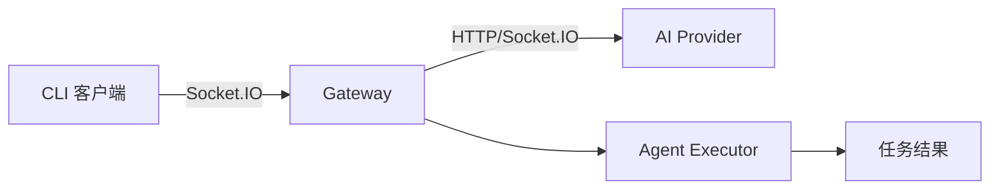

# Viben v1.3.2 更新日志

  

## 亮点

- **Socket.IO Gateway 支持**: CLI Gateway 现已支持 Socket.IO 传输协议，实现更高效的实时通信
- **跨平台测试脚本**: 为 macOS、Linux、Windows 平台添加完整的 CLI Gateway 集成测试

## 新功能

### Socket.IO Gateway 传输

Gateway 核心新增 Socket.IO 传输协议支持，提供比传统 HTTP 轮询更高效的实时双向通信能力。

| 功能 | v1.3.1 | v1.3.2 |
|------|--------|--------|
| HTTP Gateway | ✅ | ✅ |
| Socket.IO Gateway | ❌ | ✅ |
| 跨平台 CLI 测试 | 部分支持 | 完整支持 |

### 跨平台 CLI Gateway 测试

新增三个平台的自动化测试脚本，确保 Gateway 在 macOS、Linux、Windows 上的稳定性：

- `scripts/macos/test-cli-gateway.sh` — macOS 测试脚本
- `scripts/linux/test-cli-gateway.sh` — Linux 测试脚本
- `scripts/windows/test-cli-gateway.bat` — Windows 测试脚本

## 改进

- 重构 Gateway 入口代码，优化传输层抽象，为后续多协议支持奠定基础

## 贡献者

感谢所有为本次发布做出贡献的人！

---

**完整变更日志**: https://github.com/LinXueyuanStdio/viben/compare/v1.3.1...v1.3.2
