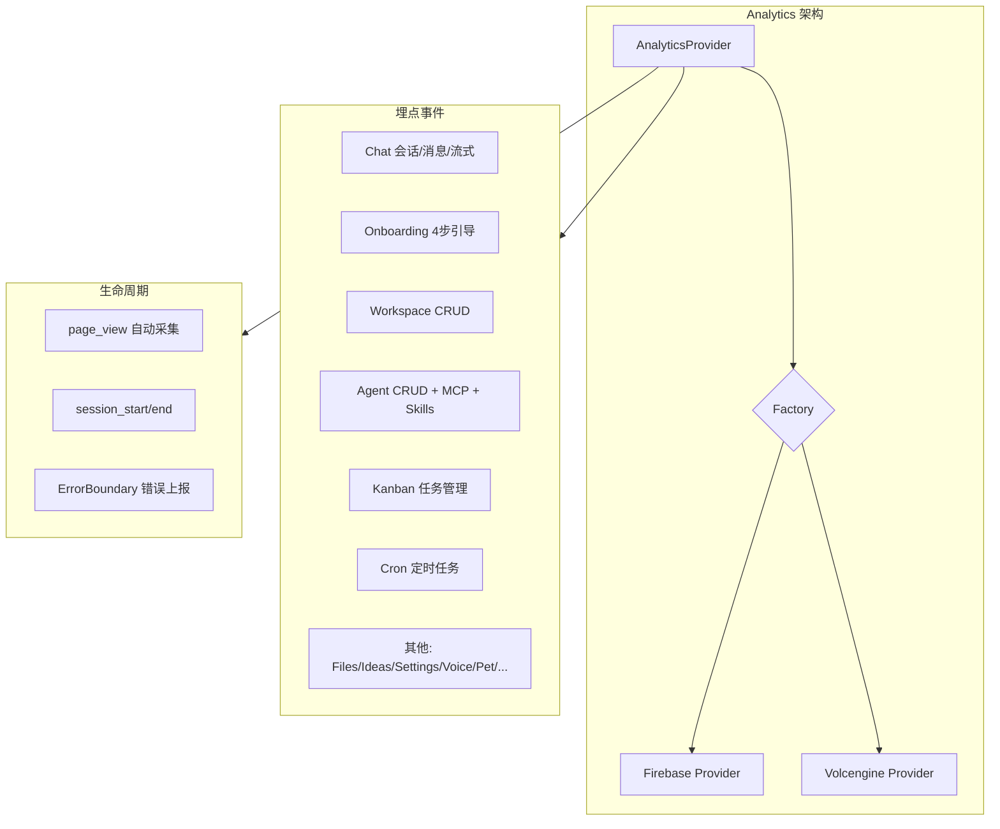

# Viben v1.3.3 更新日志

  

## 亮点

- **Firebase Analytics 全面接入**: 覆盖 72 个文件、70+ 分析事件，Provider 可替换架构（Firebase/Volcengine），业务全流程埋点
- **Gateway 诊断日志**: stderr 始终捕获到日志文件，生产环境启动失败不再"无迹可寻"

---

## 新功能

### Firebase Analytics 埋点系统

全面接入 Firebase Analytics，建立了完整的可替换 Provider 分析架构，覆盖桌面端所有核心业务流程。

| 模块 | 事件数 | 覆盖范围 |
|------|--------|----------|
| Chat | 6+ | session/message/stream/plan/slash_command |
| Onboarding | 4 | welcome/envCheck/login/agentSetup |
| Workspace | 3 | create/switch/delete |
| Agent | 5+ | CRUD + MCP + Skills + Default |
| Kanban | 3+ | task CRUD + move/status |
| Cron | 3+ | job CRUD + manual run |
| 其他 | 10+ | Files/Ideas/MCP/Skills/Settings/Voice/Pet |

**架构特性:**
- **Provider 可替换**: 通过 AnalyticsFactory 切换 Firebase 或 Volcengine，无需修改业务代码
- **类型安全**: 1315 行类型定义，覆盖所有分析事件和参数
- **应用初始化入口**: `lib/init.ts` 统一管理初始化流程
- **ErrorBoundary**: 自动捕获 React 组件树异常并上报
- **Gateway 侧 FirebaseService**: 支持 Bug 上报和事件埋点

---

## Bug 修复

- **Gateway 生产环境启动失败无日志**: 之前 `auto_start_gateway()` 在非 verbose 模式下将 stdout/stderr 都重定向到 `/dev/null`，当 Gateway 启动失败时完全没有诊断信息。现在 stderr 始终被捕获并写入 `~/.viben/logs/gateway-desktop.log`，确保每次启动失败都有诊断轨迹可追溯
- **Windows CLI 测试失败**: PowerShell `Start-Process -WindowStyle Hidden` 会关闭子进程的 stdin，导致 Bun 编译的二进制文件报 "Input redirection is not supported" 错误退出。改用 `cmd.exe start /B` 保持 stdin 连接，Windows CLI 集成测试恢复正常

---

## 清理

- **移除 Sentry 集成**: 移除 Sentry 错误监控、demo 文件（`demo-firebase.html`、`demo-volcengine.html`），将分析系统简化为 Firebase-only 方案

---

## 贡献者

感谢所有为本次发布做出贡献的人！

---

**完整变更日志**: https://github.com/LinXueyuanStdio/viben/compare/v1.3.2...v1.3.3
