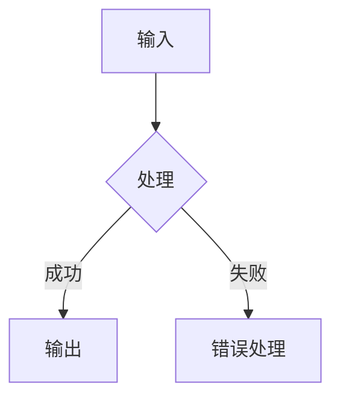
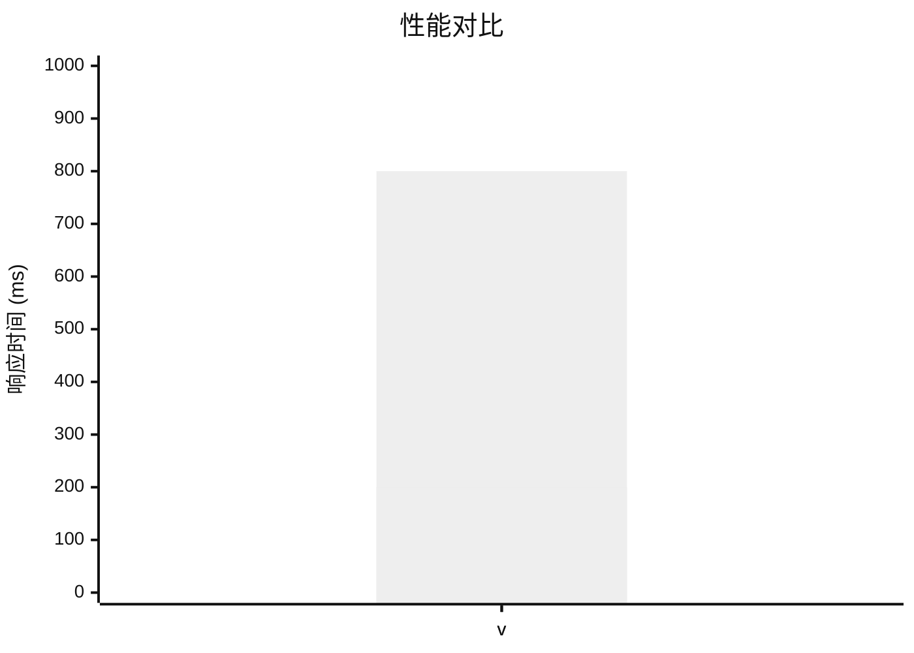

# Viben v<VERSION> 更新日志

> 复制此模板到 `<version>.md`（如 `1.2.0.md`）并填写内容
>
> **生成步骤**:
> 1. 运行 `git log $(git describe --tags --abbrev=0)..HEAD --oneline` 查看所有 commits
> 2. 根据 commit message prefix 分类（feat/fix/perf/refactor/docs/chore）
> 3. 撰写用户友好的 changelog

<!-- 可选: Viben 品牌 SVG 动画，增强视觉效果 -->

  

## 亮点

- **功能 1**: 简要描述
- **功能 2**: 简要描述

## 新功能

### 功能名称

功能的详细描述，包括：
- 使用方法
- 关键特性
- 相关命令或 API

<!-- 可选: 使用 Mermaid 图表展示架构或流程 -->

### API 变更对比

<!-- 可选: 使用表格展示 API 或功能变更 -->
| 功能 | 旧版本 | 新版本 | 说明 |
|------|--------|--------|------|
| 并发数 | 2 | 10 | 提升 5x |
| 启动时间 | 3s | 1s | 优化 67% |

## 改进

- 改进 1: 简要描述
- 改进 2: 简要描述

## Bug 修复

- 修复了 XXX 问题 (#issue_number)
- 修复了 YYY 导致的崩溃

## 破坏性变更

> 如果没有破坏性变更，删除此节

- **变更描述**: `旧 API` → `新 API`
  - **迁移指南**: 如何升级

## 性能提升

<!-- 可选: 使用 Mermaid 图表展示性能对比 -->

## 依赖更新

- 升级 `package-name` 从 v1.0.0 到 v2.0.0

## 贡献者

感谢所有为本次发布做出贡献的人！

<!-- 可选: 列出贡献者 -->
<!-- 
- @contributor1
- @contributor2
-->

---

**完整变更日志**: https://github.com/LinXueyuanStdio/viben/compare/v<PREV_VERSION>...v<VERSION>
