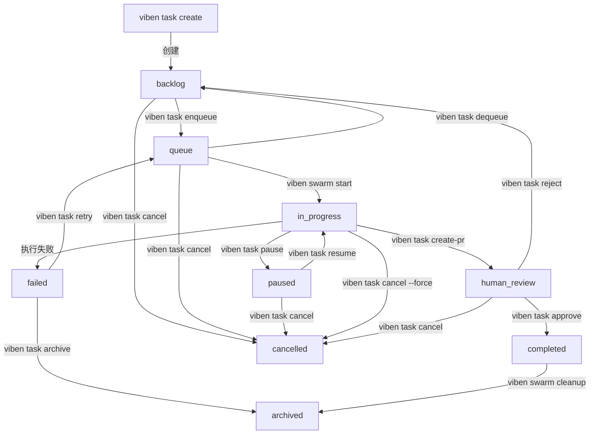

# viben task

> 任务管理命令，支持任务的完整生命周期管理。

## 概述

`viben task` 命令用于管理开发任务，包括任务的创建、配置、上下文管理、规划和监控。设计参考了 Trellis 的 `task.py` 和 GitHub CLI (`gh`) 的命令风格。

## 命令结构

```
viben task <subcommand> [options]
```

---

## 任务 CRUD

### `viben task list`

列出任务。

```bash
viben task list [--mine] [--status <status>] [--json]
```

**选项**:
| 选项 | 说明 |
|------|------|
| `--mine`, `-m` | 只显示分配给当前开发者的任务 |
| `--status`, `-s` | 按状态过滤 (backlog, in_progress, completed) |
| `--json` | JSON 格式输出 |

**示例**:
```bash
viben task list
viben task list --mine
viben task list --status in_progress --json
```

---

### `viben task create`

创建新任务。

```bash
viben task create <title> [options]
```

**选项**:
| 选项 | 说明 |
|------|------|
| `--slug <name>` | 任务标识符，默认从 title 生成 |
| `--assignee <dev>` | 分配给谁，默认当前开发者 |
| `--priority <P0-P3>` | 优先级，默认 P2 |
| `--agent <agent-id>` | 关联的智能体配置 |

**示例**:
```bash
viben task create "Add user authentication"
viben task create "Fix login bug" --slug fix-login --priority P1
viben task create "Implement API" --assignee john --agent coding-assistant
```

**输出**: 返回任务目录路径，如 `.viben/tasks/03-03-add-user-auth`

---

### `viben task view`

查看任务详情。

```bash
viben task view <task>
```

**示例**:
```bash
viben task view add-user-auth
viben task view .viben/tasks/03-03-add-user-auth
```

---

### `viben task edit`

编辑任务（打开编辑器）。

```bash
viben task edit <task>
```

---

### `viben task delete`

删除任务。

```bash
viben task delete <task> [--force]
```

---

## 任务状态（本地开发）

### `viben task start`

设为当前任务。

```bash
viben task start <task>
viben task start <task> --resume
```

**选项**:
| 选项 | 说明 |
|------|------|
| `--resume` | 同时恢复关联的智能体 session（如有） |

设置后，hook 会自动注入该任务的上下文文件。

**示例**:
```bash
viben task start add-user-auth
viben task start add-user-auth --resume    # 恢复智能体
```

---

### `viben task finish <task>`

完成指定任务。

```bash
viben task finish <task>
```

---

### `viben task archive`

归档已完成的任务。

```bash
viben task archive <task>
```

任务会被移动到 `archive/YYYY-MM/` 目录。

---

### `viben task list-archive`

列出归档任务。

```bash
viben task list-archive [YYYY-MM]
```

**示例**:
```bash
viben task list-archive           # 列出所有月份
viben task list-archive 2024-03   # 列出指定月份
```

---

## 状态生命周期管理

> 基于 [任务系统状态机](../task-system.md) 定义的完整状态生命周期 CLI 命令。

### 设计原则

1. **统一使用 task_dir** - 所有命令以任务目录名作为标识
2. **显式参数** - `viben task <command> <task>` 必须指定任务
3. **本地优先** - 直接操作 task.json 和 events.jsonl，不依赖 Gateway
4. **原子命令** - 每个命令负责单一状态转换

### 命令概览

```
viben task <command> <task>

状态转换命令:
  enqueue <task>     backlog → queue        入队等待执行
  dequeue <task>     queue → backlog        移出队列
  pause <task>       in_progress → paused   暂停执行
  resume <task>      paused → 恢复          恢复执行
  review <task>      展示审查信息           查看待审任务
  approve <task>     human_review → completed   批准完成
  reject <task>      human_review → backlog     拒绝返工
  retry <task>       failed → queue         重试失败任务
  cancel <task>      * → cancelled          取消任务
  stop <task>        cancel 的别名
```

### 与现有命令的关系

| 现有命令 | 用途 | 保持不变 |
|---------|------|---------|
| `start <task>` | 启动任务执行（串行或并行模式） | ✓ |
| `finish <task>` | 标记任务完成 | ✓ |
| `create-pr <task>` | 创建 PR 并进入 human_review | ✓ |
| `archive <task>` | 归档到 archive/ 目录 | ✓ |

---

### `viben task enqueue`

入队任务，从 backlog 进入 queue 状态。

```bash
viben task enqueue <task> [options]

Options:
  --agent <id>       执行智能体 ID
  --executor <type>  执行器类型 (CLAUDE_CODE, CURSOR, OPENCODE, etc.)
  --model <id>       模型 ID
  --priority <p>     优先级 (P0/P1/P2/P3)
```

**行为:**

1. 验证 task 状态为 `backlog`
2. 设置 `agent/executor/model`（如指定，入队后锁定）
3. 设置 `queuedAt` 时间戳（用于 FIFO 排序）
4. 状态变更: `backlog` → `queue`
5. 写入 `QUEUE` 事件到 `events.jsonl`

**示例:**

```bash
# 基本入队
viben task enqueue 03-10-feature-xyz

# 指定执行配置
viben task enqueue 03-10-feature-xyz --agent my-agent --executor CLAUDE_CODE --model claude-sonnet-4-20250514
```

---

### `viben task dequeue`

移出队列，从 queue 返回 backlog 状态。

```bash
viben task dequeue <task>
```

**行为:**

1. 验证状态为 `queue`
2. 清除 `queuedAt`
3. 状态变更: `queue` → `backlog`
4. 写入 `DEQUEUE` 事件

---

### `viben task pause`

暂停执行中的任务。

```bash
viben task pause <task>
```

**行为:**

1. 验证状态为 `in_progress` 或 `queue`
2. 保存 `pausedSnapshot`:
   ```json
   {
     "fromState": "in_progress",
     "subtaskIndex": 2,
     "pausedAt": "2026-03-11T10:00:00Z"
   }
   ```
3. 状态变更: `in_progress/queue` → `paused`
4. 写入 `PAUSE` 事件

---

### `viben task resume`

恢复暂停的任务。

```bash
viben task resume <task>
```

**行为:**

1. 验证状态为 `paused`
2. 读取 `pausedSnapshot.fromState`
3. 恢复到暂停前状态
4. 清除 `pausedSnapshot`
5. 写入 `RESUME` 事件

---

### `viben task review`

查看待审查任务的详细信息。

```bash
viben task review <task>
```

**输出:**

```
=== Task Review: 03-10-feature-xyz ===

Title:    实现用户认证功能
Status:   human_review
Priority: P1

PR URL:   https://github.com/org/repo/pull/123
Branch:   feature/03-10-feature-xyz

Files Changed: 12
+425 -89

Next steps:
  viben task approve 03-10-feature-xyz   # 批准完成
  viben task reject 03-10-feature-xyz    # 拒绝返工
```

**行为:**

1. 读取 task.json
2. 如有 pr_url，获取 PR 统计信息（通过 gh CLI）
3. 展示任务详情和下一步操作提示

---

### `viben task approve`

批准任务完成。

```bash
viben task approve <task>
```

**行为:**

1. 验证状态为 `human_review`
2. 设置 `completedAt` 为当前时间
3. 状态变更: `human_review` → `completed`
4. 写入 `APPROVED` 事件

---

### `viben task reject`

拒绝任务，返回待办。

```bash
viben task reject <task> [options]

Options:
  --reason <text>    拒绝原因
```

**行为:**

1. 验证状态为 `human_review`
2. 清除 `pr_url`（PR 可能需要关闭或重新提交）
3. 记录 `reviewReason: "rejected"` 和 `rejectReason`（如指定）
4. 状态变更: `human_review` → `backlog`
5. 写入 `REJECTED` 事件

---

### `viben task retry`

重试失败的任务。

```bash
viben task retry <task>
```

**行为:**

1. 验证状态为 `failed`
2. 清除错误相关字段
3. 重新设置 `queuedAt`
4. 状态变更: `failed` → `queue`
5. 写入 `RETRY` 事件

---

### `viben task cancel`

取消任务，直接进入 `cancelled` 终止状态。

```bash
viben task cancel <task> [options]
viben task stop <task>   # cancel 的别名

Options:
  --reason <text>    取消原因（可选）
  --force, -f        强制取消 in_progress 状态的任务
```

**行为:**

1. 验证任务状态在允许列表中：`backlog`, `queue`, `paused`, `in_progress`, `human_review`
2. 如果是 `in_progress` 且未指定 `--force`，报错退出：
   ```
   Error: Task is in_progress. Use --force to cancel a running task.
   ```
3. 记录 `cancelReason`（如指定）
4. 设置 `cancelledAt` 为当前时间
5. 状态变更 → `cancelled`
6. 写入 `CANCEL` 事件到 `events.jsonl`

**不允许取消的状态:**
- `completed` - 已完成，应使用 archive
- `failed` - 已失败，应使用 retry 或 archive
- `cancelled` - 已取消

---

### 状态转换验证

合法的状态转换:

| 命令 | 允许的起始状态 | 目标状态 |
|------|--------------|---------|
| enqueue | backlog | queue |
| dequeue | queue | backlog |
| pause | queue, in_progress | paused |
| resume | paused | queue 或 in_progress |
| approve | human_review | completed |
| reject | human_review | backlog |
| retry | failed | queue |
| cancel / stop | backlog, queue, paused, in_progress*, human_review | cancelled |

> *`in_progress` 状态需要 `--force` 参数

非法转换返回错误:

```
Error: Cannot enqueue task in 'in_progress' status. Expected: backlog
```

---

### 与其他系统的关系

#### Gateway Queue

`viben queue` 命令通过 Gateway API 操作队列，主要用于：
- 查看全局队列状态
- 远程管理任务

`viben task enqueue/dequeue` 直接操作本地文件，适用于：
- 本地开发工作流
- 无需启动 Gateway 的场景

两者状态兼容，Gateway 会读取 task.json 的状态。

#### Swarm

`viben swarm start` 会将任务状态设为 `in_progress`，与 `enqueue` 命令独立：

- `enqueue` 只是入队，不启动执行
- `swarm start` 启动 worktree agent 并执行

**典型工作流:**

```bash
viben task create "Feature XYZ"       # → backlog
viben task enqueue 03-11-feature-xyz  # → queue (可选，手动入队)
viben swarm start 03-11-feature-xyz   # → in_progress (自动处理状态)
```

---

### 完整状态生命周期图



---

## 任务配置

### `viben task set-branch`

设置 Git 分支。

```bash
viben task set-branch <task> --branch <branch-name>
```

**示例**:
```bash
viben task set-branch add-user-auth --branch feature/user-auth
```

---

### `viben task set-base`

设置 PR 目标分支。

```bash
viben task set-base <task> --branch <branch-name>
```

**示例**:
```bash
viben task set-base add-user-auth --branch develop
```

---

### `viben task set-agent`

设置关联的智能体配置。

```bash
viben task set-agent <task> --agent <agent-id>
```

---

## 上下文管理

### `viben task init-context`

初始化空上下文文件，由 research agent 填充。

```bash
viben task init-context <task>
```

创建的文件:
- `implement.jsonl` - 实现阶段上下文
- `check.jsonl` - 检查阶段上下文
- `fix.jsonl` - 修复阶段上下文

**示例**:
```bash
viben task init-context add-user-auth
```

---

### `viben task add-context`

添加上下文文件。

```bash
viben task add-context <task> <file>... [--reason <text>] [--recursive]
```

**选项**:
| 选项 | 说明 |
|------|------|
| `--reason <text>` | 添加原因 |
| `--recursive` | 递归添加目录 |

**示例**:
```bash
viben task add-context add-user-auth src/auth/
viben task add-context add-user-auth docs/api.md --reason "API 参考文档"
```

---

### `viben task remove-context`

移除上下文文件。

```bash
viben task remove-context <task> <file>...
```

---

### `viben task list-context`

列出上下文条目。

```bash
viben task list-context <task>
```

---

### `viben task validate-context`

验证上下文文件（检查引用的文件是否存在）。

```bash
viben task validate-context <task>
```

---

## 任务规划与监控

### `viben task plan-phase`

启动 Plan Agent 规划任务。

```bash
viben task plan-phase <task>
```

**示例**:
```bash
viben task plan-phase user-auth
```

Plan Agent 会:
1. 分析需求
2. 生成 prd.md
3. 配置任务参数

---

### `viben task status`

查看任务状态。

```bash
# 查看所有任务状态
viben task status                        # 显示所有任务摘要
viben task status --assignee <dev>       # 按分配人过滤
viben task status --status <status>      # 按状态过滤
viben task status --running              # 只显示有运行中智能体的任务
viben task status --json                 # JSON 输出

# 查看特定任务状态
viben task status <task>                 # 显示特定任务
viben task status <task> --detail        # 详细状态
viben task status <task> --watch         # 实时监控智能体日志
viben task status <task> --log           # 显示最近日志条目
```

**选项**:
| 选项 | 说明 |
|------|------|
| `--assignee`, `-a` | 按分配人过滤 |
| `--status`, `-s` | 按状态过滤 (backlog, in_progress, completed) |
| `--running` | 只显示有运行中智能体的任务 |
| `--json` | JSON 格式输出 |
| `--detail` | 显示详细状态 |
| `--watch` | 实时监控智能体日志 |
| `--log` | 显示最近日志条目 |

**摘要输出内容**:

运行中智能体：
- Phase（阶段）、Elapsed（耗时）、Branch（分支）
- Modified files（修改文件数）、Last tool（最后工具）、PID

已停止智能体：
- Status（状态）、最后消息、Resume 命令

普通任务：
- 按 assignee 分组、显示优先级和状态

**示例输出**:
```
=== Multi-Agent Status ===
  Agents:  2 running / 3 registered
  Tasks:   5 planning / 3 in_progress / 10 completed

Running Agents:
▶ add-user-auth [running] [P1] @john
  Phase:    implement (1/4)
  Elapsed:  5m 32s
  Branch:   feature/user-auth
  Modified: 3 file(s)
  Activity: Edit
  PID:      12345

Stopped Agents:
○ fix-login-bug [stopped]
  "正在分析登录逻辑..."
  viben swarm start fix-login-bug --resume

───────────────────────────────────────

@john:
  ● 03-03-add-user-auth (in_progress) [P1]
  ● 03-02-fix-bug (planning) [P2]

@alice:
  ● 03-01-docs (planning) [P3]
```

**示例**:
```bash
viben task status
viben task status --assignee john
viben task status --running
viben task status add-user-auth --detail
viben task status add-user-auth --watch
```

---

### `viben task create-pr`

从任务创建 PR。

```bash
viben task create-pr <task> [--dry-run]
```

**选项**:
| 选项 | 说明 |
|------|------|
| `--dry-run` | 只显示会做什么，不实际执行 |

**流程**:
1. 暂存并提交所有变更（排除 workspace/）
2. 推送到 remote
3. 使用 `gh pr create` 创建 Draft PR
4. 更新 task.json 状态为 completed

**示例**:
```bash
viben task create-pr add-user-auth
viben task create-pr add-user-auth --dry-run   # 预览
```

---

## 任务目录结构

```
.viben/tasks/
├── 03-03-add-user-auth/
│   ├── task.json           # 任务元数据
│   ├── prd.md              # 产品需求文档 (Plan Agent 生成)
│   ├── implement.jsonl     # 实现阶段上下文
│   ├── check.jsonl         # 检查阶段上下文
│   ├── fix.jsonl           # 修复阶段上下文
│   └── .plan-log           # Plan Agent 日志
└── archive/
    └── 2024-02/
        └── 02-15-old-task/
```

---

## task.json 格式

```json
{
  "id": "add-user-auth",
  "name": "add-user-auth",
  "title": "Add user authentication",
  "description": "",
  "status": "backlog",
  "dev_type": "backend",
  "priority": "P2",
  "creator": "john",
  "assignee": "john",
  "createdAt": "2024-03-03",
  "completedAt": null,
  "branch": "feature/user-auth",
  "base_branch": "main",
  "worktree_path": null,
  "current_phase": 0,
  "next_action": [
    {"phase": 1, "action": "implement"},
    {"phase": 2, "action": "check"},
    {"phase": 3, "action": "finish"},
    {"phase": 4, "action": "create-pr"}
  ],
  "commit": null,
  "pr_url": null,
  "subtasks": [],
  "relatedFiles": [],
  "notes": ""
}
```

---

## Trellis 命令映射

| Trellis 命令 | viben 命令 |
|-------------|-----------|
| `task.py create` | `viben task create` |
| `task.py list` | `viben task list` |
| `task.py start` | `viben task start` |
| `task.py finish` | `viben task finish <task>` |
| `task.py archive` | `viben task archive` |
| `task.py list-archive` | `viben task list-archive` |
| `task.py set-branch` | `viben task set-branch` |
| `task.py set-base-branch` | `viben task set-base` |
| `task.py init-context` | `viben task init-context` |
| `task.py add-context` | `viben task add-context` |
| `task.py list-context` | `viben task list-context` |
| `task.py validate` | `viben task validate-context` |
| `task.py create-pr` | `viben task create-pr` |
| `plan.py` | `viben task plan` |
| `status.py` | `viben task status` |

---

## Acceptance Criteria

### 任务 CRUD
- [ ] `viben task list` 列出所有任务
- [ ] `viben task create` 创建新任务
- [ ] `viben task view` 查看任务详情
- [ ] `viben task edit` 编辑任务
- [ ] `viben task delete` 删除任务

### 任务状态（本地开发）
- [ ] `viben task start` 设为当前任务
- [ ] `viben task finish <task>` 完成指定任务
- [ ] `viben task archive` 归档任务
- [ ] `viben task list-archive` 列出归档任务

### 状态生命周期管理
- [x] `viben task enqueue` 入队任务 (backlog → queue)
- [x] `viben task dequeue` 移出队列 (queue → backlog)
- [x] `viben task pause` 暂停任务 (queue/in_progress → paused)
- [x] `viben task resume` 恢复任务 (paused → 原状态)
- [x] `viben task review` 查看待审任务详情
- [x] `viben task approve` 批准完成 (human_review → completed)
- [x] `viben task reject` 拒绝返工 (human_review → backlog)
- [x] `viben task retry` 重试失败任务 (failed → queue)
- [x] `viben task cancel` 取消任务 (* → cancelled)
- [x] `viben task stop` cancel 的别名
- [x] 状态转换验证 (`validateStatusTransition`)
- [x] 事件追加 (`appendTaskEvent` → events.jsonl)

### 任务配置
- [ ] `viben task set-branch` 设置 Git 分支
- [ ] `viben task set-base` 设置 PR 目标分支
- [ ] `viben task set-agent` 设置关联智能体

### 上下文管理
- [ ] `viben task init-context` 初始化上下文
- [ ] `viben task add-context` 添加上下文
- [ ] `viben task remove-context` 移除上下文
- [ ] `viben task list-context` 列出上下文
- [ ] `viben task validate-context` 验证上下文

### 任务规划与监控
- [ ] `viben task plan` 启动 Plan Agent
- [ ] `viben task status` 查看状态
- [ ] `viben task status --running` 过滤运行中
- [ ] `viben task status --detail/--watch/--log` 详细监控
- [ ] `viben task start --resume` 恢复智能体
- [ ] `viben task create-pr` 创建 PR

---

## Related Documents

- [task-system.md](../task-system.md) - 任务系统状态机规范
- [swarm.md](./swarm.md) - 智能体集群调度
- [agent.md](./agent.md) - Agent 实例管理

## 实现位置

| 文件 | 描述 |
|------|------|
| `packages/core/src/cli/commands/task.ts` | CLI 命令实现 |
| `packages/core/src/cli/lib/viben-workspace.ts` | 工具函数 (`validateStatusTransition`, `appendTaskEvent`, `updateTaskStatus`) |
| `packages/core/src/cli/commands/task.test.ts` | 单元测试 |
