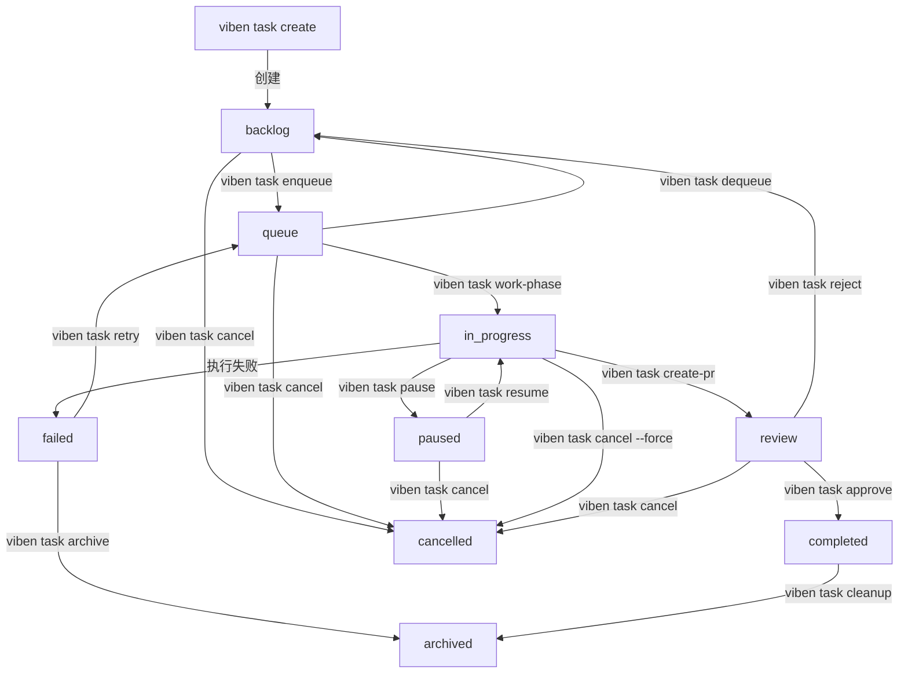

# Task 功能测试计划

> 日期: 2026-04-06
> 目标: 验证 viben task 命令系列的完整工作流程

## 1. 测试范围

### 1.1 核心命令

| 功能 | 命令 | 覆盖场景 |
|------|------|----------|
| 创建任务 | `viben task create <title>` | 创建 task.json 配置文件 |
| 列出任务 | `viben task list` | 列出活跃任务 |
| 查看任务 | `viben task view <task>` | 查看任务详情 |
| 编辑任务 | `viben task edit <task>` | 打开编辑器编辑 |
| 删除任务 | `viben task delete <task>` | 删除任务目录 |
| 完成任务 | `viben task finish <task>` | 标记任务完成 |
| 归档任务 | `viben task archive <task>` | 归档到 archive/ |
| 列出归档 | `viben task list-archive` | 列出归档任务 |

### 1.2 状态生命周期命令

| 功能 | 命令 | 验证点 |
|------|------|--------|
| 入队 | `viben task enqueue <task>` | backlog → queue |
| 出队 | `viben task dequeue <task>` | queue → backlog |
| 暂停 | `viben task pause <task>` | queue/in_progress → paused |
| 恢复 | `viben task resume <task>` | paused → 原状态 |
| 审查 | `viben task review <task>` | 展示 PR 信息 |
| 批准 | `viben task approve <task>` | review → completed |
| 拒绝 | `viben task reject <task>` | review → backlog |
| 重试 | `viben task retry <task>` | failed → queue |
| 取消 | `viben task cancel <task>` | * → cancelled |
| 停止 | `viben task stop <task>` | cancel 的别名 |

### 1.3 执行阶段命令

| Phase | 命令 | 验证点 |
|-------|------|--------|
| start | `viben task start <task>` | 启动执行流程，读取 start.md |
| plan | `viben task plan-phase <task>` | Plan Agent 生成 prd.md |
| work | `viben task work-phase <task>` | Work Agent 执行子任务 |
| implement | `viben task implement-phase <task>` | Implement Agent 写代码 |
| check | `viben task check-phase <task>` | Check Agent 检查代码 |
| worktree | `viben task create-worktree <task>` | 创建 git worktree |
| create-pr | `viben task create-pr <task>` | 创建 Draft PR |

### 1.4 配置命令

| 命令 | 验证点 |
|------|--------|
| `viben task set-branch <task> --branch <name>` | 更新 branch 字段 |
| `viben task set-base <task> --branch <name>` | 更新 base_branch 字段 |
| `viben task set-agent <task> --agent <id>` | 更新 agent 字段 |

### 1.5 上下文管理命令

| 命令 | 验证点 |
|------|--------|
| `viben task init-context <task>` | 创建 implement/check/fix.jsonl |
| `viben task add-context <task> <file>` | 追加上下文条目 |
| `viben task remove-context <task> <file>` | 删除上下文条目 |
| `viben task list-context <task>` | 列出所有上下文 |
| `viben task validate-context <task>` | 验证文件存在 |
| `viben task context <task>` | 获取完整上下文 |

### 1.6 监控命令

| 命令 | 验证点 |
|------|--------|
| `viben task status` | 显示所有任务摘要 |
| `viben task status <task>` | 显示特定任务 |
| `viben task status --running` | 过滤运行中任务 |
| `viben task status --watch` | 实时监控日志 |
| `viben task check-stuck <task>` | 检测卡住状态 |

## 2. 测试环境

### 2.1 初始化时创建的文件

```
/tmp/task-test/
├── .git/                           # git 仓库（必需）
├── .viben/
│   ├── .developer                  # 开发者标识（由 viben init 创建）
│   └── tasks/                      # 任务目录（由 viben 管理）
├── .claude/
│   └── commands/
│       └── viben/
│           └── start.md            # task start 依赖此文件
└── src/
    └── index.ts                    # 测试代码
```

### 2.2 Task 目录结构（由 viben 管理）

```
.viben/tasks/
├── 04-06-feature-xyz/              # 任务目录（MM-DD-slug 格式）
│   ├── task.json                   # 任务元数据
│   ├── events.jsonl                # 事件日志
│   ├── prd.md                      # 产品需求文档（Plan Agent 生成）
│   ├── implement.jsonl             # 实现阶段上下文
│   ├── check.jsonl                 # 检查阶段上下文
│   └── fix.jsonl                   # 修复阶段上下文
└── archive/
    └── 2026-04/
        └── 04-01-old-task/         # 归档任务
            └── task.json
```

### 2.3 task.json 格式

```json
{
  "id": "feature-xyz",
  "name": "feature-xyz",
  "title": "Implement feature XYZ",
  "description": "Add new feature",
  "status": "backlog",
  "priority": "P2",
  "creator": "test-developer",
  "assignee": "test-developer",
  "createdAt": "2026-04-06T10:00:00Z",
  "completedAt": null,
  "branch": "feature/xyz",
  "base_branch": "main",
  "worktree_path": null,
  "current_phase": 0,
  "next_action": [
    {"phase": 1, "action": "implement"},
    {"phase": 2, "action": "check"},
    {"phase": 3, "action": "finish"}
  ],
  "commit": null,
  "pr_url": null
}
```

### 2.4 events.jsonl 格式

```jsonl
{"type":"CREATE","timestamp":"2026-04-06T10:00:00Z","data":{"creator":"test-developer"}}
{"type":"QUEUE","timestamp":"2026-04-06T10:01:00Z","data":{}}
{"type":"START","timestamp":"2026-04-06T10:02:00Z","data":{"executor":"CLAUDE_CODE"}}
```

### 2.5 初始代码

```typescript
// src/index.ts
export function greet(name: string): string {
  return `Hello, ${name}`;
}

export function add(a: number, b: number): number {
  return a + b;
}

if (require.main === module) {
  console.log(greet("World"));
  console.log(add(1, 2));
}
```

## 3. 测试用例

### 3.1 场景 A: 基础 CRUD 流程

**目标**: 验证任务的创建、查看、修改、删除基本流程

**步骤**:

```bash
# ============================================
# 阶段 1: 初始化测试环境
# ============================================

# 1.1 清空测试目录
rm -rf /tmp/task-test
mkdir -p /tmp/task-test
cd /tmp/task-test

# 1.2 初始化 git
git init
mkdir -p src
cat > src/index.ts << 'EOF'
export function greet(name: string): string {
  return `Hello, ${name}`;
}

export function add(a: number, b: number): number {
  return a + b;
}
EOF
git add . && git commit -m "init"

# 1.3 初始化 viben
viben init --user task-tester

# ============================================
# 阶段 2: CRUD 操作
# ============================================

# 2.1 创建任务
viben task create "Add user authentication" --slug auth-feature --priority P1
# 验证: .viben/tasks/04-06-auth-feature/task.json 存在

# 2.2 列出任务
viben task list
# 验证: 显示 auth-feature 任务

# 2.3 查看任务
viben task view auth-feature
# 验证: 显示任务详情

# 2.4 修改任务配置
viben task set-branch auth-feature --branch feature/user-auth
viben task set-base auth-feature --branch develop
# 验证: task.json 中 branch 和 base_branch 已更新

# 2.5 删除任务
viben task create "Temp task" --slug temp-task
viben task delete temp-task --force
# 验证: temp-task 目录已删除

# 2.6 查看 JSON 输出
viben task list --json
viben task view auth-feature --json
```

**预期结果**:
- 任务创建成功，目录结构正确
- 列出任务显示正确信息
- 查看任务显示完整详情
- 配置修改正确保存
- 删除操作正确清理

### 3.2 场景 B: 状态生命周期完整流程

**目标**: 验证任务状态从 backlog 到 completed 的完整流转

**步骤**:

```bash
# 使用场景 A 的测试环境

# ============================================
# 阶段 1: backlog → queue → in_progress
# ============================================

# 1.1 创建任务（初始状态 backlog）
viben task create "Test lifecycle" --slug lifecycle-test
viben task view lifecycle-test --json
# 验证: status = "backlog"

# 1.2 入队任务
viben task enqueue lifecycle-test --executor CLAUDE_CODE
# 验证: status = "queue", queuedAt 有值

# 1.3 启动任务（模拟，需要 start.md）
# 注意: viben task start 会调用 AI，这里跳过
# 可以手动修改 task.json 来模拟
cat > .viben/tasks/04-06-lifecycle-test/task.json << 'EOF'
{
  "id": "lifecycle-test",
  "name": "lifecycle-test",
  "title": "Test lifecycle",
  "status": "in_progress",
  "priority": "P2",
  "assignee": "task-tester"
}
EOF

# ============================================
# 阶段 2: pause/resume 循环
# ============================================

# 2.1 暂停任务
viben task pause lifecycle-test
viben task view lifecycle-test --json
# 验证: status = "paused", pausedSnapshot.fromState = "in_progress"

# 2.2 恢复任务
viben task resume lifecycle-test
viben task view lifecycle-test --json
# 验证: status = "in_progress", pausedSnapshot = null

# ============================================
# 阶段 3: 完成流程
# ============================================

# 3.1 完成任务
viben task finish lifecycle-test
# 验证: status 变更

# 3.2 归档任务
viben task archive lifecycle-test
# 验证: 任务移动到 archive/2026-04/

# 3.3 列出归档
viben task list-archive
viben task list-archive 2026-04
```

**预期结果**:
- 状态转换符合状态机定义
- pausedSnapshot 正确记录和清除
- 归档正确移动文件

### 3.3 场景 C: 状态转换验证

**目标**: 验证所有合法/非法状态转换

**配置**: 使用 validateStatusTransition 函数

**测试矩阵**:

| 起始状态 | 事件 | 目标状态 | 预期结果 |
|----------|------|----------|----------|
| backlog | QUEUE | queue | ✓ 成功 |
| backlog | START | in_progress | ✗ 失败 |
| queue | START | in_progress | ✓ 成功 |
| queue | DEQUEUE | backlog | ✓ 成功 |
| queue | PAUSE | paused | ✓ 成功 |
| in_progress | PAUSE | paused | ✓ 成功 |
| in_progress | QUEUE | queue | ✗ 失败 |
| paused | RESUME | queue/in_progress | ✓ 成功 |
| paused | QUEUE | queue | ✗ 失败 |
| review | APPROVED | completed | ✓ 成功 |
| review | REJECTED | backlog | ✓ 成功 |
| failed | RETRY | queue | ✓ 成功 |
| completed | CANCEL | cancelled | ✗ 失败 |
| backlog | CANCEL | cancelled | ✓ 成功 |

**验证命令**:

```bash
# 非法转换应返回错误
viben task enqueue lifecycle-test  # 当 status != backlog 时
# 预期: Error: Cannot enqueue task in 'in_progress' status. Expected: backlog

viben task dequeue lifecycle-test  # 当 status != queue 时
# 预期: Error: Cannot dequeue task in 'backlog' status. Expected: queue
```

### 3.4 场景 D: Cancel/Stop 操作

**目标**: 验证 cancel 命令的各种场景

**步骤**:

```bash
# ============================================
# 场景 D1: 取消 backlog 任务
# ============================================

viben task create "Cancel test 1" --slug cancel-backlog
viben task cancel cancel-backlog
viben task view cancel-backlog --json
# 验证: status = "cancelled"

# ============================================
# 场景 D2: 取消 queue 任务
# ============================================

viben task create "Cancel test 2" --slug cancel-queue
viben task enqueue cancel-queue
viben task cancel cancel-queue
# 验证: status = "cancelled"

# ============================================
# 场景 D3: 取消 in_progress 任务（需要 --force）
# ============================================

viben task create "Cancel test 3" --slug cancel-progress
# 模拟 in_progress 状态
viben task cancel cancel-progress
# 预期: Error: Task is in_progress. Use --force to cancel a running task.

viben task cancel cancel-progress --force
# 验证: status = "cancelled"

# ============================================
# 场景 D4: cancel 带原因
# ============================================

viben task create "Cancel test 4" --slug cancel-reason
viben task cancel cancel-reason --reason "Requirements changed"
viben task view cancel-reason --json
# 验证: cancelReason = "Requirements changed"

# ============================================
# 场景 D5: stop 作为 cancel 别名
# ============================================

viben task create "Stop test" --slug stop-test
viben task stop stop-test
# 验证: 与 cancel 行为一致
```

**预期结果**:
- 从允许的状态可以取消
- in_progress 需要 --force
- 终止状态（completed, failed, cancelled）不可取消

### 3.5 场景 E: 上下文管理

**目标**: 验证任务上下文文件的管理

**步骤**:

```bash
# ============================================
# 阶段 1: 初始化上下文
# ============================================

viben task create "Context test" --slug context-test
viben task init-context context-test
# 验证: implement.jsonl, check.jsonl, fix.jsonl 已创建

# ============================================
# 阶段 2: 添加上下文
# ============================================

# 添加单个文件
viben task add-context context-test src/index.ts --reason "Main entry point"
viben task list-context context-test
# 验证: 显示 src/index.ts 条目

# 添加目录（递归）
mkdir -p src/utils
echo "export const VERSION = '1.0.0';" > src/utils/version.ts
viben task add-context context-test src/utils --recursive
viben task list-context context-test

# ============================================
# 阶段 3: 验证和移除上下文
# ============================================

# 验证上下文
viben task validate-context context-test
# 验证: 所有文件存在

# 删除一个文件后验证
rm src/utils/version.ts
viben task validate-context context-test
# 验证: 报告文件不存在

# 移除上下文
viben task remove-context context-test src/utils/version.ts
viben task list-context context-test
# 验证: 条目已移除

# ============================================
# 阶段 4: 获取完整上下文
# ============================================

viben task context context-test
viben task context context-test --json
```

**预期结果**:
- init-context 创建三个 jsonl 文件
- add-context 正确追加条目
- validate-context 检测缺失文件
- remove-context 正确删除条目
- context 输出完整上下文

### 3.6 场景 F: 任务监控

**目标**: 验证 status 命令的各种使用方式

**步骤**:

```bash
# ============================================
# 阶段 1: 准备多个任务
# ============================================

viben task create "Monitor task 1" --slug monitor-1 --priority P1
viben task create "Monitor task 2" --slug monitor-2 --priority P2
viben task create "Monitor task 3" --slug monitor-3 --priority P3
viben task enqueue monitor-1
# 模拟 monitor-2 为 in_progress

# ============================================
# 阶段 2: 状态查询
# ============================================

# 查看所有任务摘要
viben task status

# 按状态过滤
viben task status --status backlog
viben task status --status queue
viben task status -s in_progress

# 按分配人过滤
viben task status --assignee task-tester
viben task status -a task-tester

# 只显示运行中
viben task status --running

# JSON 输出
viben task status --json

# ============================================
# 阶段 3: 特定任务状态
# ============================================

# 查看特定任务
viben task status monitor-1

# 详细模式
viben task status monitor-1 --detail

# 显示日志
viben task status monitor-1 --log

# 列表模式
viben task status --list

# 注册表模式
viben task status --registry
```

**预期结果**:
- 摘要显示正确统计
- 过滤功能正常工作
- 详细模式显示更多信息
- JSON 输出格式正确

### 3.7 场景 G: 卡住检测

**目标**: 验证 check-stuck 命令的检测逻辑

**配置**: 模拟卡住场景

**步骤**:

```bash
# ============================================
# 场景 G1: 正常任务（未卡住）
# ============================================

viben task create "Normal task" --slug normal-task
viben task enqueue normal-task
# 模拟 in_progress 并有最近事件
viben task check-stuck normal-task
# 预期: Status: NOT STUCK

# ============================================
# 场景 G2: 事件超时
# ============================================

# 模拟最后事件超过阈值
# 修改 events.jsonl 使最后时间戳超过 2 分钟前
viben task check-stuck timeout-task -t 120000
# 预期: 检测到超时

# ============================================
# 场景 G3: 进程不存在
# ============================================

# 模拟 agent_pid 但进程已死
viben task check-stuck dead-process-task
# 预期: process check 失败

# ============================================
# 场景 G4: 自定义阈值
# ============================================

viben task check-stuck normal-task --threshold 60000  # 1分钟
viben task check-stuck normal-task -t 300000          # 5分钟

# ============================================
# 场景 G5: 输出格式
# ============================================

viben task check-stuck normal-task --verbose
viben task check-stuck normal-task --json
```

**检测逻辑**:

```
isStuck = process_not_running OR (event_timeout AND log_inactive)
```

**验证点**:
- [ ] status 检查: 只有 in_progress/queue 状态可判定卡住
- [ ] event_timestamp 检查: 超过阈值无新事件
- [ ] process 检查: PID 对应进程不存在
- [ ] log_activity 检查: 日志文件长时间未修改

### 3.8 场景 H: Review 工作流

**目标**: 验证审查相关命令

**步骤**:

```bash
# ============================================
# 阶段 1: 准备 review 状态任务
# ============================================

viben task create "Review task" --slug review-task
# 模拟到达 review 状态并有 PR
# 需要手动设置 task.json:
# {
#   "status": "review",
#   "pr_url": "https://github.com/org/repo/pull/123",
#   "branch": "feature/review-task"
# }

# ============================================
# 阶段 2: 审查操作
# ============================================

# 查看审查信息
viben task review review-task
# 预期输出:
# === Task Review: review-task ===
# Title:    Review task
# Status:   review
# PR URL:   https://github.com/org/repo/pull/123
# Branch:   feature/review-task
# ...
# Next steps:
#   viben task approve review-task
#   viben task reject review-task

# ============================================
# 阶段 3: 批准流程
# ============================================

viben task approve review-task
viben task view review-task --json
# 验证: status = "completed", completedAt 有值

# ============================================
# 阶段 4: 拒绝流程
# ============================================

# 准备另一个 review 任务
viben task create "Reject task" --slug reject-task
# 设置为 review 状态

viben task reject reject-task --reason "Needs more tests"
viben task view reject-task --json
# 验证: status = "backlog", rejectReason = "Needs more tests"

# ============================================
# 阶段 5: 重试流程
# ============================================

# 准备 failed 状态任务
viben task create "Failed task" --slug failed-task
# 设置为 failed 状态

viben task retry failed-task
viben task view failed-task --json
# 验证: status = "queue"
```

**预期结果**:
- review 命令显示 PR 信息
- approve 正确转换到 completed
- reject 正确转换到 backlog 并记录原因
- retry 正确转换到 queue

### 3.9 场景 I: Cleanup 操作

**目标**: 验证 worktree 清理功能

**步骤**:

```bash
# ============================================
# 阶段 1: 准备 worktree
# ============================================

viben task create "Worktree task" --slug worktree-task --branch feature/worktree-task
viben task create-worktree worktree-task
# 验证: .viben/worktrees/feature/worktree-task 存在

# ============================================
# 阶段 2: 列出 worktree
# ============================================

viben task cleanup --list
# 预期输出:
# === Git Worktrees ===
# /path/to/.viben/worktrees/feature/worktree-task  [feature/worktree-task]

# ============================================
# 阶段 3: 清理指定分支
# ============================================

viben task cleanup feature/worktree-task
# 交互确认或使用 --yes
viben task cleanup feature/worktree-task --yes
# 验证: worktree 已删除，分支已删除

# 保留分支
viben task cleanup feature/other-task --keep-branch --yes
# 验证: worktree 已删除，分支保留

# ============================================
# 阶段 4: 批量清理
# ============================================

# 清理已合并的 worktree
viben task cleanup --merged --yes

# 清理所有 worktree（危险操作）
viben task cleanup --all --yes
```

**清理流程**:
1. 归档任务目录到 `archive/YYYY-MM/`
2. 从 registry 移除 agent
3. 移除 Git worktree
4. 删除 Git 分支（除非 `--keep-branch`）

### 3.10 场景 J: 执行阶段命令

**目标**: 验证 phase 命令的独立使用

**前置条件**: 需要配置 agents 和 start.md

**步骤**:

```bash
# ============================================
# 阶段 1: 准备任务和 prd.md
# ============================================

viben task create "Phase test" --slug phase-test
# 创建 prd.md
cat > .viben/tasks/04-06-phase-test/prd.md << 'EOF'
# Phase Test PRD

## Goal
Test the phase commands.

## Requirements
- Add a new function
- Write tests
EOF

# ============================================
# 阶段 2: Plan Phase
# ============================================

viben task plan-phase phase-test
# 验证: Plan Agent 执行
# 或指定平台
viben task plan-phase phase-test --platform cursor

# ============================================
# 阶段 3: Work Phase
# ============================================

viben task work-phase phase-test
# 验证: Work Agent 执行
# 或前台运行
viben task work-phase phase-test --no-detach

# ============================================
# 阶段 4: 独立 Phase
# ============================================

# 直接运行 implement
viben task implement-phase phase-test

# 直接运行 check
viben task check-phase phase-test

# ============================================
# 阶段 5: 创建 PR
# ============================================

# 先在 worktree 中提交代码
viben task create-pr phase-test
# 验证: Draft PR 创建

# 或预览
viben task create-pr phase-test --dry-run
```

**前置条件检查**:
- plan-phase: task.json 必须存在
- work-phase: prd.md 必须存在
- implement-phase: prd.md 必须存在
- check-phase: prd.md 必须存在
- create-worktree: 任务状态不能是 rejected

### 3.11 场景 K: 创建任务高级选项

**目标**: 验证 create 命令的所有选项

**步骤**:

```bash
# ============================================
# 基本选项
# ============================================

# 自定义 slug
viben task create "My Task" --slug custom-slug

# 自定义分支
viben task create "Branch Task" --branch fix/bug-123

# 分配人
viben task create "Assigned Task" --assignee john

# 优先级
viben task create "Urgent Task" --priority urgent

# 描述
viben task create "Desc Task" --description "This is a detailed description"

# ============================================
# 执行相关选项
# ============================================

# 指定 agent
viben task create "Agent Task" --agent my-custom-agent

# 指定 executor
viben task create "Executor Task" --executor CURSOR

# 指定 model
viben task create "Model Task" --model claude-3-opus

# ============================================
# 自动启动
# ============================================

# 创建后自动入队
viben task create "Auto Start Task" --start

# 创建后在 worktree 中执行
viben task create "Worktree Task" --worktree

# 组合选项
viben task create "Full Task" \
  --slug full-test \
  --branch feature/full \
  --assignee alice \
  --priority P1 \
  --description "Full test" \
  --executor CLAUDE_CODE \
  --model claude-sonnet-4-20250514 \
  --start \
  --worktree
```

**验证 task.json 内容**:

```json
{
  "id": "full-test",
  "name": "full-test",
  "title": "Full Task",
  "description": "Full test",
  "status": "queue",
  "priority": "P1",
  "assignee": "alice",
  "branch": "feature/full",
  "executor": "CLAUDE_CODE",
  "model": "claude-sonnet-4-20250514",
  "worktree": true
}
```

## 4. 状态转换验证

### 4.1 状态机定义



### 4.2 事件类型

| 事件 | 触发命令 | 源状态 | 目标状态 |
|------|----------|--------|----------|
| CREATE | create | - | backlog |
| QUEUE | enqueue | backlog | queue |
| DEQUEUE | dequeue | queue | backlog |
| START | start/work-phase | queue | in_progress |
| PAUSE | pause | queue/in_progress | paused |
| RESUME | resume | paused | 原状态 |
| APPROVED | approve | review | completed |
| REJECTED | reject | review | backlog |
| RETRY | retry | failed | queue |
| CANCEL | cancel/stop | * | cancelled |

### 4.3 非法转换错误格式

```
Error: Cannot enqueue task in 'in_progress' status. Expected: backlog
Error: Cannot start task in 'backlog' status. Expected: queue
Error: Task is in_progress. Use --force to cancel a running task.
```

## 5. 执行顺序

| 顺序 | 场景 | 预计时间 | 依赖 |
|------|------|----------|------|
| 1 | A: 基础 CRUD | 10 min | 无 |
| 2 | B: 状态生命周期 | 15 min | A 完成 |
| 3 | C: 状态转换验证 | 10 min | A 完成 |
| 4 | D: Cancel/Stop | 10 min | A 完成 |
| 5 | K: 创建高级选项 | 10 min | A 完成 |
| 6 | E: 上下文管理 | 15 min | A 完成 |
| 7 | F: 任务监控 | 10 min | A 完成 |
| 8 | G: 卡住检测 | 15 min | B 完成 |
| 9 | H: Review 工作流 | 15 min | B 完成 |
| 10 | I: Cleanup 操作 | 15 min | B 完成 |
| 11 | J: 执行阶段命令 | 20 min | E 完成 |

## 6. 验收标准

### 6.1 必须通过

- [ ] `viben task create` 创建任务成功
- [ ] `viben task list` 列出任务正确
- [ ] `viben task view` 显示任务详情
- [ ] `viben task delete --force` 删除任务成功
- [ ] 状态转换验证正确（validateStatusTransition）
- [ ] events.jsonl 事件追加正确
- [ ] JSON 输出格式正确

### 6.2 应该通过

- [ ] `viben task enqueue/dequeue` 入队出队正常
- [ ] `viben task pause/resume` 暂停恢复正常
- [ ] `viben task approve/reject` 审批流程正常
- [ ] `viben task cancel --force` 强制取消正常
- [ ] `viben task archive` 归档正常
- [ ] 上下文管理命令正常
- [ ] 状态监控命令正常

### 6.3 执行阶段验证

- [ ] `viben task start` 读取 start.md 并执行
- [ ] `viben task plan-phase` 启动 Plan Agent
- [ ] `viben task work-phase` 启动 Work Agent
- [ ] `viben task create-worktree` 创建 worktree
- [ ] `viben task create-pr` 创建 Draft PR
- [ ] `viben task cleanup` 清理 worktree

## 7. 命令速查

```bash
# 初始化
viben init --user <developer-name>

# CRUD
viben task create "<title>" [--slug <name>] [--priority <P0-P3>]
viben task list [--mine] [--status <status>] [--json]
viben task view <task> [--json]
viben task edit <task>
viben task delete <task> [--force]

# 状态生命周期
viben task enqueue <task> [--agent <id>] [--executor <type>] [--model <id>]
viben task dequeue <task>
viben task pause <task>
viben task resume <task>
viben task finish <task>
viben task archive <task>

# 审核流程
viben task review <task>
viben task approve <task>
viben task reject <task> [--reason <text>]
viben task retry <task>
viben task cancel <task> [--reason <text>] [--force]
viben task stop <task>

# 配置
viben task set-branch <task> --branch <name>
viben task set-base <task> --branch <name>
viben task set-agent <task> --agent <id>

# 上下文
viben task init-context <task>
viben task add-context <task> <file>... [--reason <text>] [--recursive]
viben task remove-context <task> <file>...
viben task list-context <task>
viben task validate-context <task>
viben task context <task> [--json]

# 执行
viben task start <task> [--executor <type>] [--detach] [--worktree] [--resume]
viben task plan-phase <task> [--platform <platform>]
viben task work-phase <task> [--platform <platform>] [--no-detach]
viben task implement-phase <task>
viben task check-phase <task>
viben task create-worktree <task> [--skip-prd]
viben task create-pr <task> [--dry-run]

# 监控
viben task status [--status <s>] [--assignee <a>] [--running] [--json]
viben task status <task> [--detail] [--watch] [--log]
viben task check-stuck <task> [--threshold <ms>] [--verbose] [--json]

# 清理
viben task cleanup <branch> [--keep-branch] [--yes]
viben task cleanup --merged [--yes]
viben task cleanup --all [--yes]
viben task cleanup --list
```

## 8. 参考文档

- [task.md](./task.md) - 任务命令规范
- [task-system.md](../task-system.md) - 任务系统状态机规范
- [swarm.md](./swarm.md) - 智能体集群调度
- [evo.test.md](./evo.test.md) - FileEvo 测试计划（格式参考）

## 9. 实现位置

| 文件 | 描述 |
|------|------|
| `packages/core/src/cli/commands/task.ts` | CLI 命令实现 |
| `packages/core/src/cli/commands/task.test.ts` | 命令注册测试 |
| `packages/core/src/cli/commands/task-execution.test.ts` | 命令执行测试 |
| `packages/core/src/cli/lib/viben-workspace.ts` | 工具函数 |
| `packages/core/src/task/ops/*.ts` | 任务操作实现 |
| `packages/core/src/task/phase/*.ts` | 阶段命令实现 |
| `packages/core/src/task/events/event-store.ts` | 事件存储 |
| `packages/core/src/task/machine/*.ts` | 状态机实现 |
