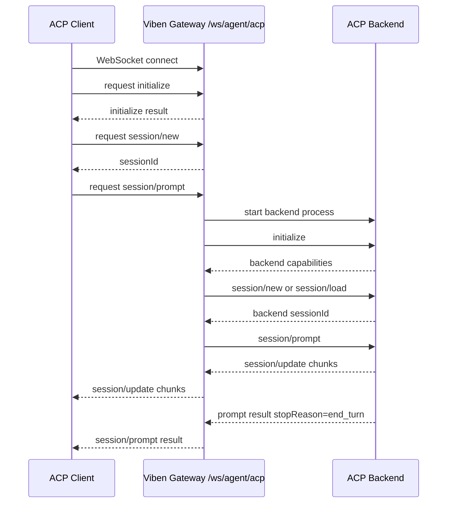
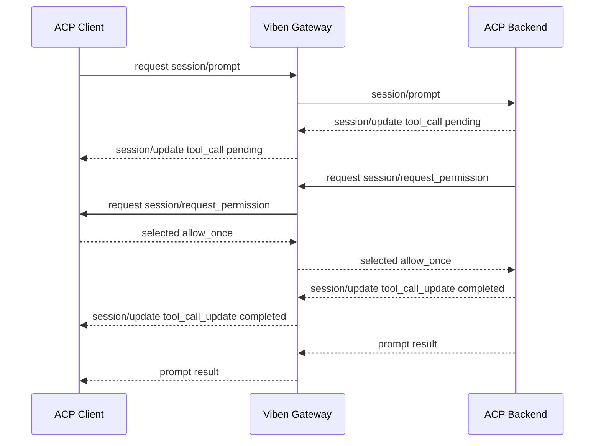
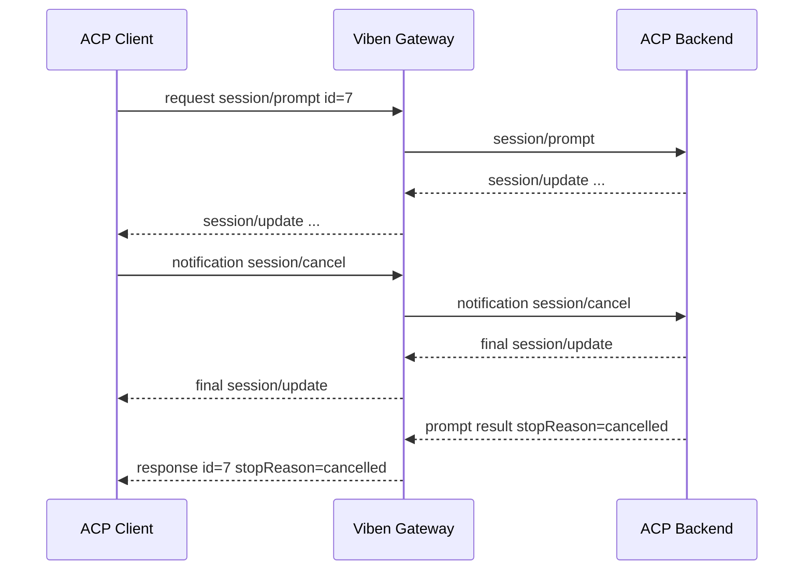
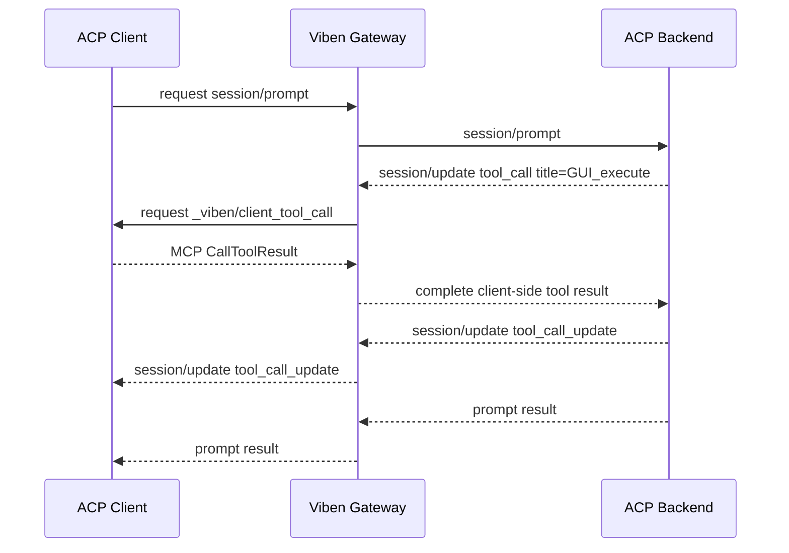
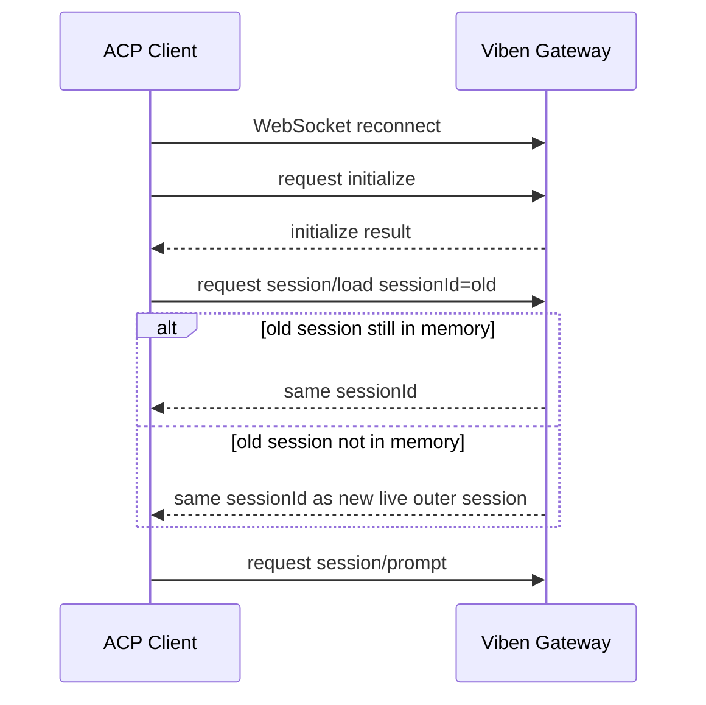
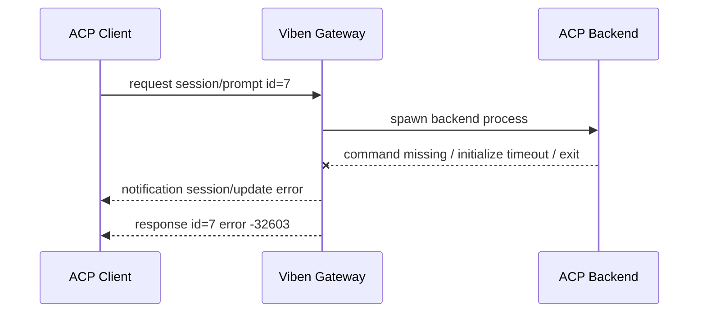
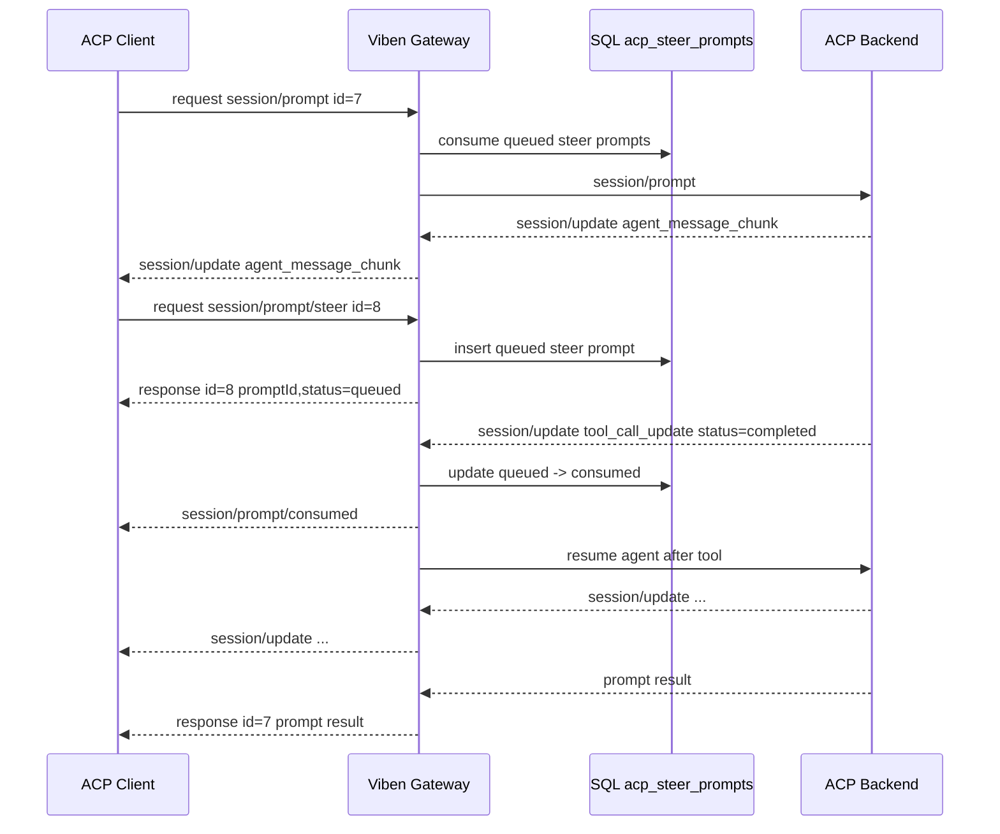
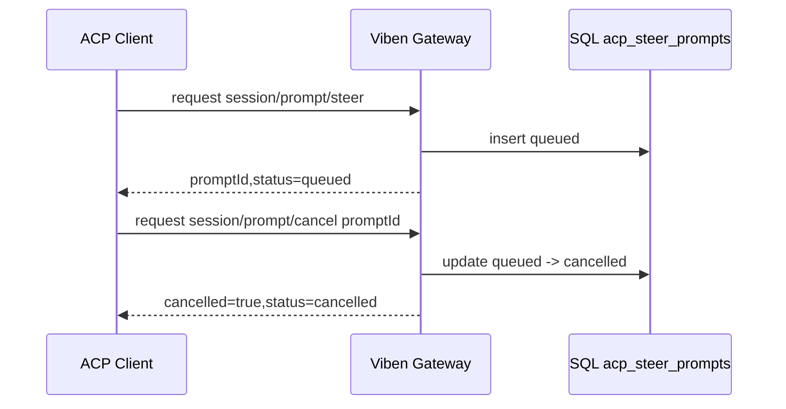
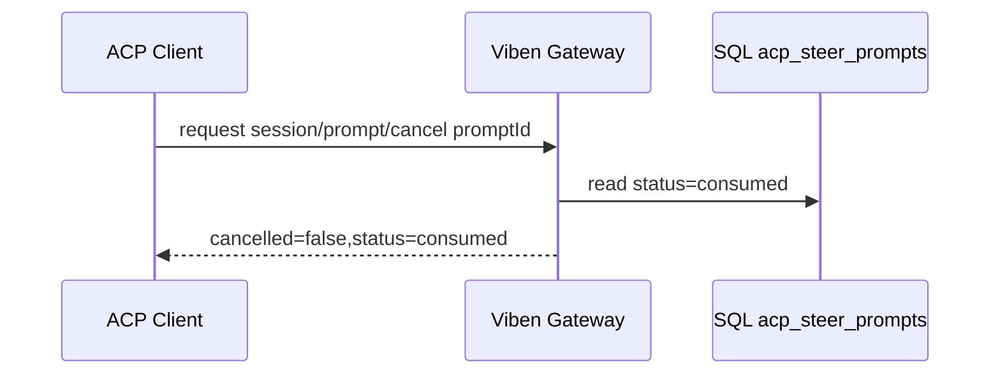
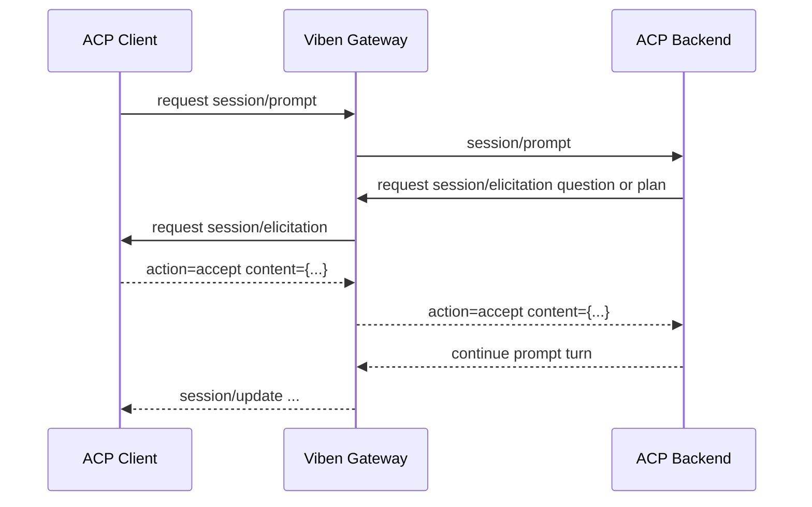

# Gateway ACP WebSocket 协议

> `/ws/agent/acp` - 通过 WebSocket 暴露 Viben Gateway 的 ACP 兼容智能体端点

## 概述

`/ws/agent/acp` 是 Viben Gateway 面向 ACP Client 的实时协议入口。客户端连接后，通过 JSON-RPC 2.0 调用 `initialize`、`session/new`、`session/prompt` 等 ACP 方法；Gateway 在内部启动或复用底层 ACP Backend（例如 Claude Code、Gemini、Codex、OpenCode 等），并把后端的 `session/update`、权限请求和客户端工具调用转发回客户端。

该端点和 `/ws/agent/run` 的职责不同：

| 端点 | 协议 | 适用场景 |
|------|------|----------|
| `/ws/agent/run` | Viben 自定义消息格式 | Viben Web/Desktop 旧执行流，消息以 `type` 区分 |
| `/ws/agent/acp` | ACP JSON-RPC 2.0 | ACP UI、外部编辑器、可互操作 Agent Client |

---

## 连接信息

### GET /ws/agent/acp

WebSocket Upgrade 后，连接上的每个文本帧承载一个或多个 JSON-RPC 消息。Gateway 写出时始终使用换行分隔 JSON 帧；读取时同时支持：

- 单个文本帧就是一个完整 JSON 对象。
- 一个文本帧包含多行 NDJSON，每一行是一个完整 JSON 对象。

**查询参数**:

| 参数 | 类型 | 必需 | 说明 |
|------|------|------|------|
| `cwd` | string | 否 | 会话工作目录；未提供时使用 Gateway 进程当前目录 |
| `agent_config_path` | string | 否 | 智能体 Markdown 配置文件路径，例如 `/repo/.viben/agents/coder/AGENTS.md` |
| `agent_dir` | string | 否 | 会话持久化读取智能体目录时使用 |
| `session_id` | string | 否 | Viben 外层持久化会话 ID，用于写入 UI 消息和原始 ACP 消息 |
| `task_id` | string | 否 | Viben 外层任务 ID，用于写入 UI 消息 |
| `gateway_url` | string | 否 | 注入给后端 MCP/工具的 Gateway 地址 |

**示例**:

```text
ws://127.0.0.1:18790/ws/agent/acp?cwd=/repo&agent_config_path=/repo/.viben/agents/coder/AGENTS.md&session_id=sess_1&task_id=task_1
```

**子协议**:

客户端可以声明 `acp.v1` 子协议。Gateway 当前不依赖子协议完成路由，协议版本以 `initialize` 的 `protocolVersion` 为准。

**认证**:

Gateway 当前没有在该路由实现独立认证；如果部署环境需要认证，应由上游 Gateway 中间件、反向代理或 WebSocket 握手层处理。

---

## JSON-RPC 基础格式

所有消息都必须是 JSON-RPC 2.0 对象。

**请求**:

```json
{
  "jsonrpc": "2.0",
  "id": 1,
  "method": "session/prompt",
  "params": {}
}
```

**响应**:

```json
{
  "jsonrpc": "2.0",
  "id": 1,
  "result": {}
}
```

**错误响应**:

```json
{
  "jsonrpc": "2.0",
  "id": 1,
  "error": {
    "code": -32602,
    "message": "Invalid params: session/prompt requires sessionId and prompt",
    "data": {}
  }
}
```

**通知**:

```json
{
  "jsonrpc": "2.0",
  "method": "session/cancel",
  "params": {
    "sessionId": "acp-session-id"
  }
}
```

**错误码**:

| code | 含义 | 典型来源 |
|------|------|----------|
| `-32700` | Parse error | WebSocket 收到不可解析 JSON |
| `-32600` | Invalid request | JSON-RPC 对象结构非法 |
| `-32601` | Method not found | 调用了未实现方法，例如 `session/set_mode` |
| `-32602` | Invalid params | 参数缺失或 schema 校验失败 |
| `-32603` | Internal error | 后端执行器启动、运行或工具调用失败 |
| `-32000` | Authentication required | ACP 后端要求认证时可能返回 |
| `-32002` | Resource not found | 文件或资源不存在时可能返回 |

---

## 方法总览

### Client -> Gateway 请求

| 方法 | JSON-RPC 类型 | Gateway 支持 | 说明 |
|------|---------------|--------------|------|
| `initialize` | request | 是 | 协商 ACP 版本、能力和认证方式 |
| `authenticate` | request | 是 | 当前返回空对象；Gateway 不声明 `authMethods` |
| `session/new` | request | 是 | 创建 Viben 外层 ACP 会话 |
| `session/load` | request | 是 | 复用或加载指定外层 ACP 会话 |
| `session/list` | request | 是 | 列出当前 Gateway 进程内 ACP 会话 |
| `session/close` | request | 是 | 关闭外层会话并释放后端进程 |
| `session/prompt` | request | 是 | 发送一轮用户 prompt，响应在该轮结束后返回 |
| `session/prompt/steer` | request | Viben 扩展 | 会话忙碌时立即入队一条 steer prompt |
| `session/prompt/cancel` | request | Viben 扩展 | 取消尚未消费的 steer prompt |
| `session/prompt/view` | request | Viben 扩展 | 查看 steer prompt 队列记录 |
| `session/interrupt` | request/notification | Viben 扩展 | 中断当前执行，并优先把 queued steer prompt 转为下一轮 prompt |
| `session/cancel` | notification | 是 | 取消指定会话当前运行 prompt 和排队 prompt |
| `session/set_mode` | request | 否 | 未在 Gateway Agent 接口实现，返回 `-32601` |
| `session/set_model` | request | 否 | 未在 Gateway Agent 接口实现，返回 `-32601` |
| `session/set_config_option` | request | 否 | 未在 Gateway Agent 接口实现，返回 `-32601` |
| `session/fork` | request | 否 | 未实现，返回 `-32601` |
| `session/resume` | request | 否 | 未实现，返回 `-32601` |
| `logout` | request | 否 | 未实现，返回 `-32601` |
| 其他方法 | request/notification | 视情况 | SDK 会尝试走扩展方法；当前 Gateway Agent 未实现扩展处理 |

### Gateway -> Client 请求或通知

| 方法 | JSON-RPC 类型 | 触发条件 | 说明 |
|------|---------------|----------|------|
| `session/update` | notification | 后端产生流式内容、工具调用、计划、用量等更新 | 客户端必须按 `sessionId` 归并到对应会话 |
| `session/prompt/consumed` | notification | Gateway 消费 queued steer prompt | Viben 扩展通知；客户端不能主动请求该方法 |
| `session/elicitation` | request | 后端需要结构化用户输入、问题回答或计划确认 | 客户端返回 accept/decline/cancel 和表单内容 |
| `session/request_permission` | request | 后端执行敏感工具前需要用户授权 | 客户端必须返回 selected 或 cancelled |
| `_viben/client_tool_call` | request | 后端请求客户端侧工具，或 Viben 拦截到客户端侧 MCP 工具 | Viben 扩展方法，结果使用 MCP `CallToolResult` 形态 |
| `fs/read_text_file` | request | 后端直接请求客户端文件读取 | 仅客户端声明并实现 `fs.readTextFile` 时可用 |
| `fs/write_text_file` | request | 后端直接请求客户端文件写入 | 仅客户端声明并实现 `fs.writeTextFile` 时可用 |
| `terminal/*` | request | 后端请求客户端终端能力 | Viben Gateway 给内层后端声明 `terminal: false`，通常不会出现 |
| 其他扩展方法 | request/notification | 后端透传扩展 | 客户端应按能力或方法名决定是否处理 |

### 心跳

客户端可以发送 JSON-RPC 通知 `$/ping` 作为应用层心跳：

```json
{"jsonrpc":"2.0","method":"$/ping"}
```

这是通知，不带 `id`。Gateway 当前没有实现该扩展通知处理；按 JSON-RPC 通知语义，客户端不应等待响应。若未来严格校验未知通知，应保持对 `$/` 命名空间的静默忽略。

---

## initialize

客户端连接后必须先调用 `initialize`。

**请求**:

```json
{
  "jsonrpc": "2.0",
  "id": 1,
  "method": "initialize",
  "params": {
    "protocolVersion": 1,
    "clientInfo": {
      "name": "acp-ui",
      "version": "1.0.0"
    },
    "clientCapabilities": {
      "fs": {
        "readTextFile": false,
        "writeTextFile": false
      },
      "terminal": false,
      "_meta": {
        "_vibenClientTools": true
      }
    }
  }
}
```

**响应**:

```json
{
  "jsonrpc": "2.0",
  "id": 1,
  "result": {
    "protocolVersion": 1,
    "agentInfo": {
      "name": "viben",
      "title": "Viben Gateway",
      "version": "1.0.0"
    },
    "agentCapabilities": {
      "loadSession": true,
      "sessionCapabilities": {
        "list": {},
        "close": {}
      },
      "promptCapabilities": {
        "embeddedContext": false,
        "image": false,
        "audio": false
      },
      "_meta": {
        "_vibenClientTools": true
      }
    },
    "authMethods": []
  }
}
```

**规则**:

- `protocolVersion` 当前来自 `@agentclientprotocol/sdk`，现行为 `1`。
- `authMethods` 为空表示 Gateway 本身不需要 ACP 认证。
- `promptCapabilities.image/audio/embeddedContext` 均为 `false`；客户端应只发送文本或基础 resource link。Viben 当前执行 prompt 时只把 `type: "text"` 的内容块拼成文本交给后端。

---

## session/new

创建一个新的外层 ACP 会话。此时 Gateway 只创建会话记录，不一定立刻启动后端进程；后端通常在第一次 `session/prompt` 时启动。

**请求**:

```json
{
  "jsonrpc": "2.0",
  "id": 2,
  "method": "session/new",
  "params": {
    "cwd": "/repo",
    "mcpServers": [],
    "agent_config": {
      "name": "coder",
      "executor_type": "CLAUDE_CODE",
      "model": "claude-sonnet-4-20250514",
      "system_prompt": "你是一个编码智能体。",
      "mcp_servers": [],
      "permission_mode": "acceptEdits"
    },
    "persist_session_id": "ui-session-1",
    "persist_task_id": "task-1",
    "gateway_url": "http://127.0.0.1:18790"
  }
}
```

**响应**:

```json
{
  "jsonrpc": "2.0",
  "id": 2,
  "result": {
    "sessionId": "9b0d8286-1f9a-45ea-b818-e6270c620062"
  }
}
```

**标准字段**:

| 字段 | 类型 | 必需 | 说明 |
|------|------|------|------|
| `cwd` | string | 是 | 会话工作目录，建议绝对路径 |
| `mcpServers` | array | 是 | ACP MCP server 列表 |

**Viben 扩展字段**:

| 字段 | 类型 | 说明 |
|------|------|------|
| `agent_config` | object | 内联智能体配置，优先于只靠查询参数 |
| `agent_config_path` | string | 智能体 Markdown 配置路径；未传时回退查询参数 |
| `agent_dir` | string | 会话存储智能体目录；未传时回退查询参数 |
| `persist_session_id` | string | Viben UI 会话 ID；用于持久化 UI 消息 |
| `persist_task_id` | string | Viben 任务 ID；用于持久化 UI 消息 |
| `gateway_url` | string | 传给后端 MCP/工具的 Gateway 地址 |
| `sandbox_config` | object | 沙箱配置，例如 `{ "enabled": true, "provider": "native" }` |

> 兼容性：代码中同时接受 camelCase 和 snake_case 版本，例如 `agentConfig` 与 `agent_config`。Gateway API 和文件存储规范要求新客户端使用 snake_case。边界规则是：ACP SDK 标准字段保持 ACP 定义的 camelCase，例如 `sessionId`、`mcpServers`、`toolCallId`、`requestedSchema`；Gateway 查询参数、文件存储字段以及 Viben 扩展字段使用 snake_case，例如 `session_id`、`agent_config_path`、`agent_id`、`user_id`。Viben 扩展中的 `_meta` 保持 ACP/MCP 风格的下划线前缀字段。

**AgentConfigPayload 字段**:

```json
{
  "name": "coder",
  "model": "claude-sonnet-4-20250514",
  "provider": "anthropic",
  "system_prompt": "完整系统提示词",
  "append_prompt": "追加提示词",
  "temperature": 0.2,
  "max_tokens": 4096,
  "executor_type": "CLAUDE_CODE",
  "executor_config": {},
  "mcp_servers": [],
  "skills": [],
  "plan_mode": false,
  "approvals": true,
  "dangerously_skip_permissions": false,
  "permission_mode": "acceptEdits"
}
```

**后端选择**:

`executor_type` 决定内层 ACP Backend。常见值包括 `CLAUDE_CODE`、`CLAUDE`、`GEMINI`、`CODEX`、`OPENCODE`、`OPENCLAW`、`QWEN_CODE`、`COPILOT`、`CURSOR` 等。未提供时默认使用 `CLAUDE_CODE`。

---

## session/load

加载指定外层 ACP 会话。若该外层会话仍在内存中，Gateway 更新连接并返回原会话；若不存在，则用请求中的 `sessionId` 创建一个新的外层会话，并把同一个 ID 作为后端加载目标。

**请求**:

```json
{
  "jsonrpc": "2.0",
  "id": 3,
  "method": "session/load",
  "params": {
    "sessionId": "9b0d8286-1f9a-45ea-b818-e6270c620062",
    "cwd": "/repo",
    "mcpServers": [],
    "agent_config_path": "/repo/.viben/agents/coder/AGENTS.md"
  }
}
```

**响应**:

```json
{
  "jsonrpc": "2.0",
  "id": 3,
  "result": {
    "sessionId": "9b0d8286-1f9a-45ea-b818-e6270c620062"
  }
}
```

**错误 case**:

如果缺少 `sessionId`，返回 `-32602`：

```json
{
  "jsonrpc": "2.0",
  "id": 3,
  "error": {
    "code": -32602,
    "message": "Invalid params: session/load requires sessionId",
    "data": {
      "request": {}
    }
  }
}
```

**Session ID 语义**:

- 外层 ACP `sessionId`：客户端在 `/ws/agent/acp` 上看到和传入的会话 ID。`session/new` 由 Gateway 生成；`session/load` 使用客户端传入的 `sessionId`。
- 后端 ACP session ID：内层 ACP Backend 自己返回的 session ID。Gateway 保存为 `sdkSessionId`，并在后续 `backend.prompt` 时使用；客户端通常不直接使用它。
- 持久化 `session_id`：WebSocket 查询参数或 `persist_session_id`，用于 Viben UI 消息和 raw ACP 消息落盘，不等同于外层 ACP `sessionId`。
- `session/resume`：当前 Gateway 未实现，调用返回 `-32601`。客户端恢复 live connection 时使用 `session/load`；历史 UI 展示依赖 Viben 持久化会话读取，不由 ACP `session/resume` 完成。

---

## session/list

列出当前 Gateway 进程内存中的外层 ACP 会话。

**请求**:

```json
{
  "jsonrpc": "2.0",
  "id": 4,
  "method": "session/list",
  "params": {
    "cwd": "/repo"
  }
}
```

**响应**:

```json
{
  "jsonrpc": "2.0",
  "id": 4,
  "result": {
    "sessions": [
      {
        "sessionId": "9b0d8286-1f9a-45ea-b818-e6270c620062",
        "cwd": "/repo",
        "title": "Viben Gateway",
        "updatedAt": "2026-06-05T12:00:00.000Z"
      }
    ]
  }
}
```

**注意**:

- 当前实现没有按 `cwd` 过滤，也没有分页；会返回进程内全部外层 ACP 会话。
- `title` 来自会话能力 `_meta.title`，通常可能为空。

---

## session/close

关闭指定外层会话，释放后端 ACP 连接和子进程，并从当前 WebSocket 连接的 owned sessions 集合中移除。

**请求**:

```json
{
  "jsonrpc": "2.0",
  "id": 5,
  "method": "session/close",
  "params": {
    "sessionId": "9b0d8286-1f9a-45ea-b818-e6270c620062"
  }
}
```

**响应**:

```json
{
  "jsonrpc": "2.0",
  "id": 5,
  "result": {}
}
```

**连接关闭清理**:

WebSocket 断开时，Gateway 会自动关闭该连接创建或加载过的所有 owned sessions。

---

## authenticate

Gateway 当前声明 `authMethods: []`，通常客户端不需要调用 `authenticate`。

**请求**:

```json
{
  "jsonrpc": "2.0",
  "id": 6,
  "method": "authenticate",
  "params": {
    "methodId": "unused"
  }
}
```

**响应**:

```json
{
  "jsonrpc": "2.0",
  "id": 6,
  "result": {}
}
```

---

## session/prompt

向会话发送一轮用户输入。`session/prompt` 是长请求：Gateway 会在请求未返回期间持续向客户端发送 `session/update` 通知；直到后端结束、取消或出错后才返回 `PromptResponse` 或错误响应。

**请求**:

```json
{
  "jsonrpc": "2.0",
  "id": 7,
  "method": "session/prompt",
  "params": {
    "sessionId": "9b0d8286-1f9a-45ea-b818-e6270c620062",
    "prompt": [
      {
        "type": "text",
        "text": "请实现登录页并补充测试。"
      }
    ]
  }
}
```

**成功响应**:

```json
{
  "jsonrpc": "2.0",
  "id": 7,
  "result": {
    "stopReason": "end_turn",
    "usage": {
      "inputTokens": 1200,
      "outputTokens": 900,
      "totalTokens": 2100
    }
  }
}
```

**stopReason**:

| 值 | 说明 |
|----|------|
| `end_turn` | 正常结束 |
| `max_tokens` | 达到输出上限 |
| `max_turn_requests` | 达到本轮请求上限 |
| `refusal` | 模型拒绝 |
| `cancelled` | 用户取消 |
| `error` | Viben 扩展，内部错误时可能出现在会话状态或封装响应中 |

**规则**:

- `sessionId` 必须存在。
- `prompt` 必须是数组。
- Viben 当前只把 `type: "text"` 且含 `text` 的内容块拼接为纯文本；其他内容块不会进入底层 prompt 文本。
- `session/prompt` 表示开启一轮完整 prompt turn。客户端如果检测到会话正在流式输出或工具执行中，不应再发起新的 `session/prompt`；应使用 `session/prompt/steer` 追加运行中指令。
- 用户 prompt 会持久化为 UI 消息；后端 `session/update` 会按可识别类型持久化为 UI 消息和 raw ACP 消息。

**错误 case**:

```json
{
  "jsonrpc": "2.0",
  "id": 7,
  "error": {
    "code": -32602,
    "message": "Invalid params: session/prompt requires sessionId and prompt",
    "data": {
      "request": {
        "sessionId": "9b0d8286-1f9a-45ea-b818-e6270c620062"
      }
    }
  }
}
```

---

## session/prompt/steer

`session/prompt/steer` 是 Viben ACP 扩展方法，用于在 Agent 正在流式输出、执行工具或处理当前 turn 时追加用户指令。它的参数与 `session/prompt` 基本一致，但处理逻辑不同：

- `session/prompt` 是长请求，等待当前 turn 完成并返回 `PromptResponse`。
- `session/prompt/steer` 是短请求，只负责把 steer prompt 立即写入 SQL 队列并返回队列记录。
- steer prompt 是否被 Agent 消费，通过 Gateway 主动发送的 `session/prompt/consumed` 通知、`session/prompt/view` 或 `session/update` 扩展更新确认。

**请求**:

```json
{
  "jsonrpc": "2.0",
  "id": 8,
  "method": "session/prompt/steer",
  "params": {
    "sessionId": "9b0d8286-1f9a-45ea-b818-e6270c620062",
    "prompt": [
      {
        "type": "text",
        "text": "先不要改样式，优先补测试。"
      }
    ],
    "agent_id": "coder",
    "user_id": "u_123",
    "_meta": {
      "source": "desktop-chat"
    }
  }
}
```

**响应**:

```json
{
  "jsonrpc": "2.0",
  "id": 8,
  "result": {
    "promptId": "sp_01JZ9W2M4C2ZQ3B5K1H8P9T0AA",
    "sessionId": "9b0d8286-1f9a-45ea-b818-e6270c620062",
    "agentId": "coder",
    "userId": "u_123",
    "status": "queued",
    "createdAt": "2026-06-05T12:00:00.000Z"
  }
}
```

**字段**:

| 字段 | 类型 | 必需 | 说明 |
|------|------|------|------|
| `sessionId` | string | 是 | 外层 ACP 会话 ID |
| `prompt` | ContentBlock[] | 是 | 与 `session/prompt` 相同的 prompt 内容块 |
| `agent_id` | string | 否 | Viben 智能体 ID，用于 SQL 过滤、审计和后端消费；未传时由 Gateway 从会话配置解析 |
| `user_id` | string | 否 | 发起 steer 的用户 ID；未传时使用 `default` |
| `_meta` | object | 否 | 客户端自定义元信息 |

> 兼容性：新客户端必须使用 snake_case 的 `agent_id`、`user_id`。当前 Gateway 实现会临时接受 camelCase；如果没有传 `agent_id`，Gateway 从会话智能体配置解析，仍无法解析时使用 `default`；如果没有传 `user_id`，使用 `default`。

**状态机**:

```text
queued -> consumed -> completed
queued -> consumed -> failed
queued -> cancelled
queued -> expired
```

| 状态 | 含义 |
|------|------|
| `queued` | 已入队，尚未被后端消费 |
| `consumed` | 后端已取走并注入或准备注入给 Agent |
| `completed` | 已消费，且后端确认处理完成 |
| `failed` | 已消费，但注入或处理失败 |
| `cancelled` | 尚未消费时被客户端取消 |
| `expired` | 超过保留时间或会话结束后被系统过期 |

**SQL 存储**:

生产环境中 steer prompt 必须使用 SQL 数据库存储，不能只放在 WebSocket 内存中。当前 core 实现如果 SQLite 初始化失败会回退到进程内 memory store；该 fallback 只适合本地示例或降级运行，不提供跨连接、跨 worker 或进程重启后的可靠消费。建议表名为 `acp_steer_prompts`：

| 字段 | 类型 | 说明 |
|------|------|------|
| `id` | string | steer prompt ID，例如 `sp_...` |
| `session_id` | string | 外层 ACP 会话 ID |
| `agent_id` | string | Viben 智能体 ID |
| `user_id` | string | 发起用户 ID |
| `prompt_json` | text/json | 原始 `ContentBlock[]` |
| `status` | string | `queued`、`consumed`、`cancelled`、`expired`、`completed`、`failed` |
| `created_at` | datetime | 入队时间 |
| `consumed_at` | datetime | 消费时间 |
| `cancelled_at` | datetime | 取消时间 |
| `completed_at` | datetime | 处理完成时间 |
| `error` | text/json | 失败详情 |
| `meta_json` | text/json | `_meta` 扩展字段 |

**消费规则**:

1. 当前实现中一个外层 ACP session 绑定一个智能体运行上下文，因此消费按 `session_id` 限定；`agent_id` 用于审计、列表过滤和未来多智能体共享 session 扩展。若未来支持多个智能体共享同一 ACP session，消费条件必须扩展为 `session_id + agent_id`。
2. 后端按 `created_at ASC` 获取最早一条或一批 steer prompt。
3. 消费必须使用 SQL 条件更新或事务，确保只有一个 worker 能把记录从 `queued` 改为 `consumed`。
4. Gateway 每次准备让 Agent 运行前，必须消费当前会话下所有 `queued` steer prompt，并向客户端发送 `session/prompt/consumed` 通知。
5. Gateway 收到任意后端工具结束事件时，必须检查当前会话下所有 `queued` steer prompt。工具结束事件包括 `tool_call_update.status = "completed"` 或 `"failed"`。如果存在 queued steer prompt，Gateway 会中断当前 turn，并把这些 steer prompt 安排为最高优先级恢复 prompt；只有恢复 prompt 真正开始前才标记 `consumed`。
6. Gateway 把客户端侧工具结果交还 Agent 之前，也属于“Agent 再次运行前”的消费检查点。当前实现会在完成客户端侧工具结果前消费 steer 队列，并把 steer 内容作为附加 text content 拼入该 `CallToolResult`，保证 Agent 恢复时能看到追加指令。
7. 如果底层执行器未来支持运行中 steer，可以替换为原生 steer 注入；但仍必须保证 `consumed` 通知只在内容已经进入 Agent 恢复上下文时发送。
8. 如果底层执行器不支持运行中 steer，不能只标记 `consumed` 后丢弃内容；必须走工具结果追加或恢复 prompt。
9. 已 `consumed` 的 steer prompt 不能通过 `session/prompt/cancel` 撤销；客户端应发新的 steer 修正指令，或用 `session/cancel` 取消当前 active prompt。

**消费通知**:

后端消费 steer prompt 后，Gateway 应发送 Viben 扩展通知 `session/prompt/consumed`。这是 Gateway -> Client notification，不是 Client -> Gateway request：

```json
{
  "jsonrpc": "2.0",
  "method": "session/prompt/consumed",
  "params": {
    "sessionId": "9b0d8286-1f9a-45ea-b818-e6270c620062",
    "promptId": "sp_01JZ9W2M4C2ZQ3B5K1H8P9T0AA",
    "status": "consumed",
    "consumedAt": "2026-06-05T12:00:05.000Z"
  }
}
```

如果处理完成或失败，也可以发送 `session/update`：

```json
{
  "jsonrpc": "2.0",
  "method": "session/update",
  "params": {
    "sessionId": "9b0d8286-1f9a-45ea-b818-e6270c620062",
    "update": {
      "sessionUpdate": "steer_completed",
      "promptId": "sp_01JZ9W2M4C2ZQ3B5K1H8P9T0AA",
      "completedAt": "2026-06-05T12:00:08.000Z"
    }
  }
}
```

## session/prompt/cancel

取消一条尚未消费的 steer prompt。该方法只影响 `session/prompt/steer` 入队记录，不等同于 ACP 标准 `session/cancel`。

**请求**:

```json
{
  "jsonrpc": "2.0",
  "id": 9,
  "method": "session/prompt/cancel",
  "params": {
    "sessionId": "9b0d8286-1f9a-45ea-b818-e6270c620062",
    "promptId": "sp_01JZ9W2M4C2ZQ3B5K1H8P9T0AA"
  }
}
```

**响应 - 成功取消**:

```json
{
  "jsonrpc": "2.0",
  "id": 9,
  "result": {
    "promptId": "sp_01JZ9W2M4C2ZQ3B5K1H8P9T0AA",
    "cancelled": true,
    "status": "cancelled",
    "cancelledAt": "2026-06-05T12:00:03.000Z"
  }
}
```

**响应 - 已消费，不能取消**:

```json
{
  "jsonrpc": "2.0",
  "id": 9,
  "result": {
    "promptId": "sp_01JZ9W2M4C2ZQ3B5K1H8P9T0AA",
    "cancelled": false,
    "status": "consumed",
    "consumedAt": "2026-06-05T12:00:05.000Z"
  }
}
```

**规则**:

- 如果记录不存在，返回 `-32002 Resource not found`。
- 如果 `sessionId` 与记录不匹配，返回 `-32602 Invalid params` 或 `-32002`，实现应避免泄露其他会话记录。
- 对已消费记录不建议返回错误；返回 `cancelled: false` 更利于前端展示“已被 Agent 接收”。

## session/prompt/consumed

`session/prompt/consumed` 是 Gateway -> Client notification，表示某条 steer prompt 已被后端从队列取走。客户端不能用它查询状态；查询状态应使用 `session/prompt/view`。

**通知**:

```json
{
  "jsonrpc": "2.0",
  "method": "session/prompt/consumed",
  "params": {
    "sessionId": "9b0d8286-1f9a-45ea-b818-e6270c620062",
    "promptId": "sp_01JZ9W2M4C2ZQ3B5K1H8P9T0AA",
    "status": "consumed",
    "consumedAt": "2026-06-05T12:00:05.000Z"
  }
}
```

**触发点**:

- Gateway 在每次 `session/prompt` 交给 Agent 运行前，消费当前会话下所有 `queued` steer prompt，并把内容合并进本轮 prompt。
- Gateway 在后端工具结束时检查当前会话下所有 `queued` steer prompt；结束状态包括 `completed` 和 `failed`。当前实现会排入恢复 prompt 并中断当前 turn，恢复 prompt 开始前再消费并通知。
- Gateway 在把客户端侧工具结果传回 Agent 前也必须执行同样的消费检查，以覆盖没有标准工具结束事件的适配器；当前实现会把 steer 内容追加到工具结果中。
- 每条被成功消费的 steer prompt 都会触发一条 `session/prompt/consumed` 通知。
- 已通知的记录状态为 `consumed`，不能再被 `session/prompt/cancel` 撤销。

## session/interrupt

`session/interrupt` 是 Viben ACP 扩展方法，用于实现“按 Esc 中断当前执行并立即发送当前输入”。客户端通常先用 `session/prompt/steer` 把输入写入 steer 队列，再发送 `session/interrupt`。Gateway 收到后会中断当前工具或后端 prompt，并把当前会话下所有 queued steer prompt 安排为最高优先级的恢复 prompt。

**请求**:

```json
{
  "jsonrpc": "2.0",
  "id": 10,
  "method": "session/interrupt",
  "params": {
    "sessionId": "9b0d8286-1f9a-45ea-b818-e6270c620062"
  }
}
```

**响应**:

```json
{
  "jsonrpc": "2.0",
  "id": 10,
  "result": {
    "interrupted": true,
    "resumed": true,
    "promptIds": [
      "sp_01JZ9W2M4C2ZQ3B5K1H8P9T0AA"
    ]
  }
}
```

**通知形式**:

客户端也可以把 `session/interrupt` 作为 notification 发送；notification 没有响应，不适合需要展示 `resumed` 或 `promptIds` 的 UI。

```json
{
  "jsonrpc": "2.0",
  "method": "session/interrupt",
  "params": {
    "sessionId": "9b0d8286-1f9a-45ea-b818-e6270c620062"
  }
}
```

**规则**:

- `interrupted: true` 表示 Gateway 已尝试中断当前执行；如果没有 active prompt，也仍然可以返回 `true`。
- `resumed: true` 表示 Gateway 已发现 queued steer prompt，并把它们安排为下一次 Agent 运行。它不表示恢复 prompt 已执行完成。
- Gateway 不会在收到 `session/interrupt` 时立刻把 steer prompt 标记为 `consumed`。只有恢复 prompt 真正开始运行前，Gateway 才消费 queued steer prompt，并逐条发送 `session/prompt/consumed`。
- 恢复 prompt 必须插入普通 `session/prompt` 队列之前，优先于更早排队但尚未运行的普通 prompt。
- 如果当前有工具调用正在等待客户端或后端结果，Gateway 会先取消当前工具执行路径，再进入恢复 prompt 检查。
- 如果没有 queued steer prompt，Gateway 只执行中断，不创建恢复 prompt，返回 `resumed: false` 和空 `promptIds`。

**Esc 中断并发送当前输入时序**:

```text
Client                 Gateway                    ACP Backend
  | session/prompt       |                             |
  |--------------------->| backend.prompt              |
  |                      |---------------------------->|
  |                      | session/update ...          |
  |<---------------------|<----------------------------|
  | 用户按 Esc            |                             |
  | session/prompt/steer |                             |
  |--------------------->| SQL: queued                 |
  |<---------------------| promptId                    |
  | session/interrupt    |                             |
  |--------------------->| cancel current execution    |
  |                      |---------------------------->|
  |<---------------------| { resumed: true, promptIds }|
  |                      | active prompt ends          |
  |                      | consume queued steer        |
  |<---------------------| session/prompt/consumed     |
  |                      | backend.prompt(merged steer)|
  |                      |---------------------------->|
```

## session/prompt/view

查看单条或多条 steer prompt 队列记录。

**查看单条**:

```json
{
  "jsonrpc": "2.0",
  "id": 11,
  "method": "session/prompt/view",
  "params": {
    "sessionId": "9b0d8286-1f9a-45ea-b818-e6270c620062",
    "promptId": "sp_01JZ9W2M4C2ZQ3B5K1H8P9T0AA"
  }
}
```

**响应**:

```json
{
  "jsonrpc": "2.0",
  "id": 11,
  "result": {
    "prompt": {
      "promptId": "sp_01JZ9W2M4C2ZQ3B5K1H8P9T0AA",
      "sessionId": "9b0d8286-1f9a-45ea-b818-e6270c620062",
      "agentId": "coder",
      "userId": "u_123",
      "status": "queued",
      "prompt": [
        {
          "type": "text",
          "text": "先不要改样式，优先补测试。"
        }
      ],
      "createdAt": "2026-06-05T12:00:00.000Z"
    }
  }
}
```

**查看列表**:

```json
{
  "jsonrpc": "2.0",
  "id": 12,
  "method": "session/prompt/view",
  "params": {
    "sessionId": "9b0d8286-1f9a-45ea-b818-e6270c620062",
    "status": "queued",
    "limit": 20,
    "cursor": "opaque-cursor"
  }
}
```

**响应**:

```json
{
  "jsonrpc": "2.0",
  "id": 12,
  "result": {
    "prompts": [
      {
        "promptId": "sp_01JZ9W2M4C2ZQ3B5K1H8P9T0AA",
        "sessionId": "9b0d8286-1f9a-45ea-b818-e6270c620062",
        "agentId": "coder",
        "userId": "u_123",
        "status": "queued",
        "createdAt": "2026-06-05T12:00:00.000Z"
      }
    ],
    "nextCursor": null
  }
}
```

**过滤字段**:

| 字段 | 类型 | 说明 |
|------|------|------|
| `sessionId` | string | 必需，限定当前 ACP 会话 |
| `promptId` | string | 可选；存在时返回单条 |
| `agent_id` | string | 可选；按智能体过滤 |
| `user_id` | string | 可选；按用户过滤 |
| `status` | string | 可选；按状态过滤 |
| `limit` | number | 可选；默认 20，最大 100 |
| `cursor` | string | 可选；分页游标 |

---

## session/cancel

取消指定会话的当前 active prompt turn。

**通知**:

```json
{
  "jsonrpc": "2.0",
  "method": "session/cancel",
  "params": {
    "sessionId": "9b0d8286-1f9a-45ea-b818-e6270c620062"
  }
}
```

**规则**:

- 这是通知，没有响应。
- Gateway 会将会话状态置为 `cancelled`。
- 如果内层后端已经启动，Gateway 会继续转发 cancel 给内层 ACP Backend。
- 客户端在发送取消后仍应继续接收最终的 `session/update`，直到原 `session/prompt` 请求收到 `stopReason: "cancelled"` 或错误响应。
- `session/cancel` 不取消 SQL 中已入队的 steer prompt；客户端需要取消未消费 steer 时必须调用 `session/prompt/cancel`。

---

## session/update

Gateway 用 `session/update` 通知向客户端报告智能体输出、工具调用、计划、用量和会话信息。

**通用格式**:

```json
{
  "jsonrpc": "2.0",
  "method": "session/update",
  "params": {
    "sessionId": "9b0d8286-1f9a-45ea-b818-e6270c620062",
    "update": {
      "sessionUpdate": "agent_message_chunk",
      "content": {
        "type": "text",
        "text": "我会先检查现有登录模块。"
      }
    }
  }
}
```

### agent_message_chunk

智能体对用户可见的回复片段。

```json
{
  "sessionUpdate": "agent_message_chunk",
  "content": {
    "type": "text",
    "text": "已创建登录页组件。"
  }
}
```

### agent_thought_chunk

智能体思考片段。客户端可按产品策略决定是否展示。

```json
{
  "sessionUpdate": "agent_thought_chunk",
  "content": {
    "type": "text",
    "text": "需要先确认路由结构。"
  }
}
```

### user_message_chunk

会话回放时可能出现的用户消息片段。

```json
{
  "sessionUpdate": "user_message_chunk",
  "content": {
    "type": "text",
    "text": "请实现登录页。"
  }
}
```

### tool_call

工具调用开始或全量状态。

```json
{
  "sessionUpdate": "tool_call",
  "toolCallId": "toolu_01",
  "title": "Write",
  "kind": "edit",
  "status": "pending",
  "locations": [
    {
      "path": "/repo/apps/web/app/login/page.tsx",
      "line": 1
    }
  ],
  "rawInput": {
    "file_path": "/repo/apps/web/app/login/page.tsx"
  }
}
```

Viben 持久化时会把 `tool_call` 映射为 UI `tool_use` 消息。若 `title` 是客户端侧工具名，且不是 `mcp__gui_action__GUI_execute`，Gateway 可能随后发起 `_viben/client_tool_call` 请求。

### tool_call_update

工具调用增量更新或结果。

```json
{
  "sessionUpdate": "tool_call_update",
  "toolCallId": "toolu_01",
  "status": "completed",
  "rawOutput": "File written successfully"
}
```

`status` 可为 `pending`、`in_progress`、`completed`、`failed`。

### plan

计划更新。

```json
{
  "sessionUpdate": "plan",
  "entries": [
    {
      "content": "检查现有登录页面",
      "status": "completed",
      "priority": "high"
    },
    {
      "content": "实现表单和校验",
      "status": "in_progress",
      "priority": "high"
    }
  ]
}
```

### session_info_update

会话元信息更新。

```json
{
  "sessionUpdate": "session_info_update",
  "title": "实现登录页",
  "updatedAt": "2026-06-05T12:00:00.000Z"
}
```

如果 `session_info_update` 或 `_meta.sessionId` 中携带后端 SDK session ID，Viben 会持久化为 `sdk_session` UI 消息。

### usage_update

上下文窗口、成本或用量更新。

```json
{
  "sessionUpdate": "usage_update",
  "used": 7200,
  "size": 200000,
  "cost": {
    "amount": 0.12,
    "currency": "USD"
  }
}
```

### current_mode_update

后端模式变化。

```json
{
  "sessionUpdate": "current_mode_update",
  "currentModeId": "code"
}
```

### config_option_update

后端配置项变化。

```json
{
  "sessionUpdate": "config_option_update",
  "configOptions": [
    {
      "id": "model",
      "name": "Model",
      "type": "select",
      "category": "model",
      "currentValue": "claude-sonnet-4-20250514",
      "options": {
        "values": [
          {
            "value": "claude-sonnet-4-20250514",
            "name": "Claude Sonnet 4"
          }
        ]
      }
    }
  ]
}
```

### available_commands_update

后端可用命令变化。

```json
{
  "sessionUpdate": "available_commands_update",
  "availableCommands": [
    {
      "name": "review",
      "description": "Review the current changes"
    }
  ]
}
```

### error

Viben 扩展更新。当后端启动或执行失败时，Gateway 会先尝试发一条错误更新，再让原 `session/prompt` 请求以 `-32603` 失败。

```json
{
  "sessionUpdate": "error",
  "error": {
    "message": "ACP backend prompt failed",
    "name": "Error",
    "stderr": "...",
    "exitCode": 1,
    "command": "claude-agent-acp",
    "cwd": "/repo"
  }
}
```

### steer_consumed

Viben 保留扩展更新，表示某条 `session/prompt/steer` 入队记录已经被后端消费。当前实现的主通知路径是独立 JSON-RPC notification `session/prompt/consumed`；客户端应以 `session/prompt/consumed` 为准，`session/update: steer_consumed` 仅用于兼容或未来 UI 状态事件。

```json
{
  "sessionUpdate": "steer_consumed",
  "promptId": "sp_01JZ9W2M4C2ZQ3B5K1H8P9T0AA",
  "consumedAt": "2026-06-05T12:00:05.000Z"
}
```

### steer_completed

Viben 扩展更新，表示某条已消费 steer prompt 已处理完成。

```json
{
  "sessionUpdate": "steer_completed",
  "promptId": "sp_01JZ9W2M4C2ZQ3B5K1H8P9T0AA",
  "completedAt": "2026-06-05T12:00:08.000Z"
}
```

### steer_failed

Viben 扩展更新，表示某条已消费 steer prompt 注入或处理失败。

```json
{
  "sessionUpdate": "steer_failed",
  "promptId": "sp_01JZ9W2M4C2ZQ3B5K1H8P9T0AA",
  "error": {
    "message": "No active query to steer"
  }
}
```

---

## session/elicitation

`session/elicitation` 是 ACP 标准客户端请求，用于结构化用户输入。Viben 在迁移 `/ws/agent/run` 时使用它替代旧协议中的 `answer`、`approve`、`reject`：

| 旧消息 | ACP 映射 |
|--------|----------|
| `answer` | `session/elicitation` form |
| `approve` | `session/elicitation` form，`decision = approve` |
| `reject` | `session/elicitation` form，`decision = reject`，可附带 `feedback` |

### 问题回答

**请求**:

```json
{
  "jsonrpc": "2.0",
  "id": "elicitation-question-1",
  "method": "session/elicitation",
  "params": {
    "sessionId": "9b0d8286-1f9a-45ea-b818-e6270c620062",
    "mode": "form",
    "message": "请选择配置方式",
    "requestedSchema": {
      "type": "object",
      "properties": {
        "question_0": {
          "type": "string",
          "title": "配置方式",
          "oneOf": [
            { "const": "default", "title": "默认配置" },
            { "const": "custom", "title": "自定义配置" }
          ]
        },
        "question_1": {
          "type": "array",
          "title": "附加功能",
          "items": {
            "type": "string",
            "oneOf": [
              { "const": "tests", "title": "测试" },
              { "const": "docs", "title": "文档" }
            ]
          }
        }
      },
      "required": ["question_0"]
    }
  }
}
```

**响应**:

```json
{
  "jsonrpc": "2.0",
  "id": "elicitation-question-1",
  "result": {
    "action": {
      "action": "accept",
      "content": {
        "question_0": "default",
        "question_1": ["tests"]
      }
    }
  }
}
```

### 计划确认

**请求**:

```json
{
  "jsonrpc": "2.0",
  "id": "elicitation-plan-1",
  "method": "session/elicitation",
  "params": {
    "sessionId": "9b0d8286-1f9a-45ea-b818-e6270c620062",
    "mode": "form",
    "message": "请确认是否执行该计划",
    "requestedSchema": {
      "type": "object",
      "title": "Plan Approval",
      "description": "1. 检查现有实现\n2. 修改 ACP adapter\n3. 补充测试",
      "properties": {
        "decision": {
          "type": "string",
          "title": "操作",
          "oneOf": [
            { "const": "approve", "title": "批准" },
            { "const": "reject", "title": "拒绝" }
          ]
        },
        "feedback": {
          "type": "string",
          "title": "反馈",
          "description": "拒绝时可填写修改建议"
        }
      },
      "required": ["decision"]
    }
  }
}
```

**响应 - 批准**:

```json
{
  "jsonrpc": "2.0",
  "id": "elicitation-plan-1",
  "result": {
    "action": {
      "action": "accept",
      "content": {
        "decision": "approve",
        "feedback": ""
      }
    }
  }
}
```

**响应 - 拒绝**:

```json
{
  "jsonrpc": "2.0",
  "id": "elicitation-plan-1",
  "result": {
    "action": {
      "action": "accept",
      "content": {
        "decision": "reject",
        "feedback": "先补测试，再改 UI。"
      }
    }
  }
}
```

**响应 - 取消**:

```json
{
  "jsonrpc": "2.0",
  "id": "elicitation-plan-1",
  "result": {
    "action": {
      "action": "cancel"
    }
  }
}
```

**规则**:

- 客户端在 `initialize.clientCapabilities` 中声明 `elicitation.form` 后，后端才应使用 form elicitation。
- 问题回答、计划确认都必须使用 `session/elicitation`，不要再定义 `answer`、`approve`、`reject` 自定义消息。
- `decision`、`feedback` 等字段是 Viben UI 约定；后端应通过 `_meta` 或 schema title/description 携带足够上下文，让客户端能渲染旧的 question/plan UI。

---

## session/request_permission

当后端需要用户批准工具调用时，Gateway 会向客户端发送请求。

**请求**:

```json
{
  "jsonrpc": "2.0",
  "id": "perm-1",
  "method": "session/request_permission",
  "params": {
    "sessionId": "9b0d8286-1f9a-45ea-b818-e6270c620062",
    "toolCall": {
      "toolCallId": "toolu_01",
      "title": "Write /repo/apps/web/app/login/page.tsx",
      "kind": "edit",
      "status": "pending",
      "locations": [
        {
          "path": "/repo/apps/web/app/login/page.tsx"
        }
      ]
    },
    "options": [
      {
        "optionId": "allow_once",
        "name": "Allow once",
        "kind": "allow_once"
      },
      {
        "optionId": "reject_once",
        "name": "Reject",
        "kind": "reject_once"
      }
    ]
  }
}
```

**允许响应**:

```json
{
  "jsonrpc": "2.0",
  "id": "perm-1",
  "result": {
    "outcome": {
      "outcome": "selected",
      "optionId": "allow_once"
    }
  }
}
```

**取消响应**:

```json
{
  "jsonrpc": "2.0",
  "id": "perm-1",
  "result": {
    "outcome": {
      "outcome": "cancelled"
    }
  }
}
```

**规则**:

- 客户端必须回复该请求，否则后端工具调用会一直等待。
- 如果用户在权限弹窗期间取消当前 turn，客户端应先回复 `outcome: cancelled`，再发送或已发送 `session/cancel`。
- Gateway 会把内层后端的 `sessionId` 改写为外层 `sessionId` 后再发给客户端。

---

## _viben/client_tool_call

这是 Viben 扩展请求，用于把某些工具调用交给客户端执行。典型场景是后端产生客户端侧 MCP 工具调用，Gateway 需要 UI/浏览器完成实际动作，然后把结果写回等待中的工具调用。

**请求**:

```json
{
  "jsonrpc": "2.0",
  "id": "client-tool-1",
  "method": "_viben/client_tool_call",
  "params": {
    "sessionId": "9b0d8286-1f9a-45ea-b818-e6270c620062",
    "toolCallId": "toolu_02",
    "toolName": "GUI_execute",
    "input": {
      "action": "click",
      "selector": "button[type=submit]"
    }
  }
}
```

**响应**:

```json
{
  "jsonrpc": "2.0",
  "id": "client-tool-1",
  "result": {
    "sessionId": "9b0d8286-1f9a-45ea-b818-e6270c620062",
    "toolCallId": "toolu_02",
    "result": {
      "content": [
        {
          "type": "text",
          "text": "Clicked submit button"
        }
      ],
      "isError": false
    }
  }
}
```

**错误响应**:

```json
{
  "jsonrpc": "2.0",
  "id": "client-tool-1",
  "result": {
    "sessionId": "9b0d8286-1f9a-45ea-b818-e6270c620062",
    "toolCallId": "toolu_02",
    "result": {
      "content": [
        {
          "type": "text",
          "text": "Client tool failed: selector not found"
        }
      ],
      "isError": true
    }
  }
}
```

**规则**:

- 请求字段使用 `toolCallId`，不是旧的 `toolUseId`。
- 响应必须使用 envelope：`{ sessionId, toolCallId, result }`。其中 `result` 采用 MCP `CallToolResult` 形态：`content` 数组必需，`isError` 可选。
- 如果 `sessionId` 或 `toolCallId` 与请求不一致，Gateway 会把该客户端工具结果视为错误结果。
- 如果 `result` 不是有效 `CallToolResult`，Gateway 会把该客户端工具结果视为错误结果。
- Gateway 当前为 `GUI_execute` 注册 60 秒等待时间；超时或取消会让等待中的工具结果失败。
- 客户端不支持该扩展时，应返回 JSON-RPC `-32601`。这会被视为工具失败，而不是协议连接失败。

---

## fs/read_text_file 与 fs/write_text_file

这些是 ACP 标准客户端文件系统请求。Viben Gateway 作为外层 Agent 可能直接向客户端发起，内层后端也可能通过透传触发。

### fs/read_text_file

**请求**:

```json
{
  "jsonrpc": "2.0",
  "id": "fs-1",
  "method": "fs/read_text_file",
  "params": {
    "sessionId": "9b0d8286-1f9a-45ea-b818-e6270c620062",
    "path": "/repo/README.md",
    "line": 1,
    "limit": 20
  }
}
```

**响应**:

```json
{
  "jsonrpc": "2.0",
  "id": "fs-1",
  "result": {
    "content": "# Project\n\n..."
  }
}
```

### fs/write_text_file

**请求**:

```json
{
  "jsonrpc": "2.0",
  "id": "fs-2",
  "method": "fs/write_text_file",
  "params": {
    "sessionId": "9b0d8286-1f9a-45ea-b818-e6270c620062",
    "path": "/repo/tmp.txt",
    "content": "hello"
  }
}
```

**响应**:

```json
{
  "jsonrpc": "2.0",
  "id": "fs-2",
  "result": {}
}
```

**规则**:

- 客户端必须只在自己确实能访问 host 文件系统时声明 `fs.readTextFile` 或 `fs.writeTextFile`。
- Web 和移动端客户端通常应声明为 `false`，收到请求时返回 `-32601 Method not found`。
- 对远程 ACP Agent，`path` 的语义属于客户端实现；不要默认把远程路径映射到浏览器本地。

---

## 未实现的 Agent 方法

Gateway 的 `initialize` 没有声明以下能力，因此客户端默认不应调用：

| 方法 | 预期响应 |
|------|----------|
| `session/set_mode` | `-32601 Method not found` |
| `session/set_model` | `-32601 Method not found` |
| `session/set_config_option` | `-32601 Method not found` |
| `session/fork` | `-32601 Method not found` |
| `session/resume` | `-32601 Method not found` |
| `logout` | `-32601 Method not found` |

示例：

```json
{
  "jsonrpc": "2.0",
  "id": 20,
  "error": {
    "code": -32601,
    "message": "\"Method not found\": session/set_mode",
    "data": {
      "method": "session/set_mode"
    }
  }
}
```

---

## 时序

### Case 1: 新建会话并完成一轮 prompt



关键点：

- 外层 `sessionId` 由 Gateway 生成，客户端始终使用这个 ID。
- 内层后端可能返回另一个 backend session ID，Gateway 会隐藏并映射。
- `session/prompt` 响应只表示该轮完成，不承载完整输出；完整输出来自之前的 `session/update`。

### Case 2: 权限请求



关键点：

- 权限请求是 Gateway -> Client 的 JSON-RPC request，必须有响应。
- 用户取消权限时返回 `outcome: cancelled`，不应让请求悬挂。

### Case 3: 取消运行中的 prompt



关键点：

- `session/cancel` 本身不返回。
- 客户端不要在发出 cancel 后立即丢弃连接；应等待原 `session/prompt` 结束。
- 如果同一会话有排队 prompt，Gateway 会直接用 `stopReason: cancelled` 结束这些排队项。

### Case 4: 客户端侧工具调用



关键点：

- `_viben/client_tool_call` 是 Viben 扩展，不属于 ACP 标准方法。
- 客户端应按 `toolUseId` 做幂等处理；重复响应或迟到响应可能被 Gateway 拒收并记录 warn。

### Case 5: 恢复外层会话



关键点：

- 断开旧 WebSocket 会触发 owned sessions 自动关闭；因此“恢复”主要依赖客户端在新连接调用 `session/load`。
- 如果旧会话已经被关闭，Gateway 会用传入的 `sessionId` 创建新的 live record，并在启动后端时尝试加载同名后端 session。

### Case 6: 后端启动失败



错误响应示例：

```json
{
  "jsonrpc": "2.0",
  "id": 7,
  "error": {
    "code": -32603,
    "message": "Internal error: Failed to start ACP backend",
    "data": {
      "message": "Failed to start ACP backend",
      "command": "claude-agent-acp",
      "cwd": "/repo",
      "installHint": "Install or configure the selected ACP backend."
    }
  }
}
```

### Case 7: 忙碌时追加 steer prompt



关键点：

- 客户端只在会话非空闲时使用 `session/prompt/steer`；空闲时使用普通 `session/prompt`。
- steer 请求返回的是队列记录，不代表 Agent 已经读取或执行。
- Gateway 在 Agent 每次运行前都会消费已有 queued steer；如果 steer 在运行中入队，则在任意工具结束时消费所有 queued steer。
- 消费成功后必须更新 SQL 状态，并发送 `session/prompt/consumed` 通知；处理完成或失败可再发送 `steer_completed` / `steer_failed` 更新。

### Case 8: 取消未消费 steer prompt



如果记录已经被消费：



### Case 9: 问题回答和计划确认



关键点：

- 旧协议中的 `answer`、`approve`、`reject` 全部收敛到 `session/elicitation`。
- `session/request_permission` 只用于工具、命令、文件修改等权限授权，不用于普通问题或计划确认。

---

## 会话状态与持久化

Gateway 内部外层会话状态：

| 状态 | 进入条件 |
|------|----------|
| `initializing` | `session/new` 或 `session/load` 创建会话记录后 |
| `active` | 开始执行某个 `session/prompt` |
| `finished` | 当前 prompt 和队列都结束 |
| `cancelled` | 收到 `session/cancel` |
| `error` | prompt 执行抛错 |

如果请求或查询参数提供了 `persist_session_id`/`session_id` 与 `persist_task_id`/`task_id`：

- 用户 prompt 会写入 UI 消息，类型为 `user`。
- `agent_message_chunk` 写入 UI `text`。
- `agent_thought_chunk` 写入 UI `thinking`。
- `tool_call` 写入 UI `tool_use`。
- `tool_call_update` 写入 UI `tool_result`。
- `plan` 写入 UI `plan`。
- `usage_update` 写入 UI `context_usage`。
- `steer_consumed`、`steer_completed`、`steer_failed` 可写入 UI 状态事件或 raw ACP 消息；是否展示为可见消息由客户端决定。
- 所有可持久化的 ACP 原始更新会作为 raw agent message 写入，`source` 为 `acp`。

steer prompt 使用 SQL 表 `acp_steer_prompts` 持久化。该表独立于 UI 消息存储；UI 消息用于展示，SQL steer 队列用于跨 WebSocket 连接、跨 worker 的可靠消费。

---

## 客户端实现建议

1. 连接后先 `initialize`，根据 `agentCapabilities` 决定是否展示加载、关闭和配置 UI。
2. 新建会话使用 `session/new`，恢复会话使用 `session/load`。
3. `session/prompt` 期间按 `session/update` 逐步渲染输出；不要等待 prompt 响应后再展示。
4. 客户端检测当前会话是否空闲：空闲时发送 `session/prompt`；非空闲时发送 `session/prompt/steer`。
5. 客户端需要保存 `session/prompt/steer` 返回的 `promptId`，用于取消、查看和消费状态轮询。
6. 旧协议中的问题回答和计划确认都通过 `session/elicitation` 处理；客户端应复用现有 question/plan UI 渲染 form schema。
7. 工具、命令、文件修改等权限授权通过 `session/request_permission` 处理。
8. 所有 Gateway -> Client 的 request 都必须响应，包括 elicitation、权限请求和 `_viben/client_tool_call`。不支持的方法返回 `-32601`。
9. 使用 snake_case 的 Viben 扩展字段：`agent_config`、`agent_config_path`、`persist_session_id`、`persist_task_id`、`gateway_url`、`agent_id`、`user_id`。
10. WebSocket 断开后重新连接并重新 `initialize`；不要假设旧连接上的 in-flight request 会自动恢复。
11. 客户端如果实现心跳，使用无 `id` 的 `$/ping` 通知，不要把心跳当作需要响应的请求。
