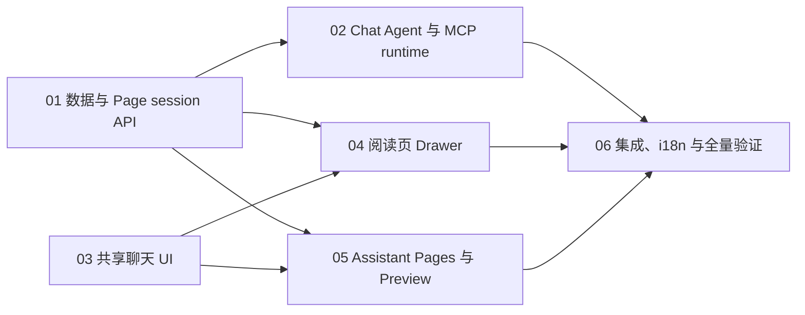

# Page Chat Agent 实施计划总索引

> **For agentic workers:** REQUIRED SUB-SKILL: Use superpowers:subagent-driven-development (recommended) or superpowers:executing-plans to implement this plan task-by-task. Steps use checkbox (`- [ ]`) syntax for tracking.

**Goal:** 在 `apps/web` 增加一个围绕发布页面工作的无 sandbox Chat Agent，使登录用户能从阅读页右侧 Drawer 或 `/assistant` 与页面对话，并通过现有 `/api/mcp/v1` 获取页面能力。

**Architecture:** 继续使用 `sessions → chats → chat_messages` 和统一 `/api/chat` 流式管线，以 `sessions.agent_type = "work" | "chat"` 在 workflow 内选择运行时。`work` 完整保留现有 sandbox Agent；`chat` 每次执行都重新校验稳定的 `published_page_id`、以当前用户身份连接 `/api/mcp/v1`，并由 Drawer 和 `/assistant` 共享同一套 Page Chat 核心 UI。

**Tech Stack:** Next.js 15 App Router、React 19、TypeScript、Drizzle/PostgreSQL、AI SDK 6、MCP TypeScript SDK Streamable HTTP、SWR、Vitest/Testing Library、Bun workflow tests、Tailwind CSS v4。

## Global Constraints

- 设计依据是 `docs/superpowers/specs/2026-08-10-page-chat-agent-design.md`；实现前必须完整阅读该 Spec、本总索引和当前子计划。
- `packages/core` 仍是 `apps/*` 使用底层能力的唯一边界；本功能不把页面 CRUD 复制到 Agent，页面能力一律来自 `/api/mcp/v1`。
- Gateway API query 参数和文件存储字段使用 `snake_case`；Page session 请求/响应也使用 `user_slug`、`page_slug`、`session_id`、`chat_id`。
- TypeScript 只允许顶部静态导入；禁止 inline `import("path").Type` 和新增 `await import()`。
- 编辑文件使用绝对路径；保留工作树中与本功能无关的用户改动。
- `agent_type = "work"` 是数据库默认值；所有现有无仓库 Chat 和 GitHub repo session 必须保持 sandbox 行为。
- `agent_type = "chat"` 不得创建、连接、恢复或保存 sandbox，也不得加载 files、skills、todo、Git、Diff、PR、Code Editor 或 dev server 能力。
- Page Agent 继续使用现有 `/api/chat`、chat 消息格式、`active_stream_id` CAS、恢复、停止、模型选择和用量记录；不得新增第二套消息协议。
- Page session get-or-create 复用现有 session 创建的 bot protection、每用户 rate limit、模型访问过滤和托管试用限制；不得成为绕过配额的第二入口。
- Page session 通过稳定 `published_page_id` 解析当前页面；slug 字段只是展示与删除后的历史快照，不能作为权限依据。
- 所有 Page session、chat、消息和 Preview API 只允许登录用户；每次 Agent 执行和 Preview 请求必须重新校验页面存在性和 `canReadPage`。
- 页面工具由服务端锁定到当前页面；模型不能通过参数切换到其他页面，MCP 凭据不能进入浏览器响应、workflow 参数或持久化消息。
- 页面被删除或权限被收回后保留历史聊天，但阻止后续工具和 Preview；页面删除不得级联删除 session。
- Drawer 的 Assistant Tab 首次点击才加载并创建/恢复 session；访问后切换 Tab 必须保留组件、草稿和附件。
- Page Drawer 与 `/assistant` 共享消息核心和 `AssistantPromptComposer` 控制层；保留图片、大段文本、模型、上下文用量、语音、发送/停止，移除 Page 模式的文件建议、Skill、Todo 和 sandbox overlay。
- Tailwind v4 中不要依赖 CVA 内的任意 `data-*` 变体；条件态通过 `cn()` 显式传入。语义色变量是 oklch，禁止 `hsl(var(--background))` 一类写法。
- 中文文案中 agent 译为“智能体”，token 译为“词元”。
- 禁止在仓库根目录运行 `pnpm build` 或 `pnpm typecheck`；只在 `packages/agent`、`apps/web`、`apps/desktop` 内执行对应命令。
- 每个任务遵循 TDD：先提交会因缺失行为而失败的测试，确认失败，再写最小实现、确认通过，最后创建一个独立 Conventional Commit。

---

## 执行前必读与总体设计摘要

每个执行者，包括只领取一个子计划的子智能体，都必须先阅读：

1. [完整设计 Spec](../specs/2026-08-10-page-chat-agent-design.md)
2. [本总索引](./2026-08-10-page-chat-agent.md)
3. 自己领取的子计划文件

不可变的数据和运行时关系：

```text
users
  └── sessions
       ├── agent_type = work ──> sandbox runtime ──> vibenAgent
       └── agent_type = chat
            ├── published_page_id ──> 每次重新解析页面/权限
            ├── page_user_slug + page_slug ──> 快照
            └── page runtime ──> /api/mcp/v1 ──> chatAgent
                 └── chats ──> chat_messages
```

统一请求链：

```text
Page Drawer 或 /assistant
  -> SharedChatCore
  -> useSessionChatRuntime
  -> POST /api/chat
  -> active_stream_id CAS
  -> runAgentWorkflow
  -> agent_type 分流
       work: 原 sandbox + Git/Diff/auto commit 收尾
       chat: 页面权限 + MCP tools + 通用消息/用量收尾
```

UI 组合关系：

```text
SessionChatContent(work) ─┐
PageSessionChatContent ───┼─> SharedChatCore
PageAssistantPanel ───────┘     ├─ ChatTranscript
                                ├─ ChatComposer
                                └─ useSessionChatRuntime

work 组合层另接 sandbox/files/skills/todo/git
page 组合层另接 page toolbar/preview refresh
```

## 跨计划公共接口

后续子计划必须使用下列命名，不在实现中临时创造同义类型：

```ts
export type SessionAgentType = "work" | "chat";

export type PageSessionResponse = {
  session: Session;
  chat: Chat;
  page: {
    published_page_id: string;
    user_slug: string;
    page_slug: string;
    title: string;
    url: string;
    can_edit: boolean;
    available: true;
  };
};

export type PageChatContext = {
  publishedPageId: string;
  userSlug: string;
  pageSlug: string;
  title: string;
  canEdit: boolean;
  url: string;
};

export type PageContentChangedDetail = {
  publishedPageId: string;
  chatId: string;
};

export const PAGE_CONTENT_CHANGED_EVENT = "viben:page-content-changed";
```

服务端接口：

```text
POST /api/page-sessions
body:     { "user_slug": string, "page_slug": string }
success:  PageSessionResponse

GET /api/page-sessions/{session_id}/preview
success:  { "published_page_id": string, "user_slug": string,
            "page_slug": string, "title": string, "html": string,
            "url": string }

POST /api/sessions/{session_id}/chats
body:     { "id"?: string }
success:  { "chat": Chat }
```

## 子计划与依赖 DAG



| 顺序 | 子计划 | 可并行条件 | 交付物 |
| --- | --- | --- | --- |
| 1 | [01-data-and-session-api.md](./2026-08-10-page-chat-agent/01-data-and-session-api.md) | 首先执行 | schema、迁移、active Page session 数据服务、get-or-create API |
| 2 | [02-chat-agent-and-mcp-runtime.md](./2026-08-10-page-chat-agent/02-chat-agent-and-mcp-runtime.md) | 依赖 01；可与 03 并行 | `chatAgent`、限定页面的 MCP adapter、workflow `work/chat` 分流 |
| 3 | [03-shared-chat-ui.md](./2026-08-10-page-chat-agent/03-shared-chat-ui.md) | 可在 01 后与 02 并行 | `SharedChatCore`、`ChatTranscript`、`ChatComposer`、work 回归迁移 |
| 4 | [04-page-drawer.md](./2026-08-10-page-chat-agent/04-page-drawer.md) | 依赖 01、03 | 登录可见且 lazy/visited 的 Assistant Tab、紧凑 Page Chat |
| 5 | [05-assistant-pages-and-preview.md](./2026-08-10-page-chat-agent/05-assistant-pages-and-preview.md) | 依赖 01、03；可与 04 并行 | Pages 分组、Page session 壳层、Preview、外链按钮 |
| 6 | [06-integration-and-verification.md](./2026-08-10-page-chat-agent/06-integration-and-verification.md) | 依赖全部前序计划 | 更新事件、i18n、权限/无 sandbox 回归、三 package 构建验证 |

## Spec 章节追踪矩阵

| Spec 章节 | 实施位置 |
| --- | --- |
| 背景、目标、非目标 | 所有子计划的总体设计摘要与边界 |
| 现状调研：页面路由与布局树、ReadDrawer | 04 Tasks 1–3 |
| 现状调研：`/assistant` 对话与输入结构 | 03 Tasks 1–4，05 Tasks 2–3 |
| 核心决策 1：`agent_type` | 01 Task 1，02 Task 3 |
| 核心决策 2：稳定页面 ID | 01 Tasks 1–3，02 Task 2，05 Task 3 |
| 核心决策 3：一个 active Page session | 01 Tasks 2–3 |
| 架构：共享聊天管线与运行时分流 | 02 Task 3，03 Task 3 |
| 无 sandbox Chat Agent | 02 Task 1 |
| MCP 接入 | 02 Task 2 |
| Session 创建与恢复 | 01 Task 3，04 Task 2 |
| 页面右侧滑栏、Tab 挂载、Drawer 输入框 | 04 Tasks 1–3 |
| `/assistant` 左侧分组 | 05 Task 1 |
| Page session 主界面 | 05 Task 2 |
| Preview | 05 Task 3，06 Task 1 |
| 共用 Page Chat 视图与组件分层 | 03 Tasks 1–4 |
| 响应式行为 | 04 Task 3，05 Tasks 2–3 |
| 权限与安全 | 01 Task 3，02 Task 2，05 Task 3，06 Task 2 |
| 缓存与同步 | 01 Task 2，06 Task 1 |
| 错误处理 | 01 Task 3，02 Tasks 2–3，04 Task 2，05 Task 3 |
| 测试策略、验收标准 | 每个子计划的测试循环；06 Tasks 2–3 汇总验收 |

## 合并顺序与冲突规则

- 01 先合并，因为 schema 和公共 response 类型被其余计划消费。
- 02 与 03 可以并行，但不得同时修改同一文件；02 只改 Agent/workflow，03 只改聊天 React 组件与通用 hooks。
- 04 与 05 可以并行；04 只负责阅读页，05 只负责 `/assistant` 与 Preview API。
- 06 最后执行，负责跨入口更新同步、翻译和最终回归，不重新设计前序接口。
- 如果前序实现必须改变“跨计划公共接口”，先更新本索引及所有消费它的子计划，再继续编码；禁止在单个分支里静默改名。

## 总体验收门槛

- 登录读者能总结任意可读页面；作者能通过 MCP 更新自己的页面。
- Page Agent 的所有正常、错误与恢复路径均没有 sandbox provisioning/connect 调用。
- 同一用户/页面并发首次打开只得到一个 active session；归档后可创建新 session。
- 阅读页和 `/assistant` 展示相同 chats/messages/active stream，默认续接最近 chat。
- Page Drawer 首次打开前不请求 Page session；切 Tab 后草稿和附件仍在。
- `/assistant` 左侧显示 `Pages` 与 `Chats` 两个同级分组；Page session 右上角只有 Preview 和外链页面相关动作。
- Preview、Agent、Page session 创建均重新校验登录与页面权限。
- 现有 work Chats 和 repo sessions 的创建、sandbox、Git/Diff、恢复、停止和收尾逻辑测试全部通过。
- `packages/agent` typecheck，`apps/web` tests/typecheck/build，`apps/desktop` typecheck/build 全部通过。
