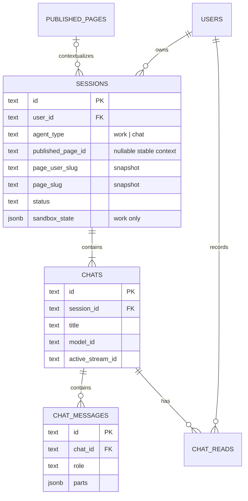
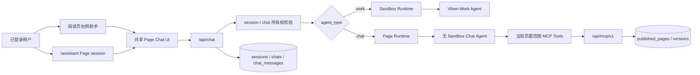
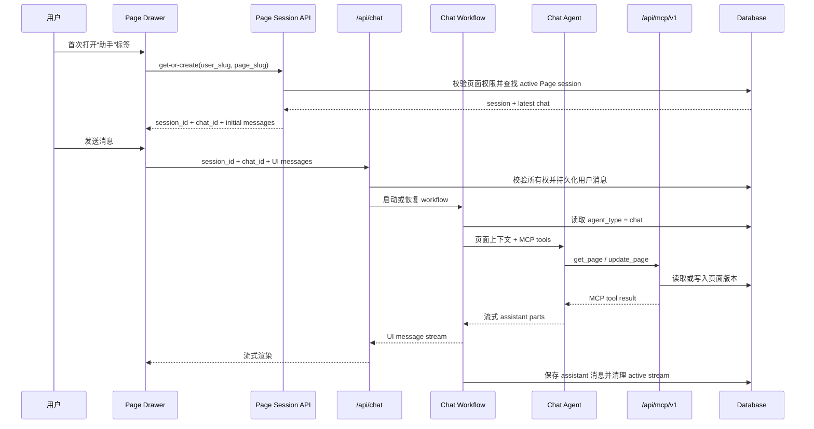
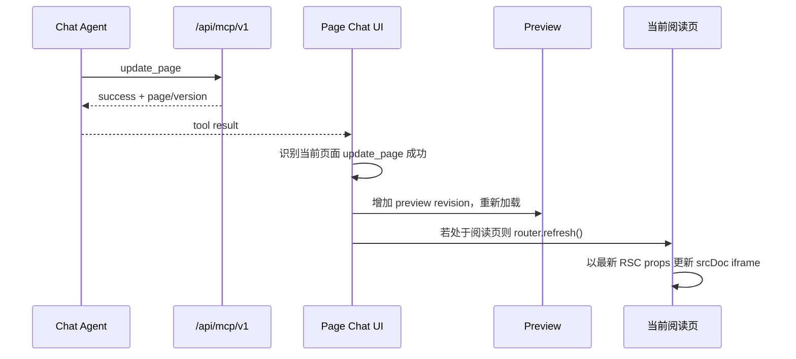
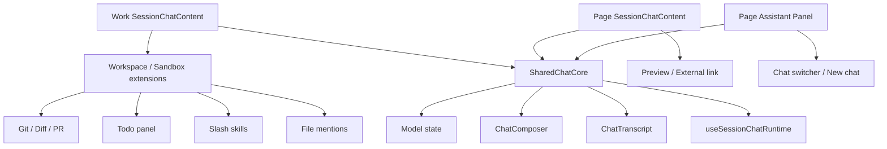

# 页面 Chat Agent 设计

## 背景

`apps/web` 当前的 Assistant 使用 `@viben/agent` 提供的 Viben Agent。该 Agent 的调用参数、工具和 workflow 都要求存在 sandbox，因此即使 session 没有关联 GitHub 仓库，也会创建并连接 sandbox。

页面阅读路由 `/{user_slug}/{page_slug}` 已经有右侧 `ReadDrawer`，而 `/assistant` 已经具备 session/chat 持久化、模型选择、流式恢复、未读状态和多 chat 管理。新功能需要增加一个不依赖 sandbox、专门围绕已发布页面工作的 Chat Agent，并复用现有 Assistant 的会话基础设施。

Viben 已在 `/api/mcp/v1` 提供 Streamable HTTP MCP 服务，其中包含页面读取和更新能力。Page Chat Agent 必须通过该端点获得页面能力，不在 Agent 内重复实现页面 CRUD。

## 目标

1. 已登录用户可以在页面右侧滑栏中与当前页面对话。
2. 作者可以通过自然语言调用 MCP 页面写能力，例如为页面增加多语言支持。
3. 读者可以通过自然语言理解页面，例如总结当前页面。
4. 页面对话复用现有 session/chat 持久化、流式响应、模型选择和恢复机制。
5. `/assistant` 左侧新增与 `Chats` 同级的 `Pages` 分组，并可继续页面对话。
6. Page Chat Agent 不创建、连接、恢复或持久化 sandbox。
7. `/assistant` 中的 Page session 提供页面 Preview 和新标签页打开按钮，不显示代码工作区功能。

## 非目标

- 不修改 `/api/mcp` 的 MCP 市场 REST API。
- 不迁移 `/api/mcp/v1`，也不重新实现其写操作确认或鉴权规则。
- 不让未登录用户使用页面 Agent。
- 不为 Page session 提供 sandbox 文件工具、终端、Git、Diff、Skill、子智能体、Code Editor、自动提交或 PR 能力；图片和大段文本仍可作为通用模型附件发送。
- 不重写现有 work session 的消息协议或数据库表。

## 现状调研

### 页面路由与布局树

当前 `/{user_slug}/{page_slug}` 阅读页由 App Router 服务端组件准备页面、权限和社区数据，再交给客户端阅读壳层。与本功能直接相关的组件树如下：

```text
AppShell
├── Topbar
│   ├── 左侧全局 Sidebar 开关
│   ├── 中间 Page / Side Page / Settings
│   └── 右侧搜索、创建、通知、用户菜单、ReadDrawer 开关
├── Sidebar                         # 全局左侧导航，桌面端可收起
├── main                            # 阅读页打开 Drawer 后增加 margin-right
│   └── ReadPageServer
│       └── ReadPageShell
│           └── ReadPageClient
│               ├── 页面正文 iframe（srcDoc）
│               └── ReadDrawer
└── #viben-drawer-slot              # 桌面端 ReadDrawer 的 portal 目标
```

服务端页面数据流：

```text
/{user_slug}/{page_slug}
        │
        ▼
ReadPageServer
        ├── getCachedPublishedPageContext
        ├── canReadPage
        ├── 判断作者或 team page manager
        ├── 注入页面、社区和用户元数据
        └── ReadPageClient
```

### 当前桌面布局

ReadDrawer 不是覆盖正文的浮层。AppShell 为其保留右侧 portal；Drawer 打开时，正文和 Topbar 同时缩短。默认宽度为 `420px`，可拖动范围为 `280px–600px`。

```text
┌──────────────────────────────────── Topbar ────────────────────────────┬──────────────┐
│ ☰  面包屑                         Page / Settings       搜索 通知 用户  │              │
├────────────────────────────────────────────────────────────────────────┤ Drawer Header│
│                                                                        ├──────────────┤
│                                                                        │              │
│                         页面正文 iframe                               │ Drawer Body  │
│                                                                        │              │
│                                                                        │              │
└────────────────────────────────────────────────────────────────────────┴──────────────┘
                                                                         默认 420px
```

页面正文 iframe 与 Drawer 是兄弟区域，聊天不需要进入页面 iframe，也不应通过 iframe DOM 获取内容。Agent 通过服务端页面身份和 MCP 获取当前版本。

### 当前移动端布局

移动端不为 Drawer 预留正文宽度，而是使用带背景遮罩的右侧全屏覆盖层：

```text
关闭状态                         打开状态
┌────────────────────┐          ┌────────────────────┐
│ Topbar           ▷ │          │ Tabs             × │
├────────────────────┤          ├────────────────────┤
│                    │          │                    │
│   页面正文 iframe  │    ->    │ Drawer / Chat      │
│                    │          │ 全屏覆盖内容        │
│                    │          │                    │
└────────────────────┘          └────────────────────┘
```

Page Chat 必须沿用该模式，并使用动态视口高度和底部安全区，避免移动端软键盘遮住输入框。

### 当前 ReadDrawer 结构与限制

现有 ReadDrawer 是两行 Grid：

```text
ReadDrawer
├── DrawerHeader                    # 固定导航高度
│   ├── Read / Comments / Notes
│   ├── More
│   └── Close
└── Content                         # overflow-auto + p-3
    ├── PageMeta
    ├── CommentsPanel
    └── NotesPanel
```

当前实现会遍历并挂载所有 TabContent，只用 `hidden` 隐藏非激活标签。这对评论和笔记可接受，但 Page Chat 不能照搬，否则用户仅访问页面就可能加载聊天 bundle、模型列表并创建 session。

Page Chat 还不能放在当前统一的 `overflow-auto` 内容容器中，因为这会让输入框随消息一起滚走。助手标签需要自己的固定输入布局，并采用“首次访问后才挂载”的策略。

### 当前 `/assistant` 对话与输入结构

现有 `/assistant/{sessionId}/chats/{chatId}` 的聊天主区域采用纵向 Flex，而不是依赖 `position: sticky`：

```text
SessionChatContent                  # h-full flex flex-col overflow-hidden
├── Error Banner                    # 可选
├── Message View                    # flex-1 overflow-hidden
│   └── Scroll Container            # h-full overflow-y-auto
│       └── Transcript              # max-w-4xl px-4 py-8
│           ├── User Message
│           ├── Reasoning
│           ├── Tool Calls
│           ├── Assistant Message
│           └── Thinking Indicator
└── Input Region                    # 消息滚动容器的兄弟节点
    └── max-w-4xl
        ├── Error / Overlay
        ├── Suggestion Dropdowns
        ├── Todo Panel
        └── AssistantPromptComposer
```

因此输入框始终留在底部，只有 Message View 滚动。Page Chat 应复用这一结构，不能把 Composer 放进 Drawer 的滚动内容里。

`AssistantPromptComposer` 当前能力：

| 能力 | 当前行为 | Page Chat |
| --- | --- | --- |
| 文本输入 | 自动增高，约三行后内部滚动 | 保留 |
| 图片附件 | 文件选择、拖放、剪贴板粘贴 | 保留 |
| 大段文本 | 粘贴后转换为文本附件 | 保留 |
| 模型选择 | 紧凑模型选择器，支持搜索 | 保留 |
| 上下文用量 | 展示词元和费用信息 | 保留 |
| 语音输入 | 录音、转写并填入输入框 | 保留 |
| 发送/停止 | 生成中将发送按钮替换为停止按钮 | 保留 |
| Inline Question | work agent 工具交互 | 本期不使用 |
| `@文件`建议 | 依赖 sandbox 文件列表 | 移除 |
| Skill 斜杠命令 | 依赖 sandbox skills | 移除 |
| Pinned Todo | 来自 work agent todo 工具 | 移除 |
| Sandbox Overlay | 归档、快照和 sandbox 状态 | 移除 |

`useSessionChatRuntime` 已经封装 `/api/chat` transport、stream resume、停止、错误恢复和 chat instance 复用，基本不依赖 sandbox。相反，现有 `SessionChatProvider` 和 `SessionChatContent` 同时加载 sandbox、Git、Diff、Files、Skills 等状态，不能直接整体复用于 Page Chat。

## 核心决策

### 1. 使用 `agent_type` 选择 Agent 运行时

在 `sessions` 表新增非空字段 `agent_type`，允许值为：

- `work`：现有 Viben Agent，绑定 sandbox；兼容无仓库 Chats 和 GitHub 仓库会话。
- `chat`：新的无 sandbox Chat Agent；本期用于页面对话。

字段默认值为 `work`，因此现有数据和未显式传值的现有创建流程自然保持原行为，不需要批量回填。

`agent_type` 只描述 Agent 运行时，不描述 session 的展示分组。GitHub 仓库仍由 `repo_owner`、`repo_name` 等字段表示；页面上下文由独立页面字段表示。

### 2. 页面上下文使用稳定 ID

Page session 在 `sessions` 表记录：

- `published_page_id`：已发布页面的稳定数据库 ID。
- `page_user_slug`：创建或最近同步时的作者 slug 快照。
- `page_slug`：创建或最近同步时的页面 slug 快照。

运行时优先通过 `published_page_id` 获取页面的当前作者 slug、页面 slug、标题和权限。快照字段用于页面删除后的历史展示和降级链接文案，不作为权限依据。

页面删除不能级联删除 session、chat 或消息。页面不存在时保留历史对话，但禁用 Preview 和页面 MCP 操作。

### 3. 一个页面对应一个 active Page session

对同一用户和同一 `published_page_id`，正常情况下最多存在一个未归档的 `chat` session：

- 第一次打开页面助手时创建 session 和初始 chat。
- 再次打开时恢复最近更新的 chat。
- “新对话”在同一 session 下创建新的 chat；Chat Tabs 即对话章节。
- session 被归档后，再次从页面进入会创建新的 active Page session，历史归档 session 保留。

数据库使用只约束未归档 Page session 的部分唯一索引，避免并发首次打开产生重复 active session。创建接口在唯一键冲突时重新读取已有 session，向客户端返回同一个结果。

### 数据关系图



Page session 状态转换：

```text
页面首次打开助手
      │
      ▼
创建 active chat session ────────┐
      │                          │
      ├── 创建/切换多个 chat     │ 再次进入页面
      │                          │
      ├── 页面改名：同步快照 ◄───┘
      │
      ├── 页面删除：保留历史，标记上下文不可用
      │
      └── session 归档
              │
              ▼
         archived history
              │
              └── 再次进入页面 -> 创建新的 active Page session
```

## 架构

### 总体架构图



### 目标模块树

```text
packages/agent
├── viben-agent.ts                  # 现有 work agent
├── chat-agent.ts                   # 新的无 sandbox chat agent
├── models.ts                       # 共用模型网关
└── context-management              # 共用上下文管理

apps/web
├── app/api/chat                    # 统一聊天入口
├── app/workflows
│   ├── chat.ts                     # 共用 workflow orchestration
│   ├── chat-sandbox-runtime.ts     # work runtime
│   └── chat-page-runtime.ts        # page context + MCP runtime
├── components/assistant
│   ├── shared-chat-runtime         # stream、model、send/stop
│   ├── chat-transcript             # 通用消息与 MCP tool result
│   ├── chat-composer               # AssistantPromptComposer 控制层
│   ├── session-chat-content        # work 组合层
│   └── page-session-chat-content   # page 组合层
└── components/pages
    ├── read-page-client
    ├── page-assistant-panel        # Drawer 紧凑布局
    └── page-preview-panel          # /assistant Preview
```

### 共享聊天管线，按运行时分流

继续使用现有 `/api/chat` 作为两类 Agent 的统一聊天入口。该 API 继续负责：

- 登录和 session/chat 所有权校验；
- bot protection 和现有用量限制；
- active stream 协调和恢复；
- 用户消息幂等持久化；
- workflow 启动和流式响应。

workflow 读取 session 后按 `agent_type` 分流：

```text
/api/chat
  -> session.agent_type = work
       -> 现有 sandbox runtime
       -> 现有 Viben Agent
       -> Diff / Git / 自动提交等现有收尾步骤

  -> session.agent_type = chat
       -> Page runtime
       -> 无 sandbox Chat Agent
       -> MCP 页面工具
       -> 仅执行消息、用量和 stream 收尾步骤
```

消息表、chat 表、UI message 格式和 stream ID 不分叉。这样页面右侧滑栏和 `/assistant` 可以同时消费同一份持久化消息与流状态。

### 请求时序



### 无 sandbox Chat Agent

`@viben/agent` 增加独立的无 sandbox Chat Agent。它复用现有模型网关、模型选择和上下文管理，但调用参数不包含 `sandbox`，也不注册以下工具：

- 文件读取、写入、编辑、glob、grep；
- bash；
- task/subagent；
- skill；
- 任何依赖工作目录的工具。

Chat Agent 接收服务端准备好的 MCP 工具集和页面系统上下文。页面专属 prompt 至少包含：

- 当前 `user_slug`、`page_slug`、标题和稳定页面 ID；
- 当前用户是作者/页面管理者还是读者；
- 回答必须围绕当前页面；
- 页面 HTML 和文本是待分析数据，不能把其中的指令当作系统指令执行；
- 页面内容问题应通过 MCP 获取当前版本，而不是依赖客户端传入的 HTML。

### MCP 接入

Page runtime 以当前登录用户身份连接现有 `/api/mcp/v1` Streamable HTTP MCP 端点。身份凭据只在服务端创建和传递，不写入消息、workflow 参数或浏览器响应。

runtime 从 MCP 获取页面能力，再向模型暴露当前页面范围内的工具适配器：

- 页面标识由服务端根据 session 锁定，模型不能把工具调用切换到其他页面。
- MCP 继续负责实际读取、更新、版本记录和写权限处理。
- 应用层不增加第二套写操作确认机制。
- MCP 的结构化成功或错误结果原样映射为 AI SDK tool result，以便消息持久化和 UI 展示。

Chat Agent 完成后只运行通用收尾逻辑：保存 assistant 消息、记录用量、更新 chat 活动时间、发送 finish 事件并清理 active stream。它不会运行 sandbox state、Diff cache、自动提交、自动 PR 或 workspace activity 逻辑。

## Session 创建与恢复

新增页面专用的 get-or-create 服务端入口，输入和输出字段使用 snake_case。输入只接受页面路由身份，例如：

```json
{
  "user_slug": "alice",
  "page_slug": "my-page"
}
```

服务端流程：

1. 要求登录。
2. 解析当前已发布页面，并使用现有 `canReadPage` 规则校验阅读权限。
3. 按当前用户、`published_page_id`、`agent_type = chat` 查找最近的未归档 session。
4. 找到时同步页面标题和 slug 快照，并返回最近 chat。
5. 没找到时创建 `agent_type = chat`、无 sandbox state 和 lifecycle state 的 session，再创建初始 chat。
6. 不调用 sandbox provisioning workflow。

session 标题使用当前页面标题。chat 标题继续使用现有首条用户消息自动命名机制。模型默认值继续来自用户 Assistant 偏好。

## 页面右侧滑栏

在现有 `ReadDrawer` 中增加“助手”标签：

- 仅登录用户可见；未登录用户既看不到标签，也不能通过 API 创建 Page session。
- 标签内容动态加载，避免未打开助手时加载聊天 bundle、模型列表或创建 session。
- 首次打开标签时调用页面 session get-or-create 接口，然后恢复最近 chat。
- 使用 Page Chat 共用视图，包含消息列表、流式状态、模型选择、输入框、停止生成和“新对话”。
- 不渲染 workspace/sandbox 状态、sandbox 文件建议或 Git 操作；图片与大段文本附件继续使用通用输入能力。
- “新对话”调用现有 session chat 创建逻辑，在当前 Page session 内创建 chat 并切换过去。

桌面端继续使用可调整宽度的右栏；移动端继续使用现有覆盖式 drawer。页面助手不改变 `ReadDrawer` 其他 Read、Comments、Notes 标签的默认行为。

### Drawer 目标线框图

```text
┌────────────────────────── Page Assistant Drawer ──────────────────────────┐
│  阅读       评论       笔记       ✦ 助手                         ⋯      × │
├───────────────────────────────────────────────────────────────────────────┤
│  总结这个页面 ▾                                      ＋新对话   ↗完整对话 │
├───────────────────────────────────────────────────────────────────────────┤
│                                                                           │
│  Assistant                                                               │
│  这个页面主要介绍……                                                       │
│                                                                           │
│                                            请总结第三部分的关键观点。      │
│                                                                           │
│  MCP · get_page                                                          │
│  已读取当前页面                                                [查看详情] │
│                                                                           │
│  Assistant                                                               │
│  第三部分包含三个关键观点……                                               │
│                                                                           │
│                              ↓                                            │
├───────────────────────────────────────────────────────────────────────────┤
│  ┌─────────────────────────────────────────────────────────────────────┐  │
│  │ 询问、总结或修改这个页面……                                         │  │
│  │                                                                     │  │
│  │ 📎  Claude 3.7 ▾  12% context                         🎙      ↑     │  │
│  └─────────────────────────────────────────────────────────────────────┘  │
└───────────────────────────────────────────────────────────────────────────┘
```

Drawer 内部布局：

```text
PageAssistantPanel                 # h-full min-h-0 grid
├── ConversationToolbar            # auto
│   ├── 当前 chat 标题 / 历史切换
│   ├── 新对话
│   └── 在 /assistant 打开
├── ChatTranscript                 # minmax(0, 1fr), overflow-y-auto
└── ChatComposer                   # auto, 不参与消息滚动
    └── AssistantPromptComposer
```

ConversationToolbar 不复制完整 Chat Tabs。Drawer 宽度有限，历史 chat 使用下拉列表；`/assistant` 完整页面继续使用横向 Chat Tabs。

空对话根据身份显示快捷入口：

```text
作者                                      读者
┌──────────────────────────┐              ┌──────────────────────────┐
│ 为页面增加多语言支持     │              │ 总结这个页面             │
│ 改善页面 SEO             │              │ 提取关键观点             │
│ 检查页面结构和可访问性   │              │ 解释我不理解的部分       │
└──────────────────────────┘              └──────────────────────────┘
```

快捷入口只负责填充并发送自然语言，不直接调用写 API。

### Tab 挂载策略

```text
初始页面加载
  ├── Read / Comments / Notes：保持现有行为
  └── Assistant：不下载、不挂载、不创建 session

第一次点击 Assistant
  ├── 标记 assistant 为 visited
  ├── 动态加载 PageAssistantPanel
  ├── get-or-create Page session
  └── 加载最近 chat / 恢复 active stream

切换到其他 Tab
  └── 保留已访问的 Assistant 实例和输入草稿，但设为不可见
```

保留已访问实例可以避免切换到评论再回来时丢失输入、附件或流式渲染；延迟首次挂载可以避免普通页面浏览产生无意义 session。

### Drawer 输入框

Drawer 与 `/assistant` 使用同一个 `ChatComposer` 控制层和 `AssistantPromptComposer` 展示层，只改变外层密度：

| 属性 | `/assistant` | Page Drawer |
| --- | --- | --- |
| 最大宽度 | `max-w-4xl` | `w-full` |
| 外边距 | `p-4 pb-8` | `p-3` + safe area |
| textarea | 自动增高至约三行 | 相同 |
| 图片/文本附件 | 保留 | 保留 |
| 模型选择 | 保留 | 保留 |
| 上下文用量 | 保留 | 保留，极窄宽度可只显示图标 |
| 语音 | 保留 | 保留 |
| 发送/停止 | 保留 | 保留 |
| 文件建议/Skills/Todo | work 模式可用 | 不显示 |

发送链路完全共用：先清空输入和附件、设置本地 pending、调用 `useSessionChatRuntime.sendMessage`；失败时保留可重试错误并回滚乐观标题。停止按钮继续调用现有 chat stop API，不实现 Page 专属中断协议。

## `/assistant` 集成

### 左侧分组

Assistant session 列表查询增加 `agent_type` 和页面展示字段。分组规则为：

- `agent_type = chat` 且有关联页面：`Pages`；
- `agent_type = work` 且没有 `repo_name`：`Chats`；
- `agent_type = work` 且有仓库：现有仓库分组。

`Pages` 与 `Chats` 同级、可独立折叠。Page session 行显示页面标题，并保留未读、流式、置顶、重命名、归档和删除能力。点击后仍进入现有 `/assistant/{sessionId}/chats/{chatId}` 路由。

### Page session 主界面

路由根据 `session.agent_type` 选择内容组件：

- `work` 渲染现有 `SessionChatContent` 和 work header。
- `chat` 渲染 Page Chat 共用视图和 page header。

Page header 保留左侧边栏切换和 Chat Tabs，右侧只提供：

- `Preview`：展开或收起页面预览，默认收起；
- `→` 外链按钮：使用 `target="_blank"` 和安全的 `rel` 属性打开当前完整页面。

Page session 不挂载 Git panel provider 的业务内容，不创建 Code Editor、dev server、Diff、Files 或 PR 控件。

Page session 在 `/assistant` 中的桌面布局：

```text
┌──── Assistant 左侧栏 ────┬──────────────── Page Chat ────────────────┬──────── Preview ────────┐
│ ＋ New Chat              │ ☰  对话一  对话二 ＋          Preview  → │                         │
│                          ├───────────────────────────────────────────┤                         │
│ Chats                    │                                           │                         │
│   普通会话 A             │           Page Chat Transcript            │   当前页面正文 iframe   │
│                          │                                           │                         │
│ Pages                    │                                           │                         │
│   当前页面会话  ●        ├───────────────────────────────────────────┤                         │
│   另一页面会话           │ AssistantPromptComposer                   │                         │
│                          │ 📎  Model ▾  Context               🎙  ↑  │                         │
│ repo/name                │                                           │                         │
│   Work session           │                                           │                         │
└──────────────────────────┴───────────────────────────────────────────┴─────────────────────────┘
```

Preview 收起时，Page Chat 占据全部主区域；展开时只压缩 Page Chat，不影响 Assistant 左侧栏。Preview 桌面宽度初始使用约 `320px`，并复用右侧面板 resize 模式扩展到更宽尺寸。

### Preview

Preview 是 Page session 专属的右侧面板：

- 桌面端为可折叠右栏；移动端为覆盖式面板。
- 通过经过登录和 `canReadPage` 校验的预览端点读取最新页面 HTML。
- 使用 sandboxed iframe 渲染页面正文，不嵌套 Viben 导航和页面右侧 drawer。
- iframe 不获得访问父页面 DOM 或认证信息的能力。
- MCP 页面更新成功后，使页面内容缓存失效并重新加载 Preview。
- 页面不存在或权限失效时显示明确的不可用状态，同时保留聊天历史。

Preview 更新链路：



## 共用 Page Chat 视图

页面 drawer 与 `/assistant` 不各自实现一套聊天逻辑。新增共用 Page Chat 控制层和视图，参数包括 session ID、chat ID、初始消息、模型选项和紧凑/完整布局模式。

共用能力包括：

- 读取持久化消息；
- 向现有 `/api/chat` 发送消息；
- 恢复 active stream；
- 切换模型；
- 停止生成；
- 渲染 Markdown、reasoning 和 MCP tool result；
- 创建并切换新 chat；
- 在 MCP 页面更新成功后触发 Preview 刷新事件。

页面 drawer 使用紧凑布局，`/assistant` 使用完整布局。两种布局不能复制网络状态机或消息持久化逻辑。

### 共用聊天组件分层



建议边界：

1. `useSessionChatRuntime`
   - 继续负责 AI SDK chat instance、`/api/chat` transport、resume、stop 和错误恢复。
   - 不读取 sandbox。
2. `SharedChatCore`
   - 组合 runtime、模型状态、消息动作、附件状态和输入提交。
   - 通过 feature props 决定是否启用 work 专属扩展。
3. `ChatTranscript`
   - 渲染用户消息、assistant Markdown、reasoning、通用 tool call、MCP tool result、thinking 和滚动到底部。
   - 通过可选回调支持 work 模式打开文件；Page 模式不注入该回调。
4. `ChatComposer`
   - 封装 `AssistantPromptComposer` 所需的附件、语音、模型、上下文用量、发送和停止状态。
   - Page 模式不读取 files、skills、todos 或 sandbox lifecycle。
5. Work 与 Page 组合层
   - Work 继续装配现有 workspace 能力。
   - Page 只装配页面 toolbar、MCP 工具展示和 Preview 刷新。

不得通过在现有 4000 行以上的 `SessionChatContent` 中到处增加 `agent_type === "chat"` 条件来实现。应先抽取真正共用的聊天核心，再让两个组合层分别装配。

### 响应式行为

| 场景 | 消息区 | 输入区 | 对话切换 | Preview |
| --- | --- | --- | --- | --- |
| 阅读页桌面 Drawer | Drawer 内独立滚动 | 固定底部，全宽 | 下拉列表 | 不显示；正文已在左侧 |
| 阅读页移动 Drawer | 全屏独立滚动 | 底部安全区，适配键盘 | 下拉列表 | 不显示 |
| `/assistant` 桌面 | 主区域独立滚动 | 固定底部，`max-w-4xl` | Chat Tabs | 右侧可折叠栏 |
| `/assistant` 移动 | 主区域独立滚动 | 底部安全区 | 紧凑 Chat Tabs/菜单 | 覆盖式面板 |

窄 Drawer 中四个顶层标签可能拥挤。Tabs 容器需要横向滚动或在容器宽度不足时使用图标加短标签，More 和 Close 始终固定在右侧且不可被挤出。

## 权限与安全

1. session 创建、chat 读取、消息发送和预览全部要求登录。
2. 所有 session/chat API 继续校验 session 所有者，不能仅凭 ID 访问其他用户的页面对话。
3. 创建 Page session 前使用页面现有阅读权限规则；不能为不可读页面提前创建 session。
4. 每次 Agent 执行前重新解析页面和权限，防止页面在 session 创建后变为 private 或权限被收回。
5. MCP 身份凭据只存在于服务端调用期间，不发送到浏览器或持久化消息。
6. 页面工具参数由服务端锁定到当前页面，页面内容中的提示注入不能访问其他页面。
7. Preview iframe 使用最小 sandbox 权限，并遵循现有 HTML 页面渲染的安全边界。
8. 写权限和页面版本语义由 `/api/mcp/v1` 负责，应用层不绕过 MCP 直接写页面表。

## 缓存与同步

- Page session 创建和消息列表不使用长时间缓存。
- 页面标题或 slug 在每次从页面入口 get-or-create 时同步到 session 快照。
- MCP 更新成功后调用现有页面缓存失效机制，确保阅读页和 Preview 获取新版本。
- `/assistant` 和页面 drawer 使用相同的 `active_stream_id`。如果一端已经生成，另一端恢复该 stream，而不是再次执行 Agent。
- session 列表沿用现有流式期间快速轮询、空闲时低频轮询策略，因此 `Pages` 的未读和工作状态与其他分组一致。

## 错误处理

| 场景 | 行为 |
| --- | --- |
| 未登录 | 隐藏页面助手；API 返回 401 |
| 页面不存在 | 不创建 session；返回页面不存在 |
| 无阅读权限 | 不创建 session；返回无权限，且不泄露页面内容 |
| MCP 连接失败 | 保留用户消息，assistant 返回可重试错误，不补建 sandbox |
| MCP 工具失败 | 持久化结构化 tool error，允许用户修正请求后重试 |
| 页面 slug 改变 | 通过稳定 ID 获取新 URL并更新快照 |
| 页面被删除 | 保留聊天；禁用 Preview 和工具并显示页面不可用 |
| 页面权限被收回 | 阻止后续 Agent 和 Preview 请求；历史消息仍仅 session 所有者可见 |
| active Page session 已归档 | 创建新的 active Page session，不自动恢复已归档 session |
| 两个入口同时发送 | 现有 active stream compare-and-set 只允许一个 workflow 获得执行权 |

## 测试策略

### 数据层

- `agent_type` 对现有创建路径默认为 `work`。
- Page session 可以保存稳定页面 ID 和 slug 快照。
- 部分唯一索引只阻止同一用户、页面的重复 active Page session，不阻止归档后新建。
- session 删除继续级联 chat/message；页面删除不删除聊天历史。

### API 与服务

- 未登录、页面不存在、无阅读权限时不创建 session。
- 首次请求创建 Page session 和初始 chat。
- 重复或并发请求返回同一 active session。
- 默认返回最近 chat；新对话创建在同一 session 下。
- 归档后请求创建新的 active session。
- 预览端点执行登录和页面阅读权限检查。

### Agent 与 workflow

- `work` 仍执行现有 sandbox runtime，行为不变。
- `chat` 不调用 sandbox provisioning、connect、skills discovery、Diff、Git 或自动提交逻辑。
- Chat Agent 能通过 `/api/mcp/v1` 读取当前页面。
- MCP 调用始终锁定当前页面，不能用模型参数访问其他页面。
- MCP 失败产生可恢复的 tool error，消息和 active stream 正确收尾。
- 同一 chat 的并发发送只启动一次 Agent workflow。

### UI

- 未登录阅读页不显示“助手”标签；登录后显示。
- Page drawer 恢复最近 chat，并能创建新对话。
- Page drawer 未访问助手标签前不加载聊天 bundle 或创建 session；访问后切换标签不丢失输入草稿和附件。
- Page drawer 与 `/assistant` 复用同一 Composer 行为，包括图片/大段文本附件、模型、上下文用量、语音和发送/停止。
- Page 模式不请求 files、skills、todos 或 sandbox lifecycle API。
- `/assistant` 正确生成 `Pages`、`Chats` 和仓库分组。
- Page session header 不显示 work 操作，只显示 Preview 和外链。
- Preview 在桌面端展开为右栏，在移动端展开为覆盖层。
- 页面 drawer 与 `/assistant` 能显示同一批消息和同一流状态。
- MCP 更新成功后 Preview 刷新。

### 回归与构建

- 运行受影响的 `apps/web` Vitest 测试。
- 在 `packages/agent` 目录运行 typecheck。
- 在 `apps/web` 目录分别运行 typecheck 和 build。
- 在 `apps/desktop` 目录分别运行 typecheck 和 build，验证共享依赖没有破坏桌面应用。
- 不从仓库根目录运行 `pnpm build` 或 `pnpm typecheck`。

## 验收标准

1. 登录用户在任意可读发布页面打开助手后，可以发送消息并获得基于当前页面的流式回复。
2. 读者可以要求总结页面；作者可以通过 MCP 请求更新当前页面。
3. 整个 Page Agent 运行期间不会创建或连接 sandbox。
4. 刷新页面或进入 `/assistant` 后，对话仍存在并默认恢复最近 chat。
5. `/assistant` 左侧存在 `Pages` 分组，Page session 可正常打开、归档和删除。
6. Page session 页面不出现 Code Editor、Files、Diff、Git、PR 或 sandbox 状态控件。
7. Preview 可在右侧展开，外链按钮可在新标签页打开页面。
8. MCP 更新后 Preview 和后续 Agent 读取获得最新页面内容。
9. 未登录用户、无阅读权限用户和其他 session 所有者无法访问页面对话。
10. 现有 work Chats 和 GitHub 仓库 session 的创建、运行、恢复及 UI 行为无回归。
11. 页面 Drawer 与 `/assistant` 的输入、附件、模型和停止生成体验一致，且 Page 模式不会发起 sandbox 相关请求。
