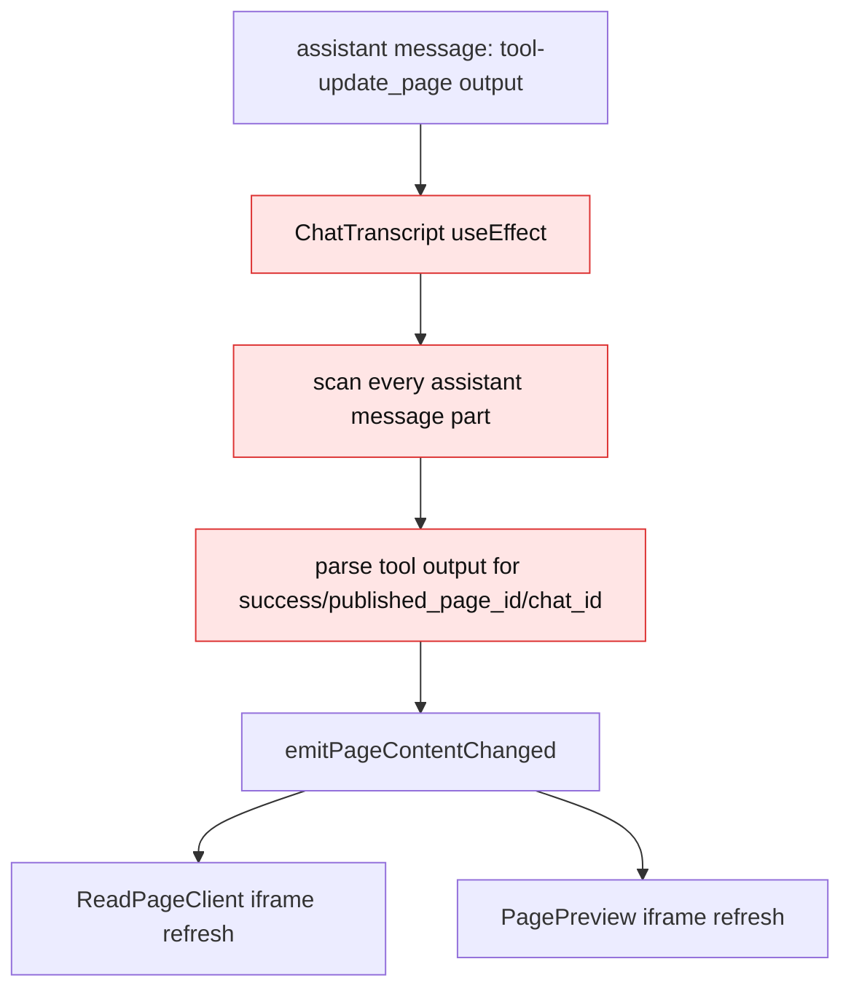
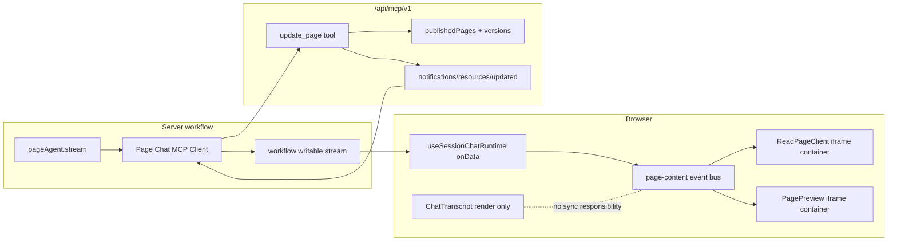
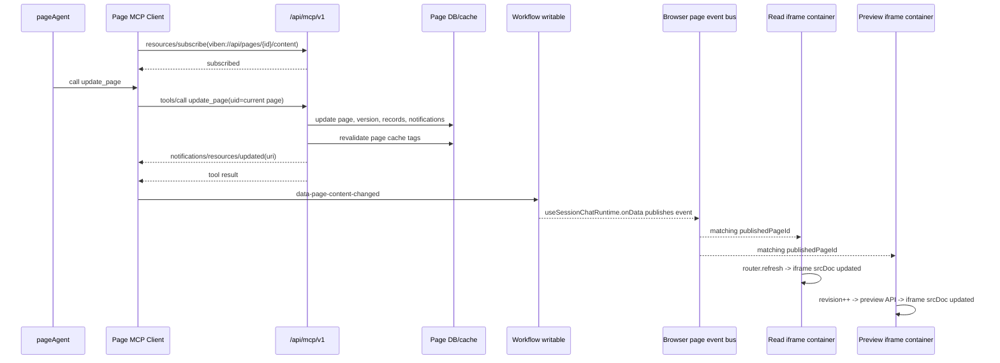

# Page Chat Agent 安全与同步收口设计

日期：2026-08-13

## 调研结论

本设计先基于当前代码和本地 SDK 形态重新调研，不再假设不存在的接口。

当前实现事实：

- MCP route 位于 `apps/web/app/api/mcp/v1/route.ts`，使用 `mcp-handler` 的 `createMcpHandler`，工具包括 `search_pages`、`get_page`、`create_page`、`update_page`。
- `get_page` 当前只按 `author_slug + page_uid` 查询页面并返回 HTML，没有复用 `canReadPage`。
- `update_page` 当前只按 `publishedPages.userId === session.userId` 查找页面，实际语义是仅作者可写。
- Page Chat context 位于 `apps/web/lib/page-chat/page-chat-context.ts`，当前 `canEdit` 把 `findEditablePage` 命中的协作者也算作可编辑。
- Page Chat MCP client 位于 `apps/web/lib/page-chat/page-mcp-tools.ts`，运行在服务端 workflow 中，不在浏览器中。
- Page Chat workflow 位于 `apps/web/app/workflows/chat-page-runtime.ts`，已有 `writable: WritableStream<UIMessageChunk>`，可以写入和 work workflow 相同的 UI message chunk。
- 客户端 runtime 位于 `apps/web/hooks/assistant/chat/use-session-chat-runtime.ts`，已有 `onData` 处理 `data-workspace-status` 的模式。
- 阅读页正文和 Assistant Preview 都已经通过 iframe 容器承载页面 HTML：`ReadPageClient` 使用主阅读 iframe，`PagePreviewPanel` 使用 Preview iframe。
- `ChatTranscript` 当前通过解析 `update_page` tool result 触发 `PAGE_CONTENT_CHANGED_EVENT`，这是需要移除的耦合点，也会造成每次消息变化后扫描全量 messages 的性能问题。
- 当前 `@modelcontextprotocol/sdk@1.29.0` 的 `LATEST_PROTOCOL_VERSION` 是 `2025-11-25`；本阶段按这个本地 SDK 形态落地。
- `@modelcontextprotocol/sdk` 的 tool callback `extra` 包含 `sendNotification`；client 支持 `subscribeResource`、`unsubscribeResource`、`setNotificationHandler`；server 支持 `sendResourceUpdated`。
- MCP 2025-era resource subscription 的请求/通知方法是 `resources/subscribe`、`resources/unsubscribe`、`notifications/resources/updated`。`notifications/resources/updated` 应只发给已经订阅对应 resource 的 client。
- `McpServer` high-level resource API 能注册 read/list handler，但没有看到 high-level 自动处理 subscribe/unsubscribe 的入口；实现时需要显式确认并补底层 request handler。

## 目标

1. 修复 MCP `get_page` 越权读取风险。
2. 将 Page Chat `update_page` 明确收敛为仅页面作者可用。
3. 页面刷新由 MCP notification 驱动，不再由 UI 解析 tool result。
4. 保持现有 Page Chat 主流程，不重写 session、chat、workflow 或 shared UI。
5. 使用消息总线的 event-driven 同步链路，避免 `ChatTranscript` 扫描消息。
6. 留下必要抽象，为后续完整 MCP resource/read/subscribe 模型做准备。

## 非目标

- 不支持协作者通过 Page Chat 更新页面。
- 不重做 `/assistant` 聊天 UI。
- 不把所有页面工具迁移成 MCP resource API。
- 不让 `ChatTranscript` 理解 MCP 协议或工具输出。
- 不新增大而全的权限 service、MCP adapter framework 或泛化事件总线。

## 核心口径

### 写权限

第一阶段只有页面作者能使用 `update_page`。

Page Chat 的 `canEdit` 与 MCP `update_page` 保持同一口径：

```text
canEdit = page.userId === currentUserId
```

协作者、团队成员或其他 `findEditablePage` 命中的用户，在 Page Chat 中按读者处理，只暴露 `get_page`。

### 读权限

MCP `get_page` 按调用身份鉴权：

| 调用方 | 读取规则 |
| --- | --- |
| 匿名 | 只能读 public 且可公开展示的页面 |
| 登录 token | 解析用户后走 `canReadPage` |
| API key | 解析 API key 所属用户后走 `canReadPage` |
| Page Chat JWE token | 解析当前 Page Chat 用户后走 `canReadPage` |
| 不存在或不可读 | 统一返回 not found |

匿名 public 判断应至少包含：

- `visibility === "public"`
- `moderationStatus === "approved"`

如现有页面目录或阅读页还有额外公开规则，应复用同一判断。

### 刷新同步

UI 不解析 `update_page` tool result。tool result 只用于展示工具调用结果。

刷新链路改为：

```text
Page Chat MCP client subscribe page content resource
  -> model calls update_page
  -> MCP update_page writes page and invalidates cache
  -> MCP tool callback sends notifications/resources/updated
  -> Page Chat MCP client notification handler receives it
  -> chat-page-runtime writes data-page-content-changed chunk
  -> useSessionChatRuntime onData receives chunk
  -> page event bus publishes page-content-changed
  -> subscribed iframe view containers refresh
```

如果 notification 没收到，不用 tool result 做兜底刷新。缺失 notification 应作为同步 bug 暴露给测试。

## 现状结构

### 当前组件树

```text
ReadPageClient
├── 主阅读 iframe
└── ReadDrawer
    └── PageAssistantPanel
        └── SharedChatCore(mode="page", density="compact")
            ├── ChatTranscript
            └── ChatComposer

/assistant/[sessionId]/chats/[chatId]
└── Page session shell
    ├── SharedChatCore(mode="page", density="full")
    │   ├── ChatTranscript
    │   └── ChatComposer
    └── PagePreviewProvider
        └── PagePreviewPanel
            └── Preview iframe

Work SessionChatContent
└── SharedChatCore(mode="work", runtime=sharedChatRuntime)
    ├── ChatTranscript
    └── ChatComposer
```

### 当前问题链路



这条链路的问题：

- `ChatTranscript` 是渲染层，不应理解页面资源同步。
- 每次 `messages` 变化都会扫描 assistant message parts，长对话性能会变差。
- 它依赖 UI 专用 tool output shape，但真实 MCP result 是协议 wrapper。
- `ChatTranscript` 被 work chat 和 Page Chat 共用，Page Chat 同步逻辑会污染 work chat 组件。

### ChatTranscript 抽取审查补充

子agent只读审查结论：`ChatTranscript` 从 work chat 抽出后，Work Chat 的主要渲染能力大体还在，包括删除/重试/fork、tool approval、git data parts、reasoning grouping、copy 按钮、empty state，以及外层错误横幅。但抽取后的 `SharedChatCore` 与 Page Chat 接入存在实质风险，后续实现必须把这些作为回归保护项。

高风险：

- 真实 Page Chat 入口目前不会触发页面刷新。`ChatTranscript` 只有在传入 `onPageContentChanged` 时才会扫描并发事件，但 `PageAssistantPanel` 和 `PageSessionChatContent` 通过 `SharedChatCore` 使用时没有传这个 prop；已有集成测试直接 render `ChatTranscript`，没有覆盖真实入口。
- `SharedChatCore` 外层是 `min-h-0 flex-1`，但不是 flex container；`ChatTranscript` 根节点依赖 `flex-1` 和内部 `h-full overflow-y-auto`。这可能破坏 Work Chat 或 Page Chat 的滚动高度，需要浏览器或组件级布局测试确认。

中风险：

- Page Chat 会显示 Work Chat 风格的用户消息 resend 按钮，但当前行为只是 `runtime.retryChatStream()`，不是按该消息重发。Page 模式应隐藏 message-level resend，除非实现真正的按消息重发。
- Page Chat 的 runtime error 不明显。`SharedChatCore` 传了 `error`，但 `ChatTranscript` 当前没有解构/渲染；Work Chat 外层还有旧错误 banner，Page Chat 只有 session/snapshot load error。
- `session-chat-content.tsx` 在抽取后仍保留旧 transcript 分组、scroll/copy state 和若干 helper/import，真实渲染已经走 `SharedChatCore`。这些残留会在长对话 streaming 时增加重复计算。

低风险：

- assistant message copy 行为有细微变化：旧实现复制当前最终 text part，抽取后可能拼接整条 assistant message 的所有 text parts。需要产品确认，并补测试锁住期望。
- 当前测试大量 mock 掉 `SharedChatCore` 或直接 render `ChatTranscript`，不足以覆盖真实 Page Chat 链路。

## 目标架构

### Event-driven 架构图



### Page update 时序图



### 目标职责树

```text
Page resource synchronization
├── MCP resource identity
│   └── build/parse viben://api/pages/{published_page_id}/content
├── MCP server
│   ├── get_page authorization
│   ├── update_page author-only write
│   ├── resources/read minimal page resource
│   ├── resources/subscribe minimal page content resource
│   └── notifications/resources/updated
├── Page Chat server runtime
│   ├── subscribe current page content resource
│   ├── handle resource updated notification
│   └── write data-page-content-changed chunk
├── Browser page event bus
│   ├── publish page-content-changed from stream data part
│   └── fan out to iframe containers
├── Iframe containers
│   ├── ReadPageClient refreshes main iframe srcDoc
│   └── PagePreviewPanel refreshes preview iframe srcDoc
└── ChatTranscript
    └── render messages only
```

## 必要抽象

只保留以下五个必要边界，其它实现尽量局部化在现有文件内。

### 1. Page resource URI helper

需要一个很小的 helper 来集中生成和解析页面资源 URI。不要在多个文件手写字符串。

URI 格式使用可扩展的分层结构：

```text
viben://api/pages/{published_page_id}/content
```

URI 设计原则：

- `viben` 是应用级 scheme，避免未来每个领域都新增一个 scheme。
- `api` 是 authority，后续 path 尽量模仿现有 HTTP API 路径，降低维护时的命名分歧。
- `pages/{published_page_id}` 对齐现有 `/api/pages/[id]` 的资源身份，使用稳定 DB id，不使用 `author_slug/page_uid` 这种可变路由身份。
- `content` 表示订阅的是页面内容快照，等价于概念上的 `/api/pages/{id}/content`，而不是页面权限记录、版本列表或评论等其它资源。
- URI 本身不放资源语义版本；payload 中保留 `resource_version: "v1"`。未来如果 payload 破坏性变化，优先新增新的 path segment 或新的 resource kind，而不是让旧 URI 改语义。
- URI 不包含 token、用户身份、可见性、标题、slug 或查询参数。权限由 read/subscribe handler 根据调用身份判断。

不采用旧草案 `viben-page://published/{id}` 或 `viben://page/v1/published/{id}/content`，原因是：

- `viben-page://...` 的 scheme 过窄，后续新增其它 domain resource 时会继续发散。
- `viben://page/v1/...` 不像现有 API 路径，维护者需要额外记一套资源命名。
- `published` 是数据库语义，API 层已有 `/api/pages/[id]`，resource URI 应跟 API 层语言保持一致。

未来可扩展资源形状：

```text
viben://api/pages/{published_page_id}/content
viben://api/pages/{published_page_id}/metadata
viben://api/pages/{published_page_id}/versions
viben://api/pages/{published_page_id}/versions/{version}
```

使用位置：

- MCP route 发送 `notifications/resources/updated`
- Page Chat MCP client 订阅当前页面 content resource
- Page Chat MCP client notification handler 判断是否为当前页面
- 未来 `resources/read` 和 `resources/subscribe` 完整实现

这个 helper 可以放在 `apps/web/lib/page-chat/page-resource-uri.ts` 或 MCP 相关 lib 下。它只做字符串构造/解析，不做权限检查、不访问数据库。

拟新增接口：

```ts
export const PAGE_RESOURCE_SCHEME = "viben";
export const PAGE_RESOURCE_AUTHORITY = "api";
export const PAGE_RESOURCE_PAGES_SEGMENT = "pages";
export const PAGE_RESOURCE_CONTENT_SEGMENT = "content";

export type PageResourceUri =
  | {
      type: "published_page_content";
      publishedPageId: string;
    };

export function buildPublishedPageContentResourceUri(
  publishedPageId: string,
): string;

export function parsePageResourceUri(
  uri: string,
): PageResourceUri | null;
```

约束：

- `publishedPageId` 为空或包含 `/` 时不生成 URI。
- parse 失败返回 `null`，不 throw。
- parse 必须使用 `URL` 或等价结构化解析，不能用脆弱的 split 链。
- parse 只接受 `viben://api/pages/{id}/content`，不接受旧格式、空 id、额外 path segment 或 query/hash。
- helper 不依赖 React、DB、MCP SDK。
- helper 是资源身份 helper，不负责协议订阅、权限、读库或浏览器事件。

### 2. Page content changed data part

因为 Page Chat MCP client 在服务端 workflow 中，不能直接触发浏览器 `window.dispatchEvent`。需要沿用现有 UI stream data part 模式，新增一个 Page Chat 专用 data part。

在 `apps/web/app/types.ts` 的 `WebAgentDataParts` 中增加：

```ts
export type WebAgentPageContentChangedData = {
  publishedPageId: string;
  chatId: string;
};

export type WebAgentDataParts = {
  commit: WebAgentCommitData;
  pr: WebAgentPrData;
  snippet: WebAgentSnippetData;
  "workspace-status": WebAgentWorkspaceStatusData;
  "page-content-changed": WebAgentPageContentChangedData;
};
```

服务端 `chat-page-runtime.ts` 收到 MCP resource updated notification 后，向 `writable` 写入：

```ts
{
  type: "data-page-content-changed",
  id: `${chatId}:page-content-changed:${publishedPageId}`,
  data: { publishedPageId, chatId },
}
```

客户端 `useSessionChatRuntime` 的 `onData` 增加对 `data-page-content-changed` 的处理，将事件发布到页面消息总线。

这个 data part 是服务端 MCP notification 到浏览器内部事件之间的唯一桥接层。它不是 UI 渲染内容，也不是 ChatTranscript 的职责。

### 3. Page event bus

页面更新在浏览器端走消息总线，而不是组件树层层传 callback，也不是让 `ChatTranscript` 扫描消息。

现有 `apps/web/lib/page-chat/page-content-events.ts` 已经有：

- `emitPageContentChanged(detail)`
- `subscribePageContentChanged(listener)`
- `PAGE_CONTENT_CHANGED_EVENT`

本阶段可以继续使用这个模块作为轻量 page event bus，但语义要调整清楚：

- publish 方：`useSessionChatRuntime` 的 `onData`，收到 `data-page-content-changed` 后发布。
- subscribe 方：页面 iframe view container，例如 `ReadPageClient` 和 `PagePreviewProvider`。
- 非职责：`ChatTranscript`、tool renderer、message renderer 不发布、不订阅、不扫描 tool output。

事件仍保持：

```ts
type PageContentChangedDetail = {
  publishedPageId: string;
  chatId: string;
};
```

消息总线接口继续沿用现有文件：

```ts
export const PAGE_CONTENT_CHANGED_EVENT = "viben:page-content-changed";

export function emitPageContentChanged(
  detail: PageContentChangedDetail,
): void;

export function subscribePageContentChanged(
  listener: (detail: PageContentChangedDetail) => void,
): () => void;
```

约束：

- publish 方只在收到 `data-page-content-changed` 时调用。
- subscriber 自行按 `publishedPageId` 过滤。
- 事件 payload 不包含 HTML，不传页面内容。

### 4. Iframe view container response

浏览器端对页面资源订阅的实际响应方是页面 iframe 容器，而不是聊天消息列表。

现有落点：

- `ReadPageClient` 的主阅读 iframe：收到匹配 `publishedPageId` 的 `PAGE_CONTENT_CHANGED_EVENT` 后，继续用 `router.refresh()` 重新获取 RSC 数据，并用新的 `pageHtml` 更新 iframe `srcDoc`。
- `PagePreviewPanel` 的 Preview iframe：由 `PagePreviewProvider` 收到匹配事件后递增 `revision`，SWR 重新请求 Preview API，并用新的 HTML 更新 iframe `srcDoc`。

因此 `PAGE_CONTENT_CHANGED_EVENT` 可以视为浏览器内的 page resource subscription response。它的消费方应保持在页面视图容器层：

```text
data-page-content-changed
  -> page event bus publishes page-content-changed
  -> ReadPageClient iframe refresh
  -> PagePreviewPanel iframe refresh
```

不要把该事件交给 `ChatTranscript` 解析，也不要让 tool call renderer 参与页面刷新。

### 5. 最小 MCP page content resource subscription

因为 `notifications/resources/updated` 应该发给订阅过资源的 client，本阶段需要最小订阅能力，而不是跳过订阅。

需要实现：

- MCP server 声明 resources capability。
- MCP server 接受当前 page content resource URI 的 `resources/subscribe` 请求。
- Page Chat MCP client 在连接后订阅当前页面 URI。
- `update_page` 成功后只在当前请求/当前连接已订阅该 URI 时发送 `notifications/resources/updated`。

实现可以保持最小：

- 不需要完整资源列表 UI。
- 不需要暴露所有页面 resources。
- 不需要把 `get_page` 立即改成 `resources/read`。
- 可以先注册一个 page resource template/read handler，用现有 `get_page` 的读取逻辑返回页面内容，为 resources capability 和后续 resource read 演进铺路。

拟实现的 MCP 接口：

```text
resources/read
  params.uri = viben://api/pages/{published_page_id}/content
  result.contents[0].text = JSON string of page payload

resources/subscribe
  params.uri = viben://api/pages/{published_page_id}/content
  result = {}

resources/unsubscribe
  params.uri = viben://api/pages/{published_page_id}/content
  result = {}

notifications/resources/updated
  params.uri = viben://api/pages/{published_page_id}/content
```

`resources/read` 的 JSON payload 使用 snake_case，保持 MCP/API 输出风格一致：

```ts
type PublishedPageContentResourcePayload = {
  resource_kind: "published_page_content";
  resource_version: "v1";
  published_page_id: string;
  uid: string;
  title: string;
  html: string;
  description: string | null;
  tags: string[];
  visibility: "public" | "unlisted" | "private";
  moderation_status: string;
  current_version: number;
  updated_at: string | null;
  author: {
    display_name: string | null;
    avatar_url: string | null;
    slug: string;
  };
};
```

`get_page` 可以继续作为模型友好的 tool 保留，但内部读取权限和 payload 构造应复用同一小函数，避免 tool path 与 resource path 演化出两套权限逻辑。

Page Chat MCP client 里可以有一个局部 adapter，隔离 SDK/protocol 细节：

```ts
async function subscribePageContentResource(input: {
  client: Client;
  uri: string;
  onUpdated: () => void | Promise<void>;
}): Promise<() => Promise<void>>;
```

约束：

- 这是 `page-mcp-tools.ts` 内部 helper，不导出成全站 MCP subscription 框架。
- helper 内注册 `ResourceUpdatedNotificationSchema` handler，并调用 `client.subscribeResource({ uri })`。
- 返回的 cleanup 尽力调用 `client.unsubscribeResource({ uri })`。
- notification URI 必须先过 `parsePageResourceUri`，再判断资源类型和 `publishedPageId`。

实现备注：

- 当前本地 SDK 1.29.0 的 client 有 `subscribeResource`、`unsubscribeResource`、`setNotificationHandler`；server 有 `sendResourceUpdated`；实现应优先使用这些高层方法。
- 本地 SDK `McpServer` high-level resource handler 会声明 resources capability，但未看到 high-level 自动处理 `resources/subscribe` 的入口；实现时需要检查并可能使用底层 `server.server.setRequestHandler` 注册 `SubscribeRequestSchema` 和 `UnsubscribeRequestSchema`。
- 如果 `mcp-handler` 的 streamable HTTP 在当前调用中不能维护长期订阅表，本阶段以 Page Chat 单次连接内订阅为准，不引入 Redis 或持久 subscription store。
- 订阅状态只用于协议语义和当前 Page Chat client；不要扩展成全站通知系统。
- 如果未来 SDK 升级到新的统一 subscription API，业务层仍调用一个本地 adapter，例如 `subscribePageContentResource(client, uri)`；只在 adapter 内切换协议方法，不改 `chat-page-runtime.ts`、iframe event bus 或 `ChatTranscript`。

## 具体改动设计

### MCP route

文件：`apps/web/app/api/mcp/v1/route.ts`

改动：

1. `get_page` 改为先解析当前 session：
   - `sessionStore.getStore()` 有值时走认证用户权限。
   - 无 session 时只允许 public approved 页面。
2. `get_page` 不可读和不存在统一返回 page not found tool error。
3. `update_page` 保持仅作者可写，不扩展协作者。
4. `update_page` 成功写库、写版本、通知社区、revalidate cache 后发送 MCP `notifications/resources/updated`。
5. tool callback 使用 SDK 提供的 `extra.sendNotification`，不要让 route 直接依赖浏览器事件。
6. 注册最小 page resource 能力：
   - resource URI 使用 `viben://api/pages/{published_page_id}/content`。
   - `resources/read` 与 `get_page` 共用同一读取权限逻辑。
   - `resources/subscribe` 至少接受合法 page URI。若 SDK high-level server 未自动处理 subscribe，需要用底层 `server.server.setRequestHandler` 明确接住。

注意：如果实现中发现 `mcp-handler` 对 stateless transport 没有稳定 `sessionId`，不要做复杂持久订阅表。Page Chat 的 `update_page` notification 可以通过当前 tool request 的 `extra.sendNotification` 返回到同一 client；订阅请求仍保留，用于符合协议语义和后续演进。

页面读取逻辑应从 `get_page` body 中抽成文件内小函数即可，不新建大 service：

```ts
async function findReadablePageForMcp(input: {
  authorSlug?: string;
  pageUid?: string;
  publishedPageId?: string;
  session: Session | null;
}): Promise<typeof publishedPages.$inferSelect | null>;
```

这是 `route.ts` 内部 helper，不是跨模块平台抽象。匿名时只允许 `isPublicPage(page)`；认证时允许 `canReadPage(page, session)`。

### Page Chat context

文件：

- `apps/web/lib/page-chat/page-chat-context.ts`
- `apps/web/lib/page-chat/page-session-service.ts`

改动：

1. 移除 Page Chat `canEdit` 对 `findEditablePage` 的依赖。
2. `canEdit` 只使用 `context.page.userId === input.userId` 或 `page.userId === input.userId`。
3. 保留 `canReadPage` 的现有检查。

`findEditablePage` 不一定要从整个项目删除；只是不用于 Page Chat 的 `can_edit` 判定。

### Page Chat MCP client

文件：`apps/web/lib/page-chat/page-mcp-tools.ts`

改动：

1. 连接 MCP 后，构造当前页面 resource URI。
2. 注册 `ResourceUpdatedNotificationSchema` handler。
3. handler 只处理当前 page content resource URI。
4. handler 不直接触发浏览器事件，而是调用由 `chat-page-runtime.ts` 传入的回调。
5. 调用 `client.subscribeResource({ uri })` 订阅当前页面。
6. `close()` 时尽力调用 `client.unsubscribeResource({ uri })`，失败不阻塞关闭。
7. `update_page` 工具暴露条件继续使用 `input.page.canEdit`，但该值已经只代表作者。

不要在 `page-mcp-tools.ts` 中解析 `update_page` tool result 来判断是否刷新。

拟调整 `createPageMcpTools` 入参：

```ts
export async function createPageMcpTools(input: {
  endpoint: URL;
  bearerToken: string;
  page: PageChatContext;
  onPageResourceUpdated?: (publishedPageId: string) => void | Promise<void>;
}): Promise<PageMcpToolRuntime>;
```

约束：

- `onPageResourceUpdated` 只在 notification URI 匹配当前 `page.publishedPageId` 时调用。
- URI 匹配必须通过 `parsePageResourceUri` 判断 `type === "published_page_content"`，不能靠 `startsWith`。
- `createPageMcpTools` 不 import `emitPageContentChanged`。
- `callScopedTool` 仍只负责调用工具和处理 `isError`。

### Page Chat workflow

文件：`apps/web/app/workflows/chat-page-runtime.ts`

改动：

1. 调用 `createPageMcpTools` 时传入一个 `onPageResourceUpdated` 回调。
2. 回调收到当前 `publishedPageId` 后，向 `input.writable` 写入 `data-page-content-changed` chunk。
3. chunk 中包含 `publishedPageId` 和 `input.chatId`。
4. 写入失败只记录错误，不改变 tool result。

这里是服务端 notification 到客户端 stream 的桥接点。

拟新增局部 helper：

```ts
async function sendPageContentChangedPart(input: {
  writable: WritableStream<UIMessageChunk>;
  publishedPageId: string;
  chatId: string;
}): Promise<void>;
```

这是 `chat-page-runtime.ts` 内部 helper，不暴露给 UI。

### 客户端 runtime

文件：`apps/web/hooks/assistant/chat/use-session-chat-runtime.ts`

改动：

1. 在 `onData` 中处理 `data-page-content-changed`。
2. 校验 payload 有 `publishedPageId` 和 `chatId`。
3. 调用页面消息总线发布 `page-content-changed`。
4. 不把这个 data part 渲染为聊天内容。

`useSessionChatRuntime` 只负责把服务端 stream data part 变成消息总线事件。真正刷新页面 HTML 的响应方是已订阅该事件的 iframe view container。

`onData` 逻辑：

```ts
onData: (dataPart) => {
  if (dataPart.type === "data-workspace-status") {
    setChatWorkspaceStatus(...);
    return;
  }

  if (dataPart.type === "data-page-content-changed") {
    const data = dataPart.data;
    if (
      data &&
      typeof data.publishedPageId === "string" &&
      typeof data.chatId === "string"
    ) {
      emitPageContentChanged(data);
    }
  }
}
```

该处理对 work chat 是无害的：work chat 不会产生 `data-page-content-changed`。

### Iframe view containers

文件：

- `apps/web/components/pages/read-page-client.tsx`
- `apps/web/components/assistant/page-preview-context.tsx`
- `apps/web/components/assistant/page-preview-panel.tsx`

改动：

1. 保留现有 `subscribePageContentChanged` 机制。
2. 阅读页 iframe 继续通过 `router.refresh()` 获得新的 `pageHtml` 并更新 `srcDoc`。
3. Preview iframe 继续通过 `revision` 触发 Preview API refetch 并更新 `srcDoc`。
4. 事件匹配只看 `publishedPageId`，避免其它页面更新刷新当前 iframe。
5. iframe 容器不理解 MCP tool result，不订阅 ChatTranscript 的 tool output。
6. iframe 容器通过消息总线订阅页面更新事件。

### ChatTranscript

文件：`apps/web/components/assistant/chat-transcript.tsx`

改动：

1. 删除或停用 `parseToolOutput`、`getPageContentChangedDetail`、`notifiedToolCallsRef` 相关刷新逻辑。
2. 保留工具结果渲染。
3. `onPageContentChanged` prop 如果只服务于旧 tool result 解析链路，应从 `ChatTranscript` 去掉。
4. 不在 `useEffect` 中扫描 `messages` 查找 `update_page`。

验收点：`ChatTranscript` 不再 import `emitPageContentChanged`。

### SharedChatCore / work chat 回归约束

文件：

- `apps/web/components/assistant/shared-chat-core.tsx`
- `apps/web/components/assistant/session-chat-content.tsx`
- `apps/web/components/assistant/page-session-chat-content.tsx`
- `apps/web/components/pages/page-assistant-panel.tsx`

当前 `SharedChatCore` 默认传给 `ChatTranscript` 的 `messageDurationMap`、`messageStartedAtMap`、`lastUserMessageSentAt` 是空值；work chat 依赖 `session-chat-content.tsx` 通过 `transcriptProps` 覆盖真实值。实现计划必须保护这些 work-only 行为：

- 不要为了 Page Chat 删除 `transcriptProps` 覆盖机制。
- work chat 的 retry/delete/fork/tool approval/open file/duration/thinking/error banner 行为必须有回归测试。
- `ChatTranscript` 去掉 page update 扫描时，不能影响 tool approval rendering 和 `ToolCall` 的 approve/deny callbacks。
- `SharedChatCore` 的 transcript wrapper 必须是稳定的 flex column 容器，例如保持 `min-h-0 flex flex-1 flex-col`，避免 `ChatTranscript` 内部滚动层失去高度基准。
- Page Chat 模式默认隐藏 message-level resend/delete/fork/open-file 等 work-only 或语义不准确的操作；如果保留 resend，必须实现按消息重发，而不是全局 retry 当前 stream。
- Page Chat runtime error 要在 Page Chat 入口可见，不能只依赖 Work Chat 外层旧 banner。
- 清理 `session-chat-content.tsx` 中抽取前残留的 transcript 分组、scroll/copy state 和未使用 helper/import，避免长对话重复 O(messages * parts) 计算。

### 错误体验

本次顺手修小问题，但不扩大范围：

- `usePageSession` 对 JSON error 做解析，不直接显示原始 JSON。
- `PageUnavailableError` 在 Page Chat 场景映射为页面不可用文案，不显示 `Workspace setup failed`。
- `PageAssistantPanel` 的 chat snapshot Retry 必须真实重新请求。
- 新建 chat 持久化失败必须 catch，并清理或标记乐观 chat。

## 测试策略

### MCP 权限

覆盖：

- 匿名 `get_page` 读取 public approved 成功。
- 匿名读取 private/unlisted/rejected 页面失败。
- 登录用户读取自己 private 页面成功。
- 登录无权限用户读取别人 private 页面失败。
- API key 所属用户按 `canReadPage` 成功或失败。
- Page Chat JWE token 按 `canReadPage` 成功或失败。

### 作者写权限

覆盖：

- 作者 Page Chat response `can_edit === true`。
- 协作者或 `findEditablePage` 命中用户 Page Chat response `can_edit === false`。
- 作者 MCP tools 包含 `update_page`。
- 非作者 MCP tools 不包含 `update_page`。
- MCP `update_page` 对非作者返回权限错误。

### Notification 同步

覆盖：

- Page Chat MCP client 连接后订阅当前 page content resource URI。
- 订阅 URI 必须等于 `viben://api/pages/{published_page_id}/content`。
- malformed URI、旧 URI、其它 resource kind 的 notification 不触发刷新。
- MCP `update_page` 成功后发送 `notifications/resources/updated`。
- Page Chat client 收到匹配 URI 后触发 runtime 回调。
- runtime 写出 `data-page-content-changed` chunk。
- `useSessionChatRuntime` 收到 data part 后发布消息总线事件。
- Read page 和 Preview 作为 iframe view container 响应消息总线事件。
- 阅读页主 iframe 在匹配页面更新后获得新的 `srcDoc`。
- Preview iframe 在打开状态下匹配页面更新后重新请求并获得新的 `srcDoc`。
- 真实 `PageAssistantPanel -> SharedChatCore -> useSessionChatRuntime` 入口能完成刷新，不允许只通过直接 render `ChatTranscript` 证明链路。

### 移除 tool result 刷新依赖

覆盖：

- `ChatTranscript` 收到 `tool-update_page` output 不触发 `PAGE_CONTENT_CHANGED_EVENT`。
- `ChatTranscript` 不再扫描 messages 来寻找页面更新。
- 真实 MCP result shape 不再影响刷新测试。
- 搜索代码中 Page Chat 刷新逻辑不再依赖 `published_page_id/chat_id` tool output 字段。

### ChatTranscript 抽取回归

覆盖：

- work chat 仍显示 message duration、startedAt 和 thinking 状态。
- work chat user message 仍支持 resend/delete。
- assistant message 仍支持 copy/fork。
- 多 text part assistant message 的 copy 行为有明确断言：复制当前 text part 或复制整条消息二选一，测试锁住产品期望。
- tool approval 仍能调用 approve/deny callbacks。
- `data-commit`、`data-pr`、`data-snippet` 仍按原规则渲染。
- reasoning parts 仍 grouping，并在 collapsed/expanded 状态下行为一致。
- Page Chat compact/full 模式不显示 work-only 操作；尤其不要显示语义不准确的 message-level resend，除非实现按消息重发。
- Page Chat runtime error 可见，且不显示 workspace/sandbox 文案。
- `SharedChatCore` wrapper 保持 flex column 滚动基准，长消息不会撑破面板。
- `session-chat-content.tsx` 抽取前残留计算清理后，不再重复计算未使用的 grouped transcript。
- `ChatTranscript` 的 page update 相关测试改为负向测试。

### 错误体验

覆盖：

- Page session JSON error 显示本地化文案。
- snapshot Retry 会重新请求。
- 新建 chat 持久化失败不会留下可发送的坏 chat。
- Page Chat 页面不可用时不显示 workspace/sandbox 文案。

## 验收标准

1. MCP `get_page` 不再越权读取非 public 或无权限页面。
2. Page Chat 只有页面作者能看到并使用 `update_page`。
3. 协作者不会被提示可以通过 Page Chat 修改页面。
4. Page content resource URI 使用 `viben://api/pages/{published_page_id}/content`，生成和解析集中在 helper。
5. `update_page` 成功后通过 MCP `notifications/resources/updated` 触发刷新链路。
6. 服务端 notification 通过 `data-page-content-changed` stream chunk 到达客户端。
7. 客户端通过页面消息总线发布 page-content-changed 事件。
8. `ChatTranscript` 不解析 tool result、不扫描 messages 来触发刷新。
9. 阅读页主 iframe 和 Assistant Preview iframe 在收到匹配 page-content-changed 事件后刷新。
10. 真实 Page Chat 入口覆盖刷新链路，不再依赖直接 render `ChatTranscript` 的伪集成测试。
11. Page Chat 错误文案不出现 raw JSON、workspace setup 或 sandbox 误导。
12. Page Chat 不显示语义不准确的 Work Chat 操作。
13. 现有 work session 行为无回归，且清理抽取前残留重复计算。

## 后续演进

本阶段留下五个面向完整 resource 模型的基础：

1. 稳定、模仿 API 路径、带 resource kind 的页面 content resource URI。
2. 最小 resource subscribe/read 能力。
3. notification 到客户端 data part 的桥接。
4. 浏览器内 page event bus 到 iframe view container 的订阅响应。
5. `page-mcp-tools.ts` 内部 subscription adapter，后续协议升级时不影响 UI 和 workflow。

后续可以把 `get_page` 内部改成 `resources/read` 的薄封装，并把后台发布、版本回滚、页面编辑器保存等非 MCP 更新统一接入同一个 resource updated 通知模型。
